# 📚 [블로그 연재 종합 목차] 반도체 장비개론 & 공압 제어 시스템 완벽 가이드

본 가이드는 강의자료(PDF 20개, DOCX 필기 노트, PPTX)의 전 과정을 초보자의 눈높이에 맞추어 체계적으로 정리한 **총 14편의 블로그 연재 포스팅 인덱스**입니다.  
각 편마다 핵심 도해 이미지가 `/assets/img/semi_pneu/` 경로로 연결되어 있으며, 초보자용 비유와 FAQ, 요약 노트가 완벽하게 구성되어 있습니다.

---

## 🗺️ 전체 시리즈 로드맵

```mermaid
flowchart TD
    subgraph Track 1 [트랙 1: 공압 제어 및 자동화 시스템]
        P1["01. 공압 기초 & 유체 압력"]
        P2["02. 공압 시스템 구성 & FRL 유닛"]
        P3["03. 방향제어밸브 기호 해독법"]
        P4["04. 유량제어: 미터인 vs 미터아웃"]
        P5["05. 순수 공압 시퀀스 & 신호 중복"]
        P6["06. 캐스케이드(Cascade) 회로 설계"]
        P7["07. 전기 시퀀스, 릴레이 & STM32 펌웨어"]
        P1 --> P2 --> P3 --> P4 --> P5 --> P6 --> P7
    end

    subgraph Track 2 [트랙 2: 반도체 제조 공정 및 첨단 장비]
        S1["01. 웨이퍼 제조 & CMP 평탄화"]
        S2["02. 8대 공정 흐름, FAB 유틸리티 & 장비사"]
        S3["03. 클린룸 환경 & 공조 설비"]
        S4["04. 정전기(ESD) 원리 & 이오나이저"]
        S5["05. 포토리소그래피: 포토마스크 & 펠리클"]
        S6["06. 노광 장비(Scanner) & EUV 광원"]
        S7["07. MOSFET 소자 원리 & HBM 첨단 패키징"]
        S1 --> S2 --> S3 --> S4 --> S5 --> S6 --> S7
    end
```

---

## 📌 트랙 1: 공압 제어 및 시퀀스 자동화 시리즈 (Part 01 ~ 07)

| 편수 | 파일명 (바로가기 링크) | 다루는 핵심 주제 | 원본 강의자료 매핑 |
| :---: | :--- | :--- | :--- |
| **01** | [Pneumatic_01_공압제어기초_유체압력.md](file:///d:/태섭/반도체장비개론_PDF/Pneumatic_01_공압제어기초_유체압력.md) | 공압의 개념, 파스칼의 원리($F=P \times A$), 게이지압/절대압, 공압 vs 유압 | `01_01공압제어란.pdf` `21유체의_압력_교육PPT.pdf` |
| **02** | [Pneumatic_02_공압시스템구성_FRL.md](file:///d:/태섭/반도체장비개론_PDF/Pneumatic_02_공압시스템구성_FRL.md) | 컴프레서, 공기탱크, 쿨러/드라이어, FRL 3종 세트(필터, 레귤레이터, 윤활기) | `01_02공압시스템구성.pdf` |
| **03** | [Pneumatic_03_방향제어밸브_기호해독법.md](file:///d:/태섭/반도체장비개론_PDF/Pneumatic_03_방향제어밸브_기호해독법.md) | 5/2way 밸브, 포트(1,2,3,4,5)와 위치, 기호 해독법, 조작 방식(편솔/양솔) | `02주차_01회차공압_방향제어_밸브.pdf` `반도체 장비개론.docx` |
| **04** | [Pneumatic_04_유량제어밸브_미터인_미터아웃.md](file:///d:/태섭/반도체장비개론_PDF/Pneumatic_04_유량제어밸브_미터인_미터아웃.md) | 일방향 유량제어 밸브, 미터-인 vs 미터-아웃(배압 제어), 급속 배기 밸브, 셔틀/2압 밸브 | `02주차_02회차공압_유량제어_밸브_및_기타_밸브.pdf` `편솔문제.pptx` |
| **05** | [Pneumatic_05_순수공압시퀀스_신호중복.md](file:///d:/태섭/반도체장비개론_PDF/Pneumatic_05_순수공압시퀀스_신호중복.md) | 시퀀스 제어($A+ B+ B- A-$), 변위-단계 선도, 신호 중복(교착 상태) 발생 원인 | `03주차_01회차순수공압_시퀀스_설계.pdf` `03주차_02회차신호중복.pdf` |
| **06** | [Pneumatic_06_캐스케이드_회로설계.md](file:///d:/태섭/반도체장비개론_PDF/Pneumatic_06_캐스케이드_회로설계.md) | 신호 중복을 100% 해결하는 캐스케이드 4단계 공식, 그룹 분할, 회로도 설계 | `04주차_01회차캐스케이드_설계_순서.pdf` `04주차_02회차캐스케이드_적용.pdf` |
| **07** | [Pneumatic_07_전기시퀀스_릴레이_펌웨어기초.md](file:///d:/태섭/반도체장비개론_PDF/Pneumatic_07_전기시퀀스_릴레이_펌웨어기초.md) | 전자기 릴레이 a/b접점, 자기유지회로, 타이머, STM32 실무 제어(인터럽트, 워치독) | `05주차_01회차전기시퀀스_기초.pdf` `반도체 장비개론.docx` |

---

## 📌 트랙 2: 반도체 제조 공정 및 첨단 장비 시리즈 (Part 08 ~ 14)

| 편수 | 파일명 (바로가기 링크) | 다루는 핵심 주제 | 원본 강의자료 매핑 |
| :---: | :--- | :--- | :--- |
| **08** | [Semiconductor_01_웨이퍼제조_CMP평탄화.md](file:///d:/태섭/반도체장비개론_PDF/Semiconductor_01_웨이퍼제조_CMP평탄화.md) | 실리콘 웨이퍼 기초, FOUP/OHT, 초크랄스키법, CMP 메커니즘, 리테이너링/패드컨디셔너 | `11반도체장비개론-1장-반도체공정_개요.pdf` `12반도체장비개론-2장-웨이퍼_제조와_CMP-P.pdf` |
| **09** | [Semiconductor_02_8대공정흐름_FAB장비_유틸리티.md](file:///d:/태섭/반도체장비개론_PDF/Semiconductor_02_8대공정흐름_FAB장비_유틸리티.md) | 8대 공정 흐름(전공정 vs 후공정), FAB 3층 구조, 5대 유틸리티(초순수, 질소 등), Top 5 장비사 | `13반도체공정_장비개요.pdf` `11반도체장비개론-1장-반도체공정_개요.pdf` |
| **10** | [Semiconductor_03_클린룸환경_공조장치.md](file:///d:/태섭/반도체장비개론_PDF/Semiconductor_03_클린룸환경_공조장치.md) | 클린룸 4대 수칙, Clean Class 등급(Class 1), 수직 층류 기류, 양압 제어, FFU & ULPA 필터 | `14.반도체_클린룸.pdf` `24반도체장비개론_4_클린룸_장치.pdf` |
| **11** | [Semiconductor_04_정전기대책_ESD원리.md](file:///d:/태섭/반도체장비개론_PDF/Semiconductor_04_정전기대책_ESD원리.md) | 정전기 발생(대전 서열), 2대 재앙(ESD 방전 파괴 & ESA 먼지 흡착), 이오나이저 코로나 방전 | `정전기대책_기초지식(이수테크노)ver2.3.8.18.pdf` |
| **12** | [Semiconductor_05_포토리소그래피_포토마스크제조.md](file:///d:/태섭/반도체장비개론_PDF/Semiconductor_05_포토리소그래피_포토마스크제조.md) | 포토마스크 4:1 축소 투영, 블랭크 마스크(석영+크롬), 전자빔(E-beam) 묘화, 펠리클(Pellicle) | `22반도체장비개론-3장-굴절식_포토마스크의_제조.pdf` |
| **13** | [Semiconductor_06_포토리소그래피_노광장비_EUV.md](file:///d:/태섭/반도체장비개론_PDF/Semiconductor_06_포토리소그래피_노광장비_EUV.md) | 레일리 공식($R=k_1 \lambda/\text{NA}$), 광원 단축(ArF Immersion ➡️ EUV 13.5nm), 스캐너 구조 | `23반도체장비개론-4장-굴절식_노광장비.pdf` |
| **14** | [Semiconductor_07_MOSFET소자원리_첨단패키징.md](file:///d:/태섭/반도체장비개론_PDF/Semiconductor_07_MOSFET소자원리_첨단패키징.md) | MOSFET 4단자 스위칭 원리, Planar ➡️ FinFET ➡️ GAA 4면 제어, 2.5D 인터포저 & HBM TSV 3D 적층 | `25반도체소자의_발전.pdf` `26반도체_패키지의_발전.pdf` `반도체 장비개론.docx` |

---

## 💡 블로그 포스팅 시 실무 운영 팁

1. **이미지 파일 경로**:
   - 모든 마크다운 파일 내의 이미지는 [`images/`](file:///d:/태섭/반도체장비개론_PDF/images) 폴더의 고화질 슬라이드 사진과 연결되어 있습니다.
   - 네이버 블로그, 티스토리, 벨로그 등에 글을 올리실 때 본문을 복사해 넣으시고, 이미지 위치에 `images/` 폴더 안의 해당 파일을 **마우스로 드래그 앤 드롭**하시면 바로 첨부됩니다.
2. **저작권 및 출처 표기 (필수!)**:
   - 원작 교수님의 "상업적 이용 금지" 권리를 보호하기 위해 모든 글의 상단에 비영리 스터디 노트 문구가 기본 포함되어 있습니다.
3. **광고(애드센스/애드포스트) 주의**:
   - 본 시리즈 포스팅을 올리실 때는 '상업적 이용' 분쟁을 방지하기 위해 해당 글의 **광고 노출 설정을 해제(비활성화)**하시길 권장합니다.
