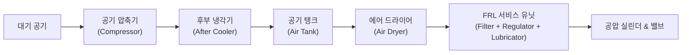
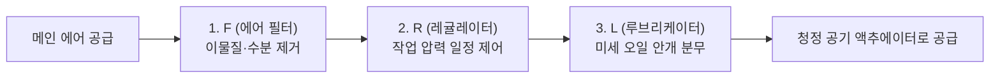

> ⚠️ **출처 및 저작권 안내**  
> 본 포스팅은 대학 강의 [공압제어 및 자동화] 강의자료를 바탕으로, 비전공자 및 초보자가 쉽게 이해할 수 있도록 일상적인 비유와 그림으로 재구성한 **비영리 스터디 요약 노트**입니다.  
> 원작자의 저작권을 존중하며, 상업적 목적으로 이용될 수 없습니다.

---

# 💨 인트로: 공기를 압축하면 왜 물이 생길까?

공압 시스템은 주변 공기를 그대로 빨아들여 사용합니다.  
그런데 우리가 숨 쉬는 일반 공기 속에는 눈에 보이지 않는 **미세 먼지, 매연, 그리고 엄청난 양의 수증기(습기)**가 섞여 있습니다.

만약 이 공기를 그대로 압축해서 반도체 장비나 공압 실린더에 바로 쏘아 넣으면 어떻게 될까요?  
배관 속에 녹이 슬고, 실린더 내부 고무 패킹이 찢어지며, 값비싼 자동화 설비가 며칠 만에 고장 나버립니다!

그래서 공압 시스템은 **"압축 ➡️ 냉각 및 수분 제거 ➡️ 저장 ➡️ 청정 필터링 & 압력 안정화"**라는 철저한 준비 과정을 거칩니다.  
이번 글에서는 공압 공장의 심장부인 공압 시스템의 전체 구성과 현장 필수 지식인 **FRL 유닛**을 완벽하게 파헤쳐 보겠습니다!

---

# 1. 공압 시스템의 전체 처리 흐름도

공기가 대기 중에서 빨려 들어가 실린더를 움직이기까지의 여정은 다음과 같습니다.

---

# 2. 공압 발생 장치 (생산 파트)

## (1) 공기 압축기 (Air Compressor) : "공압의 심장"
- 모터나 엔진을 돌려 피스톤, 스크루 등을 이용해 대기압의 공기를 $7\sim10\text{ bar}$의 고압으로 쥐어짜는 기계입니다.

> 💡 **시험 & 도면 해독 꿀팁: 기호의 삼각형 색깔을 보세요!**  
> - **삼각형 안쪽이 비어있음(흰색 $\triangle$)** ➡️ **공기 압축기 (공압)**: 공기는 투명하니까 속이 하얗습니다!
> - **삼각형 안쪽이 꽉 차 있음(검은색 $\blacktriangle$)** ➡️ **유압 펌프 (유압)**: 기름(오일)은 색깔이 있으니까 속이 까맣습니다!

---

## (2) 후부 냉각기 (After Cooler) & 에어 탱크 (Air Tank)

### ❄️ 후부 냉각기 (After Cooler)
- 기체를 강하게 압축하면 단열 압축 현상 때문에 공기 온도가 $150\sim200℃$까지 치솟습니다.
- 공기가 뜨거우면 수증기를 잔뜩 머금고 있다가 배관을 타고 가면서 식어 배관 내부에 물방울이 맺힙니다. 이를 막기 위해 컴프레서 바로 뒤에서 공기를 상온($40℃$ 이하)으로 급랭시켜 수분의 70% 이상을 물방울로 맺히게 한 뒤 배출(드레인)합니다.

### 🛢️ 공기 저장 탱크 (Air Receiver Tank) : "공기의 댐 / 저수지"
1. **맥동 압력 흡수**: 컴프레서가 쿵쾅거리며 토출할 때 발생하는 압력의 출렁거림(맥동)을 안정적으로 흡수합니다.
2. **비상 에너지 비축**: 공장에서 순간적으로 에어를 많이 쓰더라도 일정한 압력을 유지할 수 있도록 버퍼 역할을 합니다.
3. **자연 냉각 및 2차 수분 분리**: 탱크에 머무는 동안 공기가 식으면서 바닥에 물(응축수)이 고입니다.

---

## (3) 에어 드라이어 (Air Dryer) : "제습기 끝판왕"
- 공기 속의 남은 수증기를 영하의 이슬점(노점, Dew Point)까지 얼리거나 흡착제를 이용해 바짝 말려주는 장치입니다.
- **냉동식 드라이어**: 냉매를 이용해 공기를 $2\sim10℃$로 냉각시켜 남은 수분을 응축 제거합니다.
- **흡착식 드라이어**: 실리카겔이나 활성 알루미나 겔을 통과시켜 수분을 $100\%$ 바짝 빨아들입니다. (정밀 반도체 클린룸용)

---

# 3. 설비의 수명을 결정하는 FRL 3총사 (Service Unit)

메인 배관을 타고 장비 바로 앞까지 온 압축 공기는 마지막으로 **FRL 서비스 유닛**을 통과해야 합니다.  
현장에서는 이를 보통 **"FRL 3점 세트"** 또는 통합형 **"공기청정조절기"**라고 부릅니다.

| 기호 | 명칭 | 알기 쉬운 비유 | 핵심 역할 |
| :---: | :--- | :--- | :--- |
| **F** | **에어 필터 (Air Filter)** | 정수기 필터 | 배관 속 녹가루, 굵은 먼지, 응축수를 원심력과 필터 엘리먼트로 걸러냅니다. (보통 $5\mu\text{m}$ 급) |
| **R** | **레귤레이터 (Regulator)** | 수압 안정기 / 감압 밸브 | 메인 배관 압력이 $7\sim9\text{ bar}$로 들쭉날쭉해도, 다이아프램과 스프링을 이용해 장비가 원하는 **일정한 작업 압력(보통 $5\text{ bar}$)**으로 낮추어 딱 고정해 줍니다. |
| **L** | **루브리케이터 (Lubricator)** | 비타민 오일 미스트 분무기 | 압축 공기가 빠르게 지나갈 때 벤투리 관 효과를 이용해 **윤활유를 미세한 안개(Mist) 형태로 공기에 섞어줍니다.** 이 오일 안개가 실린더 내부로 들어가 고무 씰(패킹)의 마모를 막고 수명을 연장합니다. |

*(※ 최근 클린룸이나 무급유 실린더를 사용하는 환경에서는 오일 오염을 막기 위해 L(루브리케이터)을 빼고 **FR 2점 세트**만 쓰기도 합니다.)*

---

# 4. 도면 기호 완벽 해독하기

- 도면을 볼 때 필터는 다이아몬드 사각형 안에 점선(`---`), 레귤레이터는 압력 게이지 원형(`○`), 루브리케이터는 상단 오일 드롭 표시로 나타냅니다.
- 세 개를 합쳐서 하나의 긴 사각형 안에 점선과 화살표로 간략화하여 표현하기도 합니다.

---

# 💡 초보자 단골 질문 FAQ

### Q. 매일 아침 출근해서 공압 장비 켤 때 작업자가 가장 먼저 해야 할 일은 무엇인가요?
> **A. 에어 필터와 에어 탱크 바닥의 '드레인(응축수 배출 밸브)'을 열어 물을 빼주는 것입니다!**  
> 밤새 공기가 식으면서 필터 투명 컵 바닥에 물이 차오릅니다. 물이 꽉 차면 공기와 함께 실린더로 넘어가 버리므로, 수동 드레인 밸브를 돌려 물을 빼거나 자동으로 물을 빼주는 오토 드레인(Auto Drain) 밸브가 정상 작동하는지 확인해야 합니다.

---

# 📝 최종 핵심 요약 노트

1. 대기 공기는 수분과 먼지가 많으므로 **컴프레서 ➡️ 애프터쿨러 ➡️ 에어탱크 ➡️ 에어드라이어**를 거쳐 정제된다.
2. 기호에서 **속이 빈 삼각형($\triangle$)은 공압**, **속이 찬 검은 삼각형($\blacktriangle$)은 유압**이다.
3. 설비 바로 앞에는 **FRL (Filter: 청정, Regulator: 압력 조절, Lubricator: 윤활)** 3점 세트가 필수적으로 장착된다.
4. 압축 공기 라인의 최대 적은 **'수분(물방울)'**이므로, 주기적인 드레인 배출 관리가 설비 수명을 좌우한다.

---
*(다음 편 예고: 03. 공압의 방향을 내 맘대로! 방향제어밸브 기호와 포트 완벽 해독법)*
