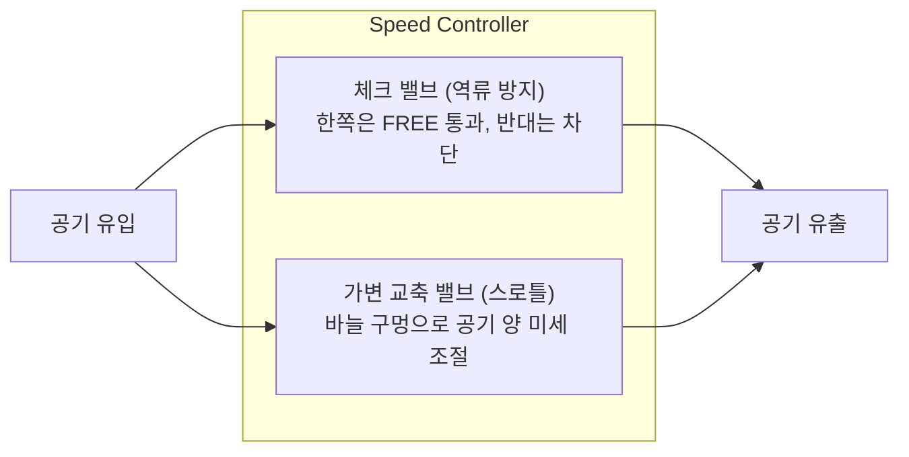

> ⚠️ **출처 및 저작권 안내**  
> 본 포스팅은 대학 강의 [공압제어 및 자동화] 강의자료를 바탕으로, 비전공자 및 초보자가 쉽게 이해할 수 있도록 일상적인 비유와 그림으로 재구성한 **비영리 스터디 요약 노트**입니다.  
> 원작자의 저작권을 존중하며, 상업적 목적으로 이용될 수 없습니다.

---

# 🏎️ 인트로: 실린더가 쾅쾅거리며 튀어나가는 이유

공압 실린더를 설치하고 밸브를 열었더니, 실린더가 부드럽게 전진하는 게 아니라 **"쾅! 퍽!"** 소리를 내며 거칠게 튀어나가 기계가 부서질 뻔한 경험이 있으신가요?

공기는 기름과 달리 고무줄처럼 눌렸다 펴지는 **'압축성'**이 있습니다.  
그래서 수도꼭지처럼 공기 양을 그냥 조절하면 실린더가 가다 서다를 반복(스틱-슬립 현상)하거나 통제 불능으로 튀어버립니다.

실린더의 속도를 0.1초 단위로 부드럽고 일정하게 제어하려면 **"유량 제어 밸브(속도 제어 밸브)"**를 올바른 방향으로 달아야 합니다.  
현장 실무와 자격증 시험에서 가장 중요한 **미터-인(Meter-in)**과 **미터-아웃(Meter-out)**의 원리를 쉽게 정리해 드립니다!

---

# 1. 일방향 유량 제어 밸브 (속도 제어 밸브)의 내부 구조

현장에서 **"스피드 컨트롤러(Speed Controller)"**라고 부르는 밸브는 사실 2개의 부품이 한 몸으로 합쳐진 장치입니다.

1. **정방향 (자유 흐름, Free Flow)**: 공기가 체크밸브를 툭 밀고 지나가므로 저항 없이 콸콸 전속력으로 통과합니다.
2. **역방향 (제어 흐름, Controlled Flow)**: 체크밸브 볼이 구멍을 꽉 막아버립니다! 공기는 좁은 바늘구멍(스로틀)으로만 지나가야 하므로 유량이 졸졸 줄어듭니다.

---

# 2. 미터-인(Meter-in) vs 미터-아웃(Meter-out)

실린더 속도를 줄일 때, 공기를 **"들어갈 때 줄일 것인가(In)"**, 아니면 **"빠져나올 때 줄일 것인가(Out)"**의 문제입니다.

| 구분 | **미터-인 (Meter-in)** | **미터-아웃 (Meter-out)** *(강력 추천!)* |
| :--- | :--- | :--- |
| **원리** | 실린더로 **들어가는 공기**를 쥐어짜서 공급 유량을 제어 | 실린더에서 **나오는 배기 공기**를 쥐어짜서 나가는 속도를 제어 |
| **쉬운 비유** | 자전거 페달을 살살 밟으며 속도 맞추기 | **자동차 브레이크를 지그시 밟으면서** 속도 맞추기 |
| **배압 형성** | 피스톤 앞쪽에 저항 압력(배압)이 없음 | 피스톤 앞쪽에 **저항 압력(배압, Back Pressure)**이 꽉 참 |
| **부하 변동 시** | 짐이 가벼워지면 순간적으로 퍽! 튀어나감 | 짐이 사라져도 배압이 잡고 있어서 **항상 부드럽게 일정 속도 유지** |
| **주요 사용처** | 스프링 복귀형 **단동 실린더**, 소형 실린더 | 자동화 설비의 **복동 실린더 (현장의 95% 이상 표준)** |

---

> 💡 **왜 공압에서는 무조건 '미터-아웃'이 정답일까요?**  
> 공압 실린더에 미터-인을 쓰면, 공기가 천천히 차오르다가 실린더 정지 마찰력을 이기는 순간 축적된 압력 때문에 피스톤이 **"퍽!"** 하고 튀어나갑니다.  
> 반면 **미터-아웃**은 공급 쪽은 전속력으로 꽉 채워두고, **나가는 공기구멍을 살짝만 열어 공기가 빠지는 속도를 통제(배압)**합니다. 마치 주사기 끝을 손가락으로 살짝 누르고 피스톤을 미는 것과 같아서, 어떤 외력이 작용해도 절대 튀지 않고 스무스하게 움직입니다!

---

# 3. 그 밖의 필수 공압 특수 밸브 3종

## (1) 급속 배기 밸브 (Quick Exhaust Valve) : "초고속 복귀!"

- 긴 에어 호스를 거쳐 밸브까지 돌아가서 배기하려면 시간이 걸립니다.
- 실린더 바로 코앞에 급속 배기 밸브를 달아주면, 공기가 밸브까지 갈 필요 없이 **현장에서 즉시 대기 중으로 "피슉!" 하고 바로 빠져나가 실린더 후진 속도가 2~3배 빨라집니다.**

---

## (2) 셔틀 밸브 (OR 밸브) vs 2압 밸브 (AND 밸브)
컴퓨터의 논리 회로처럼 공압만으로도 논리 연산을 할 수 있습니다.

### 🔀 셔틀 밸브 (Shuttle Valve, OR 회로)
- 입구가 2개(X, Y), 출구가 1개(A)입니다.
- **X 또는 Y 둘 중 어느 한쪽에만 공기가 들어와도** 내부 셔틀 볼이 반대쪽을 막아주면서 출구 A로 공기가 나옵니다. (원격 조작 스위치나 비상 정지 버튼을 양쪽 라인에 배치할 때 사용)

### 🤝 2압 밸브 (Dual Pressure Valve, AND 회로)
- **X와 Y 양쪽 모두에 공기가 들어와야만** 출구 A로 공기가 나옵니다!
- 작업자가 손을 프레스에 넣지 못하도록, **양손으로 두 개의 버튼을 동시에 눌러야만 기계가 작동하는 안전 회로(Two-hand Safety Circuit)**에 필수적으로 쓰입니다.

---

# 💡 초보자 단골 질문 FAQ

### Q. 실린더에 달린 스피드 컨트롤러 나사를 돌렸는데 왜 전진 속도가 아니라 후진 속도가 변하나요?
> **A. 미터-아웃 방식이기 때문입니다!**  
> 미터-아웃 방식에서는 **전진할 때 빠져나오는 공기는 실린더 앞쪽(로드 측) 포트에서 나옵니다.** 따라서 **전진 속도를 조절하고 싶다면 실린더 '앞쪽'에 달린 스피드 컨트롤러**를 돌려야 하고, 후진 속도를 조절하고 싶다면 실린더 '뒤쪽' 밸브를 돌려야 합니다. (반대로 생각하기 쉬우니 주의하세요!)

---

# 📝 최종 핵심 요약 노트

1. 일방향 유량 제어 밸브는 **체크 밸브(자유 흐름)**와 **스로틀 밸브(속도 조절)**의 결합이다.
2. 공압 복동 실린더는 튀는 현상을 막기 위해 99% **미터-아웃(배기 유량 제어)** 방식을 쓴다.
3. **급속 배기 밸브**는 실린더 바로 앞에서 공기를 직배출하여 작동 속도를 극대화한다.
4. **셔틀 밸브는 OR(둘 중 하나)**, **2압 밸브는 AND(양손 동시 조작 안전용)** 논리를 구현한다.

---
*(다음 편 예고: 05. 실린더가 지 혼자 멈춰버린다? 순수 공압 시퀀스 설계와 신호 중복의 비밀)*
