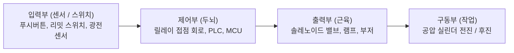
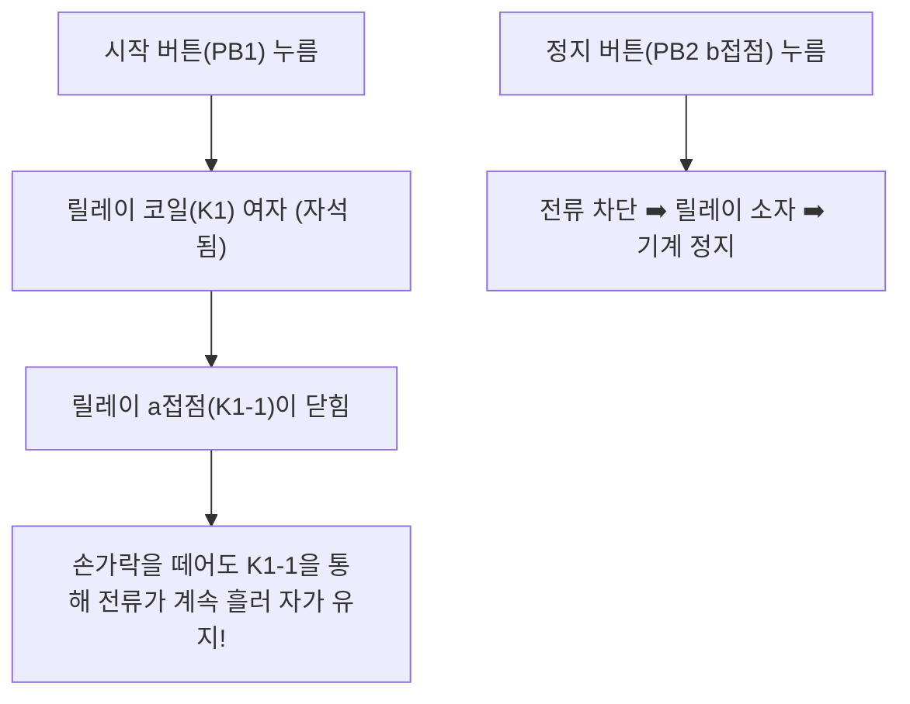

> ⚠️ **출처 및 저작권 안내**  
> 본 포스팅은 대학 강의 [공압제어 및 자동화] 강의자료와 실제 실습 노트를 바탕으로, 비전공자 및 초보자가 쉽게 이해할 수 있도록 일상적인 비유와 그림으로 재구성한 **비영리 스터디 요약 노트**입니다.  
> 원작자의 저작권을 존중하며, 상업적 목적으로 이용될 수 없습니다.

---

# ⚡ 인트로: 공기 호스를 전선으로 바꾸는 마법

지금까지 배운 '순수 공압'은 굵은 공기 호스가 거미줄처럼 얽혀 배관이 복잡하고, 신호 전달 속도가 음속(초속 약 340m)에 불과해 먼 거리 제어에는 한계가 있었습니다.

만약 **"판단과 신호 전달은 빛처럼 빠른 전선(전기)으로 하고, 무거운 짐을 밀어내는 파워는 강력한 공기(공압)로 한다면?"**  
이 환상적인 결합이 바로 현대 공장의 99%를 차지하는 **전기 공압 제어(Electro-Pneumatics)**입니다!

이번 글에서는 전기 시퀀스의 알파이자 오메가인 **릴레이(Relay)**와 **자기유지회로**, 그리고 마이크로컨트롤러(STM32)를 이용한 **임베디드 펌웨어 실무 제어 팁**까지 완벽하게 정리해 드리겠습니다!

---

# 1. 전기 시퀀스 제어의 기본 구성

- 전압은 작업자의 감전 위험을 막고 안전을 위해 공장 표준인 **직류 24V (DC 24V)**를 주로 사용합니다.

---

# 2. 전기 시퀀스의 꽃: 전자기 릴레이 (Relay)

릴레이는 **"전기로 켜고 끄는 전자석 원격 스위치"**입니다.

> 💡 **전기석 자석 비유**:  
> 작은 코일에 약한 전류를 흘리면 가운데 철심이 자석(전자석)이 되어 스프링으로 버티고 있던 쇠막대(가동 접점)를 **"찰칵!"** 하고 끌어당깁니다.

### 📌 접점의 3가지 형태
1. **a접점 (Normally Open / Make Contact)**:
   - 평소에는 스위치가 열려(Open) 있어서 전기가 안 통하다가, 코일에 전기를 주면 **닫혀서(Close) 전기를 통하게 하는 스위치**
2. **b접점 (Normally Closed / Break Contact)**:
   - 평소에는 닫혀(Close) 있어서 전기가 잘 통하다가, 코일에 전기를 주면 **열려서(Open) 전기를 차단하는 스위치**
3. **c접점 (Change-over Contact)**:
   - a접점과 b접점이 한 세트로 묶여 있어 방향을 갈아타는 전환 스위치

---

# 3. 전기 제어의 1번 공식: 자기유지 회로 (Self-Holding Circuit)

우리가 엘리베이터 호출 버튼이나 공장 기계 시동 버튼을 누를 때, 손가락을 떼어도 기계가 계속 켜져 있습니다.  
이 기억(Memory) 기능을 회로로 구현한 것이 바로 **자기유지 회로**입니다!

1. 시작 버튼(푸시버튼)을 누르면 순간적으로 릴레이 코일에 전기가 흐릅니다.
2. 코일이 자석이 되면서 릴레이 자신의 **a접점**을 찰칵 닫아버립니다.
3. 작업자가 시작 버튼에서 손을 떼더라도, **닫힌 자신의 a접점을 타고 전류가 계속 흘러 들어가 스스로 켜진 상태를 영구히 유지**합니다!
4. 기계를 끄고 싶을 때는 전원 길목에 직렬로 달아둔 **b접점 정지 버튼(Stop Button)**을 누르면 전류가 끊겨 원래대로 돌아옵니다.

---

# 4. 시간 제어의 핵심: 타이머 (Timer)

1. **온 딜레이 타이머 (On-delay Timer)**:
   - 전기가 들어오고 나서, 설정한 시간(예: 3초) 동안 뜸을 들이다가 **3초 뒤에 찰칵 스위치를 켭니다.** (실린더가 전진한 뒤 제품을 3초간 꾹 눌러줄 때 사용)
2. **오프 딜레이 타이머 (Off-delay Timer)**:
   - 전기가 꺼지고 나서, 설정한 시간(예: 5초) 동안 계속 켜져 있다가 **5초 뒤에 스위치를 끕니다.** (화장실 환풍기가 불을 끄고도 1분 더 도는 원리)

---

# 5. 전기를 공압으로 바꾸는 솔레노이드 밸브 (Solenoid Valve)

- 릴레이 회로의 최종 출력단에 **솔레노이드 코일(Sol 1, Sol 2)**을 연결합니다.
- 전기가 들어가면 전자석이 밸브 내부 밸브 코어를 당겨 공기 유로를 순식간에 열어주고, 공압 실린더가 강력하게 튀어나옵니다!

---

# 6. 실기 및 시험 단골: 편솔(Single Sol) 시퀀스 회로 설계의 비밀 🛠️

양솔(Double Solenoid)은 전기를 한 번만 찰칵 줘도 스풀이 제자리를 유지하지만, **편솔(Single Solenoid)**은 전기가 끊어지는 순간 뒤쪽 스프링 힘에 의해 실린더가 제멋대로 후진해 버립니다!  
따라서 편솔 회로에서는 **"전진 상태를 유지하기 위한 릴레이 자기유지"**와 **"후진시킬 때 자기유지를 칼같이 끊어주는 인터록(해제) 설계"**가 핵심입니다.

### 📌 편솔 시퀀스 실전 3대 문제 해법 공식
공압 실습(FluidSIM)과 시험에서 100% 출제되는 3가지 대표 패턴입니다:

1. **문제 1: $A+ B+ A- B-$ (순차 교차 동작)**
   - $K_1$ 여자 ➡️ 실린더 A 전진 및 자기유지
   - A 전진 완료 센서($S_2$) 감지 ➡️ $K_2$ 여자 ➡️ 실린더 B 전진 및 자기유지
   - B 전진 완료 센서($S_4$) 감지 ➡️ $K_3$ 여자 ➡️ **$K_1$의 전원 라인에 직렬로 달린 $K_3$ b접점이 열리며 $K_1$ 자기유지 해제!** ➡️ 솔레노이드 $Y_1$ 전원 차단으로 실린더 A 스프링 복귀(후진)
   - A 후진 완료 센서($S_1$) 감지 ➡️ $K_4$ 여자 ➡️ **$K_2$ 자기유지 해제!** ➡️ 실린더 B 후진
2. **문제 2: $A+ A- B+ B-$ (단독 왕복 동작)**
   - A가 나갔다 들어오는 사이 B는 대기하고, A 복귀 후 비로소 B가 왕복하는 회로
3. **문제 3: $A+ B+ B- A-$ (되돌림 회송 동작)**
   - A 전진 ➡️ B 전진 ➡️ B 먼저 후진 ➡️ A 마지막 후진

> 💻 **FluidSIM 시뮬레이터 실습 꿀팁**:
> - **센서 라벨링 (Actuating Labels)**: 더블클릭 후 $S_1$ (Begin: 0, End: 0), $S_2$ (Begin: 100, End: 100)으로 정확하게 입력해야 리밋 스위치가 인식됩니다.
> - **래더 심볼 연결**: 상단 24V와 하단 0V 레일에 Pushbutton(make/break), Relay 코일을 수직으로 정렬하여 배치합니다.

---

# 7. 실전 엔지니어링: STM32 마이크로컨트롤러 제어 실습 팁 🚀

최근 산업 현장에서는 릴레이 선을 일일이 잇는 대신 **STM32(NUCLEO-F103RB 등) MCU나 PLC**를 이용해 소프트웨어(C언어)로 솔레노이드 밸브와 센서를 제어합니다.

### (1) 클럭 설정 (Clock Configuration)
- **HSE / HSI**: High Speed External(외부 크리스털) / High Speed Internal(내부 RC 오실레이터)
- **LSE / LSI**: Low Speed External(32.768kHz RTC용) / Low Speed Internal(저전력/워치독용)
- 배터리 전원이나 저전력 환경에서는 클럭 스피드를 유연하게 조절하여 전력 소비를 줄입니다.

### (2) `HAL_Delay()`를 현업에서 절대 쓰면 안 되는 이유!
- 초보 시절에는 실린더 전진 후 1초 대기를 위해 `HAL_Delay(1000);`을 자주 씁니다.
- **치명적 문제점**: `HAL_Delay`가 도는 동안 **CPU는 완전히 멍때리는 상태(Blocking)**가 되어, 비상 정지 버튼이나 안전 센서 입력이 들어와도 전혀 알아채지 못합니다! (실시간성 상실)
- **현업 해결책**: **하드웨어 타이머 인터럽트(Timer Interrupt)**나 **논블로킹 밀리스(`HAL_GetTick()`) 카운팅**을 사용하여 멀티태스킹을 구현해야 합니다.

### (3) 설비 다운을 막는 수호신: 워치독 타이머 (WatchDog Timer)
- 공장에서는 강력한 모터와 인버터 노이즈 때문에 CPU 코드가 순간적으로 튀어 무한 루프(Freezing/멈춤)에 빠질 위험이 있습니다.
- **워치독(WatchDog)**은 감시견처럼 일정 시간마다 메인 루프에서 "나 안 죽고 잘 돌고 있어!" 하고 사료를 줘야(카운터 리셋) 합니다.
- 만약 코드가 멈춰 사료를 주지 못하면, 워치독 타이머가 만료되면서 **하드웨어 시스템을 강제로 즉시 리셋(Reset)**시켜 대형 공장 사고를 원천 방지합니다.

---

# 💡 초보자 단골 질문 FAQ

### Q. 비상 정지 버튼(Emergency Stop)은 왜 회로도에서 항상 b접점을 쓰나요?
> **A. 페일 세이프(Fail-Safe) 안전 원칙 때문입니다!**  
> 만약 a접점을 썼는데 전선이 쥐가 갉아먹어 단선되었다면, 위급 상황에서 버튼을 아무리 쾅 눌러도 기계가 멈추지 않아 사람이 다칩니다.  
> 평소에 전기가 통하는 **b접점**을 쓰면, 전선이 끊어지는 사고가 발생하는 즉시 전기가 차단되어 기계가 안전하게 멈추기 때문입니다!

---

# 📝 최종 핵심 요약 노트

1. **전기 공압 제어**는 제어 신호는 전기(DC 24V)로, 실제 구동 파워는 공압 실린더로 분담하는 이상적인 시스템이다.
2. **릴레이**는 코일의 전자석 힘을 이용해 a접점(상시 열림), b접점(상시 닫힘)을 스위칭한다.
3. **자기유지회로**는 푸시버튼을 놓아도 자신의 a접점으로 전원을 기억하여 동작을 유지시키는 시퀀스 회로의 심장이다.
4. 임베디드 펌웨어 제어 시 CPU 블로킹을 유발하는 `HAL_Delay` 대신 **인터럽트**를 써야 하며, 시스템 먹통 방지를 위해 **워치독 타이머**를 필수 가동한다.

---
*(공압 제어 및 시퀀스 트랙 완료! 다음 트랙: 반도체 제조 공정 및 첨단 장비 시리즈로 이어집니다)*
