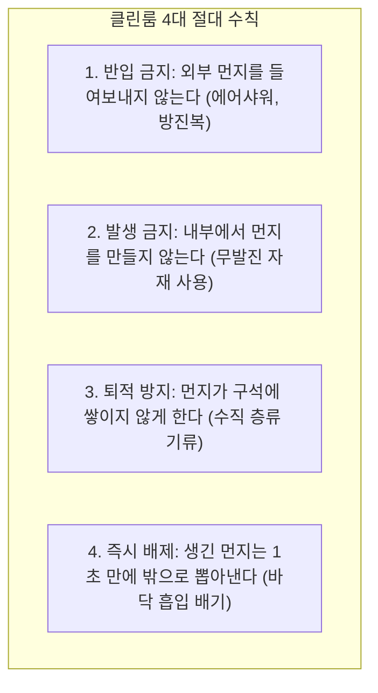

> ⚠️ **출처 및 저작권 안내**  
> 본 포스팅은 대학 강의 [반도체장비개론] 강의자료를 바탕으로, 비전공자 및 초보자가 쉽게 이해할 수 있도록 일상적인 비유와 그림으로 재구성한 **비영리 스터디 요약 노트**입니다.  
> 원작자의 저작권을 존중하며, 상업적 목적으로 이용될 수 없습니다.

---

# 🌪️ 인트로: 머리카락 하나가 수억 원의 손실을 낸다?

일반적인 실내 방 안에는 눈에 보이지 않지만, 1리터짜리 공기 속에 수십만에서 수백만 개의 먼지, 꽃가루, 각질이 둥둥 떠다니고 있습니다.  
사람 눈에는 전혀 보이지 않지만, **선폭이 몇 나노미터(nm)에 불과한 최신 반도체 회로 입장에서는 $0.1\mu\text{m}$ 크기의 먼지 하나도 거대한 '운석'이나 바위 덩어리**와 같습니다.

회로 위에 먼지 하나만 떨어져도 회로가 끊어지거나(단선), 옆 선과 달라붙어 합선(단락)이 일어나 그 칩은 즉시 불량이 됩니다.  
그래서 반도체를 생산하는 공간은 지구상에서 가장 깨끗한 특수 밀폐 방, 바로 **클린룸(Cleanroom, 청정실)**이어야 합니다!

---

# 1. 클린룸이란? 4대 절대 원칙

클린룸은 단순히 청소를 열심히 한 방이 아닙니다. **공기 중의 먼지(파티클), 온도, 습도, 실내 압력(기압), 기류의 흐름까지 정밀하게 통제하는 최첨단 밀폐 공간**입니다.

- **클린룸 전용 자재**: 일반 종이나 볼펜은 종이 가루와 잉크 가루를 뿜어내므로 반입 금지입니다! 먼지가 날리지 않는 **특수 코팅 무발진 종이(Clean Paper)**와 **무발진 펜**만 사용할 수 있습니다.

---

# 2. 청정도 등급 (Clean Class) 완벽 비교

클린룸의 깨끗한 정도는 **"Class(클래스)"**라는 단위로 매깁니다.

> 📐 **Class의 정의 (미 연방 규격 FS-209E 기준)**:  
> 가로·세로·높이가 각각 $1\text{ ft}$(약 30cm)인 상자($1\text{ ft}^3 \approx 28.3\text{ L}$) 안에 **$0.5\mu\text{m}$ 이상의 먼지가 몇 개 들어있는가?**

| 장소 구분 | 청정도 등급 (Class) | 공기 1입방피트($\text{ft}^3$) 당 먼지 수 |
| :--- | :---: | :---: |
| **일반 도심 야외 / 일반 사무실** | **Class 500,000 ~ 1,000,000** | $50만 \sim 100만$ 개 이상 (뿌연 상태!) |
| **병원 무균 수술실** | **Class 1,000 ~ 10,000** | $1,000 \sim 1만$ 개 이하 |
| **반도체 일반 검사 / 후공정** | **Class 100 ~ 1,000** | $100 \sim 1,000$ 개 이하 |
| **반도체 핵심 포토/노광 라인 (최고급)** | **Class 1 ~ 10** | **단 1개 ~ 10개 이하! (기적에 가까운 무균)** |

---

# 3. 먼지를 완벽히 쓸어내는 기류 방식: 수직 층류식

클린룸 안에서는 바람이 어떻게 불어야 먼지가 안 쌓일까요?

1. **난류식 (Turbulent Flow - 저가형)**:
   - 일반 에어컨처럼 찬 바람을 쏘아주면 방 안에서 바람이 소용돌이치면서 구석에 먼지가 맴돌게 됩니다.
2. **수직 층류식 (Vertical Laminar Flow - 반도체 팹 표준)**:
   - 천장 전체에서 깨끗한 공기를 마치 **'샤워기 물줄기'처럼 위에서 아래로 일정한 속도($0.3 \sim 0.5\text{ m/s}$)로 균일하게 뿜어냅니다.**
   - 먼지가 옆으로 날아가지 않고, 바람을 타고 수직으로 곧장 바닥의 송송 뚫린 구멍(Access Floor Grate)으로 빨려 내려가 서브팹으로 배출됩니다!

---

# 4. 외부 먼지를 밀어내는 마법: 양압(Positive Pressure) 제어

만약 클린룸 문을 열었을 때 복도의 더러운 먼지가 훅 들어오면 어떡할까요?

> 🎈 **터진 풍선 비유**:  
> 빵빵하게 분 풍선의 주둥이를 열면 풍선 안의 공기가 바깥으로 쉭- 뿜어져 나오지, 바깥 공기가 풍선 안으로 들어가지 않습니다!

- 클린룸 공조기는 실내 압력을 복도나 외부보다 **약 $10\sim30\text{ Pa}$ 높게(양압, Positive Pressure)** 유지합니다.
- 사람이 드나들기 위해 문을 열더라도, **내부의 초청정 공기가 바깥으로 강하게 밀고 나가기 때문에 바깥의 더러운 먼지가 절대로 안으로 들어올 수 없습니다!**

---

# 5. 클린룸의 핵심 공조 장비들

### (1) FFU (Fan Filter Unit) : 천장에 달린 청정 엔진
- 모터 팬과 초정밀 에어 필터가 일체형으로 합쳐진 장치로, 반도체 공장 천장에 수천~수만 대가 빈틈없이 촘촘하게 박혀 있습니다.
- **HEPA 필터**: $0.3\mu\text{m}$ 크기의 먼지를 **$99.97\%$ 이상** 포집
- **ULPA 필터**: $0.1\mu\text{m}$ 크기의 초미세 먼지를 **$99.999\%$ 이상** 완벽 차단

---

### (2) 에어샤워 (Air Shower) & 패스박스 (Pass Box)

- **에어샤워기**: 사람이 방진복을 입고 클린룸에 입장하기 직전, 밀폐된 챔버에서 시속 80km 이상의 초고속 청정 바람을 360도로 뿜어 몸에 붙은 미세 먼지를 털어내는 장치입니다.
- **패스박스**: 작은 부품이나 공구를 전달할 때 사람이 직접 문을 열고 다니지 않도록, 벽에 설치된 인터록 이중문 전달 상자입니다.

---

### (3) 항온항습기 (Temperature & Humidity Control)

- 반도체 웨이퍼는 열을 받으면 미세하게 팽창하고 식으면 수축합니다. 0.01℃만 변해도 노광 초점이 틀어집니다!
- **온도 제어**: $22 \pm 0.5℃$ 수준의 극한 정밀도로 유지
- **습도 제어**: 습도가 너무 높으면 금속이 부식되고, 습도가 너무 낮으면 다음 편에서 다룰 **'치명적인 정전기(ESD)'**가 폭발하므로 **$45 \pm 5\%$ RH**로 사계절 내내 칼같이 유지합니다.

---

# 💡 초보자 단골 질문 FAQ

### Q. 클린룸 천장의 조명은 왜 하얀색이 아니라 노란색(옐로우 룸)인 곳이 있나요?
> **A. 포토(Photo) 공정에서 감광액(PR)이 미리 반응해 타버리는 것을 막기 위해서입니다!**  
> 빛으로 회로를 그리는 포토 공정 구역에 일반 형광등(자외선/청색광 포함)을 켜면, 웨이퍼에 바른 감광액이 형광등 불빛에 반응해 버려 회로가 망가집니다. 자외선 파장이 없는 500nm 이상의 안전한 **노란색 조명(Yellow Lamp)**을 켜두기 때문에 그 구역을 '옐로우 룸(Yellow Room)'이라고 부릅니다!

---

# 📝 최종 핵심 요약 노트

1. **클린룸**은 먼지, 온·습도, 실내 압력을 정밀 통제하여 반도체 수율을 지키는 청정 공간이다.
2. 핵심 공정 구역은 공기 1입방피트당 먼지가 1개 이하인 **Class 1** 수준의 청정도를 유지한다.
3. 먼지가 쌓이지 않도록 천장에서 바닥으로 수직 바람을 쏘는 **수직 층류 방식**을 채택한다.
4. 문이 열려도 먼지가 들어오지 못하게 실내 압력을 높게 유지하는 **양압(Positive Pressure) 제어**가 기본이다.
5. 천장에는 **FFU(팬 필터 유닛)와 ULPA 필터**가 장착되어 초미세 먼지를 $99.999\%$ 걸러낸다.

---
*(다음 편 예고: 04. 반도체 칩을 한순간에 태워먹는 보이지 않는 저승사자, 정전기(ESD)와 이오나이저)*
