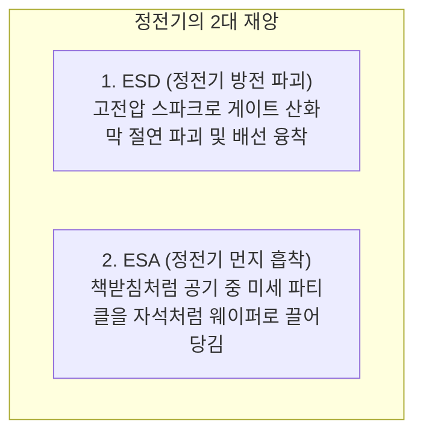

> ⚠️ **출처 및 저작권 안내**  
> 본 포스팅은 대학 강의 및 전문 교육 자료 [정전기 대책 기초지식]을 바탕으로, 비전공자 및 초보자가 쉽게 이해할 수 있도록 일상적인 비유와 그림으로 재구성한 **비영리 스터디 요약 노트**입니다.  
> 원작자의 저작권을 존중하며, 상업적 목적으로 이용될 수 없습니다.

---

# ⚡ 인트로: 문손잡이를 잡을 때 "찌릿!" 한 기억

건조한 겨울철에 니트 스웨터를 벗거나 자동차 문손잡이를 잡을 때 **"찌릿!"** 하고 파란 스파크가 튄 적이 누구나 한 번쯤 있을 겁니다.

우리가 손끝으로 "앗, 따가워!" 하고 느낄 때의 전압이 무려 **$3,000\text{V} \sim 5,000\text{V}$**에 달한다는 사실을 알고 계셨나요?  
사람 피부는 저항이 커서 잠깐 따끔하고 말지만, **머리카락 10만 분의 1 굵기로 얇게 만들어진 반도체 칩에게 $3,000\text{V}$의 벼락은 거대한 원자폭탄이 떨어지는 것**과 같습니다!

심지어 최신 초미세 반도체는 **단 $10\text{V} \sim 50\text{V}$의 미세한 정전기만 튀어도 즉시 절연막에 구멍이 뻥 뚫려 영구 파괴**됩니다.  
사람은 전혀 느끼지도 못하는 사이에 수백억 원어치의 웨이퍼가 죽어나가는 것이죠.  
이번 글에서는 반도체의 보이지 않는 암살자 **정전기(ESD)**의 정체와 이를 막아내는 첨단 무기 **이오나이저(Ionizer)**의 원리를 파헤쳐 보겠습니다!

---

# 1. 정전기는 왜 생길까? (마찰과 박리 대전)

모든 물질은 원자핵(양전하 $+$)과 전자(음전하 $-$)로 이루어져 평소에는 중성($0$) 상태를 유지합니다.

- 하지만 두 물체가 서로 문지르거나(마찰 대전), 붙어 있다가 떨어질 때(박리 대전) 전자가 한쪽으로 홀라당 넘어가 버립니다!
- 전자를 빼앗긴 쪽은 **양($+$)전하**, 전자를 얻은 쪽은 **음($-$)전하**를 띠게 되며, 이렇게 전하가 이동하지 못하고 한곳에 머물러 고여 있는 전기를 **정전기(Static Electricity, 靜電氣)**라고 부릅니다.

> 📊 **대전 서열 (전자를 잃기 쉬운 순서)**:  
> **(+) 사람 손/피부 ➡️ 유리 ➡️ 나일론 ➡️ 솜(면) ➡️ 실리콘 ➡️ 테플론 (-)**  
> 서열 표에서 서로 멀리 떨어진 물질끼리 접촉했다 떨어질수록 수만 볼트의 초강력 정전기가 발생합니다!

---

# 2. 정전기가 반도체에 일으키는 2대 치명적 재앙

정전기는 반도체 공장에서 크게 2가지 방식으로 수율을 파괴합니다.

### (1) ESD (Electrostatic Discharge: 정전기 방전 파괴)
- 정전기가 모여 있다가 도체나 웨이퍼 핀에 닿는 순간, 수 나노초(ns)의 눈 깜짝할 사이에 거대한 번개 전류가 흐릅니다.
- 트랜지스터의 극도로 얇은 게이트 산화막($\text{SiO}_2$)이 녹아내려 구멍이 뚫리고, 알루미늄/구리 배선이 타서 끊어져 버립니다.

### (2) ESA (Electrostatic Attraction: 정전기 먼지 흡착)
- 어릴 때 플라스틱 책받침을 머리에 문지른 뒤 머리카락을 대면 착 달라붙던 현상을 기억하실 겁니다.
- 웨이퍼 표면이나 운반 로봇 팔이 정전기를 띠게 되면, **클린룸 공기 중에 떠다니던 눈에 안 보이는 미세 먼지들을 자석처럼 맹렬하게 끌어당겨 웨이퍼 표면에 달라붙게 만듭니다!** (세정 장비로 씻어도 잘 안 떨어짐)

---

# 3. 보이지 않는 번개를 막아라: 이오나이저 (Ionizer: 제전기)

웨이퍼나 플라스틱 부품은 부도체(절연체)라서 전선을 꽂아 접지(어스)를 해도 정전기가 빠져나가지 않습니다.  
이때 공기를 이용해 정전기를 흔적도 없이 지워버리는 마법 같은 장치가 바로 **이오나이저(Ionizer)**입니다!

> ⚖️ **중화(Neutralization)의 원리**:  
> 플러스($+$) 정전기가 쌓여 있으면 마이너스($-$)를 던져주고, 마이너스($-$)가 쌓여 있으면 플러스($+$)를 던져서 영($0$)으로 만들어주면 끝납니다!

1. **코로나 방전 (Corona Discharge)**:
   - 이오나이저 내부의 아주 뾰족한 방전 침(바늘) 끝에 수천 볼트의 고전압을 걸어줍니다.
   - 바늘 끝에서 강력한 전기장이 형성되면서 주변 공기 분자(질소, 산소)가 쪼개져 **양이온($\text{Ion}^+$)**과 **음이온($\text{Ion}^-$)**이 대량으로 생성됩니다.
2. **이온 바람 분사**:
   - 깨끗한 압축 공기나 팬 바람을 이용해 생성된 양이온과 음이온을 웨이퍼 표면으로 골고루 불어넣습니다.
3. **순식간에 정전기 소멸**:
   - 웨이퍼에 음전하가 뭉쳐 있었다면 양이온이 달라붙고, 양전하가 뭉쳐 있었다면 음이온이 달라붙어 **1초도 안 되는 사이에 완벽한 중성($0\text{V}$) 상태**로 되돌려 놓습니다!

---

# 4. 현장 엔지니어의 정전기 방지 3대 수칙

반도체 라인에 들어가는 작업자는 머리부터 발끝까지 완벽한 정전기 차폐 무장을 해야 합니다.

1. **제전 리스트 스트랩 (Wrist Strap - 손목 밴드)**:
   - 작업대에서 손으로 반도체 부품을 만질 때 반드시 손목에 차는 전도성 밴드입니다. 몸에 쌓이는 정전기를 접지선을 통해 1메가옴($1\text{ M}\Omega$) 저항을 거쳐 땅속으로 안전하게 흘려보냅니다.
2. **제전화 & 제전 바닥 (ESD Shoes & Conductive Floor)**:
   - 걸어 다니는 마찰만으로도 수천 볼트가 충전됩니다. 신발 밑창에 탄소 전도성 물질이 들어간 제전화를 신고 전도성 타일 바닥을 밟아, 발을 디딜 때마다 정전기가 바닥으로 즉시 빠져나가게 합니다.
3. **도전성 트레이 & 쉴딩 백 (ESD Safe Bag)**:
   - 칩을 보관하고 운반하는 플라스틱 박스와 비닐은 은박이 코팅된 전도성 자재를 사용하여 외부 정전기가 내부 칩에 닿지 못하도록 차폐(패러데이 케이지 효과)합니다.

---

# 💡 초보자 단골 질문 FAQ

### Q. 손목 접지 밴드(Wrist Strap) 안에 왜 굳이 1메가옴($1\text{ M}\Omega$)짜리 큰 저항을 넣어두나요? 그냥 구리선으로 연결하면 정전기가 더 빨리 빠지지 않나요?
> **A. 작업자의 소중한 목숨을 지키기 위한 감전 방지 안전장치입니다!**  
> 만약 밴드를 찬 상태에서 작업자가 220V 전원선이나 고전압 부품을 실수로 만졌을 때, 저항이 없는 맨 도선이라면 거대한 전류가 작업자 심장을 관통해 감전사하게 됩니다.  
> $1\text{ M}\Omega$의 높은 저항을 달아두면 **미세한 정전기 전하는 땅으로 안전하게 빠져나가면서도, 상용 전기가 닿았을 때는 치명적인 대전류를 완벽히 막아주기 때문**입니다!

---

# 📝 최종 핵심 요약 노트

1. 사람은 $3,000\text{V}$ 이상이어야 정전기를 느끼지만, **반도체는 단 수십 볼트의 미세 방전(ESD)으로도 즉사**한다.
2. 정전기는 칩을 태워먹는 **ESD(방전 파괴)**뿐만 아니라, 웨이퍼에 먼지를 자석처럼 끌어당기는 **ESA(먼지 흡착)**라는 치명적인 문제를 일으킨다.
3. 부도체 표면의 정전기를 없애기 위해 고전압 코로나 방전으로 양이온·음이온을 만들어 뿜어주는 **이오나이저(Ionizer)**가 필수 장비이다.
4. 작업자는 **제전복, 제전화, 손목 스트랩, 접지(Ground)**를 통해 몸에 전하가 쌓이지 않도록 철저히 관리해야 한다.

---
*(다음 편 예고: 05. 빛으로 나노 회로를 그리는 첫 단추! 포토마스크(Photomask) 제조 공정 완벽 해설)*
