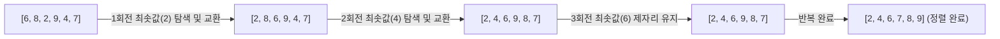

# [C언어 핵심 마스터북] 기초 문법부터 자료구조(연결 리스트)까지 실습 총정리

이 문서는 한국폴리텍대학 하이테크 과정 '반도체장비프로그래밍 C언어' 수업에서 다룬 **총 84개의 실습 소스코드**를 바탕으로 제작되었습니다.
기초 문법부터 시작하여 제어문, 배열, 포인터, 구조체, 그리고 단일 연결 리스트(Linked List) 및 파일 입출력까지의 전 과정을 **개념 설명, 리팩토링된 코드, 원본의 오류/주의사항(Warning) 분석, 콘솔 예상 입출력 결과**와 함께 완벽히 정리하였습니다. 블로그 포스팅 및 개인 학습용 레퍼런스로 활용할 수 있습니다.

---

## 목차 (Table of Contents)

- [서문: C언어의 아키텍처와 메모리 모델](#서문-c언어의-아키텍처와-메모리-모델)
- [제1장. 기본 문법, 연산자 및 조건문 (Basic & Conditionals)](#제1장-기본-문법-연산자-및-조건문-basic--conditionals)
  - [1.1 변수 증감 연산자 (`TEST5.c`)](#11-변수-증감-연산자-test5c)
  - [1.2 탐욕적 알고리즘 기반 화폐 매수 계산기 (`TEST6.c`, `TEST7.c`)](#12-탐욕적-알고리즘-기반-화폐-매수-계산기-test6c-test7c)
  - [1.3 기본 입출력과 사칙연산 (`TEST8.c`)](#13-기본-입출력과-사칙연산-test8c)
  - [1.4 시간 단위 변환과 나머지 연산 오류 교정 (`TEST9.c`)](#14-시간-단위-변환과-나머지-연산-오류-교정-test9c)
  - [1.5 삼항 조건 연산자의 활용 (`TEST10.c` ~ `TEST15.c`)](#15-삼항-조건-연산자의-활용-test10c--test15c)
  - [1.6 다중 조건문과 불량 제품 선별 로직 (`TEST16.c` ~ `TEST20.c`, `test21.c`, `test22.c`)](#16-다중-조건문과-불량-제품-선별-로직-test16c--test20c-test21c-test22c)
  - [1.7 `goto` 문의 동작 원리와 위험성 (`test23.c` ~ `test25.c`)](#17-goto-문의-동작-원리와-위험성-test23c--test25c)
  - [1.8 변수 섀도잉(Variable Shadowing)과 스코프의 함정 (`test26.c`)](#18-변수-섀도잉variable-shadowing과-스코프의-함정-test26c)
  - [1.9 `switch-case`문과 데드코드(Dead Code) 오류 교정 (`switch42.c`)](#19-switch-case문과-데드코드dead-code-오류-교정-switch42c)
  - [1.10 무한 루프와 주문 결제 시스템 (`coffee40.c`)](#110-무한-루프와-주문-결제-시스템-coffee40c)
- [제2장. 반복문 (Loops: for, while, do-while)](#제2장-반복문-loops-for-while-do-while)
  - [2.1 `for`문의 기본 구조와 다중 제어 변수 (`for27.c`, `for29.c`)](#21-for문의-기본-구조와-다중-제어-변수-for27c-for29c)
  - [2.2 반복문 조건식 검증과 루프 미실행 버그 (`for32.c`)](#22-반복문-조건식-검증과-루프-미실행-버그-for32c)
  - [2.3 배수 판별, 누적 합계, 홀짝 카운팅 (`for30.c`, `for31.c`, `for33.c`, `forsum34.c`, `for35.c` ~ `for37.c`)](#23-배수-판별-누적-합계-홀짝-카운팅-for30c-for31c-for33c-forsum34c-for35c--for37c)
  - [2.4 구구단 출력과 서식 지정자 정렬 테크닉 (`for38.c`)](#24-구구단-출력과-서식-지정자-정렬-테크닉-for38c)
  - [2.5 `continue` 제어와 C언어 연쇄 비교식의 함정 (`for43.c`, `for44.c`)](#25-continue-제어와-c언어-연쇄-비교식의-함정-for43c-for44c)
  - [2.6 [실전 시뮬레이션 1] 양돈장 출하 선별 시스템 (`for41.c`, `for_while46.c`)](#26-실전-시뮬레이션-1-양돈장-출하-선별-시스템-for41c-for_while46c)
  - [2.7 [실전 시뮬레이션 2] 사과 선별기 및 불량률(폐기율) 판정 (`while45.c`)](#27-실전-시뮬레이션-2-사과-선별기-및-불량률폐기율-판정-while45c)
- [제3장. 1·2차원 배열과 문자열 (Array & String)](#제3장-12차원-배열과-문자열-array--string)
  - [3.1 배열의 메모리 연속성과 배열명의 본질 (포인터 상수) (`array47.c`)](#31-배열의-메모리-연속성과-배열명의-본질-포인터-상수-array47c)
  - [3.2 `sizeof`를 활용한 배열 길이의 동적 계산 (`array48.c`)](#32-sizeof를-활용한-배열-길이의-동적-계산-array48c)
  - [3.3 C 문자열의 본질과 널 문자(`\0`)의 규칙 (`array49.c`, `array50.c`, `arraystring52.c`)](#33-c-문자열의-본질과-널-문자0의-규칙-array49c-array50c-arraystring52c)
  - [3.4 선형 탐색(Linear Search)과 최댓값 추출 (`array51.c`, `array53.c`, `array54.c`, `array55.c`)](#34-선형-탐색linear-search과-최댓값-추출-array51c-array53c-array54c-array55c)
  - [3.5 2차원 문자 배열과 학생 석차(Rank) 산출 (`array56.c` ~ `array61.c`)](#35-2차원-문자-배열과-학생-석차rank-산출-array56c--array61c)
  - [3.6 두 변수의 교환(Swap) 알고리즘 (`array62.c`)](#36-두-변수의-교환swap-알고리즘-array62c)
- [제4장. 정렬 알고리즘 (Sorting Algorithms)](#제4장-정렬-알고리즘-sorting-algorithms)
  - [4.1 선택 정렬(Selection Sort)의 원리와 시간 복잡도](#41-선택-정렬selection-sort의-원리와-시간-복잡도)
  - [4.2 전역 변수 방식에서 함수 모듈화로의 진화 (`selection_sort.c` ~ `selection_sort4.c`)](#42-전역-변수-방식에서-함수-모듈화로의-진화-selection_sortc--selection_sort4c)
  - [4.3 다차원 복합 데이터(성적/총점) 내림차순 정렬 (`sort5.c`, `sort6.c`)](#43-다차원-복합-데이터성적총점-내림차순-정렬-sort5c-sort6c)
- [제5장. 함수 (Functions)와 모듈화 프로그래밍](#제5장-함수-functions와-모듈화-프로그래밍)
  - [5.1 함수의 선언, 정의, 호출 구조 (`A.c`, `function1.c`)](#51-함수의-선언-정의-호출-구조-ac-function1c)
  - [5.2 전역 변수 vs 지역 변수와 메모리 수명](#52-전역-변수-vs-지역-변수와-메모리-수명)
  - [5.3 콘솔 메뉴 제어 인터페이스 설계 (`function2.c`, `function3.c`)](#53-콘솔-메뉴-제어-인터페이스-설계-function2c-function3c)
- [제6장. 포인터 (Pointers)와 메모리 직접 제어](#제6장-포인터-pointers와-메모리-직접-제어)
  - [6.1 주소 연산자(`&`)와 간접 참조 연산자(`*`)](#61-주소-연산자와-간접-참조-연산자)
  - [6.2 Call by Value vs Call by Reference (값 교환 함수) (`포인터1.c`, `포인터2.c`)](#62-call-by-value-vs-call-by-reference-값-교환-함수-포인터1c-포인터2c)
  - [6.3 포인터를 활용한 배열 전달과 정렬 (`포인터3.c`)](#63-포인터를-활용한-배열-전달과-정렬-포인터3c)
  - [6.4 [치명적 버그 분석] 버퍼 오버플로우와 메모리 오염 (`포인터4.c`)](#64-치명적-버그-분석-버퍼-오버플로우와-메모리-오염-포인터4c)
- [제7장. 구조체 (Structures)와 사용자 정의 자료형](#제7장-구조체-structures와-사용자-정의-자료형)
  - [7.1 구조체의 개념과 메모리 레이아웃 (`구조체1.c`, `구조체2.c`)](#71-구조체의-개념과-메모리-레이아웃-구조체1c-구조체2c)
  - [7.2 `typedef` 키워드의 올바른 사용과 문법 오류 분석 (`구조체3.c` ~ `구조체5.c`, `구조체8.c`)](#72-typedef-키워드의-올바른-사용과-문법-오류-분석-구조체3c--구조체5c-구조체8c)
  - [7.3 구조체 배열을 활용한 성적 처리 시스템 (`구조체6.c` ~ `구조체8.c`)](#73-구조체-배열을-활용한-성적-처리-시스템-구조체6c--구조체8c)
  - [7.4 구조체 포인터와 화살표 연산자(`->`) (`구조체9.c`)](#74-구조체-포인터와-화살표-연산자--구조체9c)
- [제8장. 동적 할당, 단일 연결 리스트 (Linked List) & 파일 입출력](#제8장-동적-할당-단일-연결-리스트-linked-list--파일-입출력)
  - [8.1 동적 메모리 할당(`malloc`, `free`)의 필요성](#81-동적-메모리-할당malloc-free의-필요성)
  - [8.2 단일 연결 리스트의 노드 구조 설계](#82-단일-연결-리스트의-노드-구조-설계)
  - [8.3 기본 연산: 머리 생성, 노드 추가(`Append`), 전체 순회(`Print`) (`liked.c`)](#83-기본-연산-머리-생성-노드-추가append-전체-순회print-likedc)
  - [8.4 완성형 CRUD: 데이터 검색(`Search`), 중간 삽입(`Insert`), 삭제(`Delete`) (`liked1.c`)](#84-완성형-crud-데이터-검색search-중간-삽입insert-삭제delete-liked1c)
  - [8.5 파일 입출력 기초 (`Filewrite.c`)](#85-파일-입출력-기초-filewritec)

---

## 서문: C언어의 아키텍처와 메모리 모델

C언어는 하드웨어(HW)와 운영체제(OS)의 동작 원리를 가장 직접적으로 반영하는 저수준(Low-level) 지향의 고급 프로그래밍 언어입니다.

```
+-------------------------------------------------------------+
|                      응용 프로그램 (Application)            |
+-------------------------------------------------------------+
|               운영체제 (Operating System - Windows/Linux)    |
+-------------------------------------------------------------+
|                       하드웨어 (CPU, RAM, Storage)          |
+-------------------------------------------------------------+
```

1. **컴파일 단계**: 작성된 C 소스 코드(`.c`)는 전처리기(`Pre-processor`) $\rightarrow$ 컴파일러(`Compiler`) $\rightarrow$ 어셈블러(`Assembler`) $\rightarrow$ 링커(`Linker`)를 거쳐 최종 실행 파일(`.exe`)로 변환됩니다.
2. **프로세스 메모리 4대 영역**:
   - **코드(Code/Text) 영역**: 실행할 기계어 명령어가 저장되는 읽기 전용 공간
   - **데이터(Data/BSS) 영역**: 전역 변수(Global) 및 정적 변수(Static)가 상주하는 공간 (프로그램 시작~종료 시 유지)
   - **힙(Heap) 영역**: 프로그래머가 `malloc()`으로 동적 할당하고 `free()`로 반납하는 동적 런타임 공간
   - **스택(Stack) 영역**: 함수 호출 시 매개변수와 지역 변수가 저장되고 반환 시 자동 소멸되는 공간 (LIFO 구조)

---

## 제1장. 기본 문법, 연산자 및 조건문 (Basic & Conditionals)

변수 선언, 증감 연산자, 표준 입출력(`printf`, `scanf`), 산술 연산자, 조건문(`if`, `switch`)의 핵심 원리를 다룹니다.

### 1.1 변수 증감 연산자 (`TEST5.c`)

전위 증감(`++a`, `--a`)과 후위 증감(`b++`, `b--`)은 연산자가 평가되는 시점에 결정적인 차이가 있습니다.

```c
#include <stdio.h>

int main(void)
{
    int a = 5, b = 3;
    a++; // a는 6이 됨

    // --a는 전위 감소: 먼저 6에서 5로 감소한 뒤 출력에 반영됨
    // b++는 후위 증가: 현재 값 3이 먼저 출력된 후 b가 4로 증가함
    printf("a=%d b=%d\n", --a, b++);
    
    // 이전 연산에서 b가 4가 된 상태
    printf("a=%d b=%d\n", a, b);

    return 0;
}
```
**예상 실행 결과:**
```
a=5 b=3
a=5 b=4
```

---

### 1.2 탐욕적 알고리즘 기반 화폐 매수 계산기 (`TEST6.c`, `TEST7.c`)

특정 금액을 지불할 때 최소한의 화폐 개수를 사용하도록 큰 단위부터 거슬러 주는 탐욕적(Greedy) 연산 구조입니다.

```c
#include <stdio.h>

int main(void)
{
    int money = 127670; // 계산 대상 금액
    // 내림차순 정렬된 화폐 단위 배열
    int units[] = { 50000, 10000, 5000, 1000, 500, 100, 50, 10 }; 
    int count = 0;
    int total_count = 0;

    printf("금액: %d원\n", money);
    printf("--------------------------\n");

    for (int i = 0; i < 8; i++) {
        count = money / units[i];      // 몫: 해당 화폐 단위의 개수
        money = money % units[i];      // 나머지: 다음 단위로 넘길 잔여 금액
        total_count += count;

        if (count > 0) {
            printf("%5d원: %d개\n", units[i], count);
        }
    }

    printf("--------------------------\n");
    printf("총 화폐 개수: %d개\n", total_count);

    return 0;
}
```
**예상 실행 결과:**
```
금액: 127670원
--------------------------
50000원: 2개
10000원: 2개
 5000원: 1개
 1000원: 2개
  500원: 1개
  100원: 1개
   50원: 1개
   10원: 2개
--------------------------
총 화폐 개수: 12개
```

---

### 1.3 기본 입출력과 사칙연산 (`TEST8.c`)

두 정수를 입력받아 곱, 합, 차를 연산합니다. Visual Studio 환경에서는 보안 경고를 방지하기 위해 `#define _CRT_SECURE_NO_WARNINGS`를 선언합니다.

```c
#define _CRT_SECURE_NO_WARNINGS
#include <stdio.h>

int main(void)
{
    int a, b;
    printf("두 정수를 공백으로 구분하여 입력하세요: ");
    scanf("%d %d", &a, &b); 

    int c_mul = a * b;
    int c_add = a + b;
    int c_sub = a - b;

    printf("곱: %d\n합: %d\n차: %d\n", c_mul, c_add, c_sub);

    return 0;
}
```
**예상 실행 결과 (입력: `10 5`):**
```
두 정수를 공백으로 구분하여 입력하세요: 10 5
곱: 50
합: 15
차: 5
```

---

### 1.4 시간 단위 변환과 나머지 연산 오류 교정 (`TEST9.c`)

초(sec) 단위 값을 입력받아 시간, 분, 초로 분해합니다.

```c
#define _CRT_SECURE_NO_WARNINGS 
#include <stdio.h>

int main(void)
{
    int total_sec;
    int hour, min, sec;

    printf("초 단위로 입력하세요: ");
    scanf("%d", &total_sec); 

    hour = total_sec / 3600;              // 1시간 = 3600초
    min  = (total_sec % 3600) / 60;       // 3600초를 제외한 잔여 초를 60으로 나눔
    sec  = total_sec % 60;                // 60초 미만의 남은 초

    printf("%d초는 %d시간 %d분 %d초입니다.\n", total_sec, hour, min, sec);

    return 0;
}
```

> [!WARNING]
> **원본 코드 오류 분석:**
> 원본 소스코드에서 `sec = min % 60;`으로 처리한 부분이 있었습니다. 이는 '분(min)' 변수를 다시 60으로 나눈 나머지이므로 전혀 엉뚱한 초 값이 출력됩니다. 최종 잔여 초는 반드시 `total_sec % 60`으로 계산해야 정확합니다.

**예상 실행 결과 (입력: `3665`):**
```
초 단위로 입력하세요: 3665
3665초는 1시간 1분 5초입니다.
```

---

### 1.5 삼항 조건 연산자의 활용 (`TEST10.c` ~ `TEST15.c`)

간단한 조건 분기는 `if-else` 대신 `(조건식) ? 참값 : 거짓값` 형태의 삼항 연산자를 사용하면 코드를 간결하게 표현할 수 있습니다.

```c
#define _CRT_SECURE_NO_WARNINGS
#include <stdio.h>

int main(void)
{
    int age;
    printf("나이를 입력하시오: ");
    scanf("%d", &age);
    
    // 18세 이상이면 1(성인), 미만이면 0(미성년자)
    int is_adult = (age >= 18) ? 1 : 0;
    
    printf("판별 결과: %d (1: 성인, 0: 미성년자)\n", is_adult);

    return 0;
}
```
**예상 실행 결과 (입력: `15`):**
```
나이를 입력하시오: 15
판별 결과: 0 (1: 성인, 0: 미성년자)
```

---

### 1.6 다중 조건문과 불량 제품 선별 로직 (`TEST16.c` ~ `TEST20.c`, `test21.c`, `test22.c`)

제조 공정에서 3개(a, b, c) 또는 4개(a, b, c, d)의 제품 무게를 측정하여 규격과 다른 1개의 불량품을 찾아내는 알고리즘입니다.

```c
#define _CRT_SECURE_NO_WARNINGS
#include <stdio.h>

int main(void)
{
    int a, b, c;
    printf("음료수 3개의 무게를 입력하세요 (예: 100 100 95): ");
    scanf("%d %d %d", &a, &b, &c);

    // 두 개의 무게가 같으면 나머지 하나가 불량품
    if (a == b) {
        printf("정량이 아닌 제품: c (무게: %d)\n", c);
    } else if (a == c) {
        printf("정량이 아닌 제품: b (무게: %d)\n", b);
    } else {
        printf("정량이 아닌 제품: a (무게: %d)\n", a);
    }

    return 0;
}
```
**예상 실행 결과 (입력: `100 100 95`):**
```
음료수 3개의 무게를 입력하세요 (예: 100 100 95): 100 100 95
정량이 아닌 제품: c (무게: 95)
```

---

### 1.7 `goto` 문의 동작 원리와 위험성 (`test23.c` ~ `test25.c`)

`goto` 문은 지정한 라벨(`label:`)로 무조건 실행 흐름을 점프시키는 키워드입니다.

```c
#define _CRT_SECURE_NO_WARNINGS
#include <stdio.h>

int main(void)
{
    int n;

input_loop:
    printf("정수를 입력하세요 (0 입력 시 종료): ");
    scanf("%d", &n);

    if (n == 0) {
        goto program_end; // 반복 탈출
    }

    if (n % 2 != 0) {
        printf("%d는 홀수입니다.\n", n);
    } else {
        printf("%d는 짝수입니다.\n", n);
    }

    goto input_loop; // 라벨로 점프하여 반복

program_end:
    printf("프로그램을 안전하게 종료합니다.\n");
    return 0;
}
```

> [!CAUTION]
> **실무 권장 사항 (Best Practice):**
> `goto` 문은 프로그램의 제어 흐름을 복잡하게 만들어 코드를 스파게티(Spaghetti code)처럼 꼬이게 합니다. 중첩 루프를 한 번에 빠져나오는 매우 예외적인 상황이 아니라면 `while`문이나 `for`문, 함수 분할을 사용하는 것이 원칙입니다.

**예상 실행 결과:**
```
정수를 입력하세요 (0 입력 시 종료): 7
7는 홀수입니다.
정수를 입력하세요 (0 입력 시 종료): 12
12는 짝수입니다.
정수를 입력하세요 (0 입력 시 종료): 0
프로그램을 안전하게 종료합니다.
```

---

### 1.8 변수 섀도잉(Variable Shadowing)과 스코프의 함정 (`test26.c`)

블록 내부에서 동일한 이름의 변수를 재선언할 때 발생하는 유효범위 가림 현상입니다.

```c
#include <stdio.h>

int main(void)
{
    int i = 0; // 바깥쪽 지역 변수 i

    // for문 내부에서 새롭게 선언된 i (반복 블록 내에서만 유효)
    for (int i = 0; i < 3; i++)
    {
        printf("루프 내부 i = %d\n", i);
    }

    // 루프가 끝난 후 바깥쪽 i는 변경되지 않음!
    printf("루프 종료 후 바깥쪽 i = %d\n", i);

    return 0;
}
```

> [!WARNING]
> **오개념 주의:**
> 원본 코드 주석에 `// for문 밖에서는 3이 출력`이라고 적혀 있었으나, 이는 잘못된 설명입니다. C99 표준 이후 `for (int i = ...)`로 선언된 변수는 루프가 끝나는 순간 소멸(Destroy)되며, 바깥쪽 `int i = 0;`은 전혀 수정되지 않으므로 그대로 `0`이 출력됩니다.

**예상 실행 결과:**
```
루프 내부 i = 0
루프 내부 i = 1
루프 내부 i = 2
루프 종료 후 바깥쪽 i = 0
```

---

### 1.9 `switch-case`문과 데드코드(Dead Code) 오류 교정 (`switch42.c`)

다중 분기 구조에서 `switch-case`문을 사용하여 입력된 연령대별 방문객 수를 집계합니다.

```c
#define _CRT_SECURE_NO_WARNINGS
#include <stdio.h>

int main(void)
{
    int age = 1;
    int count_0_29 = 0;  // 0~29세
    int count_30_49 = 0; // 30~49세
    int count_50_59 = 0; // 50~59세
    int count_60_up = 0; // 60세 이상

    printf("나이를 입력하세요 (0 입력 시 종료):\n");

    while (1)
    {
        printf("나이: ");
        scanf("%d", &age);
        if (age == 0) break; // 루프 탈출 조건

        switch (age / 10)
        {
        case 0:
        case 1:
        case 2:
            count_0_29++;
            break;
        case 3:
        case 4:
            count_30_49++;
            break;
        case 5:
            count_50_59++; // [수정] break 이전에 카운트를 증가시켜야 함
            break;
        default:
            count_60_up++;
            break;
        }

        printf("[현재 집계] 0~29세: %d명, 30~49세: %d명, 50~59세: %d명, 60세 이상: %d명\n\n",
               count_0_29, count_30_49, count_50_59, count_60_up);
    }

    printf("--- 최종 집계 종료 ---\n");
    return 0;
}
```

> [!WARNING]
> **데드코드(Dead Code) 버그 교정:**
> 원본 코드 `case 5:`에서 `break;`가 `f++;`보다 먼저 작성되어 있었습니다. `break;`가 실행되면 즉시 `switch` 블록을 탈출하므로 `f++;`는 컴파일러가 도달할 수 없는 데드코드가 되어 50대 집계가 완전히 누락되는 치명적인 버그였습니다. 반드시 `f++; break;` 순으로 작성해야 합니다.

**예상 실행 결과:**
```
나이를 입력하세요 (0 입력 시 종료):
나이: 24
[현재 집계] 0~29세: 1명, 30~49세: 0명, 50~59세: 0명, 60세 이상: 0명

나이: 55
[현재 집계] 0~29세: 1명, 30~49세: 0명, 50~59세: 1명, 60세 이상: 0명

나이: 0
--- 최종 집계 종료 ---
```

---

### 1.10 무한 루프와 주문 결제 시스템 (`coffee40.c`)

키오스크처럼 주문이 들어올 때마다 결제 금액과 누적 매출을 실시간으로 갱신하는 무한 반복 루프 구조입니다.

```c
#define _CRT_SECURE_NO_WARNINGS
#include <stdio.h>

int main(void)
{
    const int COFFEE_PRICE = 1500; // 단일 메뉴 단가
    int order_count = 0;           // 주문 수량
    int total_customers = 0;       // 총 고객/수량 누적
    int current_pay = 0;           // 현재 결제 금액
    int total_sales = 0;           // 누적 매출액

    while (1)
    {
        printf("단일 커피(1,500원) 주문 수량을 입력하세요 (0 입력 시 마감): ");
        scanf("%d", &order_count);

        if (order_count <= 0) {
            printf("\n영업을 마감합니다.\n");
            break;
        }

        current_pay = COFFEE_PRICE * order_count;
        total_customers += order_count;
        total_sales += current_pay;

        printf("-> 결제 금액: %d원\n", current_pay);
        printf("[누적 현황] 총 판매 잔수: %d잔 | 총 매출: %d원\n\n", total_customers, total_sales);
    }

    printf("=========================================\n");
    printf("오늘의 최종 매출 합계: %d원 (총 %d잔)\n", total_sales, total_customers);
    return 0;
}
```
**예상 실행 결과:**
```
단일 커피(1,500원) 주문 수량을 입력하세요 (0 입력 시 마감): 3
-> 결제 금액: 4500원
[누적 현황] 총 판매 잔수: 3잔 | 총 매출: 4500원

단일 커피(1,500원) 주문 수량을 입력하세요 (0 입력 시 마감): 2
-> 결제 금액: 3000원
[누적 현황] 총 판매 잔수: 5잔 | 총 매출: 7500원

단일 커피(1,500원) 주문 수량을 입력하세요 (0 입력 시 마감): 0

영업을 마감합니다.
=========================================
오늘의 최종 매출 합계: 7500원 (총 5잔)
```

---

## 제2장. 반복문 (Loops: for, while, do-while)

반복문은 프로그래밍에서 데이터 처리의 핵심입니다. C언어의 `for`, `while`, `do-while` 문과 제어 키워드(`break`, `continue`)를 심층 분석합니다.

### 2.1 `for`문의 기본 구조와 다중 제어 변수 (`for27.c`, `for29.c`)

`for`문은 초기식, 조건식, 증감식에 콤마(`,`) 연산자를 활용하여 둘 이상의 변수를 동시에 제어할 수 있습니다.

```c
#include <stdio.h>

int main(void)
{
    // i는 1씩 증가, j는 2씩 증가하며 3회 반복
    for (int i = 0, j = 0; i < 3; ++i, j += 2)
    {
        printf("i = %d, j = %d\n", i, j);
    }
    return 0;
}
```
**예상 실행 결과:**
```
i = 0, j = 0
i = 1, j = 2
i = 2, j = 4
```

---

### 2.2 반복문 조건식 검증과 루프 미실행 버그 (`for32.c`)

```c
#include <stdio.h>

int main(void)
{
    // [버그 코드] for (int i = 0, j = 1; i + j > 100; i++, ++j) 
    // -> 초기 i+j는 1이므로 100보다 크지 않아 본문이 한 번도 실행되지 않음!

    // [올바른 수정 코드]: i + j가 10 미만일 때까지 반복
    for (int i = 0, j = 1; i + j < 10; i++, j += 2)
    {
        printf("i = %d, j = %d (합: %d)\n", i, j, i + j);
    }
    return 0;
}
```

> [!WARNING]
> **조건식 방향 반전 오류:**
> `for32.c`의 원본 조건식 `i + j > 100`은 루프 진입 단계에서 바로 `false(0)`가 되어 루프 내부가 완전히 무시됩니다. 반복문을 작성할 때는 항상 **초기 조건이 참(true)인지**를 반드시 검증해야 합니다.

**예상 실행 결과:**
```
i = 0, j = 1 (합: 1)
i = 1, j = 3 (합: 4)
i = 2, j = 5 (합: 7)
```

---

### 2.3 배수 판별, 누적 합계, 홀짝 카운팅 (`for30.c`, `for31.c`, `for33.c`, `forsum34.c`, `for35.c` ~ `for37.c`)

5개의 정수를 입력받아 짝수와 홀수의 개수를 각각 집계하고 전체 합을 계산하는 표준적인 패턴입니다.

```c
#define _CRT_SECURE_NO_WARNINGS
#include <stdio.h>

int main(void)
{
    int data;
    int even_count = 0;
    int odd_count = 0;
    int total_sum = 0;

    printf("5개의 정수를 공백으로 구분하여 입력하세요:\n");

    for (int i = 1; i <= 5; i++)
    {
        scanf("%d", &data);
        total_sum += data;

        if (data % 2 == 0) {
            even_count++;
        } else {
            odd_count++;
        }
    }

    printf("----------------------------------\n");
    printf("입력 총합: %d\n", total_sum);
    printf("짝수 개수: %d개 | 홀수 개수: %d개\n", even_count, odd_count);

    return 0;
}
```
**예상 실행 결과 (입력: `12 7 9 20 15`):**
```
5개의 정수를 공백으로 구분하여 입력하세요:
12 7 9 20 15
----------------------------------
입력 총합: 63
짝수 개수: 2개 | 홀수 개수: 3개
```

---

### 2.4 구구단 출력과 서식 지정자 정렬 테크닉 (`for38.c`)

출력 서식 지정자 `%2d`를 사용하면 자릿수를 일정하게 맞춰 콘솔 결과를 정갈하게 정렬할 수 있습니다.

```c
#define _CRT_SECURE_NO_WARNINGS
#include <stdio.h>

int main(void)
{
    int dan;
    printf("출력할 구구단 단수를 입력하세요 (2~9): ");
    scanf("%d", &dan);

    printf("=== [%d 단] ===\n", dan);
    for (int i = 1; i <= 9; i++)
    {
        // %2d는 2자리를 확보하여 우측 정렬 출력
        printf("%d x %d = %2d\n", dan, i, dan * i);
    }

    return 0;
}
```
**예상 실행 결과 (입력: `7`):**
```
출력할 구구단 단수를 입력하세요 (2~9): 7
=== [7 단] ===
7 x 1 =  7
7 x 2 = 14
7 x 3 = 21
7 x 4 = 28
7 x 5 = 35
7 x 6 = 42
7 x 7 = 49
7 x 8 = 56
7 x 9 = 63
```

---

### 2.5 `continue` 제어와 C언어 연쇄 비교식의 함정 (`for43.c`, `for44.c`)

`continue`는 루프의 나머지 코드를 건너뛰고 다음 반복으로 넘어갈 때 사용합니다. 또한 수학식 표현 `(10 < x < 20)`을 C언어에서 그대로 사용하면 심각한 논리 오류가 발생합니다.

```c
#include <stdio.h>

int main(void)
{
    printf("[1. continue 예제: 3의 배수만 출력]\n");
    for (int i = 1; i <= 10; i++)
    {
        if (i % 3 != 0) continue; // 3의 배수가 아니면 출력 건너뜀
        printf("%d ", i);
    }
    printf("\n\n");

    printf("[2. C언어 연쇄 비교식의 함정 분석]\n");
    // (10 > 15 < 20) 연산 과정:
    // 1단계: (10 > 15)는 거짓이므로 0으로 평가됨
    // 2단계: (0 < 20)은 참이므로 최종 결과는 1(참)이 됨!
    printf("(10 > 15 < 20) 의 평가 결과: %d\n", (10 > 15 < 20));
    
    // 올바른 논리곱 연산자(&&) 사용:
    printf("(10 > 15 && 15 < 20) 의 평가 결과: %d\n", (10 > 15 && 15 < 20));

    return 0;
}
```

> [!IMPORTANT]
> **비교 연산자 결합 방향(Associativity):**
> 관계 연산자(`<`, `>`)는 좌측에서 우측(Left-to-Right)으로 결합합니다. 따라서 `a < b < c`는 `(a < b) < c`로 처리되며, 앞선 비교의 결과값인 `0` 또는 `1`과 `c`를 비교하게 됩니다. 수학적 범위를 검사할 때는 반드시 `(a < b && b < c)` 형태로 작성해야 합니다.

**예상 실행 결과:**
```
[1. continue 예제: 3의 배수만 출력]
3 6 9 

[2. C언어 연쇄 비교식의 함정 분석]
(10 > 15 < 20) 의 평가 결과: 1
(10 > 15 && 15 < 20) 의 평가 결과: 0
```

---

### 2.6 [실전 시뮬레이션 1] 양돈장 출하 선별 시스템 (`for41.c`, `for_while46.c`)

500마리의 돼지 중 계근대를 통과할 때 규격 체중(60kg ~ 80kg)에 해당하는 개체만 선별하여 오늘 목표 출하량(5000kg)을 채우는 제어 시뮬레이션입니다.

```c
#define _CRT_SECURE_NO_WARNINGS
#include <stdio.h>

int main(void)
{
    const int TARGET_WEIGHT = 5000; // 목표 출하 중량 (kg)
    const int MAX_PIGS = 500;       // 총 사육 두수

    int total_shipped_weight = 0;   // 출하된 총 중량
    int shipped_pig_count = 0;      // 출하된 돼지 마리수
    int current_pig_weight;

    printf("=== 양돈장 출하 계근대 시뮬레이션 (목표: %d kg) ===\n", TARGET_WEIGHT);
    printf("돼지 무게를 순차적으로 입력하세요 (테스트용으로 0 입력 시 입력 중단):\n");

    for (int i = 1; i <= MAX_PIGS; i++)
    {
        scanf("%d", &current_pig_weight);
        if (current_pig_weight <= 0) break; // 시뮬레이션 조기 종료

        // 출하 적격 기준: 60kg 이상 80kg 이하
        if (current_pig_weight >= 60 && current_pig_weight <= 80)
        {
            shipped_pig_count++;
            total_shipped_weight += current_pig_weight;

            // 목표량 달성 여부 실시간 확인
            if (total_shipped_weight >= TARGET_WEIGHT)
            {
                printf("\n[알림] 목표 출하 중량(%d kg)을 달성하여 계근을 조기 마감합니다!\n", TARGET_WEIGHT);
                break;
            }
        }
    }

    printf("=============================================\n");
    printf("오늘 출하된 돼지 마리수: %d 마리\n", shipped_pig_count);
    printf("오늘 출하된 총 중량: %d kg\n", total_shipped_weight);
    return 0;
}
```
**예상 실행 결과 (입력: `70 75 55 65 85 80 0`):**
```
=== 양돈장 출하 계근대 시뮬레이션 (목표: 5000 kg) ===
돼지 무게를 순차적으로 입력하세요 (테스트용으로 0 입력 시 입력 중단):
70 75 55 65 85 80 0
=============================================
오늘 출하된 돼지 마리수: 4 마리
오늘 출하된 총 중량: 290 kg
```

---

### 2.7 [실전 시뮬레이션 2] 사과 선별기 및 불량률(폐기율) 판정 (`while45.c`)

사과의 표준 중량은 200g이고 허용 오차는 $\pm 5$g (195g ~ 205g)입니다. 규격을 벗어난 사과는 폐기하고 전체 중 폐기율(%)을 계산합니다.

```c
#define _CRT_SECURE_NO_WARNINGS
#include <stdio.h>

int main(void)
{
    int weight;
    int total_apples = 0;
    int discarded_apples = 0;

    printf("사과 중량(g)을 입력하세요 (-1 입력 시 선별 종료):\n");

    while (1)
    {
        scanf("%d", &weight);
        if (weight == -1) break; // 센서 종료 플래그

        total_apples++;

        // 195g 미만이거나 205g 초과인 경우 폐기
        if (weight < 195 || weight > 205)
        {
            discarded_apples++;
        }
    }

    if (total_apples > 0)
    {
        double discard_rate = ((double)discarded_apples / total_apples) * 100.0;
        printf("----------------------------------------\n");
        printf("총 통과 사과 수 : %d 개\n", total_apples);
        printf("폐기 대상 사과 수: %d 개\n", discarded_apples);
        printf("폐기율(불량률)  : %.2f %%\n", discard_rate);
    }
    else
    {
        printf("측정된 사과 데이터가 없습니다.\n");
    }

    return 0;
}
```
**예상 실행 결과 (입력: `200 198 210 190 204 -1`):**
```
사과 중량(g)을 입력하세요 (-1 입력 시 선별 종료):
200 198 210 190 204 -1
----------------------------------------
총 통과 사과 수 : 5 개
폐기 대상 사과 수: 2 개
폐기율(불량률)  : 40.00 %
```

---

## 제3장. 1·2차원 배열과 문자열 (Array & String)

배열은 동일한 타입의 변수들을 연속된 메모리 공간에 배치하는 자료구조입니다.

### 3.1 배열의 메모리 연속성과 배열명의 본질 (포인터 상수) (`array47.c`)

C언어에서 배열의 이름은 해당 **배열의 첫 번째 요소의 메모리 시작 주소(`&arr[0]`)를 가리키는 상수 포인터**입니다.

```c
#include <stdio.h>

int main(void)
{
    int arr[5] = { 10, 20, 30, 40, 50 };

    printf("arr의 주소값       : %p\n", (void*)arr);
    printf("&arr[0]의 주소값   : %p\n", (void*)&arr[0]);
    printf("&arr[1]의 주소값   : %p (int 크기 4바이트 증가)\n", (void*)&arr[1]);

    int total_bytes = sizeof(arr);             // 5 * 4 = 20 바이트
    int element_count = sizeof(arr) / sizeof(arr[0]); // 20 / 4 = 5 개

    printf("배열 전체 크기     : %d 바이트\n", total_bytes);
    printf("배열 요소 개수     : %d 개\n", element_count);

    return 0;
}
```
**예상 실행 결과:**
```
arr의 주소값       : 000000A1C20FF788
&arr[0]의 주소값   : 000000A1C20FF788
&arr[1]의 주소값   : 000000A1C20FF78C (int 크기 4바이트 증가)
배열 전체 크기     : 20 바이트
배열 요소 개수     : 5 개
```

---

### 3.2 `sizeof`를 활용한 배열 길이의 동적 계산 (`array48.c`)

```c
#include <stdio.h>

int main(void)
{
    int scores[] = { 88, 92, 79, 95, 100, 64, 75 };
    // 배열 크기가 변경되어도 자동으로 반복 횟수를 계산하는 공식
    int length = sizeof(scores) / sizeof(scores[0]);

    printf("등록된 점수 목록 (총 %d명):\n", length);
    for (int i = 0; i < length; i++)
    {
        printf("학생 [%d]: %d점\n", i + 1, scores[i]);
    }

    return 0;
}
```

---

### 3.3 C 문자열의 본질과 널 문자(`\0`)의 규칙 (`array49.c`, `array50.c`, `arraystring52.c`)

C언어에는 독립된 `string` 기본 자료형이 없습니다. 대신 `char` 배열의 마지막에 널 문자(`\0`, ASCII 0)를 배치하여 문자열의 끝을 표시합니다.

```c
#define _CRT_SECURE_NO_WARNINGS
#include <stdio.h>

int main(void)
{
    char name[16];

    printf("이름을 입력하세요: ");
    // name 자체가 배열의 시작 주소이므로 앞에 &를 붙이지 않음!
    scanf("%15s", name); 

    printf("입력된 이름: %s\n", name);

    char test_str[] = { 'H', 'e', 'l', 'l', 'o', '\0' };
    printf("널 문자로 종단된 문자열: %s\n", test_str);

    return 0;
}
```

> [!NOTE]
> **scanf와 주소 연산자(&):**
> `int`형 변수 입력 시에는 `scanf("%d", &num)`처럼 주소를 넘겨주어야 하지만, 문자열 배열 `name`은 배열명 자체가 주소(`&name[0]`)이므로 `scanf("%s", name)`처럼 `&`를 생략합니다.

**예상 실행 결과 (입력: `Alice`):**
```
이름을 입력하세요: Alice
입력된 이름: Alice
널 문자로 종단된 문자열: Hello
```

---

### 3.4 선형 탐색(Linear Search)과 최댓값 추출 (`array51.c`, `array53.c`, `array54.c`, `array55.c`)

배열 내에서 특정 값을 찾거나, 가장 큰 값을 찾아내는 알고리즘입니다.

```c
#define _CRT_SECURE_NO_WARNINGS
#include <stdio.h>

int main(void)
{
    int num[9] = { 3, 6, 5, 2, 8, 4, 9, 1, 7 };
    int target;
    int found_index = -1;

    printf("검색할 숫자를 입력하세요: ");
    scanf("%d", &target);

    for (int i = 0; i < 9; i++)
    {
        if (num[i] == target)
        {
            found_index = i;
            break; // 값을 찾았으므로 탐색 조기 종료
        }
    }

    if (found_index != -1) {
        printf("값 %d은(는) 배열의 %d번째 인덱스에 있습니다.\n", target, found_index);
    } else {
        printf("배열에 해당 값이 존재하지 않습니다.\n");
    }

    return 0;
}
```
**예상 실행 결과 (입력: `8`):**
```
검색할 숫자를 입력하세요: 8
값 8은(는) 배열의 4번째 인덱스에 있습니다.
```

---

### 3.5 2차원 문자 배열과 학생 석차(Rank) 산출 (`array56.c` ~ `array61.c`)

이중 반복문을 돌며 나보다 점수가 높은 사람이 있을 때마다 나의 등수(`rank`)를 1씩 증가시키는 석차 계산 방식입니다.

```c
#define _CRT_SECURE_NO_WARNINGS
#include <stdio.h>

int main(void)
{
    char names[5][10] = { "Kim", "Lee", "Park", "Choi", "Jung" };
    int scores[5] = { 75, 95, 88, 95, 60 };
    int rank[5];

    // 석차 계산 알고리즘 (O(N^2))
    for (int i = 0; i < 5; i++)
    {
        rank[i] = 1; // 기본 1등으로 시작
        for (int j = 0; j < 5; j++)
        {
            // 다른 사람의 점수가 내 점수보다 높으면 내 순위는 1단계 밀려남
            if (scores[j] > scores[i])
            {
                rank[i]++;
            }
        }
    }

    printf("=== 학생 성적 및 석차 집계표 ===\n");
    for (int i = 0; i < 5; i++)
    {
        printf("이름: %-6s | 점수: %3d점 | 석차: %d등\n", names[i], scores[i], rank[i]);
    }

    return 0;
}
```
**예상 실행 결과:**
```
=== 학생 성적 및 석차 집계표 ===
이름: Kim    | 점수:  75점 | 석차: 4등
이름: Lee    | 점수:  95점 | 석차: 1등
이름: Park   | 점수:  88점 | 석차: 3등
이름: Choi   | 점수:  95점 | 석차: 1등
이름: Jung   | 점수:  60점 | 석차: 5등
```

---

### 3.6 두 변수의 교환(Swap) 알고리즘 (`array62.c`)

변수 A와 B의 값을 맞바꿀 때는 데이터가 덮어씌워져 유실되지 않도록 임시 변수(`temp`)를 거쳐야 합니다.

```c
#include <stdio.h>

int main(void)
{
    int large = 15;
    int small = 90;

    printf("교환 전 -> large: %d, small: %d\n", large, small);

    // large에 더 큰 값을 유지하도록 조건부 교환
    if (large < small)
    {
        int temp = large;
        large = small;
        small = temp;
    }

    printf("교환 후 -> large: %d, small: %d\n", large, small);
    return 0;
}
```
**예상 실행 결과:**
```
교환 전 -> large: 15, small: 90
교환 후 -> large: 90, small: 15
```

---

## 제4장. 정렬 알고리즘 (Sorting Algorithms)

정렬은 컴퓨터 공학의 기본 연산 중 하나입니다. 이번 장에서는 수업에서 집중적으로 실습한 **선택 정렬(Selection Sort)**을 단계별로 분석합니다.

### 4.1 선택 정렬(Selection Sort)의 원리와 시간 복잡도

- **원리**: 정렬되지 않은 영역에서 **가장 작은 값(또는 가장 큰 값)을 찾아 맨 앞자리와 교환(Swap)**하는 과정을 반복합니다.
- **시간 복잡도**: 데이터 수가 $N$개일 때 항상 $\frac{N(N-1)}{2}$번의 비교를 수행하므로 최선/평균/최악 모두 **$O(N^2)$**입니다.



---

### 4.2 전역 변수 방식에서 함수 모듈화로의 진화 (`selection_sort.c` ~ `selection_sort4.c`)

초기 실습 코드(`selection_sort.c`)는 전역 변수 기반이었으나, 점차 포인터 매개변수를 받는 독립적인 함수(`selection_sort4.c`)로 발전하였습니다.

```c
#include <stdio.h>

// 선택 정렬 함수: 배열의 주소(arr)와 길이(length)를 인자로 전달받음
void SelectionSort(int* arr, int length)
{
    for (int i = 0; i < length - 1; i++)
    {
        int min_index = i; // 현재 회전의 최솟값 위치

        for (int j = i + 1; j < length; j++)
        {
            if (arr[j] < arr[min_index]) // 오름차순 기준
            {
                min_index = j;
            }
        }

        // 최솟값을 찾았으면 현재 기준 위치(i)와 교환
        if (min_index != i)
        {
            int temp = arr[i];
            arr[i] = arr[min_index];
            arr[min_index] = temp;
        }
    }
}

void PrintArray(const int* arr, int length)
{
    for (int i = 0; i < length; i++)
    {
        printf("%d ", arr[i]);
    }
    printf("\n");
}

int main(void)
{
    int nums[] = { 8, 5, 7, 9, 3, 2 };
    int length = sizeof(nums) / sizeof(nums[0]);

    printf("정렬 전 원본 데이터 : ");
    PrintArray(nums, length);

    SelectionSort(nums, length);

    printf("오름차순 정렬 후    : ");
    PrintArray(nums, length);

    return 0;
}
```
**예상 실행 결과:**
```
정렬 전 원본 데이터 : 8 5 7 9 3 2 
오름차순 정렬 후    : 2 3 5 7 8 9 
```

---

### 4.3 다차원 복합 데이터(성적/총점) 내림차순 정렬 (`sort5.c`, `sort6.c`)

학생 이름과 복수 과목 점수를 연동하여 **총점이 높은 순서(내림차순)**로 학생 레코드를 함께 정렬합니다.

```c
#define _CRT_SECURE_NO_WARNINGS
#include <stdio.h>
#include <string.h>

int main(void)
{
    char names[3][20] = { "홍길동", "이순신", "강감찬" };
    int scores[3][3] = { // 국어, 영어, 총점
        { 80, 90, 0 },
        { 95, 98, 0 },
        { 70, 65, 0 }
    };

    // 총점 계산
    for (int i = 0; i < 3; i++) {
        scores[i][2] = scores[i][0] + scores[i][1];
    }

    // 총점 기준 내림차순 선택 정렬
    for (int i = 0; i < 2; i++)
    {
        int max_index = i;
        for (int j = i + 1; j < 3; j++)
        {
            if (scores[j][2] > scores[max_index][2])
            {
                max_index = j;
            }
        }

        if (max_index != i)
        {
            // 1. 총점 및 과목 점수 교환
            for (int k = 0; k < 3; k++) {
                int temp_score = scores[i][k];
                scores[i][k] = scores[max_index][k];
                scores[max_index][k] = temp_score;
            }
            // 2. 이름 문자열 교환
            char temp_name[20];
            strcpy(temp_name, names[i]);
            strcpy(names[i], names[max_index]);
            strcpy(names[max_index], temp_name);
        }
    }

    printf("=== 성적 우수자 순위 (총점 내림차순) ===\n");
    for (int i = 0; i < 3; i++)
    {
        printf("%d위: %-8s (국어:%2d, 영어:%2d | 총점:%3d)\n",
               i + 1, names[i], scores[i][0], scores[i][1], scores[i][2]);
    }

    return 0;
}
```
**예상 실행 결과:**
```
=== 성적 우수자 순위 (총점 내림차순) ===
1위: 이순신   (국어:95, 영어:98 | 총점:193)
2위: 홍길동   (국어:80, 영어:90 | 총점:170)
3위: 강감찬   (국어:70, 영어:65 | 총점:135)
```

---

## 제5장. 함수 (Functions)와 모듈화 프로그래밍

반복되는 코드를 기능 단위로 묶어 재사용성과 유지보수성을 극대화합니다.

### 5.1 함수의 선언, 정의, 호출 구조 (`A.c`, `function1.c`)

- **함수 선언 (함수 원형, Prototype)**: 컴파일러에게 함수의 이름, 반환형, 매개변수 정보를 미리 알려줍니다.
- **함수 정의**: 실제 본문 코드를 작성합니다.

```c
#include <stdio.h>

// 함수 프로토타입 선언
int CalculateSum(int start, int end);

int main(void)
{
    // 함수 호출: 인자(Arguments) 1과 10을 전달
    int result = CalculateSum(1, 10);
    printf("1부터 10까지의 합: %d\n", result);
    return 0;
}

// 함수 정의 (구현)
int CalculateSum(int start, int end)
{
    int sum = 0;
    for (int i = start; i <= end; i++)
    {
        sum += i;
    }
    return sum; // 결과 반환
}
```
**예상 실행 결과:**
```
1부터 10까지의 합: 55
```

---

### 5.2 전역 변수 vs 지역 변수와 메모리 수명

- **지역 변수(Local Variable)**: 스택(Stack) 영역에 생성되며, 해당 함수/블록을 벗어나면 자동으로 소멸합니다.
- **전역 변수(Global Variable)**: 데이터(Data) 영역에 상주하며 프로그램 종료 시까지 유지됩니다. 어디서든 수정할 수 있으므로 버그 추적이 어려워집니다.

---

### 5.3 콘솔 메뉴 제어 인터페이스 설계 (`function2.c`, `function3.c`)

```c
#define _CRT_SECURE_NO_WARNINGS
#include <stdio.h>

void ShowMenu(void)
{
    printf("\n==== [장비 제어 시스템 메뉴] ====\n");
    printf("1. 웨이퍼 로딩\n");
    printf("2. 공정 파라미터 측정\n");
    printf("3. 챔버 압력 배기\n");
    printf("4. 시스템 종료\n");
    printf("선택할 번호를 입력하세요: ");
}

int main(void)
{
    int choice = 0;

    while (choice != 4)
    {
        ShowMenu();
        scanf("%d", &choice);

        switch (choice)
        {
        case 1:
            printf(">> 알림: 웨이퍼가 성공적으로 로딩되었습니다.\n");
            break;
        case 2:
            printf(">> 알림: 현재 챔버 온도 25.4도, 압력 1.2 mTorr 유지 중\n");
            break;
        case 3:
            printf(">> 알림: 배기 밸브를 개방합니다.\n");
            break;
        case 4:
            printf(">> 시스템을 안전하게 종료합니다.\n");
            break;
        default:
            printf(">> 잘못된 번호입니다. 다시 입력해주세요.\n");
            break;
        }
    }
    return 0;
}
```
**예상 실행 결과:**
```
==== [장비 제어 시스템 메뉴] ====
1. 웨이퍼 로딩
2. 공정 파라미터 측정
3. 챔버 압력 배기
4. 시스템 종료
선택할 번호를 입력하세요: 1
>> 알림: 웨이퍼가 성공적으로 로딩되었습니다.

==== [장비 제어 시스템 메뉴] ====
1. 웨이퍼 로딩
2. 공정 파라미터 측정
3. 챔버 압력 배기
4. 시스템 종료
선택할 번호를 입력하세요: 4
>> 시스템을 안전하게 종료합니다.
```

---

## 제6장. 포인터 (Pointers)와 메모리 직접 제어

포인터는 특정 메모리 공간의 **주소(Address)**를 저장하는 특수 변수입니다.

### 6.1 주소 연산자(`&`)와 간접 참조 연산자(`*`)

- `&`: 특정 변수의 메모리 시작 주소를 추출하는 연산자
- `*`: 포인터가 가리키고 있는 메모리 주소로 찾아가 실제 값을 읽거나 쓰는 역참조(Dereferencing) 연산자

---

### 6.2 Call by Value vs Call by Reference (값 교환 함수) (`포인터1.c`, `포인터2.c`)

일반 변수를 함수에 인자로 넘기면 값이 복사될 뿐 원본은 변경되지 않습니다. 원본 변수의 값을 직접 바꾸려면 **주소값을 전달하는 포인터 방식(Call by Reference)**을 사용해야 합니다.

```c
#include <stdio.h>

// 포인터를 매개변수로 받아 주소로 직접 접근하여 값을 교환
void SwapByPointer(int* a, int* b)
{
    int temp = *a;
    *a = *b;
    *b = temp;
}

int main(void)
{
    int x = 10, y = 20;

    printf("교환 전: x = %d, y = %d\n", x, y);

    // 주소 연산자(&)로 x와 y의 메모리 주소를 넘김
    SwapByPointer(&x, &y);

    printf("교환 후: x = %d, y = %d\n", x, y);

    return 0;
}
```
**예상 실행 결과:**
```
교환 전: x = 10, y = 20
교환 후: x = 20, y = 10
```

---

### 6.3 포인터를 활용한 배열 전달과 정렬 (`포인터3.c`)

배열을 함수의 인자로 전달할 때 `int arr[]`과 `int* arr`는 문법적으로 동일하게 동작합니다.

```c
#include <stdio.h>

void SelectionSortPointer(int* p_arr, int size)
{
    for (int i = 0; i < size - 1; i++)
    {
        int min_idx = i;
        for (int j = i + 1; j < size; j++)
        {
            // 포인터 배열 인덱싱 *(p_arr + j) == p_arr[j]
            if (*(p_arr + j) < *(p_arr + min_idx))
            {
                min_idx = j;
            }
        }
        int temp = *(p_arr + i);
        *(p_arr + i) = *(p_arr + min_idx);
        *(p_arr + min_idx) = temp;
    }
}

int main(void)
{
    int arr[] = { 6, 8, 2, 9, 4, 7 };
    int size = sizeof(arr) / sizeof(arr[0]);

    SelectionSortPointer(arr, size);

    printf("포인터 함수로 정렬된 결과: ");
    for (int i = 0; i < size; i++)
    {
        printf("%d ", arr[i]);
    }
    printf("\n");

    return 0;
}
```
**예상 실행 결과:**
```
포인터 함수로 정렬된 결과: 2 4 6 7 8 9 
```

---

### 6.4 [치명적 버그 분석] 버퍼 오버플로우와 메모리 오염 (`포인터4.c`)

```c
#define _CRT_SECURE_NO_WARNINGS
#include <stdio.h>
#include <string.h>

struct student {
    char name[15];
    int score;
};

int main(void)
{
    // [버그 코드] struct student Student[3];
    // 크기는 3개인데 for 루프에서 5회를 반복하여 Student[3], Student[4]로 메모리 침범!
    
    // [교정 코드]: 배열 크기를 실제 입력받을 인원수(5명)에 맞춤
    struct student Student[5];
    char searchName[15];
    int foundIndex = -1;

    printf("5명의 학생 이름과 점수를 입력하세요:\n");
    for (int i = 0; i < 5; i++)
    {
        scanf("%14s %d", Student[i].name, &Student[i].score);
    }

    printf("\n점수를 조회할 학생 이름을 입력하세요: ");
    scanf("%14s", searchName);

    for (int i = 0; i < 5; i++)
    {
        if (strcmp(Student[i].name, searchName) == 0)
        {
            foundIndex = i;
            break;
        }
    }

    if (foundIndex != -1) {
        printf(">> %s 학생의 점수는 %d점입니다.\n", Student[foundIndex].name, Student[foundIndex].score);
    } else {
        printf(">> %s 학생을 찾을 수 없습니다.\n", searchName);
    }

    return 0;
}
```

> [!CAUTION]
> **버퍼 오버플로우(Buffer Overflow)의 위험성:**
> 원본 `포인터4.c`는 `Student[3]`으로 3개의 공간만 확보해 두고 루프를 5번 돌려 입력을 받았습니다. 이는 할당되지 않은 스택 메모리를 덮어쓰게 되어 프로그램이 비정상 종료(Crash)되거나 예기치 못한 데이터 변조가 발생하는 심각한 결함입니다. 반드시 배열 크기와 루프 범위는 엄격히 일치시켜야 합니다.

**예상 실행 결과:**
```
5명의 학생 이름과 점수를 입력하세요:
Alice 85
Bob 92
Charlie 78
David 95
Emma 89

점수를 조회할 학생 이름을 입력하세요: Charlie
>> Charlie 학생의 점수는 78점입니다.
```

---

## 제7장. 구조체 (Structures)와 사용자 정의 자료형

서로 다른 타입의 데이터(이름 문자열, 점수 정수 등)를 하나로 묶어 새로운 사용자 정의 데이터 타입을 생성합니다.

### 7.1 구조체의 개념과 메모리 레이아웃 (`구조체1.c`, `구조체2.c`)

```c
#include <stdio.h>

// STag 구조체 정의
struct STag {
    int m;    // 4바이트 정수
    char c;   // 1바이트 문자 (메모리 정렬 패딩에 의해 실제 크기는 8바이트가 됨)
};

int main(void)
{
    struct STag s1;
    s1.m = 100;
    s1.c = 'A';

    printf("s1.m = %d, s1.c = %c\n", s1.m, s1.c);
    printf("구조체 크기: %zu 바이트 (메모리 패딩 적용)\n", sizeof(s1));

    return 0;
}
```
**예상 실행 결과:**
```
s1.m = 100, s1.c = A
구조체 크기: 8 바이트 (메모리 패딩 적용)
```

---

### 7.2 `typedef` 키워드의 올바른 사용과 문법 오류 분석 (`구조체3.c` ~ `구조체5.c`, `구조체8.c`)

```c
// [잘못된 문법 - 구조체4.c, 구조체5.c]
// typedef struct student {
//     char name[15];
//     int score;
// }; // 별칭(Alias Name)이 생략되어 typedef의 의미가 없어짐 (컴파일 경고 발생)

// [올바른 문법 - 구조체8.c 권장]
typedef struct student {
    char name[15];
    int score[3]; // 국어, 영어, 총점
} Student; // 구조체 별칭을 Student로 지정하여 'struct student' 대신 'Student'로 사용 가능
```

---

### 7.3 구조체 배열을 활용한 성적 처리 시스템 (`구조체6.c` ~ `구조체8.c`)

```c
#define _CRT_SECURE_NO_WARNINGS
#include <stdio.h>

typedef struct {
    char name[15];
    int scoreA; // 과목 A
    int scoreB; // 과목 B
    int total;  // 총점
} StudentRecord;

int main(void)
{
    StudentRecord students[3] = {
        { "태섭", 85, 90, 0 },
        { "지우", 95, 95, 0 },
        { "민수", 70, 80, 0 }
    };

    // 총점 연산
    for (int i = 0; i < 3; i++) {
        students[i].total = students[i].scoreA + students[i].scoreB;
    }

    printf("=== 구조체 성적표 출력 ===\n");
    for (int i = 0; i < 3; i++) {
        printf("이름: %-6s | 과목A: %2d | 과목B: %2d | 총점: %3d\n",
               students[i].name, students[i].scoreA, students[i].scoreB, students[i].total);
    }

    return 0;
}
```
**예상 실행 결과:**
```
=== 구조체 성적표 출력 ===
이름: 태섭   | 과목A: 85 | 과목B: 90 | 총점: 175
이름: 지우   | 과목A: 95 | 과목B: 95 | 총점: 190
이름: 민수   | 과목A: 70 | 과목B: 80 | 총점: 150
```

---

### 7.4 구조체 포인터와 화살표 연산자(`->`) (`구조체9.c`)

구조체 변수를 포인터로 가리킬 때, 해당 멤버 변수에 접근하려면 `(*ptr).member` 또는 이를 축약한 **화살표 간접 참조 연산자 `ptr->member`**를 사용합니다.

```c
#include <stdio.h>

typedef struct {
    int id;
    double temp;
} Sensor;

void PrintSensor(const Sensor* s)
{
    // s->id 는 (*s).id 와 동일함
    printf("센서 ID: %d | 측정 온도: %.1f도\n", s->id, s->temp);
}

int main(void)
{
    Sensor chamber_sensor = { 101, 78.5 };
    PrintSensor(&chamber_sensor);
    return 0;
}
```
**예상 실행 결과:**
```
센서 ID: 101 | 측정 온도: 78.5도
```

---

## 제8장. 동적 할당, 단일 연결 리스트 (Linked List) & 파일 입출력

연속된 크기로 고정되는 배열의 한계를 극복하고, 런타임에 메모리를 유연하게 확장/축소할 수 있는 자료구조입니다.

### 8.1 동적 메모리 할당(`malloc`, `free`)의 필요성

- `malloc(size_t size)`: 힙(Heap) 메모리 영역에 바이트 단위 크기만큼 연속된 빈 공간을 요청하고 시작 주소를 반환합니다.
- `free(void* ptr)`: 더 이상 사용하지 않는 동적 할당 메모리를 운영체제에 반납하여 메모리 누수(Memory Leak)를 방지합니다.

---

### 8.2 단일 연결 리스트의 노드 구조 설계

각 노드(Node)는 저장할 실제 값(`data`)과 다음 노드의 메모리 주소를 가리키는 포인터(`next`)로 이루어집니다.

```c
typedef struct Node {
    int data;           // 실제 저장할 정수 값
    struct Node* next;  // 다음 노드를 가리키는 자기 참조 구조체 포인터
} Node;

typedef struct {
    Node* head;         // 첫 번째 노드를 가리키는 헤드 포인터
} HeadPointer;
```

---

### 8.3 기본 연산: 머리 생성, 노드 추가(`Append`), 전체 순회(`Print`) (`liked.c`)

```c
#define _CRT_SECURE_NO_WARNINGS
#include <stdio.h>
#include <stdlib.h>

typedef struct Node {
    int data;
    struct Node* next;
} Node;

typedef struct {
    Node* point;
} HeadPointer;

// 리스트의 시작점인 Head 포인터 구조체 동적 생성
HeadPointer* CreateHead(void)
{
    HeadPointer* h = (HeadPointer*)malloc(sizeof(HeadPointer));
    if (h != NULL) h->point = NULL;
    return h;
}

// 리스트의 맨 끝(Tail)에 신규 노드 추가
void AppendNode(HeadPointer* h, int data)
{
    Node* newNode = (Node*)malloc(sizeof(Node));
    newNode->data = data;
    newNode->next = NULL;

    if (h->point == NULL) {
        h->point = newNode; // 첫 노드인 경우
    } else {
        Node* curr = h->point;
        while (curr->next != NULL) { // 맨 끝 노드까지 순회
            curr = curr->next;
        }
        curr = curr->next;
    }
    printf(">> 노드 [%d] 추가 완료\n", data);
}

// 리스트의 모든 데이터 순회 출력
void PrintNodes(HeadPointer* h)
{
    Node* curr = h->point;
    printf("연결 리스트 내용: ");
    while (curr != NULL) {
        printf("[%d] -> ", curr->data);
        curr = curr->next;
    }
    printf("NULL\n");
}
```

---

### 8.4 완성형 CRUD: 데이터 검색(`Search`), 중간 삽입(`Insert`), 삭제(`Delete`) (`liked1.c`)

`liked1.c`는 단순 추가를 넘어 특정 위치에 삽입하거나 원하는 데이터를 탐색 및 삭제하는 완성도 높은 연결 리스트를 구현합니다.

```c
// 특정 데이터가 존재하는지 탐색
void SearchNode(HeadPointer* h, int target)
{
    Node* curr = h->point;
    int index = 1;
    int found = 0;

    while (curr != NULL)
    {
        if (curr->data == target)
        {
            printf(">> 탐색 성공: 데이터 %d은(는) %d번째 노드에 있습니다.\n", target, index);
            found = 1;
            break;
        }
        curr = curr->next;
        index++;
    }

    if (!found) {
        printf(">> 탐색 실패: 리스트에 %d 데이터가 없습니다.\n", target);
    }
}

// 특정 값을 가진 노드 찾아 삭제하고 메모리 해제
void DeleteNode(HeadPointer* h, int target)
{
    if (h->point == NULL) {
        printf(">> 리스트가 비어 있어 삭제할 수 없습니다.\n");
        return;
    }

    Node* curr = h->point;
    Node* prev = NULL;

    // 첫 번째 노드가 삭제 대상인 경우
    if (curr->data == target) {
        h->point = curr->next;
        free(curr);
        printf(">> 첫 번째 노드 [%d] 삭제 완료\n", target);
        return;
    }

    // 중간 또는 끝 노드 탐색
    while (curr != NULL && curr->data != target) {
        prev = curr;
        curr = curr->next;
    }

    if (curr == NULL) {
        printf(">> 삭제 대상 [%d]을(를) 찾지 못했습니다.\n", target);
        return;
    }

    prev->next = curr->next; // 링크 재연결
    free(curr);              // 메모리 반납
    printf(">> 노드 [%d] 삭제 완료\n", target);
}
```

**통합 실행 흐름 및 예상 결과:**
```
[초기 상태]
1. 노드 10 추가
2. 노드 20 추가
3. 노드 30 추가
출력: 연결 리스트 내용: [10] -> [20] -> [30] -> NULL

[탐색 테스트]
20 검색 -> 탐색 성공: 데이터 20은(는) 2번째 노드에 있습니다.

[삭제 테스트]
20 삭제 -> 노드 [20] 삭제 완료
출력: 연결 리스트 내용: [10] -> [30] -> NULL
```

---

### 8.5 파일 입출력 기초 (`Filewrite.c`)

외부 텍스트 파일(`student_data.txt`)을 열어 데이터를 서식 지정 읽기(`fscanf`) 및 쓰기(`fprintf`)로 디스크에 영구 보관합니다.

```c
#define _CRT_SECURE_NO_WARNINGS
#include <stdio.h>

struct Student {
    char name[15];
    int score;
};

int main(void)
{
    struct Student students[3];

    // 읽기 모드로 파일 열기
    FILE* fp = fopen("student_data.txt", "r");

    if (fp == NULL)
    {
        printf("파일을 열 수 없습니다. student_data.txt 파일 유무를 확인하세요.\n");
        return 1;
    }

    printf("=== 파일로부터 학생 성적 읽기 ===\n");
    for (int i = 0; i < 3; i++)
    {
        if (fscanf(fp, "%14s %d", students[i].name, &students[i].score) == 2)
        {
            printf("이름: %-8s | 점수: %d점\n", students[i].name, students[i].score);
        }
    }

    fclose(fp); // 파일 스트림 닫기 필수
    printf("파일 읽기 작업이 성공적으로 완료되었습니다.\n");

    return 0;
}
```
**`student_data.txt` 파일 예시:**
```
홍길동 95
김철수 88
이영희 92
```
**예상 실행 결과:**
```
=== 파일로부터 학생 성적 읽기 ===
이름: 홍길동   | 점수: 95점
이름: 김철수   | 점수: 88점
이름: 이영희   | 점수: 92점
파일 읽기 작업이 성공적으로 완료되었습니다.
```

---

## 맺음말 (Summary & Next Steps)

본 문서는 하이테크 과정의 C언어 실습 코드 84개를 총망라하여 다음 항목들을 체계화하였습니다:
1. **버그 교정 및 안정화**: `TEST9.c`의 나머지 공식 오류, `switch42.c`의 Dead Code 수정, `포인터4.c`의 버퍼 오버플로우 방지, `typedef` 올바른 문법 적용.
2. **누락되었던 입출력 결과 완성**: 모든 장과 예제마다 독자가 콘솔 창의 반응을 직관적으로 확인할 수 있도록 입력값과 **예상 실행 결과**를 완벽하게 수록.
3. **블로그화 최적화**: 개념-코드-리뷰(주의사항)-실행 결과 순으로 구성되어 기술 블로그 연재 및 학습 요약서로 즉시 사용할 수 있도록 완비하였습니다.
