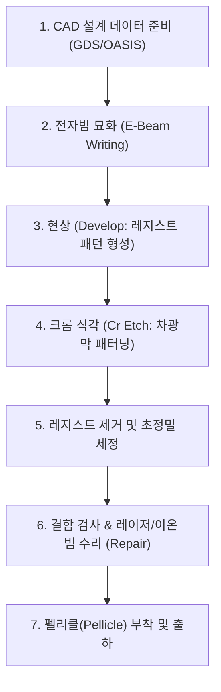

> ⚠️ **출처 및 저작권 안내**  
> 본 포스팅은 대학 강의 [반도체장비개론] 강의자료를 바탕으로, 비전공자 및 초보자가 쉽게 이해할 수 있도록 일상적인 비유와 그림으로 재구성한 **비영리 스터디 요약 노트**입니다.  
> 원작자의 저작권을 존중하며, 상업적 목적으로 이용될 수 없습니다.

---

# 🎞️ 인트로: 사진을 인화하려면 필름이 필요하다!

어릴 적 필름 카메라를 써보신 적이 있나요?  
필름에 맺힌 사진 상을 인화지 위에 올려놓고 빛을 쬐어주면 인화지에 선명한 사진이 찍혀 나옵니다.

반도체 웨이퍼 위에 복잡한 나노 회로를 새겨 넣는 **포토리소그래피(Photolithography, 노광) 공정**도 이와 완벽하게 같은 원리입니다!  
웨이퍼라는 인화지 위에 회로를 수억 번 찍어내기 위해 반드시 필요한 **"최고 정밀도의 유리 원판 필름"**, 그것이 바로 **포토마스크(Photomask)** 또는 **레티클(Reticle)**입니다.

포토마스크 한 장을 만드는 데 수천만 원에서 수억 원이 들며, 최신 칩 하나를 생산하려면 이런 마스크가 50~80장 이상 필요합니다.  
이번 글에서는 포토마스크의 기본 구조부터 제작 과정, 그리고 마스크를 지키는 투명 방패 **펠리클(Pellicle)**의 원리까지 쉽게 정리해 드립니다!

---

# 1. 포토마스크란 무엇인가?

- **정의**: 반도체 집적회로의 평면 배선 패턴을 투명한 유리 기판 위에 불투명한 금속 차광막으로 정밀하게 형상화한 원판입니다.
- **크기**: 보통 가로×세로 6인치(약 15.2cm), 두께 0.25인치 규격의 네모난 판입니다.

> 🔍 **웨이퍼 칩보다 4배나 크게 만든다고? (4:1 축소 투영)**  
> 웨이퍼 위의 회로는 나노미터(nm) 단위로 너무 미세해서 마스크에 1:1 크기로 회로를 파는 것은 불가능에 가깝습니다.  
> 그래서 포토마스크는 실제 칩 크기보다 **4배(가로 4배 × 세로 4배 = 면적 16배) 큼직하게** 회로를 그린 뒤, 노광 장비 안의 고정밀 축소 렌즈를 통해 **1/4로 줄여서 웨이퍼에 축소 투영(Reduction Projection)**시킵니다!

---

# 2. 포토마스크의 뼈대: 블랭크 마스크 (Blank Mask)

패턴을 새기기 전의 순수한 원재료 판을 **블랭크 마스크(Blank Mask)**라고 부릅니다.  
케이크처럼 3개의 층으로 겹쳐져 있습니다.

1. **고순도 합성 석영 기판 (Synthetic Quartz Substrate)**:
   - 일반 창문 유리는 자외선을 흡수해 버리고 열을 받으면 팽창해 휘어집니다.
   - 따라서 자외선 투과율이 90%가 넘고, 열팽창 계수가 거의 0에 가까운 **초고순도 석영(Quartz, 쿼츠)** 유리판을 바닥 기판으로 씁니다.
2. **차광막 (Light Absorber Layer)**:
   - 빛이 통과하지 못하도록 석영 위에 $50\sim100\text{nm}$ 두께로 증착한 얇은 금속 박막입니다. 주로 **크롬(Cr)**이나 몰리브덴 실리사이드(MoSi)를 사용합니다.
3. **감광막 (Resist Layer)**:
   - 회로를 그릴 때 쏘아주는 전자빔(E-beam)에 화학적으로 반응하는 특수 코팅층입니다.

---

# 3. 포토마스크 제작 6단계 공정 흐름

포토마스크는 레이저나 빛 대신 **'전자빔(Electron Beam)'**이라는 가장 날카로운 붓으로 회로를 한 땀 한 땀 직접 그립니다.

1. **E-Beam 묘화**: 전자총에서 발사된 가느다란 전자빔이 블랭크 마스크 표면 위를 스캔하며 설계된 회로 좌표를 따라 감광막을 노광합니다. (마스크 1장 그리는 데 수 시간~하루 종일 소요!)
2. **현상 및 식각**: 반응한 감광액을 씻어내고, 드러난 크롬 금속막을 플라즈마로 깎아내어 빛이 통과할 구멍을 뚫습니다.
3. **결함 검사 및 수리(Repair)**: 10나노미터 크기의 흠집도 용납되지 않으므로 전자현미경으로 전수 검사합니다. 덜 깎인 크롬 찌꺼기는 자외선 레이저로 태워 날리고, 덜 파진 곳은 집속 이온빔(FIB)으로 메워 넣는 수리 과정을 거칩니다.

---

# 4. 수억 원짜리 마스크를 지키는 투명 방패: 펠리클 (Pellicle)

공정 라인에서 마스크 표면에 먼지 하나라도 달라붙으면, 그 마스크로 찍어내는 **수십만 장의 웨이퍼 전체에 똑같은 불량(반복 결함)이 복사**되어 공장이 초토화됩니다!

이 재앙을 막아주는 기발한 발명품이 바로 **펠리클(Pellicle)**입니다.

> ⚽ **축구 골대 그물망 비유**:  
> 먼지가 골대 안(마스크 표면)으로 들어가지 못하게 골대 앞에 투명한 그물망(펠리클)을 씌워두는 것입니다!

- **구조**: 마스크 표면에서 약 $5\sim6\text{mm}$ 떨어진 높이에 알루미늄 프레임을 세우고, 그 위에 두께 $1\mu\text{m}$도 안 되는 **초박막 투명 폴리머 막**을 팽팽하게 씌워둡니다.

### 🔍 왜 먼지가 묻어도 괜찮을까요? (초점 이탈의 마법!)
- 노광 장비의 렌즈 초점은 정확하게 **석영 마스크 표면의 크롬 패턴에 칼같이 맞춰져 있습니다.**
- 공기 중의 먼지가 떨어지더라도 석영 표면에 닿지 못하고 **$5\text{mm}$ 위쪽에 떠 있는 펠리클 비닐막 위에 내려앉게 됩니다.**
- 스마트폰 카메라로 철창 너머의 풍경을 찍을 때 눈앞의 철창이 흐려져서 사진에 안 찍히듯, **펠리클 위의 먼지는 초점 심도(DOF)를 완전히 벗어나(Out of Focus)** 웨이퍼 표면에 그림자가 전혀 생기지 않습니다!

---

# 💡 초보자 단골 질문 FAQ

### Q. 차세대 반도체 공정인 EUV(극자외선) 마스크는 왜 기존 마스크와 완전히 다르게 만드나요?
> **A. EUV 빛은 석영 유리를 투과하지 못하고 유리 속에 100% 흡수되어 버리기 때문입니다!**  
> 지금까지 배운 DUV(ArF)용 마스크는 빛이 유리를 '투과'하는 방식이지만, 13.5nm 극자외선(EUV)은 공기와 유리마저 다 흡수해 버립니다.  
> 따라서 EUV 마스크는 빛을 투과시키는 판이 아니라, **몰리브덴(Mo)과 실리콘(Si)을 수십 층 겹쳐서 거울처럼 빛을 튕겨내는 '반사형 마스크'**로 완전히 새롭게 제작해야 합니다!

---

# 📝 최종 핵심 요약 노트

1. **포토마스크**는 웨이퍼에 회로를 찍어내기 위해 석영 유리 위에 크롬 차광막으로 패턴을 새긴 원판 필름이다.
2. 미세 패턴 구현을 위해 실제 웨이퍼 칩보다 **4배 크게 제작하여 축소 투영(4:1)**한다.
3. 마스크는 **전자빔(E-Beam Writer)**으로 초정밀하게 묘화하고 식각하여 완성한다.
4. 마스크 표면에서 $5\text{mm}$ 띄워 붙이는 **펠리클(Pellicle)**은 먼지를 초점 밖으로 밀어내어 패턴 불량을 원천 차단하는 필수 보호막이다.

---
*(다음 편 예고: 06. 1대당 3,000억 원! 반도체의 심장 노광 장비(Scanner)와 광원의 변천사)*
