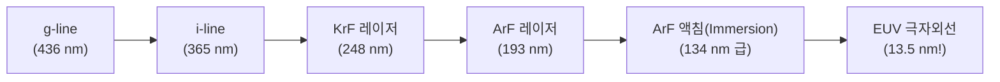

> ⚠️ **출처 및 저작권 안내**  
> 본 포스팅은 대학 강의 [반도체장비개론] 강의자료를 바탕으로, 비전공자 및 초보자가 쉽게 이해할 수 있도록 일상적인 비유와 그림으로 재구성한 **비영리 스터디 요약 노트**입니다.  
> 원작자의 저작권을 존중하며, 상업적 목적으로 이용될 수 없습니다.

---

# 💡 인트로: 아파트 한 채보다 비싼 기계 한 대?

반도체 뉴스를 보다 보면 네덜란드의 장비 회사 **ASML**의 이름이 빠지지 않고 등장합니다.  
미국, 중국, 한국, 대만의 국가 정상들과 글로벌 기업 총수들이 ASML의 본사로 찾아가 머리를 숙이고 줄을 서는 진풍경이 벌어지기도 합니다.

ASML이 독점 생산하는 **EUV(극자외선) 노광 장비**는 비행기 한 대 크기에 부품만 10만 개가 넘고, 1대당 가격이 무려 **2,000억~4,000억 원**에 달합니다!  
도대체 노광 장비가 무엇이길래 전 세계 반도체 산업의 목줄을 쥐고 있는 걸까요?

노광 장비는 **"빛을 쏘아 웨이퍼 위에 머리카락 10만 분의 1 굵기의 나노 회로를 사진 찍듯 인쇄하는 기계"**입니다.  
이번 글에서는 노광 장비의 핵심 물리 법칙인 **레일리 공식**부터 파장의 단축 역사, 그리고 **스캐너(Scanner)**의 메커니즘을 완벽 해부해 보겠습니다!

---

# 1. 미세 회로의 절대 공식: 레일리(Rayleigh)의 법칙

> ✏️ **굵은 매직펜 vs 0.3mm 샤프심 비유**:  
> 굵은 유성 매직으로 작은 수첩에 글씨를 쓰면 글자들이 서로 뭉개져 알아볼 수 없습니다.  
> 좁은 면적에 수많은 글씨를 적으려면 **펜촉이 가늘고 뾰족한 샤프심**을 써야 합니다!

반도체 노광 공정도 똑같습니다. 회로를 얼마나 가늘게 그릴 수 있는가(해상도, Resolution)는 물리학의 **레일리 공식**이 결정합니다.

### 📐 공식: 해상도(선폭) $R$
$$\mathbf{R = k_1 \frac{\lambda}{\text{NA}}}$$

- **$R$ (해상도 / 최소 선폭)**: 숫자가 **작을수록** 더 가늘고 미세한 회로를 그릴 수 있습니다! (우리의 목표!)
- **$\lambda$ (람다, 빛의 파장)**: 빛의 펜촉 굵기입니다. **파장이 짧을수록** 선폭 $R$이 가늘어집니다!
- **$\text{NA}$ (개구수, Numerical Aperture)**: 렌즈가 빛을 모으는 능력(구경)입니다. **렌즈가 크고 굴절률이 높을수록** $R$이 작아집니다.
- **$k_1$ (공정 상수)**: 마스크 설계 기술과 감광액 성능에 따른 계수입니다.

---

# 2. 빛의 파장 단축 역사: 수은등에서 EUV까지!

엔지니어들은 더 가는 회로를 그리기 위해, 50년 동안 **빛의 파장을 줄이는 극한의 전쟁**을 치러왔습니다.

1. **초기 수은 램프 시대 (g-line 436nm ➡️ i-line 365nm)**:
   - 전구에서 나오는 가시광선과 근자외선을 사용하던 시절. 마이크로미터 단위의 회로에 머묾.
2. **DUV (심자외선) 엑시머 레이저 시대 (KrF 248nm ➡️ ArF 193nm)**:
   - 불화크립톤(KrF)과 불화아르곤(ArF) 가스 레이저를 도입해 나노미터 시대를 엶.
3. **신의 한 수: ArF 액침 노광 (ArF Immersion)**:
   - 193nm 파장의 한계에 부딪히자, 엔지니어들은 **렌즈와 웨이퍼 사이에 공기 대신 굴절률($n=1.44$)이 높은 '초순수 물(Water)'을 채워 넣는 기발한 아이디어**를 냅니다!
   - 빛이 물을 통과하면서 굴절률 덕분에 파장이 $134\text{nm}$ 수준으로 압축되는 기적을 만들어냈습니다.
4. **궁극의 빛: EUV (Extreme Ultraviolet: 13.5nm)**:
   - ArF보다 파장이 **14배 이상 짧은 13.5nm 극자외선**입니다!
   - 엑스레이(X-ray)에 가까운 강력한 파장으로, 현재 스마트폰의 3나노, 2나노 최첨단 칩을 만드는 유일한 무기입니다.

---

# 3. 장비의 진화: 스테퍼(Stepper) vs 스캐너(Scanner)

초기 노광기는 웨이퍼 전체를 한 번에 찍는 접촉식이었지만 마스크가 긁혀 망가졌습니다.  
이후 렌즈를 사용하는 투영 노광기로 발전했습니다.

### 📸 스테퍼 (Stepper: Step and Repeat)
- 마스크 전체를 한 번에 카메라 셔터 터뜨리듯 **"찰칵!"** 찍고, 옆으로 한 칸 이동(Step)해서 또 **"찰칵!"** 찍는 방식입니다.
- **한계**: 렌즈 가장자리의 광학 왜곡 현상 때문에 한 번에 넓은 영역을 왜곡 없이 크게 찍기 어려웠습니다.

### 🏎️ 스캐너 (Scanner: Step and Scan - 현대 표준)
- 마스크 전체를 한 번에 쏘는 대신, **가느다란 틈새(슬릿, Slit) 빛**을 쏩니다.
- **마스크 스테이지와 웨이퍼 스테이지를 서로 반대 방향으로 초고속으로 동시에 달리며(Scan) 회로를 훑어 내립니다!**
- **장점**: 렌즈의 가장 깨끗한 중심부 빛만 통과하므로 왜곡이 거의 없고, 한 번에 훨씬 크고 긴 칩을 정밀하게 찍어낼 수 있습니다.
- 현재 모든 첨단 ArF 및 EUV 노광 장비는 이 **'스캐너'** 방식을 사용합니다!

---

# 4. 나노 단위의 오차도 잡는 레이저 간섭계 스테이지 제어

- 웨이퍼 위에는 이미 수십 층의 회로가 그려져 있습니다. 그 위에 다음 층 회로를 찍을 때 오차가 단 **1나노미터(nm)**만 어긋나도 회로 선이 빗나가 불량이 됩니다(Overlay 불량).
- 노광 장비는 웨이퍼를 얹은 스테이지(작업대)를 시속 수십 km로 가속하면서도, 멈출 때는 원자 몇 개 크기 단위로 칼같이 멈춰야 합니다.
- 이를 위해 진공 레이저 빔을 쏘아 거리를 측정하는 **레이저 간섭계(Laser Interferometer)**와 자기부상 리니어 모터를 사용하여 극한의 초정밀 제어를 수행합니다.

---

# 💡 초보자 단골 질문 FAQ

### Q. EUV 장비는 왜 내부가 완전한 진공(Vacuum)이어야 하나요?
> **A. 13.5nm 극자외선은 공기(산소, 질소)마저 빛을 꿀꺽 삼켜버리기 때문입니다!**  
> EUV 빛은 공기 분자와 부딪히면 에너지를 빼앗기고 즉시 흡수되어 사라집니다.  
> 따라서 EUV 장비 내부의 모든 광학계와 웨이퍼 챔버는 우주 공간과 같은 **초고진공 상태**를 유지해야만 빛이 웨이퍼까지 온전히 도달할 수 있습니다!

---

# 📝 최종 핵심 요약 노트

1. 노광 해상도는 **레일리 공식($R = k_1 \cdot \lambda / \text{NA}$)**에 의해 빛의 파장($\lambda$)이 짧을수록 미세해진다.
2. 광원은 **g-line ➡️ i-line ➡️ KrF ➡️ ArF ➡️ ArF Immersion(액침) ➡️ EUV(13.5nm)**로 눈부시게 진화했다.
3. 현대 노광 장비는 렌즈 왜곡을 줄이기 위해 슬릿 빛을 쏘며 마스크와 웨이퍼를 동시에 스캔하는 **스캐너(Step and Scan)**를 쓴다.
4. 노광 장비 1등 기업 네덜란드 **ASML**은 전 세계 EUV 스캐너 시장을 100% 독점하고 있다.

---
*(다음 편 예고: 07. 스위치에서 3차원 빌딩으로! MOSFET 트랜지스터 원리와 HBM 3D 패키징)*
