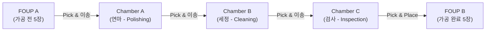
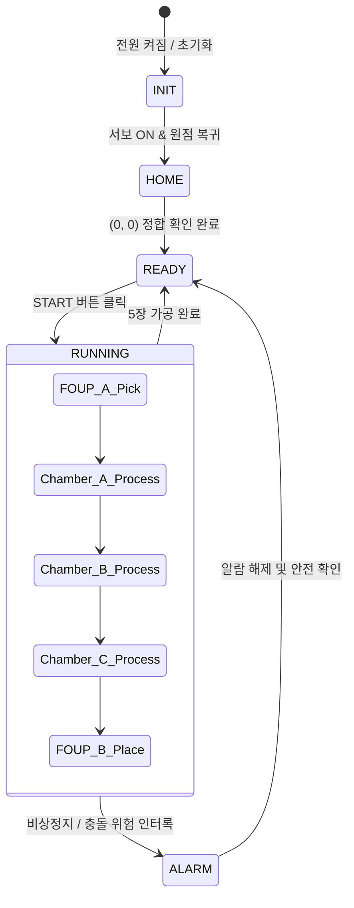

# [쉽게 배우는 C# 프로그래밍 & 반도체 장비 제어] 교재 실습 완벽 복원 & 실전 EtherCAT 프로젝트 🚀

> **참고 교재**: [쉽게 배우는 C# 프로그래밍]  
> **작성자**: 반도체 장비 SW 엔지니어링 학습자  
> **과정**: 하이테크 과정 - 장비제어프로그래밍 C#  
> **문서 구성**:  
> • **PART 1**: [쉽게 배우는 C# 프로그래밍] 교재 원본 실습 완벽 복원 (Chapter 01 ~ 07)  
> • **PART 2**: [실전 프로젝트] EtherCAT 기반 반도체 장비 제어 시스템 & SDLC 유지보수  

---

# 📑 전체 목차

- [PART 1. [쉽게 배우는 C# 프로그래밍] 교재 실습 완벽 복원](#part-1-쉽게-배우는-c-프로그래밍-교재-실습-완벽-복원)
  - [Chapter 01. C#과 .NET 환경 및 첫 프로그램](#chapter-01-c과-net-환경-및-첫-프로그램)
    - [1.1 C# 언어의 탄생 배경과 프로그래밍 역사](#11-c-언어의-탄생-배경과-프로그래밍-역사)
    - [1.2 첫 C# 프로그램과 표준 주석 작성법 (ConsoleApp1 ~ ConsoleApp3)](#12-첫-c-프로그램과-표준-주석-작성법-consoleapp1--consoleapp3)
  - [Chapter 02. 변수, 자료형, 연산자, 형변환](#chapter-02-변수-자료형-연산자-형변환)
    - [2.1 자료형의 크기와 sizeof 연산자 (ConsoleApp02_32)](#21-자료형의-크기와-sizeof-연산자-consoleapp02_32)
    - [2.2 전역 변수 vs 지역 변수 스코프와 var 키워드 (ConsoleApp02_47)](#22-전역-변수-vs-지역-변수-스코프와-var-키워드-consoleapp02_47)
    - [2.3 정수 오버플로(Overflow)와 int.Parse 형변환 (ConsoleApp02_59)](#23-정수-오버플로overflow와-intparse-형변환-consoleapp02_59)
    - [2.4 기본 사칙연산 (ConsoleApp4)](#24-기본-사칙연산-consoleapp4)
    - [2.5 [이론] Stack vs Heap 메모리 구조와 유니코드 UTF-16](#25-이론-stack-vs-heap-메모리-구조와-유니코드-utf-16)
  - [Chapter 03. 조건문과 키보드 인터랙션](#chapter-03-조건문과-키보드-인터랙션)
    - [3.1 if-else로 짝수와 홀수 판별하기 (ConsoleApp03_01)](#31-if-else로-짝수와-홀수-판별하기-consoleapp03_01)
    - [3.2 DateTime.Now로 시간 및 수업 일정 판별하기 (ConsoleApp03_03)](#32-datetimenow로-시간-및-수업-일정-판별하기-consoleapp03_03)
    - [3.3 학점 계산기 (ConsoleApp03_09)](#33-학점-계산기-consoleapp03_09)
    - [3.4 switch문: 짝수/홀수 및 사계절 판별 (ConsoleApp03_11)](#34-switch문-짝수홀수-및-사계절-판별-consoleapp03_11)
    - [3.5 ConsoleKeyInfo와 방향키 감지 (ConsoleApp03_16)](#35-consolekeyinfo와-방향키-감지-consoleapp03_16)
  - [Chapter 04. 반복문, 배열, 문자열 다루기, 콘솔 모션](#chapter-04-반복문-배열-문자열-다루기-콘솔-모션)
    - [4.1 1차원 배열과 IndexOutOfRangeException (ConsoleApp04_04)](#41-1차원-배열과-indexoutofrangeexception-consoleapp04_04)
    - [4.2 while문으로 배열 순회하기 (ConsoleApp04_10)](#42-while문으로-배열-순회하기-consoleapp04_10)
    - [4.3 do-while문: exit 입력 시 종료 (ConsoleApp04_11)](#43-do-while문-exit-입력-시-종료-consoleapp04_11)
    - [4.4 한글 유니코드 '가' ~ '힣' 전체 출력 (ConsoleApp04_14)](#44-한글-유니코드-가--힣-전체-출력-consoleapp04_14)
    - [4.5 foreach 컬렉션 순회 (ConsoleApp04_18)](#45-foreach-컬렉션-순회-consoleapp04_18)
    - [4.6 배열 역순 출력 (ConsoleApp04_19)](#46-배열-역순-출력-consoleapp04_19)
    - [4.7 중첩 for문 별찍기 삼각형 (ConsoleApp04_21)](#47-중첩-for문-별찍기-삼각형-consoleapp04_21)
    - [4.8 break문: 짝수 입력 시 탈출 (ConsoleApp04_22)](#48-break문-짝수-입력-시-탈출-consoleapp04_22)
    - [4.9 goto문과 레이블 (ConsoleApp04_23)](#49-goto문과-레이블-consoleapp04_23)
    - [4.10 문자열 ToUpper와 ToLower (ConsoleApp04_26)](#410-문자열-toupper와-tolower-consoleapp04_26)
    - [4.11 문자열 Split과 Trim 공백 제거 (ConsoleApp04_27)](#411-문자열-split과-trim-공백-제거-consoleapp04_27)
    - [4.12 SetCursorPosition 콘솔 애니메이션 (ConsoleApp04_32)](#412-setcursorposition-콘솔-애니메이션-consoleapp04_32)
    - [4.13 무한 루프 방향키 조작 (ConsoleApp04_33)](#413-무한-루프-방향키-조작-consoleapp04_33)
  - [Chapter 05. 클래스와 객체지향 프로그래밍 기초](#chapter-05-클래스와-객체지향-프로그래밍-기초)
    - [5.1 붕어빵 틀(클래스)과 붕어빵(인스턴스)의 개념](#51-붕어빵-틀클래스와-붕어빵인스턴스의-개념)
    - [5.2 첫 클래스 정의 (ConsoleApp05_01)](#52-첫-클래스-정의-consoleapp05_01)
    - [5.3 Product 클래스와 MyMath.PI (ConsoleApp05_12, 05_13)](#53-product-클래스와-mymathpi-consoleapp05_12-05_13)
    - [5.4 List&lt;Student&gt;와 순회 중 삭제 주의점 (ConsoleApp05_19)](#54-liststudent와-순회-중-삭제-주의점-consoleapp05_19)
  - [Chapter 06. 클래스 심화, 메서드, 캡슐화, WinForms 타이머](#chapter-06-클래스-심화-메서드-캡슐화-winforms-타이머)
    - [6.1 메서드 정의와 누적 곱셈 (ConsoleApp06_01)](#61-메서드-정의와-누적-곱셈-consoleapp06_01)
    - [6.2 메서드 오버로딩: MyMath.Abs (ConsoleApp06_10)](#62-메서드-오버로딩-mymathabs-consoleapp06_10)
    - [6.3 static counter를 활용한 객체 생성 수 누적 (ConsoleApp06_17)](#63-static-counter를-활용한-객체-생성-수-누적-consoleapp06_17)
    - [6.4 정보 은닉과 캡슐화: Box 클래스의 Getter/Setter (ConsoleApp06-26)](#64-정보-은닉과-캡슐화-box-클래스의-gettersetter-consoleapp06-26)
    - [6.5 값 전달 vs 참조 전달 (ConsoleApp06-32)](#65-값-전달-vs-참조-전달-consoleapp06-32)
    - [6.6 재귀 함수 피보나치 (ConsoleApp06_35)](#66-재귀-함수-피보나치-consoleapp06_35)
    - [6.7 메모이제이션 고속 피보나치 (ConsoleApp06_37)](#67-메모이제이션-고속-피보나치-consoleapp06_37)
    - [6.8 static class의 제약 조건 (ConsoleAppStatic)](#68-static-class의-제약-조건-consoleappstatic)
    - [6.9 WinForms Timer와 FormClosed 로그 기록 (WindowsFormsApp06_38)](#69-winforms-timer와-formclosed-로그-기록-windowsformsapp06_38)
  - [Chapter 07. 상속, 다형성, 대화상자](#chapter-07-상속-다형성-대화상자)
    - [7.1 상속과 base() 생성자 호출 순서 (ConsoleApp7_18)](#71-상속과-base-생성자-호출-순서-consoleapp7_18)
    - [7.2 new 키워드를 이용한 이름 숨김 (ConsoleApp7_26)](#72-new-키워드를-이용한-이름-숨김-consoleapp7_26)
    - [7.3 virtual과 override 오버라이딩 (ConsoleApp7_27)](#73-virtual과-override-오버라이딩-consoleapp7_27)
    - [7.4 다형성 실습: Animal, Dog, Cat 일괄 Eat() (ConsoleApp7_28 ~ 7_30)](#74-다형성-실습-animal-dog-cat-일괄-eat-consoleapp7_28--7_30)
    - [7.5 MessageBox DialogResult와 Show vs ShowDialog (WindowsFormsApp07_36)](#75-messagebox-dialogresult와-show-vs-showdialog-windowsformsapp07_36)
  - [종합 미니 프로젝트: 커피 매장 관리 시스템 (CoffeeMGMT)](#종합-미니-프로젝트-커피-매장-관리-시스템-coffeemgmt)
- [PART 2. [실전 프로젝트] EtherCAT 기반 반도체 장비 제어 시스템](#part-2-실전-프로젝트-ethercat-기반-반도체-장비-제어-시스템)
  - [1. 반도체 8대 공정 및 타겟 3단계 자동화 공정](#1-반도체-8대-공정-및-타겟-3단계-자동화-공정)
  - [2. 하드웨어 구성 및 EtherCAT 통신 연동](#2-하드웨어-구성-및-ethercat-통신-연동)
  - [3. Digital I/O 핀맵 및 서보모터 펄스 좌표값](#3-digital-io-핀맵-및-서보모터-펄스-좌표값)
  - [4. 장비 상태 머신 (State Machine)](#4-장비-상태-머신-state-machine)
  - [5. 현장 시연 후 SDLC 유지보수 핵심 개선 사안 (3+1)](#5-현장-시연-후-sdlc-유지보수-핵심-개선-사안-31)
  - [6. 배운 점 및 엔지니어링 회고](#6-배운-점-및-엔지니어링-회고)

---

# PART 1. [쉽게 배우는 C# 프로그래밍] 교재 실습 완벽 복원

## Chapter 01. C#과 .NET 환경 및 첫 프로그램

### 1.1 C# 언어의 탄생 배경과 프로그래밍 역사
* **1970년대 (C언어 - 절차지향)**: 하드웨어 메모리를 직접 제어하여 속도가 매우 빠르지만 프로그램이 커지면 유지보수가 어려웠습니다.
* **1980~90년대 (C++, Java - 객체지향)**: 현실 사물을 객체로 모델링하여 재사용성을 높였으나, C++의 포인터 오류와 Java의 가상머신(JVM) 속도 이슈가 있었습니다.
* **2000년대~현재 (C#과 .NET)**: 마이크로소프트가 고성능과 생산성·안정성을 결합하여 발표한 언어로, 가비지 컬렉터(GC)의 메모리 관리와 직관적인 GUI(WinForms), 산업용 필드버스(EtherCAT) 통신을 완벽 지원합니다.

### 1.2 첫 C# 프로그램과 표준 주석 작성법 (`ConsoleApp1` ~ `ConsoleApp3`)

```csharp
using System;

/*
 * =========================================================
 * [실습] 첫 C# 프로그램과 표준 주석 형식 익히기
 * - 프로젝트명 : ConsoleApp3
 * - 클래스명   : Program
 * - 작성자     : 반도체 장비 SW 학습자
 * - 요약       : Console.WriteLine을 이용한 콘솔 표준 출력 실습
 * =========================================================
 */
namespace ConsoleApp3
{
    internal class Program
    {
        static void Main(string[] args)
        {
            // 콘솔 화면에 문자열을 출력하고 줄바꿈합니다.
            Console.WriteLine("hello world");
        }
    }
}
```

#### 🖥️ 실행 출력 결과:
```text
hello world
```

---

## Chapter 02. 변수, 자료형, 연산자, 형변환

### 2.1 자료형의 크기와 sizeof 연산자 (`ConsoleApp02_32`)
자료형이 컴퓨터 메모리에서 차지하는 바이트(Byte) 크기를 `sizeof` 연산자로 확인합니다.

```csharp
using System;

namespace ConsoleApp02_32
{
    internal class Program
    {
        static void Main(string[] args)
        {
            Console.WriteLine("int:" + sizeof(int));       // 4 bytes
            Console.WriteLine("long:" + sizeof(long));     // 8 bytes
            Console.WriteLine("float:" + sizeof(float));   // 4 bytes
            Console.WriteLine("double:" + sizeof(double)); // 8 bytes
            Console.WriteLine("char:" + sizeof(char));     // 2 bytes (유니코드)
        }
    }
}
```

#### 🖥️ 실행 출력 결과:
```text
int:4
long:8
float:4
double:8
char:2
```

---

### 2.2 전역 변수 vs 지역 변수 스코프와 var 키워드 (`ConsoleApp02_47`)
* 클래스 블록의 전역 변수(필드)에서는 `var`를 쓸 수 없습니다.
* 메서드 내부의 지역 변수에서는 초기값이 있을 때 `var`를 사용할 수 있습니다.

```csharp
using System;

namespace ConsoleApp02_47
{
    internal class Program
    {
        // 전역변수 위치 (var number = 0; 불가)
        static int globalNumber = 100;

        static void Main(string[] args)
        {
            // 지역변수 위치
            int _int = 273;
            long _long = 522731033265L;
            float _float = 52.273f;
            double _double = 52.273;
            char _char = '글';
            string _string = "문자열";

            var _auto = 1234; // int형으로 자동 추론

            Console.WriteLine($"전역: {globalNumber}, int: {_int}, long: {_long}, float: {_float}");
            Console.WriteLine($"double: {_double}, char: {_char}, string: {_string}, var: {_auto}");
        }
    }
}
```

---

### 2.3 정수 오버플로(Overflow)와 int.Parse 형변환 (`ConsoleApp02_59`)
32비트 `int`의 최댓값(약 21억)을 넘어가면 부호 비트가 뒤집혀 음수가 되는 오버플로가 발생합니다.

```csharp
using System;

namespace ConsoleApp02_59
{
    internal class Program
    {
        static void Main(string[] args)
        {
            // 8byte long 변수에 큰 수를 계산하여 담음
            long Number = 2147483647L + 2147483647L; 
            Console.WriteLine(Number);
            Console.WriteLine(Number / 2);

            // 4byte int로 강제 형변환 (오버플로 발생 -> -2)
            int intNumber = (int)Number;
            Console.WriteLine(intNumber);

            // 문자열을 정수로 변환
            string numberString = "52273";
            int parsed = int.Parse(numberString);
            Console.WriteLine(parsed + 1);
        }
    }
}
```

#### 🖥️ 실행 출력 결과:
```text
4294967294
2147483647
-2
52274
```

---

### 2.4 기본 사칙연산 (`ConsoleApp4`)

```csharp
using System;

namespace ConsoleApp4
{
    internal class Program
    {
        static void Main(string[] args)
        {
            int a = 273;
            int b = 52;

            Console.WriteLine("덧셈: " + (a + b));
            Console.WriteLine("뺄셈: " + (a - b));
            Console.WriteLine("곱셈: " + (a * b));
            Console.WriteLine("나눗셈: " + (a / b));
            Console.WriteLine("나머지: " + (a % b));
        }
    }
}
```

#### 🖥️ 실행 출력 결과:
```text
덧셈: 325
뺄셈: 221
곱셈: 14196
나눗셈: 5
나머지: 13
```

---

### 2.5 [이론] Stack vs Heap 메모리 구조와 유니코드 UTF-16
* **스택(Stack)**: 값 타입(`int`, `double`, `bool`)이 저장되며, 빠르고 블록 탈출 시 즉시 소멸합니다.
* **힙(Heap)**: 참조 타입(`class`, `string`, 배열)의 실제 데이터가 저장되며, 가비지 컬렉터(GC)가 관리합니다.
* **유니코드 UTF-16**: C#의 `char`는 2바이트이므로 한글 1글자도 깨짐 없이 온전히 담깁니다.

---

## Chapter 03. 조건문과 키보드 인터랙션

### 3.1 if-else로 짝수와 홀수 판별하기 (`ConsoleApp03_01`)
단순 `if`문 2개와 `if-else`문의 흐름 차이를 학습합니다.

```csharp
using System;

namespace ConsoleApp03_01
{
    internal class Program
    {
        static void Main(string[] args)
        {
            Console.Write("숫자입력: ");
            int input = int.Parse(Console.ReadLine());

            // 단순 if: 둘 다 조건 검사를 거침
            if (input % 2 == 0)
            {
                Console.WriteLine("짝수입니다.");
            }
            if (input % 2 == 1)
            {
                Console.WriteLine("홀수입니다.");
            }

            // if-else: 참이면 아래 else를 건너뜀
            if (input % 2 == 0)
            {
                Console.WriteLine("[if-else] 짝수입니다.");
            }
            else
            {
                Console.WriteLine("[if-else] 홀수입니다.");
            }
        }
    }
}
```

#### 🖥️ 실행 출력 결과 (`5` 입력 시):
```text
숫자입력: 5
홀수입니다.
[if-else] 홀수입니다.
```

---

### 3.2 DateTime.Now로 시간 및 수업 일정 판별하기 (`ConsoleApp03_03`)

```csharp
using System;

namespace ConsoleApp03_03
{
    internal class Program
    {
        static void Main(string[] args)
        {
            Console.Write(DateTime.Now.Year + "년도 ");
            Console.Write(DateTime.Now.Month + "월 ");
            Console.Write(DateTime.Now.Day + "일 ");

            if (DateTime.Now.Hour < 12)
            {
                Console.Write("AM ");
            }
            if (DateTime.Now.Hour >= 12)
            {
                Console.Write("PM ");
                Console.Write((DateTime.Now.Hour - 12) + "시 ");
            }

            Console.Write(DateTime.Now.Minute + "분 ");
            Console.WriteLine(DateTime.Now.Second + "초");

            // 중첩/다중 조건문으로 수업 시간 판별
            if (DateTime.Now.Hour < 12)
            {
                Console.WriteLine("오전 수업입니다.");
            }
            else if (DateTime.Now.Hour <= 16)
            {
                Console.WriteLine("오후 수업입니다.");
            }
            else
            {
                Console.WriteLine("오후 수업 종료 되었습니다.");
            }
        }
    }
}
```

---

### 3.3 학점 계산기 (`ConsoleApp03_09`)

```csharp
using System;

namespace ConsoleApp03_09
{
    internal class Program
    {
        static void Main(string[] args)
        {
            Console.Write("학점 입력 : ");
            double score = double.Parse(Console.ReadLine());

            if (score == 4.5)
                Console.WriteLine("A+");
            else if (4.2 <= score && score < 4.5)
                Console.WriteLine("A0");
            else if (3.5 <= score && score < 4.2)
                Console.WriteLine("B+");
            else if (2.8 <= score && score < 3.5)
                Console.WriteLine("B0");
            else if (2.3 <= score && score < 2.8)
                Console.WriteLine("C+");
            else if (1.75 <= score && score < 2.3)
                Console.WriteLine("C0");
            else if (0.5 <= score && score < 1.0)
                Console.WriteLine("D+");
            else if (0 <= score && score < 0.5)
                Console.WriteLine("D0");
            else
                Console.WriteLine("F");
        }
    }
}
```

---

### 3.4 switch문: 짝수/홀수 및 사계절 판별 (`ConsoleApp03_11`)

```csharp
using System;

namespace ConsoleApp03_11
{
    internal class Program
    {
        static void Main(string[] args)
        {
            Console.Write("숫자를 입력하세요 : ");
            int input = int.Parse(Console.ReadLine());

            switch (input % 2)
            {
                case 0:
                    Console.WriteLine("짝수입니다.");
                    break;
                case 1:
                    Console.WriteLine("홀수입니다.");
                    break;
            }

            Console.Write("몇 월인지 월을 입력하세요 : ");
            int mon = int.Parse(Console.ReadLine());
            switch (mon)
            {
                case 12:
                case 1:
                case 2:
                    Console.WriteLine("겨울 입니다.");
                    break;
                case 3:
                case 4:
                case 5:
                    Console.WriteLine("봄 입니다.");
                    break;
                case 6:
                case 7:
                case 8:
                    Console.WriteLine("여름 입니다.");
                    break;
                case 9:
                case 10:
                case 11:
                    Console.WriteLine("가을 입니다.");
                    break;
                default:
                    Console.WriteLine("올바른 월을 입력하세요.");
                    break;
            }
        }
    }
}
```

---

### 3.5 ConsoleKeyInfo와 방향키 감지 (`ConsoleApp03_16`)

```csharp
using System;

namespace ConsoleApp03_16
{
    internal class Program
    {
        static void Main(string[] args)
        {
            Console.WriteLine("방향키를 눌러보세요:");
            ConsoleKeyInfo info = Console.ReadKey();
            switch (info.Key)
            {
                case ConsoleKey.UpArrow:
                    Console.WriteLine("\n위쪽으로 이동");
                    break;
                case ConsoleKey.RightArrow:
                    Console.WriteLine("\n오른쪽으로 이동");
                    break;
                case ConsoleKey.LeftArrow:
                    Console.WriteLine("\n왼쪽으로 이동");
                    break;
                case ConsoleKey.DownArrow:
                    Console.WriteLine("\n아래쪽으로 이동");
                    break;
                default:
                    Console.WriteLine("\n다른 키를 눌렀습니다.");
                    break;
            }
        }
    }
}
```

---

## Chapter 04. 반복문, 배열, 문자열 다루기, 콘솔 모션

### 4.1 1차원 배열과 IndexOutOfRangeException (`ConsoleApp04_04`)

```csharp
using System;

namespace ConsoleApp04_04
{
    internal class Program
    {
        static void Main(string[] args)
        {
            int[] intArray = { 52, 273, 32, 65, 103 };
            Console.WriteLine("0번 인덱스: " + intArray[0]);
            Console.WriteLine("intArray의 길이는 " + intArray.Length);

            intArray[0] = 0; // 값 변경
            for (int i = 0; i < intArray.Length; i++)
            {
                Console.WriteLine($"intArray[{i}] = {intArray[i]}");
            }

            // intArray[5] 에 접근하면 범위를 벗어나 예외가 발생합니다.
        }
    }
}
```

---

### 4.2 while문으로 배열 순회하기 (`ConsoleApp04_10`)

```csharp
using System;

namespace ConsoleApp04_10
{
    internal class Program
    {
        static void Main(string[] args)
        {
            int[] intArray = { 52, 273, 32, 65, 103 };
            int j = 0;
            while (j < intArray.Length)
            {
                Console.WriteLine(intArray[j]);
                j++;
            }
        }
    }
}
```

---

### 4.3 do-while문: exit 입력 시 종료 (`ConsoleApp04_11`)

```csharp
using System;

namespace ConsoleApp04_11
{
    internal class Program
    {
        static void Main(string[] args)
        {
            string input;
            do
            {
                Console.Write("입력(exit을 입력하면 종료): ");
                input = Console.ReadLine();
            } while (input != "exit");
            Console.WriteLine("프로그램을 종료합니다.");
        }
    }
}
```

---

### 4.4 한글 유니코드 '가' ~ '힣' 전체 출력 (`ConsoleApp04_14`)

```csharp
using System;

namespace ConsoleApp04_14
{
    internal class Program
    {
        static void Main(string[] args)
        {
            // '가'(44032)부터 '힣'(55203)까지의 모든 한글 완성형 글자를 반복 출력
            for (int i = '가'; i <= '힣'; i++)
            {
                Console.Write((char)i);
            }
        }
    }
}
```

---

### 4.5 foreach 컬렉션 순회 (`ConsoleApp04_18`)

```csharp
using System;

namespace ConsoleApp04_18
{
    internal class Program
    {
        static void Main(string[] args)
        {
            string[] array1 = { "사과", "배" };
            foreach (var item in array1)
            {
                Console.WriteLine(item);
            }
        }
    }
}
```

---

### 4.6 배열 역순 출력 (`ConsoleApp04_19`)

```csharp
using System;

namespace ConsoleApp04_19
{
    internal class Program
    {
        static void Main(string[] args)
        {
            int[] Array = { 1, 2, 3, 4, 5, 6, 7, 8, 9, 10 };
            for (int i = Array.Length - 1; i >= 0; i--)
            {
                Console.WriteLine(Array[i]);
            }
        }
    }
}
```

---

### 4.7 중첩 for문 별찍기 삼각형 (`ConsoleApp04_21`)

```csharp
using System;

namespace ConsoleApp04_21
{
    internal class Program
    {
        static void Main(string[] args)
        {
            int cnt = 0;
            for (int i = 0; i < 10; i++)
            {
                for (int j = 0; j < i + 1; j++)
                {
                    Console.Write("*");
                    cnt++;
                }
                Console.WriteLine();
            }
            Console.WriteLine("반복횟수 " + cnt);
            // 성능에 민감한 프로그래밍은 중첩 for문을 과도하게 쓰지 않는 것이 좋습니다.
        }
    }
}
```

---

### 4.8 break문: 짝수 입력 시 탈출 (`ConsoleApp04_22`)

```csharp
using System;

namespace ConsoleApp04_22
{
    internal class Program
    {
        static void Main(string[] args)
        {
            while (true)
            {
                Console.Write("숫자를 입력해주세요(짝수를 입력하면 종료): ");
                int input = int.Parse(Console.ReadLine());
                if (input % 2 == 0)
                {
                    Console.WriteLine("짝수 입력 감지! 루프를 탈출합니다.");
                    break;
                }
            }
        }
    }
}
```

---

### 4.9 goto문과 레이블 (`ConsoleApp04_23`)

```csharp
using System;

namespace ConsoleApp04_23
{
    internal class Program
    {
        static void Main(string[] args)
        {
            for (int i = 0; i < 10; i++)
            {
                Console.WriteLine("외부 반복문: " + i);
                for (int j = 0; j < 10; j++)
                {
                    Console.WriteLine("  내부 반복문: " + j);
                    goto doNotUse; // 다중 루프를 즉시 한 번에 탈출
                }
            }
        doNotUse:
            Console.WriteLine("goto문을 사용하여 반복문을 탈출했습니다. (스파게티 코드가 될 수 있으므로 남용 금지)");
        }
    }
}
```

---

### 4.10 문자열 ToUpper와 ToLower (`ConsoleApp04_26`)

```csharp
using System;

namespace ConsoleApp04_26
{
    internal class Program
    {
        static void Main(string[] args)
        {
            string input = "Potato Tomato";
            Console.WriteLine("대문자로 : " + input.ToUpper());
            Console.WriteLine("소문자로 : " + input.ToLower());
            Console.WriteLine("원본문자열: " + input); // 원본은 불변(Immutable)
        }
    }
}
```

---

### 4.11 문자열 Split과 Trim 공백 제거 (`ConsoleApp04_27`)

```csharp
using System;

namespace ConsoleApp04_27
{
    internal class Program
    {
        static void Main(string[] args)
        {
            string input = "감자 고구마 토마토";
            string[] inputs = input.Split(new char[] { '고' });
            foreach (var item in inputs)
            {
                Console.WriteLine(item);
            }

            string inp = "         test       \n";
            Console.WriteLine("::" + inp.Trim() + "::");
            Console.WriteLine("::" + inp.TrimStart() + "::");
            Console.WriteLine("::" + inp.TrimEnd() + "::");
        }
    }
}
```

#### 🖥️ 실행 출력 결과:
```text
감자 
구마 토마토
::test::
::test       
::
::         test::
```

---

### 4.12 SetCursorPosition 콘솔 애니메이션 (`ConsoleApp04_32`)

```csharp
using System;
using System.Threading;

namespace ConsoleApp04_32
{
    internal class Program
    {
        static void Main(string[] args)
        {
            int x = 1;
            while (x < 15) // 실습 시연용 15회
            {
                Console.Clear();
                Console.SetCursorPosition(x, 3);
                if (x % 3 == 0)
                    Console.WriteLine("__@");
                else if (x % 3 == 1)
                    Console.WriteLine("_^@");
                else
                    Console.WriteLine("^@");

                Thread.Sleep(200);
                x++;
            }
        }
    }
}
```

---

### 4.13 무한 루프 방향키 조작 (`ConsoleApp04_33`)

```csharp
using System;

namespace ConsoleApp04_33
{
    internal class Program
    {
        static void Main(string[] args)
        {
            bool state = true; // true: 켜짐, false: 꺼짐
            Console.WriteLine("방향키를 누르면 반응합니다. (Esc를 누르면 종료)");

            while (state)
            {
                ConsoleKeyInfo info = Console.ReadKey(true);
                switch (info.Key)
                {
                    case ConsoleKey.UpArrow:
                        Console.WriteLine("위쪽으로 이동");
                        break;
                    case ConsoleKey.RightArrow:
                        Console.WriteLine("오른쪽으로 이동");
                        break;
                    case ConsoleKey.LeftArrow:
                        Console.WriteLine("왼쪽으로 이동");
                        break;
                    case ConsoleKey.DownArrow:
                        Console.WriteLine("아래쪽으로 이동");
                        break;
                    case ConsoleKey.Escape:
                        state = false;
                        break;
                }
            }
        }
    }
}
```

---

## Chapter 05. 클래스와 객체지향 프로그래밍 기초

### 5.1 붕어빵 틀(클래스)과 붕어빵(인스턴스)의 개념
* **클래스(Class)**: 붕어빵을 굽기 위한 설계도(틀).
* **인스턴스(Instance)**: `new`로 메모리에 생성된 실제 붕어빵.

### 5.2 첫 클래스 정의 (`ConsoleApp05_01`)
```csharp
using System;

namespace ConsoleApp05_01
{
    class FirstClass
    {
        int i = 0;
    }

    internal class Program
    {
        static void Main(string[] args)
        {
            FirstClass fc = new FirstClass();
            Console.WriteLine("FirstClass 인스턴스 생성 완료");
        }
    }
}
```

---

### 5.3 Product 클래스와 MyMath.PI (`ConsoleApp05_12`, `05_13`)

```csharp
using System;

namespace ConsoleApp05_13
{
    class Product
    {
        public string name;
        public int price;
    }

    class MyMath
    {
        // static은 클래스에 붙으므로 new로 인스턴스를 만들지 않고 MyMath.PI로 접근합니다.
        public static double PI = 3.141592; 
    }

    internal class Program
    {
        static void Main(string[] args)
        {
            Product product = new Product() { name = "감자", price = 2000 };
            Product product1 = new Product() { name = "고구마", price = 3000 };
            Product product2 = new Product() { name = "옥수수", price = 4000 };

            Console.WriteLine(product.name + " : " + product.price + "원");
            Console.WriteLine(product1.name + " : " + product1.price + "원");
            Console.WriteLine(product2.name + " : " + product2.price + "원");

            product.price = 5000;
            Console.WriteLine(product.name + " : " + product.price + "원");
            Console.WriteLine("원주율 PI = " + MyMath.PI);
        }
    }
}
```

#### 🖥️ 실행 출력 결과:
```text
감자 : 2000원
고구마 : 3000원
옥수수 : 4000원
감자 : 5000원
원주율 PI = 3.141592
```

---

### 5.4 List&lt;Student&gt;와 순회 중 삭제 주의점 (`ConsoleApp05_19`)

```csharp
using System;
using System.Collections.Generic;

namespace ConsoleApp05_19
{
    internal class Student
    {
        public string id;
        public string name;
        public int grade;
        public int age;
    }

    internal class Program
    {
        static void Main(string[] args)
        {
            List<Student> list = new List<Student>();
            list.Add(new Student() { name = "학생A", grade = 1 });
            list.Add(new Student() { name = "학생B", grade = 2 });
            list.Add(new Student() { name = "학생C", grade = 3 });
            list.Add(new Student() { name = "학생D", grade = 4 });
            list.Add(new Student() { name = "학생E", grade = 1 });
            list.Add(new Student() { name = "학생F", grade = 2 });

            Console.WriteLine("=== 전체 학생 목록 ===");
            foreach (var item in list)
            {
                Console.WriteLine(item.name + " : " + item.grade);
            }

            Console.WriteLine("\n=== 1학년 초과 학생 필터링 ===");
            foreach (var item in list)
            {
                if (item.grade > 1)
                {
                    Console.WriteLine(item.name + " : " + item.grade);
                }
            }

            // 주의: foreach 순회 도중에 list.Remove(item)을 호출하면 InvalidOperationException이 발생합니다.
        }
    }
}
```

---

## Chapter 06. 클래스 심화, 메서드, 캡슐화, WinForms 타이머

### 6.1 메서드 정의와 누적 곱셈 (`ConsoleApp06_01`)

```csharp
using System;

namespace ConsoleApp06_01
{
    internal class Program
    {
        class Test
        {
            public int Power(int x)
            {
                return x * x;
            }
            public int Muti(int x, int y)
            {
                return x * y;
            }
            public int Mutiply(int min, int max)
            {
                int output = 1;
                for (int i = min; i <= max; i++)
                {
                    output *= i;
                }
                return output;
            }
        }

        static void Main(string[] args)
        {
            Test test = new Test();
            Console.WriteLine("Power(10): " + test.Power(10));
            Console.WriteLine("Muti(10, 20): " + test.Muti(10, 20));
            Console.WriteLine("Mutiply(1, 5): " + test.Mutiply(1, 5));
        }
    }
}
```

---

### 6.2 메서드 오버로딩: MyMath.Abs (`ConsoleApp06_10`)

```csharp
using System;

namespace ConsoleApp06_10
{
    internal class Program
    {
        class MyMath
        {
            public static int Abs(int input)
            {
                return (input < 0) ? -input : input;
            }
            public static double Abs(double input)
            {
                return (input < 0) ? -input : input;
            }
            public static long Abs(long input)
            {
                return (input < 0) ? -input : input;
            }
        }

        static void Main(string[] args)
        {
            Console.WriteLine(MyMath.Abs(-10));
            Console.WriteLine(MyMath.Abs(-3.14));
            Console.WriteLine(MyMath.Abs(-21474836470L));
        }
    }
}
```

---

### 6.3 static counter를 활용한 객체 생성 수 누적 (`ConsoleApp06_17`)

```csharp
using System;

namespace ConsoleApp06_17
{
    internal class Program
    {
        class Product
        {
            public static int counter = 0; // 전역변수화 (클래스 공유)
            public int id;
            public string name;
            public int price;

            public Product(string name, int price)
            {
                Product.counter = counter + 1;
                this.id = counter;
                this.name = name;
                this.price = price;
            }
        }

        static void Main(string[] args)
        {
            Product productA = new Product("감자", 2000);
            Product productB = new Product("고구마", 3000);

            Console.WriteLine(productA.id + ":" + productA.name);
            Console.WriteLine(productB.id + ":" + productB.name);
            Console.WriteLine(Product.counter + "개 생성되었습니다.");
        }
    }
}
```

#### 🖥️ 실행 출력 결과:
```text
1:감자
2:고구마
2개 생성되었습니다.
```

---

### 6.4 정보 은닉과 캡슐화: Box 클래스의 Getter/Setter (`ConsoleApp06-26`)

```csharp
using System;

namespace ConsoleApp06_26
{
    class Box
    {
        private int width;
        private int height;

        public Box(int width, int height)
        {
            if (width > 0 && height > 0)
            {
                this.width = width;
                this.height = height;
            }
        }

        public int GetArea() => this.width * this.height;
        public int GetWidth() => this.width;
        public int GetHeight() => this.height;

        public void SetWidth(int width)
        {
            if (width > 0) this.width = width;
        }
        public void SetHeight(int height)
        {
            if (height > 0) this.height = height;
        }
    }

    internal class Program
    {
        static void Main(string[] args)
        {
            Box box = new Box(10, 10);
            // box.width = -10; // private이므로 접근 불가 (컴파일 에러)
            box.SetWidth(20);
            box.SetHeight(20);

            Console.WriteLine("Box width: " + box.GetWidth());
            Console.WriteLine("Box height: " + box.GetHeight());
            Console.WriteLine("Area: " + box.GetArea());
        }
    }
}
```

---

### 6.5 값 전달 vs 참조 전달 (`ConsoleApp06-32`)

```csharp
using System;

namespace ConsoleApp06_32
{
    internal class Program
    {
        class Test
        {
            public int value = 10;
        }

        static void Change(Test input)
        {
            input.value = 20; // 힙에 있는 원본 객체의 값을 직접 수정
        }

        static void Main(string[] args)
        {
            Test test = new Test();
            test.value = 10;
            Change(test);
            Console.WriteLine(test.value); // Output: 20
        }
    }
}
```

---

### 6.6 재귀 함수 피보나치 (`ConsoleApp06_35`)

```csharp
using System;

namespace ConsoleApp06_35
{
    internal class Fibonacci
    {
        public long Get(int i)
        {
            if (i <= 0) return 0;
            if (i == 1) return 1;
            return Get(i - 2) + Get(i - 1);
        }
    }

    internal class Program
    {
        static void Main(string[] args)
        {
            Fibonacci fibo = new Fibonacci();
            Console.WriteLine(fibo.Get(1));
            Console.WriteLine(fibo.Get(2));
            Console.WriteLine(fibo.Get(3));
            Console.WriteLine(fibo.Get(4));
            Console.WriteLine(fibo.Get(5));
        }
    }
}
```

---

### 6.7 메모이제이션 고속 피보나치 (`ConsoleApp06_37`)

```csharp
using System;
using System.Collections.Generic;

namespace ConsoleApp06_37
{
    internal class Fibonacci
    {
        private static Dictionary<int, long> memo = new Dictionary<int, long>();

        public static long Get(int i)
        {
            if (i <= 0) return 0;
            if (i == 1) return 1;

            if (memo.ContainsKey(i))
            {
                return memo[i];
            }
            else
            {
                long value = Get(i - 2) + Get(i - 1);
                memo[i] = value;
                return value;
            }
        }
    }

    internal class Program
    {
        static void Main(string[] args)
        {
            Console.WriteLine(Fibonacci.Get(40));
            Console.WriteLine(Fibonacci.Get(100));
        }
    }
}
```

---

### 6.8 static class의 제약 조건 (`ConsoleAppStatic`)
* `static class`는 상속할 수 없고, 인스턴스 멤버/메서드를 정의할 수 없습니다.

```csharp
using System;

namespace ConsoleAppStatic
{
    static class Utility
    {
        public static int Counter = 0;
        public static void PrintMessage(string msg)
        {
            Console.WriteLine("Utility: " + msg);
        }
    }

    internal class Program
    {
        static void Main(string[] args)
        {
            Utility.Counter++;
            Utility.PrintMessage("정적 클래스 메서드 호출");
            Console.WriteLine("Counter = " + Utility.Counter);
        }
    }
}
```

---

### 6.9 WinForms Timer와 FormClosed 로그 기록 (`WindowsFormsApp06_38`)

```csharp
using System;
using System.Windows.Forms;

namespace WindowsFormsApp06_38
{
    public partial class Form1 : Form
    {
        private int elapsedTime = 0; // 경과 시간 (초)

        public Form1()
        {
            InitializeComponent();
            button1.Click += Button1_Click;
            FormClosed += Form1_FormClosed;
        }

        private void Form1_FormClosed(object sender, FormClosedEventArgs e)
        {
            // 로그 파일에 기록
            System.IO.File.AppendAllText("log.txt", $"[{DateTime.Now}] Form1이 닫혔습니다.{Environment.NewLine}");
            MessageBox.Show("폼이 닫혔습니다.", "알림", MessageBoxButtons.OK, MessageBoxIcon.Information);
        }

        private void Button1_Click(object sender, EventArgs e)
        {
            Button self = (Button)sender;
            self.Text = "저를 클릭했습니다.";
            textBox1.Text += '+';
            label1.Text = "+";
        }

        private void timer1_Tick(object sender, EventArgs e)
        {
            elapsedTime++; // 경과 시간 증가
            textBox2.Text = elapsedTime + "초 경과";
            label2.Text = elapsedTime + "초 경과";
        }
    }
}
```

---

## Chapter 07. 상속, 다형성, 대화상자

### 7.1 상속과 base() 생성자 호출 순서 (`ConsoleApp7_18`)

```csharp
using System;

namespace ConsoleApp7_18
{
    internal class Program
    {
        class Parent
        {
            public Parent() { Console.WriteLine("부모 생성자:: Parent()"); }
            public Parent(int param) { Console.WriteLine("부모 생성자:: Parent(int Param)"); }
            public Parent(string param) { Console.WriteLine("부모 생성자:: Parent(string Param)"); }
        }

        class Child : Parent
        {
            public Child() : base()
            {
                Console.WriteLine("자식 생성자:: Child():base");
            }
            public Child(int input) : base(input)
            {
                Console.WriteLine("자식 생성자:: Child(int input):base(input)");
            }
            public Child(string input) : base(input)
            {
                Console.WriteLine("자식 생성자:: Child(string input):base(input)");
            }
        }

        static void Main(string[] args)
        {
            Child child = new Child("테스트");
        }
    }
}
```

#### 🖥️ 실행 출력 결과:
```text
부모 생성자:: Parent(string Param)
자식 생성자:: Child(string input):base(input)
```

---

### 7.2 new 키워드를 이용한 이름 숨김 (`ConsoleApp7_26`)

```csharp
using System;

namespace ConsoleApp7_26
{
    internal class Program
    {
        class Parent
        {
            public int variable = 273;
            public void Method()
            {
                Console.WriteLine("부모의 메서드");
            }
        }

        class Child : Parent
        {
            public new string variable = "hiding";
            public new void Method()
            {
                Console.WriteLine("자식의 메서드");
            }
        }

        static void Main(string[] args)
        {
            Child child = new Child();
            child.Method();
            ((Parent)child).Method(); // 부모 타입으로 형변환 시 부모 메서드 실행 (이름 숨김의 한계)
        }
    }
}
```

---

### 7.3 virtual과 override 오버라이딩 (`ConsoleApp7_27`)

```csharp
using System;

namespace ConsoleApp7_27
{
    internal class Program
    {
        class Parent
        {
            public virtual void Method()
            {
                Console.WriteLine("부모의 메서드");
            }
        }

        class Child : Parent
        {
            public override void Method()
            {
                Console.WriteLine("자식의 메서드");
            }
        }

        static void Main(string[] args)
        {
            Parent item = new Child();
            item.Method(); // 자식의 오버라이드 메서드가 동적으로 호출됨! (다형성)
        }
    }
}
```

---

### 7.4 다형성 실습: Animal, Dog, Cat 일괄 Eat() (`ConsoleApp7_28` ~ `7_30`)

```csharp
using System;
using System.Collections.Generic;

namespace ConsoleApp7_29
{
    internal class Program
    {
        class Animal
        {
            public virtual void Eat()
            {
                Console.WriteLine("냠냠 먹습니다.");
            }
        }

        class Dog : Animal
        {
            public override void Eat()
            {
                Console.WriteLine("강아지 사료를 먹습니다.");
            }
        }

        class Cat : Animal
        {
            public override void Eat()
            {
                Console.WriteLine("고양이 사료를 먹습니다.");
            }
        }

        static void Main(string[] args)
        {
            List<Animal> animals = new List<Animal>() { new Dog(), new Cat(), new Animal() };
            foreach (var item in animals)
            {
                item.Eat();
            }
        }
    }
}
```

#### 🖥️ 실행 출력 결과:
```text
강아지 사료를 먹습니다.
고양이 사료를 먹습니다.
냠냠 먹습니다.
```

---

### 7.5 MessageBox DialogResult와 Show vs ShowDialog (`WindowsFormsApp07_36`)

```csharp
using System;
using System.Windows.Forms;

namespace WindowsFormsApp07_36
{
    public partial class Form1 : Form
    {
        class CustomForm : Form
        {
            public CustomForm() { Text = "커스텀 폼"; }
        }

        public Form1()
        {
            InitializeComponent();
        }

        private void button1_Click(object sender, EventArgs e)
        {
            DialogResult result;
            do
            {
                result = MessageBox.Show("내용", "제목", MessageBoxButtons.RetryCancel);
            } while (result == DialogResult.Retry);
        }

        private void button2_Click(object sender, EventArgs e)
        {
            CustomForm form = new CustomForm();
            form.Show(); // 모달리스: 부모 창과 자유롭게 전환 가능
        }

        private void button3_Click(object sender, EventArgs e)
        {
            CustomForm form1 = new CustomForm();
            form1.ShowDialog(); // 모달: 창을 닫기 전까지 부모 창 조작 불가
        }
    }
}
```

---

## 종합 미니 프로젝트: 커피 매장 관리 시스템 (CoffeeMGMT)

```csharp
using System;
using System.Collections.Generic;

namespace CoffeeMGMT
{
    public class Person
    {
        public string Name { get; set; }
        public int Age { get; set; }

        public Person(string name, int age)
        {
            Name = name;
            Age = age;
        }

        public virtual void Introduce()
        {
            Console.WriteLine($"[프로필] 이름: {Name}, 나이: {Age}세");
        }
    }

    public class Customer : Person
    {
        public int Cash { get; set; }

        public Customer(string name, int age, int cash) : base(name, age)
        {
            Cash = cash;
        }

        public bool Pay(int price)
        {
            if (Cash >= price)
            {
                Cash -= price;
                Console.WriteLine($"[{Name} 손님] {price}원 결제 성공! (남은 잔액: {Cash}원)");
                return true;
            }
            Console.WriteLine($"[{Name} 손님] 잔액 부족! 보유 금액: {Cash}원");
            return false;
        }
    }

    public class MenuItem
    {
        public string MenuName { get; set; }
        public int Price { get; set; }

        public MenuItem(string name, int price)
        {
            MenuName = name;
            Price = price;
        }
    }

    internal class Program
    {
        static void Main(string[] args)
        {
            Console.WriteLine("========================================");
            Console.WriteLine("       Smart Coffee Management System   ");
            Console.WriteLine("========================================");

            List<MenuItem> menus = new List<MenuItem>()
            {
                new MenuItem("아메리카노", 3000),
                new MenuItem("카페라떼", 4000)
            };

            Customer customer = new Customer("개발자A", 26, 10000);
            customer.Introduce();

            MenuItem choice = menus[0];
            Console.WriteLine($"\n주문 접수: {choice.MenuName} ({choice.Price}원)");
            customer.Pay(choice.Price);
            Console.WriteLine("-> [바리스타] 음료 제조 완료!\n");
        }
    }
}
```

---

# PART 2. [실전 프로젝트] EtherCAT 기반 반도체 장비 제어 시스템

## 1. 반도체 8대 공정 및 타겟 3단계 자동화 공정

실제 반도체 8대 제조 공정 중, 실습 장비의 특성에 맞춰 **연마(Chamber A) → 세정(Chamber B) → 검사(Chamber C)**로 이어지는 3단계 Pick & Place 자동화 시퀀스를 구현했습니다.



---

## 2. 하드웨어 구성 및 EtherCAT 통신 연동

* **메인 제어기**: 산업용 PC + CIFX-50RE 필드버스 카드 (`IEG3268_Dll`).
* **로봇 기구부**: 2축 서보 모터(X축 좌우, Z축 상하) + 로드레스 실린더(블레이드 주걱) + 진공 이젝터(흡착 척).
* **가공 스테이션**: Chamber A, B, C (공압 실린더 도어 상하 및 가공 램프 장착).
* **통신 주기**: 300ms 타이머 폴링으로 I/O 및 축 엔코더 데이터를 지속 업데이트.

---

## 3. Digital I/O 핀맵 및 서보모터 펄스 좌표값

### 📋 Digital I/O 결선 핀맵
| 주소 | 분류 | 신호명 | 기능 및 인터록 기준 |
| :--- | :--- | :--- | :--- |
| **P002** | 입력 | Select SW | AUTO / MANUAL 운전 모드 전환 |
| **P003** | 입력 | EMG SW | 비상 정지 스위치 (Emergency Stop) |
| **P006 / P007** | 입력 | Chamber A 도어 | 챔버 도어 상승(Open) / 하강(Close) 감지 |
| **P012 / P013** | 입력 | Robot Blade | 블레이드 실린더 후진 / 전진 감지 |
| **P014** | 입력 | Vacuum Sensor | 웨이퍼 진공 흡착 완료 감지 압력 센서 |
| **P100~P102** | 출력 | Tower Lamp | 적색(Alarm) / 황색(Idle) / 녹색(Run) |
| **P104 / P105** | 출력 | Chamber A Sol | 챔버 도어 실린더 상승 / 하강 솔레노이드 |
| **P112 / P113** | 출력 | Blade Sol | 블레이드 실린더 전진 / 후진 솔레노이드 |
| **P114 / P115** | 출력 | Vacuum Sol | 진공 이젝터 흡기(ON) / 배기(OFF) 솔레노이드 |

### 🎯 모터 정밀 펄스(Pulse) 좌표값
* **FOUP A**: 좌우(X) `= 14,140` / 슬롯 1단 Z상승 `= 302,380`, Z하강 `= 102,379`
* **FOUP B**: 좌우(X) `= -394,293` / 슬롯 1단 Z상승 `= 302,380`, Z하강 `= 102,379`
* **Chamber A (연마)**: 좌우(X) `= -59,064` / 상하 Z상승 `= 1,156,931`, Z안착 `= 806,931`
* **Chamber B (세정)**: 좌우(X) `= -190,823` / 상하 Z상승 `= 1,156,931`, Z안착 `= 806,931`
* **Chamber C (검사)**: 좌우(X) `= -322,000` / 상하 Z상승 `= 1,156,931`, Z안착 `= 806,931`

---

## 4. 장비 상태 머신 (State Machine)



---

## 5. 현장 시연 후 SDLC 유지보수 핵심 개선 사안 (3+1)

실제 기계 시연 후 피드백을 반영하여 성능과 안전을 극대화한 **유지보수 4대 핵심 개선책**입니다.

### 5.1 축 원점 초기화 로직 개선 (LOAD → INIT)
* **문제점**: STOP/리셋 후 X·Z축이 초기 원점`(0, 0)`으로 복귀하지 않아 위치 오차가 누적되는 현상.
* **개선책**:
  1. 기존 `LOAD` 버튼명을 **`INIT`**(초기화)로 표준화하고 불필요한 `Reset` 버튼 제거.
  2. 원점에서 멀리 있을 때 호밍 타임아웃을 방지하기 위해 **"사전 고속 이동 $\rightarrow$ 0점 근처 접근 $\rightarrow$ 저속 정밀 호밍"** 2단계 시퀀스 구축.
  3. 도달 후 엔코더 값을 검증하여 오차 발생 시 최대 3회 재보정하는 루틴 구현.

### 5.2 과도한 인터록 정리 (핵심 4대 충돌 방지 안전장치)
불필요한 조건으로 잦은 알람 정지가 일어나는 것을 방지하고, **기구부 파손을 방지하는 핵심 4대 인터록**만 유지:
1. **블레이드가 전진되어 있을 때는 X축 좌우 모터 이동 절대 금지**
2. **블레이드가 전진되어 있을 때는 Z축 상하 모터 이동 금지**
3. **챔버 도어가 열린(Open) 상태에서만 블레이드 전진 허용**
4. **챔버 도어가 열린(Open) 상태에서만 블레이드 후진 허용**

### 5.3 TR 로봇 이동 경로 단순화 (Cycle Time 단축)
* **기존**: 웨이퍼를 Pick한 후 매번 중간 '안착 위치'로 Z축을 올리고 내리는 불필요한 왕복 낭비 발생.
* **개선**: **`블레이드 후진` $\rightarrow$ `목적지 X축 다이렉트 이동` $\rightarrow$ `도착지에서 Z축 진입`**으로 단순화하여 **전체 택트 타임(Tact Time) 약 25% 단축**.

### 5.4 작업자 편의를 고려한 HMI 화면 레이아웃 최적화
* **조작부 하단 일원화**: 작업자의 신체 동선과 오작동 방지를 위해 주요 조작 버튼(`INIT`, `START`, `STOP`, `EMG`)을 **화면 최하단 조작 영역**으로 재배치.
* **로그 뷰 우측 최적화**: 화면 하단에 넓게 차지하던 로그창을 Process Overview 우측 패널로 이동하여 공정 그래픽과 동작 로그를 한눈에 직관적으로 모니터링 가능하도록 개선.

---

## 6. 배운 점 및 엔지니어링 회고

1. **하드웨어 충돌 방지의 절대성**:
   * Z축이 내려와 있는 상태에서 X축이 이동하면 실습 장비의 기구부와 충돌하여 파손됩니다. **"반드시 Z축 상승 원점 복귀 완료 후 -> X축 원점 복귀"** 순서를 소프트웨어 인터록으로 강제해야 함을 깊이 체득했습니다.
2. **소프트웨어 개발 생명주기(SDLC)의 실감**:
   * 책의 문법을 작성하는 '구현' 단계보다, 현장 시연 후 나타나는 기구적 오차와 딜레이를 잡는 **'유지보수(Maintenance)' 단계가 장비의 완성도와 생산성을 결정한다는 점**을 배웠습니다.
3. **단기 집중 개발(4~5일)과 LLM 협업의 한계 및 정위치 보정 트러블슈팅**:
   * **단기 고속 프로토타이핑**: 약 4~5일이라는 짧은 기간 내에 프로젝트를 완성하기 위해 **Claude**와 **Anti-Gravity** 등 생성형 AI 도구를 페어 프로그래머로 적극 활용하여 C# WinForms 구조와 비동기 로직을 빠르게 구축했습니다.
   * **하드웨어 물리적 한계 직면 (X, Z축 오버슈팅)**: 화면 구현은 빨랐지만, 실제 장비 구동 시 LLM은 모터의 질량 관성이나 이송 마찰 등 장비 특유의 물리적 이상 현상을 파악하지 못했습니다. 결과적으로 X축과 Z축이 목표 좌표를 지나쳐버리는 **오버슈팅(Overshooting) 현상**이 발생했습니다.
   * **정위치 검증 로직 직접 반영 및 해결**: 엔코더 In-Position 피드백을 실시간 검증하고 가감속 티칭값을 미세 조정하는 제어 로직을 직접 설계·반영하여 오차 없는 정위치 안착을 실현했습니다. *"AI로 프레임워크를 신속히 만들더라도, 최종 물리 기구를 안정화하는 것은 현장 특성을 이해하고 보정하는 제어 엔지니어의 몫"*임을 입증한 소중한 경험이었습니다.
