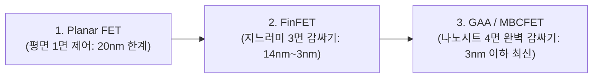

> ⚠️ **출처 및 저작권 안내**  
> 본 포스팅은 대학 강의 [반도체장비개론] 강의자료와 필기 노트를 바탕으로, 비전공자 및 초보자가 쉽게 이해할 수 있도록 일상적인 비유와 그림으로 재구성한 **비영리 스터디 요약 노트**입니다.  
> 원작자의 저작권을 존중하며, 상업적 목적으로 이용될 수 없습니다.

---

# 🏙️ 인트로: 0과 1을 만드는 나노 수도꼭지

스마트폰 두뇌인 AP(애플 A시리즈, 퀄컴 스냅드래곤) 속에는 손톱만 한 크기에 무려 **150억~200억 개의 초미세 스위치**가 빽빽하게 들어차 있습니다.  
컴퓨터가 사진을 띄우고, 게임을 돌리고, 인공지능(AI)을 연산할 수 있는 것은 이 수백억 개의 스위치가 1초에 수십억 번씩 켜졌다($1$) 꺼졌다($0$)를 반복하기 때문입니다.

이 전자 스위치의 진짜 이름이 바로 **MOSFET(모스펫)**입니다!

그런데 회로가 너무 미세해져 원자 몇 개 크기까지 작아지자, 전자가 제멋대로 새어나가는 벽에 부딪혔습니다.  
엔지니어들은 이 한계를 극복하기 위해 트랜지스터를 입체(FinFET, GAA)로 세우고, 메모리를 아파트처럼 수직으로 쌓아 올리는 **HBM(고대역폭 메모리) 3D 패키징 혁명**을 일으켰습니다!  
오늘 그 거대한 진화의 역사를 완벽하게 정리해 드립니다!

---

# 1. 반도체의 기본 스위치: MOSFET의 구조와 작동 원리

**MOSFET**(Metal-Oxide-Semiconductor Field-Effect Transistor)은 **"전기장(Field)의 힘으로 전류를 통제하는 트랜지스터"**입니다.

> 🚰 **수도꼭지 비유**:  
> 물이 나오는 수도꼭지를 떠올려 보세요.  
> - **Source (소스)**: 물(전자)이 나오는 상수도 수원지  
> - **Drain (드레인)**: 물(전자)이 빠져나가는 하수구 배수구  
> - **Gate (게이트)**: 물을 틀지 잠글지 돌리는 **수도꼭지 손잡이(밸브)**  
> - **Substrate (기판/바디)**: 수도관이 박혀 있는 벽체 몸통

---

### 💡 MOSFET의 스위칭 메커니즘

1. **OFF 상태 (게이트 전압 = 0V)**:
   - 소스와 드레인 사이에 전자가 지나갈 수 있는 길이 없습니다. 전류가 흐르지 않으므로 디지털 신호 **'0'**입니다.
2. **ON 상태 (게이트 전압 > 문턱 전압 $V_{\text{th}}$)**:
   - 게이트 손잡이에 일정 수준 이상의 전압(문턱 전압, Threshold Voltage)을 걸어줍니다.
   - 플러스($+$) 전기장에 이끌려 기판 속에 흩어져 있던 마이너스($-$) 전자들이 게이트 바로 밑으로 착 달라붙어 **전자가 지나갈 수 있는 다리(채널, Channel)**를 연결합니다!
   - 소스에서 드레인으로 전자가 콸콸 쏟아져 전류가 흐르며, 디지털 신호 **'1'**이 됩니다!

---

# 2. 평면에서 4차원 입체로: 트랜지스터의 눈부신 진화

칩 크기를 줄이다 보니 소스와 드레인 사이의 거리가 너무 가까워졌습니다.  
게이트 손잡이를 꽉 잠갔는데도 전자가 문틈으로 슬금슬금 새어나가는 **'단채널 효과(Short Channel Effect / 누설 전류)'**가 발생해 배터리가 광탈하고 열이 펄펄 끓게 되었습니다.

이를 극복하기 위해 트랜지스터는 3차원으로 진화했습니다!

1. **평면 트랜지스터 (Planar FET)**:
   - 바닥에 평평하게 누워있는 구조. 게이트가 위쪽 1개 면에서만 채널을 통제하므로 누설 전류 통제에 한계 봉착.
2. **핀펫 (FinFET - 3면 제어)**:
   - 물고기 등지느러미(Fin)처럼 채널을 위로 빳빳하게 세운 3D 구조입니다.
   - **게이트가 채널의 좌, 우, 상 3개 면을 입체적으로 감싸 쥐어** 누설 전류를 획기적으로 줄였습니다! (인텔, TSMC, 삼성이 14나노부터 3나노까지 주력으로 사용)
3. **GAA (Gate-All-Around / MBCFET - 4면 감싸기)**:
   - 얇은 종이 테이프 같은 나노시트(Nanosheet) 여러 장을 공중에 띄우고, **게이트가 4개 면 전체를 핫도그 빵처럼 360도 완벽하게 둘러싸는 궁극의 구조**입니다!
   - 삼성전자가 3나노 공정에 세계 최초로 도입하여 누설 전류를 완벽 차단하고 전력 효율을 극대화했습니다.

---

# 3. 반도체 패권의 새로운 열쇠: 첨단 패키징 (Advanced Packaging)

회로 선폭을 줄이는 미세화(전공정)가 물리적 한계에 다다르면서, 이제 전 세계 반도체 전쟁의 승부처는 **후공정인 '패키징(Packaging)'**으로 옮겨왔습니다!

### 📦 패키징의 4대 역할
1. **전기적 신호 연결**: 나노 크기의 칩 패드를 메인보드 전선과 연결
2. **기계적 보호**: 습기, 먼지, 충격으로부터 약한 실리콘 칩을 밀봉 보호
3. **전력 공급**: 칩이 작동할 수 있도록 안정적인 전원 분배
4. **열 방출 (방열)**: 고성능 연산 시 발생하는 엄청난 열기를 구리 히트스프레더로 방출

---

# 4. 패키징의 세대별 진화: 리드프레임에서 HBM까지!

1. **1세대 (리드프레임 DIP / QFP)**: 지네 다리처럼 옆으로 금속 핀이 튀어나온 전통적 형태
2. **2세대 (BGA: Ball Grid Array)**: 다리를 없애고 칩 바닥 전체에 작은 납땜 볼(Solder Ball)을 바둑판처럼 촘촘히 배열하여 전송 속도 향상
3. **3세대 (WLCSP: Wafer Level CSP)**: 웨이퍼 상태에서 패키징과 테스트를 한 번에 끝내어 칩 크기와 100% 동일한 초소형 패키지 구현

---

# 5. AI 시대를 연 괴물: 2.5D 패키징과 HBM (고대역폭 메모리)

ChatGPT와 같은 생성형 AI가 등장하면서, 엔비디아의 GPU(H100, B200)는 수천억 개의 파라미터를 초고속으로 메모리와 주고받아야 합니다.  
기존처럼 기판 위에 메모리를 멀리 떨어뜨려 놓으면 통신 병목 현상(데이터 정체)이 발생합니다.

### 🚀 HBM(High Bandwidth Memory)과 TSV의 기적
- **TSV (Through Silicon Via: 실리콘 관통 전극)**:
  - D램 칩에 머리카락 굵기보다 가는 미세 구멍 수천 개를 뚫고, 그 구멍 속에 구리(Cu)를 꽉 채워 기둥을 만듭니다.
- **초고속 3D 아파트 적층**:
  - TSV 구멍을 통해 D램 칩을 8층, 12층, 16층으로 수직으로 차곡차곡 쌓아 올려 한 몸처럼 연결합니다!
- **2.5D 패키징 (인터포저)**:
  - 중앙의 거대한 GPU 바로 옆에 HBM 메모리 4~8개를 1밀리미터도 안 되는 거리에 초밀착 배치하고, 바닥에 초미세 배선이 깔린 **'실리콘 인터포저(Interposer)'**로 1,024개 이상의 초고속 데이터 고속도로를 연결합니다!
  - 이 기술 덕분에 초당 수 테라바이트(TB)의 데이터를 지연 없이 처리하는 AI 슈퍼컴퓨터가 탄생했습니다.

---

# 💡 초보자 단골 질문 FAQ

### Q. 삼성전자와 SK하이닉스가 HBM 시장에서 왜 그렇게 치열하게 싸우나요?
> **A. HBM은 단순한 메모리가 아니라 '초고난도 첨단 패키징 기술'의 결정체이기 때문입니다!**  
> D램을 12층, 16층으로 얇게 갈아내어 오차 없이 수직으로 쌓고 열을 식히는 기술(MR-MUF, NCF 등)은 기술 장벽이 극도로 높습니다. 엔비디아 AI 가속기의 핵심 파트너 자리를 차지하느냐가 기업의 명운을 가르기 때문에 전 세계가 HBM에 주목하고 있습니다!

---

# 📝 최종 핵심 요약 노트

1. **MOSFET**은 게이트 전압을 이용해 소스와 드레인 사이에 채널(전자의 길)을 열어 $0$과 $1$을 만드는 나노 스위치다.
2. 미세화에 따른 누설 전류를 잡기 위해 **Planar(평면) ➡️ FinFET(3면) ➡️ GAA(4면 나노시트)**로 진화했다.
3. 전공정 미세화 한계를 돌파하기 위해 후공정 **첨단 패키징(Advanced Packaging)**이 반도체의 핵심 경쟁력으로 부상했다.
4. **HBM**은 **TSV(실리콘 관통 전극)**를 통해 D램을 수직 3차원으로 쌓아 올려 GPU와 초고속 통신을 실현한 AI 시대 최고의 핵심 부품이다.

---
*(반도체 장비개론 & 공압 제어 전 과정 14편 포스팅 완료!)*
