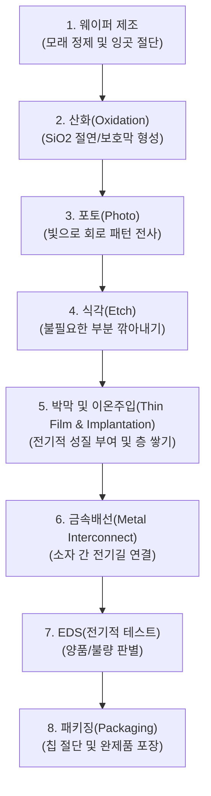

# 🎓 반도체 장비개론 시험대비 완벽정리
> **한국폴리텍 하이테크 과정 | 반도체 장비개론 (김랑기 교수님 수업 총정리)**  
> 복잡하고 방대한 반도체 공정, 유공압 제어, 임베디드 펌웨어의 연결고리를 한눈에 이해하고 시험에 완벽 대비할 수 있도록 정리한 핵심 요약 가이드입니다.

---

## 🗺️ 들어가며 : 왜 이 과목은 여러 분야가 섞여서 어려울까?

반도체 장비개론을 배울 때 가장 당황스러운 점은 **"화학/재료(웨이퍼, 공정) → 물리/전자(MOSFET, 밴드갭) → 기계(공압 실린더, 밸브) → 컴퓨터/소프트웨어(STM32, C언어)"**가 한 과목에 모두 등장한다는 것입니다.

하지만 **실제 반도체 장비 1대**를 상상해보면 모든 것이 연결됩니다:
1. **장비 뼈대와 이송(기계/공압)**: 웨이퍼를 집어서 챔버 안으로 넣고 빼는 로봇 암(Arm)과 실린더를 움직이기 위해 **공압(Pneumatics)**이 필요합니다.
2. **챔버 안에서 일어나는 일(재료/공정)**: 웨이퍼 위에 화학 물질을 뿌리고 깎아내는 **8대 공정 및 CMP**가 진행됩니다.
3. **만들어지는 최종 결과물(전자 소자)**: 공정을 거쳐 웨이퍼 위에 스위치 역할을 하는 수십억 개의 **MOSFET(트랜지스터)**이 완성됩니다.
4. **장비의 두뇌와 센싱(임베디드/STM32)**: 이 모든 밸브를 열고 닫고 센서 값을 읽어 정확한 타이밍에 모터를 멈추게 하는 전자 제어기가 바로 **마이크로컨트롤러(STM32)**입니다.

이 전체 그림을 머리에 두고 각 파트를 하나씩 분해해보겠습니다.

---

# 제 1 장. 반도체 공정 개요 & 자동화 물류 시스템

## 1.1 웨이퍼(Wafer)의 기초
* **웨이퍼란?** 반도체 집적회로(IC)를 만드는 도화지 역할을 하는 둥근 실리콘(Si) 원판.
* **왜 하필 실리콘(Si, 규소)을 가장 많이 쓸까?**
  1. **원재료 조달 용이 & 저렴**: 모래(석영)의 주성분이라 지구상에 매장량이 엄청나게 많습니다.
  2. **우수한 열적/기계적 안정성**: 고온(수백~천 도)의 공정에서도 물리적·기계적 성질 변화가 적습니다.
  3. **산화막($\text{SiO}_2$) 형성 용이**: 실리콘 표면을 산소와 반응시키면 매우 뛰어난 절연체인 산화막이 쉽게 만들어집니다.
* **웨이퍼 주요 부위 명칭**:
  * **칩(Chip) / 다이(Die)**: 실제 전자 회로가 형성되어 잘라내어 제품이 될 사각형 영역.
  * **절단선(Scribe Line)**: 칩과 칩 사이를 다이아몬드 휠이나 레이저로 자를 수 있도록 비워둔 빈 공간.
  * **플랫존(Flat Zone) / 노치(Notch)**: 웨이퍼가 둥글기 때문에 기준 위치나 결정 방향을 기계가 알아볼 수 있도록 한쪽을 평평하게 깎거나(플랫존), 홈을 파둔(노치) 기준점.

---

## 1.2 반도체 팹(FAB)의 물류 장비
웨이퍼 표면에 눈에 보이지 않는 미세한 먼지 하나만 앉아도 회로가 끊어져 수억 원어치 웨이퍼가 전량 폐기됩니다. 따라서 이송 과정이 완전 자동화·밀폐되어 있습니다.


1. **FOUP (Front Opening Unified Pod)**:
   * 300mm 웨이퍼 25장을 담는 밀폐형 캐리어 박스.
   * **질소($\text{N}_2$) 충전 이유**: 공기 중의 산소와 수분 때문에 웨이퍼 표면이 제멋대로 산화되는 자연 산화막 형성을 막기 위함.
2. **OHT (Overhead Hoist Transport)**:
   * 공장 천장에 깔린 모노레일을 타고 시속 수십 km로 날아다니며 FOUP을 장비로 배달하는 천장 크레인 로봇.
3. **Load Port (로드 포트)**:
   * OHT가 내려준 FOUP의 문을 열고 장비 내부 진공/청정 구역으로 웨이퍼를 들여보내는 입구 도킹 스테이션.

---

## 1.3 반도체 8대 핵심 공정
반도체는 건물을 짓듯이 **"바닥 깔기 → 벽 세우기 → 깎기 → 전선 연결"**을 수십 번 반복하는 과정입니다.



### 🔍 주요 공정 심층 분석
1. **산화 (Oxidation)**:
   * 고온($800\sim 1200^\circ\text{C}$)에서 산소나 수증기를 반응시켜 표면에 균일한 $\text{SiO}_2$ 막을 만듦. 회로 사이 누설 전류를 막는 절연막이자 오염 방지 보호막.
2. **포토 공정 (Photolithography)**:
   * **3단계 핵심**: **PR(감광액) 도포** $\rightarrow$ **노광(빛 쬐기)** $\rightarrow$ **현상(녹여내기)**
   * **EUV (Extreme Ultra Violet, 극자외선)**:
     * 파장이 **13.5nm**로 매우 짧음 (기존 ArF 193nm 대비 1/14 수준).
     * 빛의 파장이 짧을수록 얇고 정밀한 선을 그릴 수 있어, **7nm 이하 초미세 공정의 필수 기술**.
3. **식각 (Etch)**:
   * PR이 없는 노출된 산화막이나 박막을 깎아내는 공정.
   * **습식 식각 (Wet Etch)**: 화학 용액 사용. 등방성(사방으로 깎임), 속도 빠름, 미세 공정 한계.
   * **건식 식각 (Dry Etch)**: 플라즈마 가스 사용. 이방성(수직으로 예리하게 깎임), 고집적 미세 패턴 필수.
4. **이온 주입 (Ion Implantation)**:
   * 순수한 실리콘(4족)은 전기가 안 통함(부도체에 가까움).
   * 3족(B, 붕소 $\rightarrow$ p형, 정공 생성)이나 5족(P, 인 / As, 비소 $\rightarrow$ n형, 전자 생성) 불순물 이온을 가속기로 때려 박아 **원하는 곳에만 전기가 통하게 만듦**.
5. **CVD (Chemical Vapor Deposition, 화학기상증착)**:
   * 반응 가스를 챔버에 넣고 열이나 플라즈마 에너지를 주어 화학반응을 일으켜 웨이퍼 위에 얇은 고체 박막을 증착하는 기술.

---

# 제 2 장. 웨이퍼 물성과 CMP & 세정

## 2.1 원자 구조와 에너지 밴드 (도대체 왜 전기가 통할까?)

```
[ 전도대 (Conduction Band) ]   ← 전자가 자유롭게 돌아다니며 전류를 흘리는 층
---------------------------
      금지대 (Bandgap)         ← 전자가 존재할 수 없는 에너지 장벽
---------------------------
[ 가전자대 (Valence Band)   ]   ← 전자가 원자핵에 묶여 얌전히 채워져 있는 층
```

* **가전자대 (Valence Band)**: 최외각 전자들이 결합하여 채워져 있는 에너지 영역 (0K 기준 꽉 차 있음).
* **전도대 (Conduction Band)**: 전자가 핵의 구속에서 벗어나 자유전자(Free electron)가 되어 전류를 흘릴 수 있는 높은 에너지 영역.
* **금지대 / 밴드갭 (Energy Gap)**: 가전자대와 전도대 사이의 간격.
  * **도체(금속)**: 밴드갭이 없거나 겹쳐 있어서 전자가 쉽게 이동.
  * **부도체(유리 등)**: 밴드갭이 너무 넓어서($>5\text{ eV}$) 전자가 못 뛰어넘음.
  * **반도체(Si 등)**: 밴드갭이 적당함($\sim 1.1\text{ eV}$). 열, 빛, 전압을 주면 전자가 펄쩍 뛰어넘어 전기가 통함!

## 2.2 실리콘 결정과 결정 방향 (100, 110, 111)
* **단결정 (Single Crystal)**: 원자 배열이 전체에 걸쳐 규칙적. 전자 이동도가 높아 반도체 웨이퍼용으로 사용 (Czochralski 공법으로 성장).
* **다결정 (Polycrystalline)**: 작은 단결정들이 얽혀 있음 (게이트 전극 등에 사용).
* **비정질 (Amorphous)**: 규칙성이 없음.
* **결정면 지수 (Miller Indices)**: 
  * 원자 밀도와 표면 결합 손(Dangling bond) 수가 다름.
  * 실리콘 웨이퍼는 주로 **(100)** 또는 **(111)** 면을 사용함. (MOSFET은 산화막 계면 특성이 우수한 (100) 웨이퍼를 가장 선호).

## 2.3 열처리 (Annealing) & CMP & 세정
* **열처리 (Annealing)**:
  * 앞선 이온 주입 공정에서 이온을 총알처럼 때려 박아 웨이퍼의 실리콘 결정 격자가 다 깨짐.
  * 이를 **고온($800\sim 1000^\circ\text{C}$)으로 달궈서 격자 결함을 스스로 복원(회복)**시키고, 주입된 불순물이 실리콘 자리에 들어가 **전기적으로 활성화(Dopant Activation)**되도록 만드는 필수 공정.
* **CMP (Chemical Mechanical Polishing, 화학-기계적 연마)**:
  * 회로 층을 여러 겹 쌓다 보면 표면이 울퉁불퉁해져서 포토 공정 시 초점이 안 맞음.
  * **슬러리(Slurry, 화학 약품+연마 입자)**와 **연마 패드(Pad)**를 회전 마찰시켜 웨이퍼 표면을 나노 단위로 완벽하게 평탄화(Flat)하는 공정.
* **단위 상식**:
  * $\text{ppm} = 10^{-6}$ (백만분의 1)
  * $\text{ppb} = 10^{-9}$ (십억분의 1) - 반도체 초순수나 가스 순도 관리 기준!

---

# 제 3 장. 클린룸 환경과 기본 전자 소자 (MOSFET)

## 3.1 클린룸 (Cleanroom)과 환경
* **청정도 단위 (Clean Class)**:
  * **$1\text{ ft}^3$ (가로x세로x높이 약 30cm) 부피의 공기 중에 $0.5\mu\text{m}$ 이상의 미세먼지가 몇 개 있는가?**
  * **Class 100**: $1\text{ ft}^3$ 안에 먼지가 100개 이하인 초청정 구역. (최신 반도체 포토 구역은 Class 1 이하를 유지).
* **초순수 (UPW, Ultra Pure Water / DIW, De-Ionized Water)**:
  * 수돗물 속 무기질, 금속 이온, 미생물을 거의 0에 가깝게 걸러낸 극도의 순수 물. 웨이퍼 세정에 필수.

---

## 3.2 반도체의 심장: MOSFET 구조와 동작 원리
MOSFET은 **"전기로 켜고 끄는 전자식 수도꼭지"**입니다.

```
       [ Gate (게이트 전압 Vg) ] ← 수도꼭지 손잡이
             | (절연 산화막)
  [Source] ---------------- [Drain]
  (수도관 입구)  [ Channel ]  (수도관 출구)
           [ Substrate (몸체) ]
```

* **4대 전극의 역할**:
  1. **Gate (게이트)**: 수도꼭지 손잡이. 전압을 걸어 통로를 열지 말지 결정.
  2. **Source (소스)**: 캐리어(전자 또는 정공)가 쏟아져 나오는 원천(수도 입구).
  3. **Drain (드레인)**: 캐리어가 빠져나가는 출구(수도 출구).
  4. **Substrate (기판/바디)**: 소자가 만들어지는 바탕 몸체.
* **스위칭 동작**:
  * **문턱 전압 ($V_{th}$, Threshold Voltage)**: 채널이 형성되어 전류가 흐르기 시작하는 최소 게이트 전압.
  * $V_g > V_{th}$ : 게이트 아래에 전자가 모여 **채널(통로) 형성 $\rightarrow$ 전류 흐름 (ON)**.
  * $V_g < V_{th}$ : 통로가 사라져 **전류 차단 (OFF)**.
* **NMOS vs PMOS vs CMOS**:
  * **NMOS**: 전자가 주 캐리어 ($V_g = \text{High}$ 일 때 켜짐). 속도가 빠름.
  * **PMOS**: 정공이 주 캐리어 ($V_g = \text{Low}$ 일 때 켜짐).
  * **CMOS (Complementary MOS)**: **NMOS와 PMOS를 위아래로 한 쌍** 묶어 만든 회로.
    * 켜질 때와 꺼질 때 둘 중 하나는 항상 닫혀 있어, 상태가 바뀔 때 외에는 **대기 전력 소모가 거의 0에 수렴** $\rightarrow$ 모든 현대 CPU/메모리의 기본 단위!

---

# 제 4 장. 공압 제어 시스템 (Pneumatic Control)

반도체 장비 내에서 웨이퍼를 집고 옮기는 로봇 척(Chuck), 챔버 도어 개폐기 등은 모터뿐만 아니라 **깨끗하고 빠르며 폭발 위험이 없는 압축 공기(공압)**를 매우 많이 씁니다.

## 4.1 공압의 3대 요소와 파스칼의 원리
* **파스칼의 원리 (Pascal's Principle)**: 밀폐된 유체에 가해진 압력은 모든 방향으로 동일하게 전달된다.
  $$\text{힘}(F) = \text{압력}(P) \times \text{면적}(A)$$
  $\rightarrow$ 공기 압력이 일정해도, 실린더 지름(면적)이 클수록 들어 올리는 힘이 세집니다.
* **공압 밸브 3대 천왕**:
  1. **압력 제어 밸브**: 실린더가 미는 **힘(일의 크기)**을 제어 (감압밸브 등).
  2. **유량(속도) 제어 밸브**: 실린더가 움직이는 **속도**를 제어 (스로틀 밸브 등).
  3. **방향 제어 밸브**: 공기의 흐름 길을 바꿔 전진/후진 **방향**을 제어 (솔레노이드 밸브 등).
* **공압 시스템 구성 기호**:
  * **공기 압축기**: 삼각형 기호가 **비어 있음 ($\vartriangle$)** (공기는 하얗고 투명하니까!).
  * **유압 펌프**: 삼각형 기호가 **검은색 채워짐 ($\blacktriangle$)** (기름은 색이 있으니까!).

---

## 4.2 방향 제어 밸브 기호 읽기 (가장 헷갈리는 부분 정복!)

예를 들어 **"5/2-way 밸브"**라고 부를 때:
* **앞의 숫자 (5)** = **포트(Port) 수**: 공기가 드나드는 구멍 수.
* **뒤의 숫자 (2)** = **위치(Position) 수**: 밸브가 전환될 수 있는 방(사각형)의 개수.

```
       [ 4 (A) ]   [ 2 (B) ]  ← 실린더로 가는 작업 포트
      ┌───────────┬───────────┐
  14  │     ↑     │     ↑     │  12
 (X) ─│  ┌──┴──┐  │  ┌──┴──┐  │─ (Y)  ← 제어 신호 (솔레노이드/공압)
      └───────────┴───────────┘
       [ 5 (R) ] [ 1 (P) ] [ 3 (S) ] ← 공급 및 배기 포트
```

### 📌 포트 번호와 문자 매칭 (시험 단골 암기 공식!)
| 번호 | 알파벳 기호 | 명칭 (약어 의미) | 역할 |
| :--- | :--- | :--- | :--- |
| **1** | **P** | **P**ressure / **P**ump / **P**ower | 메인 압축 공기 공급 라인 |
| **2, 4** | **A, B** | **A**ctuator | 실린더(구동부)로 연결되는 작업 포트 (짝수) |
| **3, 5** | **R, S** (T) | **R**eturn / **R**elease | 일을 마치고 나온 공기를 밖으로 빼는 배기 포트 (홀수) |
| **12, 14** | **Y, X** | 제어 신호 포트 | 외부에서 밸브를 밀어주는 전기/공압 신호 |

* **제어 포트 숫자(12, 14)의 비밀**:
  * **14 (X)**에 신호가 들어오면: **1번(P) 포트가 4번(A) 포트로 연결됨!** (1 $\rightarrow$ 4)
  * **12 (Y)**에 신호가 들어오면: **1번(P) 포트가 2번(B) 포트로 연결됨!** (1 $\rightarrow$ 2)

---

## 4.3 미터 인(Meter-in) vs 미터 아웃(Meter-out) 유량 제어
실린더 속도를 조절할 때 체크밸브가 달린 유량제어 밸브를 씁니다.

```
[미터 인 (Meter-In)]   : 들어가는 공기량을 조절하여 속도 제어
[미터 아웃 (Meter-Out)] : 나가는 공기량을 조절하여(배압을 형성) 속도 제어 ★현업 표준★
```
* **공압에서는 왜 대부분 "미터 아웃"을 쓸까?**
  * 공기는 압축성 기체입니다. 미터 인으로 들어가게 하면 실린더가 처음에 멈춰 있다가 압력이 차는 순간 '툭' 하고 튀어나가는 **Stick-Slip(덜컥거림) 현상**이 발생합니다.
  * 반면 **미터 아웃**은 실린더 나가는 쪽 공기 배기를 쥐어짜서(배압 형성) 실린더를 꽉 잡아주며 전진시키므로 **움직임이 아주 부드럽고 안정적**입니다.

## 4.4 순수공압 시퀀스 & 전기공압 제어
* **신호의 중복(Signal Overlap)**:
  * 전진 명령 신호가 아직 켜져 있는데 후진 명령 신호가 들어오면 밸브 양쪽에서 맞짱을 떠서 실린더가 멈춰버림.
  * 해결책: **Stepper(스텝퍼) 방식** 또는 캐스케이드(Cascade) 회로를 써서 이전 단계 신호를 차단하고 다음 단계로 순차 진행.
* **전기 공압 제어 부품**:
  * **자기유지회로 (Self-holding)**: 푸시버튼을 손에서 떼도 릴레이 접점이 계속 붙어 전원을 유지하는 시퀀스의 기본.
  * **On-Delay Timer**: 신호가 들어오고 **정해진 시간(초)이 지난 후에** 접점이 켜짐.
  * **Off-Delay Timer**: 신호가 꺼진 후에도 **정해진 시간 동안 켜져 있다가** 꺼짐.

---

# 제 5 장. 임베디드 제어 실습 (STM32 마이크로컨트롤러)

반도체 장비 내부의 각 모듈(온도 조절기, 압력 센서, 공압 밸브 블록)마다 이런 마이크로컨트롤러(MCU)가 들어가 초고속으로 하드웨어를 감시하고 제어합니다.

## 5.1 하드웨어 & 개발 도구 환경
* **MCU 보드**: STMicroelectronics 사의 **NUCLEO-F103RB** (ARM Cortex-M3 기반).
* **소프트웨어 툴**:
  * **STM32CubeMX**: 핀 배치, 클럭 설정, 주변장치 초기화 코드를 마우스 클릭으로 자동 생성해주는 도구.
  * **STM32CubeIDE**: 생성된 C언어 프로젝트를 코딩하고 컴파일, 다운로드, 디버깅하는 통합 개발 환경.

---

## 5.2 클럭(Clock) 시스템의 이해 (HSI, HSE, LSI, LSE)
MCU는 심장 박동(클럭)에 맞춰 코드를 한 줄씩 실행합니다.

| 이름 | 약어 풀이 | 속도 | 위치 | 주 용도 |
| :--- | :--- | :--- | :--- | :--- |
| **HSI** | **H**igh **S**peed **I**nternal | 고속 (약 8MHz) | MCU 내부 RC 발진기 | 외부 크리스탈 없이 빠르게 구동할 때 |
| **HSE** | **H**igh **S**peed **E**xternal | 고속 (4~16MHz) | 보드 외부 크리스탈/발진기 | **정밀한 통신, 고속 연산의 메인 클럭 (가장 많이 사용)** |
| **LSI** | **L**ow **S**peed **I**nternal | 저속 (약 40kHz) | MCU 내부 | **Watchdog 타이머**, 저전력 RTC |
| **LSE** | **L**ow **S**peed **E**xternal | 저속 (32.768kHz) | 외부 시계용 크리스탈 | 초정밀 RTC(실시간 시계) |

> 💡 **왜 클럭 속도를 늦추거나 선택할까?**  
> 클럭이 빠를수록 연산 속도는 올라가지만 전력 소모와 열이 급증합니다. 배터리 구동이나 저전력 장비에서는 필요에 따라 저속 클럭으로 전환합니다.

---

## 5.3 STM32 프로그래밍 시 가장 중요한 실무 규칙 3가지!

### 1) `USER CODE` 블록 주석을 반드시 지켜라!
STM32CubeMX에서 설정을 바꾸고 코드를 재생성(Generate Code)하면 파일 전체를 새로 덮어씁니다.
```c
/* USER CODE BEGIN 2 */
// ★ 여기에 적은 내 코드는 CubeMX를 다시 돌려도 안 지워집니다!
HAL_GPIO_WritePin(GPIOA, GPIO_PIN_5, GPIO_PIN_SET);
/* USER CODE END 2 */

// ⚠️ 이 블록 바깥에 적은 코드는 재생성 시 완전히 흔적도 없이 삭제됩니다!
```

---

### 2) `HAL_Delay()`를 산업용 제어 장비에서 쓰면 안 되는 이유!
```c
HAL_GPIO_WritePin(VALVE_PORT, VALVE_PIN, 1);
HAL_Delay(5000); // 5초 대기
HAL_GPIO_WritePin(VALVE_PORT, VALVE_PIN, 0);
```
* **문제점 (치명적 한계)**:
  * `HAL_Delay()`는 지정된 시간 동안 CPU가 아무 일도 안 하고 무의미한 카운팅 루프만 도는 **블로킹(Blocking) 함수**입니다.
  * 5초 동안 긴급 비상정지 버튼(E-Stop)이 눌리거나, 웨이퍼 이송 센서에 충돌 에러가 발생해도 **CPU는 멈춰 있어서 대응하지 못합니다 (실시간성 상실 & 멀티태스킹 불가)**.
* **해결책**:
  * **인터럽트 (Interrupt)**: 평소엔 다른 일을 하다가 버튼이 눌리거나 타이머 시간이 되면 즉시 하던 일을 멈추고 우선 처리하는 긴급 호출 벨.
  * **DMA (Direct Memory Access)**: CPU를 거치지 않고 주변장치(ADC 센서, 통신)와 메모리가 다이렉트로 데이터를 주고받는 고속 전송 기술.

---

### 3) 시스템 수호신 : 워치독 타이머 (WatchDog Timer)
* 반도체 라인은 노이즈나 정전기, 소프트웨어 버그로 MCU가 **무한 루프(Freezing, 뻗음)**에 빠질 위험이 항상 존재합니다.
* **Watchdog(감시견)의 작동 원리**:
  1. 워치독 타이머는 시간이 지남에 따라 숫자가 줄어드는 카운트다운 타이머입니다 (예: 1초 카운트다운).
  2. 정상 작동 중인 코드는 주기적으로 워치독에게 "나 살아있어!" 하고 먹이를 주어(Kick / Refresh) 타이머를 1초로 리셋시킵니다.
  3. 만약 코드가 멈춰서 먹이를 못 주면, 타이머가 **0초(Timeout)**가 되는 순간 **MCU 하드웨어를 자동으로 강제 리셋(Reset)**시켜 시스템을 재부팅합니다.

---

# 📝 [부록] 중간/기말 시험 대비 핵심 키워드 1분 치트시트

1. **실리콘 웨이퍼 채택 이유 3가지**: 매장량 풍부(저렴), 열적/기계적 성질 우수, 양질의 산화막($\text{SiO}_2$) 형성.
2. **FOUP에 $\text{N}_2$ 넣는 이유**: 공기 중 산소/수분 접촉 차단 $\rightarrow$ 자연 산화막 방지.
3. **EUV 노광 파장 & 용도**: **13.5 nm**, 7nm 이하 미세 회로 구현.
4. **Annealing(열처리) 2대 목적**: 결정 결함 복원, 주입된 도펀트 활성화.
5. **Class 100의 의미**: $1\text{ ft}^3$ 공기 내 $0.5\mu\text{m}$ 이상 먼지 100개 이하.
6. **MOSFET 문턱전압($V_{th}$)**: 소스-드레인 간 전자가 흐르는 채널이 생기는 최소 게이트 전압.
7. **CMOS가 좋은 이유**: NMOS+PMOS 상보적 결합 $\rightarrow$ 대기 전력 소모 극소화.
8. **파스칼의 공식**: $F = P \times A$ (힘 = 압력 $\times$ 면적).
9. **5/2-way 밸브의 뜻**: 포트(구멍) 5개, 위치(사각형) 2개.
10. **밸브 포트 번호**: 1(공급 P), 2/4(작업 A/B), 3/5(배기 R/S), 14(1번이 4번으로 연결).
11. **미터 아웃을 쓰는 이유**: 나가는 공기 쪽에 배압을 걸어 실린더 튀는 현상(Stick-slip) 방지 및 부드러운 주행.
12. **`HAL_Delay()` 한계 극복법**: 인터럽트(Interrupt) 및 DMA 활용.
13. **Watchdog 타이머 역할**: 무한루프/프리징 시 하드웨어 자동 강제 리셋.
