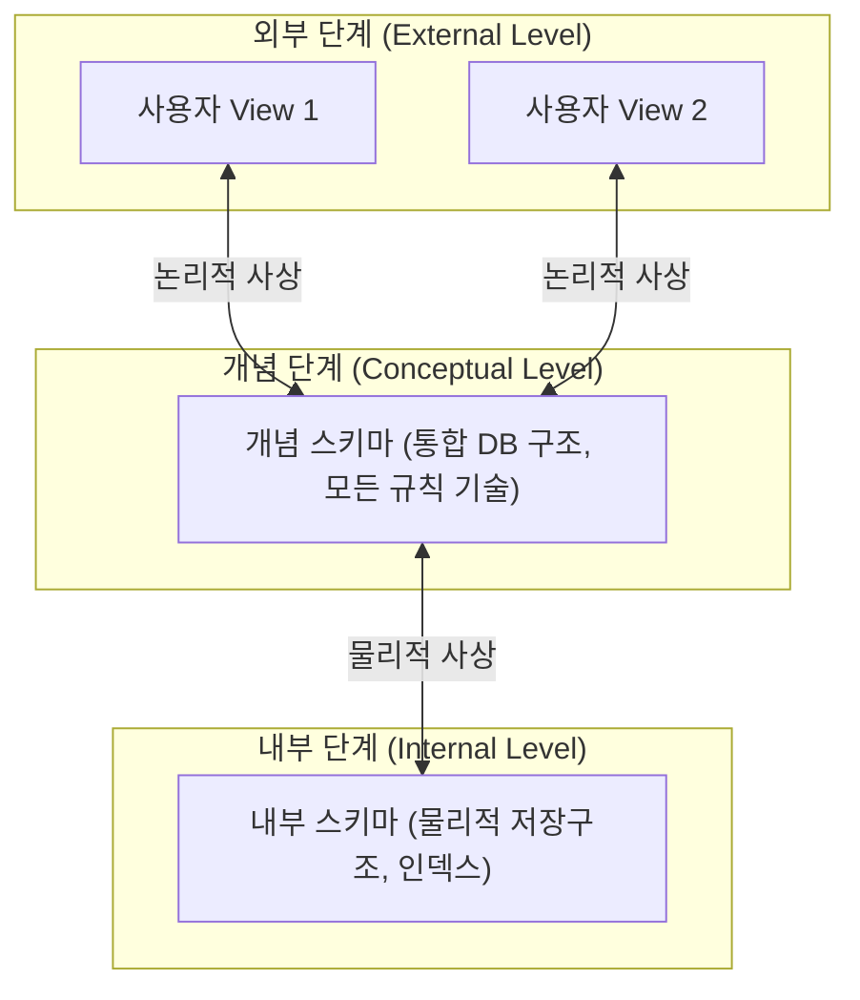

---
layout: post
title: "[SQLD 2024] 01. 제1과목 데이터 모델링의 이해 완벽 정리"
date: 2026-09-26
categories: [SQLD]
tags: [SQLD, 제1과목, 데이터모델링, 3층스키마, 엔터티, 속성, 관계, 식별자]
---
> **출제 비중**: 제1과목 10문항 중 약 4~6문항 출제  
> **핵심 키워드**: 모델링 3특징/3관점/3단계, 3층 스키마와 데이터 독립성, 엔터티/속성/관계/식별자 분류, 식별자 vs 비식별자 관계

---

## 1. 데이터 모델링의 기본 개념

### 📌 데이터 모델링이란?
현실 세계의 복잡한 비즈니스 프로세스와 데이터를 추상화·단순화하여 컴퓨터 시스템의 데이터베이스로 구축하기 위해 정해진 표기법으로 명확히 표현하는 과정입니다.

### 📐 데이터 모델링의 3대 특징 (시험 단골!)
| 특징 | 설명 | ⚠️ 오답 함정 (주의!) |
| :--- | :--- | :--- |
| **추상화 (Abstraction)** | 현실세계를 일정한 형식에 맞춰 간략하게 모형화 | 구체화 ❌ |
| **단순화 (Simplification)** | 약속된 규약과 표기법을 통해 누구나 쉽게 이해하도록 표현 | 복잡화 ❌ |
| **명확화 (Clarity)** | 애매모호함을 제거하고 정확하게 기술하여 의미 왜곡 방지 | 일반화 ❌ |

---

## 2. 모델링의 3가지 관점 & 유의점

### 🔍 모델링의 3가지 관점
1. **데이터 관점 (What)**: 어떤 데이터가 필요한가? (업무와 데이터, 데이터 간의 관계 모델링)
2. **프로세스 관점 (How)**: 업무가 실제로 무엇을 어떻게 처리하는가? (처리 절차, 흐름 모델링)
3. **상관 관점 (Interaction)**: 업무 프로세스가 데이터에 어떤 영향(CRUD)을 미치는가?

### ⚠️ 데이터 모델링 시 3대 유의점 (데이터 품질 저해 요인)
1. **중복성 (Duplication)**: 여러 테이블에 같은 데이터가 중복 저장되지 않도록 설계
2. **비유연성 (Inflexibility)**: 사소한 업무 변화에도 데이터 모델이 수시로 변경되지 않도록 **데이터의 정의와 사용 프로세스를 분리**
3. **비일관성 (Inconsistency)**: 데이터 간 상호 연관 관계를 명확히 정의하여 데이터 불일치 방지

---

## 3. 데이터 모델링의 3단계

| 구분 | 주요 내용 및 특징 | 산출물 / 키워드 |
| :--- | :--- | :--- |
| **1) 개념적 모델링** | - 업무 중심적이고 포괄적인 수준의 모델링 - 추상화 수준이 가장 높음 - 전사적 관점에서 핵심 엔터티 도출 | **핵심 Entity 추출, ERD 도출** |
| **2) 논리적 모델링** | - 개념적 모델을 바탕으로 비즈니스 정보 구조를 구체화 - Key, 속성, 관계를 빠짐없이 정의 - **정규화(Normalization)** 수행을 통한 데이터 일관성 확보 | **테이블 도출, 정규화 수행** |
| **3) 물리적 모델링** | - 특정 DBMS의 특성에 맞추어 물리적 저장 구조 설계 - 테이블스페이스, 인덱스, 파티션, 성능 고려 (반정규화 등) | **테이블 정의서, 인덱스 설계** |

---

## 4. 데이터의 독립성과 3단계 스키마 구조

데이터의 물리적/논리적 구조가 바뀌더라도 **응용 프로그램에 영향을 주지 않는 것(데이터 독립성)**이 목표입니다.

### 🏛️ ANSI-SPARC 3단계 스키마
- **외부 스키마 (External Schema)**: 사용자/개발자 개별 관점 (View)
- **개념 스키마 (Conceptual Schema)**: 모든 사용자 관점을 **통합한 조직 전체 DB의 논리적 구조** (모든 엔터티, 관계, 제약조건 기술)
- **내부 스키마 (Internal Schema)**: 물리적 저장 장치 관점 (실제 저장 형식, 내부 인덱스, 컬럼 바이트 등)

### 🔗 2단계 사상 (Mapping)과 독립성
- **논리적 데이터 독립성**: 개념 스키마가 변경되어도 **외부 스키마(응용 프로그램)**에 영향을 주지 않음 (외부-개념 사상)
- **물리적 데이터 독립성**: 내부 스키마(저장장치 구조)가 변경되어도 **개념 스키마**에 영향을 주지 않음 (개념-내부 사상)

---

## 5. 데이터 모델링의 3요소

| 개념 | 영문 | 의미 | ERD 표현 |
| :--- | :--- | :--- | :--- |
| **엔터티 (Entity)** | Things | 업무에서 관리하고자 하는 대상 (명사형) | 사각형 (Table) |
| **속성 (Attribute)** | Attributes | 엔터티가 가지는 세부 성격/항목 | 컬럼 (Column) |
| **관계 (Relationship)** | Relationships | 엔터티 간에 맺고 있는 연관성 (동사형) | 연결선 (Relationship line) |

---

## 6. 엔터티 (Entity) 총정리

### 📋 엔터티의 필수 특징
1. 반드시 해당 업무에서 **필요하고 관리하고자 하는 정보**여야 함
2. 유일한 식별자(PK)에 의해 **인스턴스가 식별 가능**해야 함
3. **영속적으로 존재하는 2개 이상의 인스턴스(행)**의 집합이어야 함 (1개뿐이면 엔터티 X)
4. 반드시 **2개 이상의 속성(열)**을 가져야 함
5. 다른 엔터티와 **최소 1개 이상의 관계**가 있어야 함 (단, 통계성 엔터티, 공통 코드 엔터티는 관계 생략 가능)

### 🗂️ 엔터티의 분류 기준 (시험 최다 빈출!)

#### 1) 유·무형에 따른 분류
- **유형 엔터티**: 물리적 형태가 있고 지속적으로 활용 (ex: 사원, 물품, 교수, 학생)
- **개념 엔터티**: 물리적 형태가 없고 개념적으로 관리되는 정보 (ex: 부서, 조직, 과목)
- **사건 엔터티**: 업무를 수행함에 따라 발생하는 엔터티, 데이터 발생량이 매우 많음 (ex: 주문, 결제, 수강신청, 청구)

#### 2) 발생 시점에 따른 분류
- **기본 엔터티 (Key Entity)**: 업무에 원래 존재하는 독립 엔터티, 타 엔터티의 부모 역할 (ex: 사원, 부서, 고객, 상품)
- **중심 엔터티 (Main Entity)**: 기본 엔터티로부터 발생하며, 업무의 중심 역할 (ex: 주문, 매출, 계약)
- **행위 엔터티 (Active Entity)**: 2개 이상의 부모 엔터티로부터 지속적으로 발생하며 내용이 자주 바뀜 (ex: 주문내역, 로그, 배송이력)

---

## 7. 속성 (Attribute) 총정리

### 🗂️ 속성의 특성에 따른 분류 (시험 필수!)
| 분류 | 설명 | 예시 |
| :--- | :--- | :--- |
| **기본 속성 (Basic)** | 업무로부터 원래 도출되는 가장 일반적인 속성 | 고객명, 사원명, 생년월일, 주소 |
| **설계 속성 (Designed)** | 원래 업무에는 없으나 시스템 설계상 편의를 위해 인위적으로 만든 속성 | 사원번호, 학번, 주문코드, 상태코드 |
| **파생 속성 (Derived)** | 다른 속성을 계산·가공하여 유도된 속성 (정합성 관리에 각별히 유의) | 총결제금액, 주문건수, 평균점수, 할인액 |

> 💡 **도메인 (Domain)이란?**  
> 각 속성이 가질 수 있는 **값의 범위나 데이터 타입/크기/제약조건** (예: 학생 학점은 0.0~4.5 범위, 전화번호는 13자리 형식 등).

---

## 8. 관계 (Relationship) 와 식별자

### 🔗 관계의 3가지 구성 요소
1. **관계명 (Heading)**: 연관성의 이름 (현재형 동사)
2. **관계차수 (Cardinality)**: 1:1, 1:N, M:N
3. **관계선택사양 (Optionality)**: 필수 참여(Mandatory, 실선/원X), 선택 참여(Optional, O 표시)

### 🔑 키(Key)의 4대 분류
- **슈퍼키 (Super Key)**: 행을 유일하게 식별할 수 있는 속성 집합 (**유일성 O, 최소성 X**)
- **후보키 (Candidate Key)**: 행을 유일하고 최소한으로 식별할 수 있는 속성 집합 (**유일성 O, 최소성 O**)
- **기본키 (Primary Key)**: 후보키 중 엔터티의 대표로 선정된 키
- **대체키 (Alternate Key)**: 후보키 중 기본키로 선정되지 못한 나머지 후보키

---

## 9. 식별자 관계 vs 비식별자 관계 비교 (별 5개 ⭐⭐⭐⭐⭐)

| 구분 | 식별자 관계 (Identifying) | 비식별자 관계 (Non-Identifying) |
| :--- | :--- | :--- |
| **개념** | 부모의 주식별자가 자식의 **주식별자(PK)**로 상속 | 부모의 주식별자가 자식의 **일반 속성(FK)**으로 상속 |
| **ERD 표기** | **실선 (Solid Line)** | **점선 (Dashed Line)** |
| **부모-자식 종속성** | **강한 연결** (부모 없는 자식 존재 불가) | **약한 연결** (부모 없이도 자식 독립 존재 가능) |
| **엔터티 구분** | 부모: 강한 엔터티, 자식: **약한 엔터티 (Weak Entity)** | 둘 다 독립적인 엔터티 |
| **장점** | 조인 시 부모 테이블 조인 없이 자식의 PK로 빠른 조회 가능 | 부모 변경에 따른 자식 PK 구조 영향이 적고 개발 유연성 확보 |
| **단점** | 상속이 반복되면 자식 테이블의 **PK 컬럼 수가 계속 증가 (복잡도↑)** | 데이터 조회 시 부모 테이블과의 조인 횟수 증가 |
