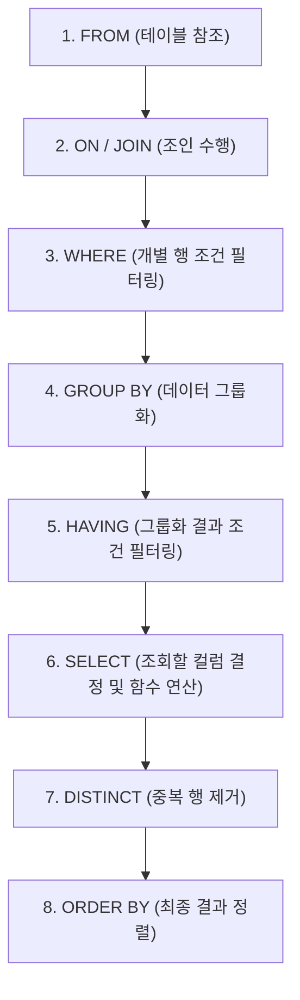

---
layout: post
title: "[SQLD 2024] 03. 제2과목 SQL 기본 - SELECT, 함수, WHERE, 그룹화 & 정렬"
date: 2026-09-28
categories: [SQLD]
tags: [SQLD, 제2과목, SQL기본, SELECT, 단일행함수, NULL함수, WHERE, GROUP_BY, ORDER_BY]
---
> **출제 비중**: 제2과목 40문항 중 약 8~10문항 출제 (점수 밭!)  
> **핵심 키워드**: SQL 작성 및 실행 순서, 단일행 함수 총집합, NULL 처리 함수, CASE/DECODE, HAVING vs WHERE, 오라클 vs SQL Server의 NULL 정렬 차이

---

## 1. 관계형 데이터베이스(RDBMS) 기본 개념

- **테이블(Table)**: 데이터를 행(Row, 튜플)과 열(Column, 어트리뷰트)의 2차원 표 형태로 저장
- **도메인(Domain)**: 하나의 속성이 취할 수 있는 동일한 원자값들의 집합
- **무결성 제약조건**:
  - **개체 무결성 (Entity Integrity)**: 기본키는 절대 NULL을 가질 수 없으며 중복 불가
  - **참조 무결성 (Referential Integrity)**: 외래키 값은 참조하는 부모의 기본키 값이거나 NULL이어야 함
  - **도메인 무결성 (Domain Integrity)**: 특정 컬럼에 입력되는 값은 정의된 데이터 타입, 범위, 제약 규칙을 준수해야 함

---

## 2. SQL 실행 순서 (시험 1순위 무조건 암기! ⭐⭐⭐⭐⭐)

SQL 문장은 작성 순서와 실제 데이터베이스 내부에서의 실행 순서가 다릅니다. 이 순서를 모르면 별칭(Alias) 사용 오류 문제를 무조건 틀립니다.



> 💡 **핵심 오답 방지 팁**:  
> - `WHERE` 절에서는 `SELECT` 절에서 정의한 별칭(Alias)을 절대 사용할 수 없습니다! (SELECT가 WHERE보다 나중에 실행되기 때문)  
> - `ORDER BY` 절에서는 `SELECT` 절의 별칭이나 컬럼 순서 번호(1, 2, 3...)를 자유롭게 사용할 수 있습니다!

---

## 3. SELECT 절과 기본 연산

### 📌 기본 문법
```sql
SELECT [DISTINCT] 컬럼명 [AS 별칭]
FROM 테이블명;
```

### 🔗 문자열 합성 연산자 (DBMS별 차이)
- **Oracle**: `||` 연산자 사용 (`SELECT FIRST_NAME || ' ' || LAST_NAME FROM EMP;`)
- **SQL Server**: `+` 연산자 사용 (`SELECT FIRST_NAME + ' ' + LAST_NAME FROM EMP;`)
- **공통 표준 함수**: `CONCAT(str1, str2)` (인수가 2개만 지원되므로 3개 이상 결합 시 중첩 필요)

---

## 4. 단일행 함수 (Single-Row Functions) 총정리

각 행(Row)마다 개별적으로 적용되어 **입력된 행의 수만큼 결과를 반환**합니다.

### 🔤 문자형 함수
| 함수명 | 설명 | 예시 | 결과 |
| :--- | :--- | :--- | :--- |
| `LOWER(str) / UPPER(str)` | 소문자/대문자 변환 | `LOWER('SQL')` | `'sql'` |
| `SUBSTR(str, m, n)` | $m$번째부터 $n$개 추출 (1-based index) | `SUBSTR('DATABASE', 5, 4)` | `'BASE'` |
| `LENGTH(str)` | 문자열 길이 반환 (SQL Server: `LEN`) | `LENGTH('SQLD')` | `4` |
| `LTRIM / RTRIM / TRIM` | 좌/우/양쪽 특정 문자 또는 공백 제거 | `TRIM('  DATA  ')` | `'DATA'` |
| `LPAD / RPAD(str, len, pad)` | 지정 길이만큼 채움 문자 패딩 | `LPAD('7', 3, '0')` | `'007'` |
| `INSTR(str, sub)` | 특정 문자열이 시작하는 위치 반환 | `INSTR('KOREA', 'R')` | `3` |
| `REPLACE(str, s1, s2)` | 문자열 $s1$을 $s2$로 치환 | `REPLACE('ABC', 'B', 'X')` | `'AXC'` |

### 🔢 숫자형 함수
| 함수명 | 설명 | 예시 | 결과 |
| :--- | :--- | :--- | :--- |
| `ABS(n)` | 절댓값 | `ABS(-15)` | `15` |
| `SIGN(n)` | 부호 판정 (양수 1, 0은 0, 음수 -1) | `SIGN(-30)` | `-1` |
| `ROUND(n, d)` | 소수점 $d$자리까지 반올림 | `ROUND(123.456, 1)`<br>`ROUND(123.456, -1)` | `123.5`<br>`120` |
| `TRUNC(n, d)` | 소수점 $d$자리 미만 절사 (버림) | `TRUNC(123.456, 1)` | `123.4` |
| `CEIL / CEILING` | 크거나 같은 최소 정수 (올림) | `CEIL(3.14)` / `CEIL(-3.14)` | `4` / `-3` |
| `FLOOR(n)` | 작거나 같은 최대 정수 (내림) | `FLOOR(3.8)` / `FLOOR(-3.8)` | `3` / `-4` |
| `MOD(m, n)` | 나머지 계산 | `MOD(10, 3)` | `1` |

### 📅 날짜형 함수
- `SYSDATE` (Oracle) / `GETDATE()` (SQL Server): 현재 일시 반환
- 날짜 연산: `날짜 + 숫자` (일수 더하기), `날짜1 - 날짜2` (두 날짜 사이의 일수 차이)
- `ADD_MONTHS(날짜, n)`: $n$개월 후 날짜 반환
- `MONTHS_BETWEEN(날짜1, 날짜2)`: 두 날짜 사이의 개월 수 차이
- `EXTRACT(YEAR FROM SYSDATE)`: 연도/월/일 추출

### 🔀 조건 분기 함수 (CASE 표현 & DECODE)
```sql
-- 1) CASE 문 (표준, 조건식 지원)
CASE 
    WHEN SAL >= 3000 THEN 'HIGH'
    WHEN SAL >= 1500 THEN 'MID'
    ELSE 'LOW'
END AS SAL_GRADE

-- 2) DECODE 문 (오라클 전용, 동등 비교만 가능)
DECODE(DEPTNO, 10, '인사과', 20, '개발과', 30, '영업과', '기타') AS DEPT_NAME
```

---

## 5. NULL 관련 함수 (시험 필수 암기! ⭐⭐⭐)

| 함수명 | 문법 및 설명 | 비고 |
| :--- | :--- | :--- |
| **`NVL(표현식1, 표현식2)`** | 표현식1이 NULL이면 표현식2 반환 | SQL Server: `ISNULL()` |
| **`NVL2(표현식1, 참, 거짓)`** | 표현식1이 NOT NULL이면 '참', NULL이면 '거짓' 반환 | 삼항 연산자와 유사 |
| **`COALESCE(e1, e2, e3...)`** | 나열된 표현식 중 **NULL이 아닌 최초의 값** 반환 | ANSI 표준 |
| **`NULLIF(e1, e2)`** | $e1$과 $e2$가 같으면 **NULL**, 다르면 **$e1$** 반환 | ANSI 표준 |

---

## 6. WHERE 절 & 논리 연산자

### 🧮 연산자 우선순위
1. 괄호 `()`
2. 비교 연산자 (`=, >, <, <=, >=, <>`) 및 SQL 연산자 (`BETWEEN, IN, LIKE, IS NULL`)
3. `NOT`
4. **`AND`**
5. **`OR`** (가장 마지막에 연산!)

### 🔍 주요 연산자 사용법
- **`BETWEEN A AND B`**: $A$ 이상 $B$ 이하 ($A \le X \le B$, 경계값 포함)
- **`IN (A, B, C)`**: 나열된 목록 중 하나라도 일치하면 참 (`OR` 조건과 동일)
  - ⚠️ **주의**: `NOT IN (A, B, NULL)` 목록 안에 NULL이 포함되어 있으면 결과가 항상 **공집합(0건)** 반환!
- **`LIKE` 와 와일드카드**:
  - `%`: 0개 이상의 모든 문자
  - `_`: 정확히 1개의 모든 문자
  - 와일드카드 문자 자체(`%`, `_`)를 검색할 때는 `ESCAPE` 구문 사용 (`WHERE NAME LIKE '%@_%' ESCAPE '@';`)
- **`IS NULL` / `IS NOT NULL`**: NULL 값의 유무 판정 (절대 `= NULL` 로 비교 금지)

---

## 7. GROUP BY, HAVING 절 & 집계 함수

### 📊 집계 함수 (Aggregate Functions)
- `COUNT(*)`, `COUNT(컬럼)`, `SUM(컬럼)`, `AVG(컬럼)`, `MAX(컬럼)`, `MIN(컬럼)`
- ⚠️ **NULL 처리 규칙**: `SUM`, `AVG`, `MAX`, `MIN`은 **NULL 값을 자동으로 제외(무시)**하고 계산합니다!
  - `COUNT(*)`는 NULL을 포함한 전체 행 수 반환
  - `COUNT(COMM)`는 COMM 컬럼이 NULL이 아닌 행 수만 반환

### ⚖️ WHERE 절 vs HAVING 절 차이
```sql
SELECT DEPTNO, AVG(SAL)
FROM EMP
WHERE SAL >= 1000        -- 1) 집계 전: 개별 사원의 SAL 필터링
GROUP BY DEPTNO
HAVING AVG(SAL) >= 2500  -- 2) 집계 후: 부서별 평균 급여 필터링 (집계함수 사용 가능)
ORDER BY DEPTNO;
```

---

## 8. ORDER BY 절 & NULL 정렬 차이 (초특급 빈출! ⭐⭐⭐)

### 📌 정렬 옵션
- `ASC` (기본값): 오름차순 (작은 값 $
\rightarrow$ 큰 값)
- `DESC`: 내림차순 (큰 값 $
\rightarrow$ 작은 값)

### 🚨 DBMS별 NULL 정렬 기준 (오라클 vs SQL Server)
| DBMS | NULL의 취급 | `ORDER BY 컬럼 ASC` (오름차순) | `ORDER BY 컬럼 DESC` (내림차순) |
| :--- | :--- | :--- | :--- |
| **Oracle** | **가장 큰 값 (Infinity)** 으로 취급 | NULL이 **맨 뒤**에 출력 | NULL이 **맨 앞**에 출력 |
| **SQL Server** | **가장 작은 값 (-Infinity)** 으로 취급 | NULL이 **맨 앞**에 출력 | NULL이 **맨 뒤**에 출력 |

> 💡 **Oracle 전용 제어 옵션**:  
> `ORDER BY COMM ASC NULLS FIRST;` (강제로 NULL을 맨 앞에 위치)  
> `ORDER BY COMM DESC NULLS LAST;` (강제로 NULL을 맨 뒤에 위치)
