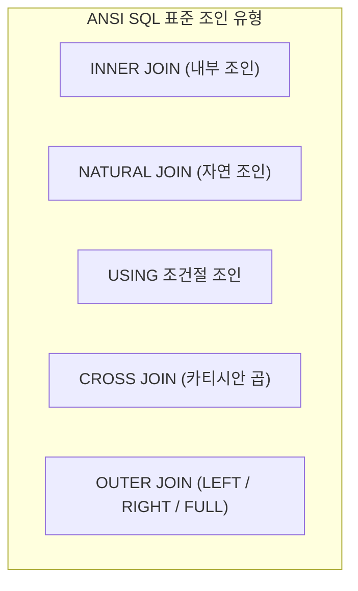
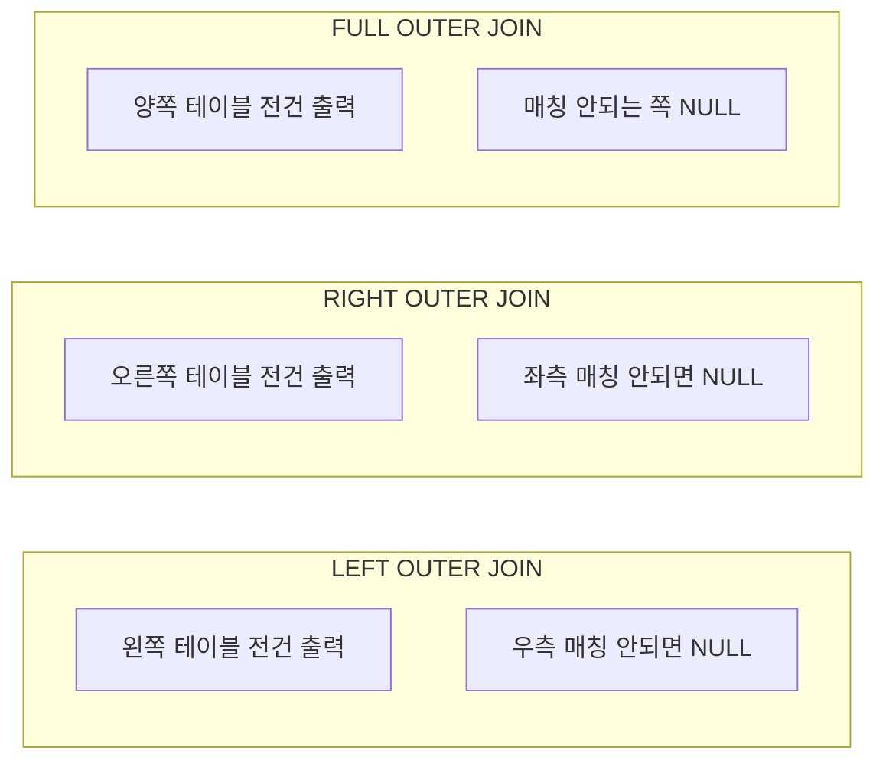

---
layout: post
title: "[SQLD 2024] 04. 제2과목 SQL 기본 - 조인(JOIN) 완벽 마스터"
date: 2026-09-29
categories: [SQLD]
tags: [SQLD, 제2과목, 조인, JOIN, EQUI_JOIN, ANSI_JOIN, NATURAL_JOIN, OUTER_JOIN]
---
> **출제 비중**: 제2과목에서 매회 4~6문항 출제 (조인 조건 누락, 문법 오류 찾기 단골!)  
> **핵심 키워드**: EQUI vs NON-EQUI JOIN, 셀프 조인(SELF JOIN), ANSI 표준 JOIN, NATURAL JOIN 주의점, USING 절 규칙, OUTER JOIN

---

## 1. 조인(JOIN)의 기본 개념

- **조인(JOIN)**이란 두 개 이상의 테이블을 연결하여 하나의 통합된 결과 집합을 도출하는 핵심 데이터베이스 연산입니다.
- **최소 조인 조건 공식**: $N$개의 테이블을 조인할 때 필요한 **최소 조인 조건식의 개수는 $(N - 1)$개**입니다.
  - 조인 조건을 생략하거나 잘못 기술하면 모든 행이 곱해지는 **카티시안 곱(Cartesian Product)**이 발생합니다.

---

## 2. 전통적인 조인 (Oracle WHERE절 문법)

### 1) 등가 조인 (EQUI JOIN)
두 테이블 간의 컬럼 값이 정확히 일치(`=`)하는 경우를 연결합니다.
```sql
SELECT E.EMPNO, E.ENAME, D.DNAME, E.DEPTNO
FROM EMP E, DEPT D
WHERE E.DEPTNO = D.DEPTNO;  -- 조인 조건
```

### 2) 비등가 조인 (NON-EQUI JOIN)
두 테이블 간의 컬럼 값이 완전히 일치하지 않고, 범위(`BETWEEN`, `>=`, `<=`, `<>`)로 연결할 때 사용합니다.
```sql
SELECT E.ENAME, E.SAL, S.GRADE
FROM EMP E, SALGRADE S
WHERE E.SAL BETWEEN S.LOSAL AND S.HISAL;
```

### 3) 자체 조인 (SELF JOIN)
하나의 동일한 테이블을 물리적으로 2개인 것처럼 별칭(Alias)을 부여하여 상하 관계나 연관 행을 검색합니다.
```sql
-- 사원 정보와 해당 사원의 직속 상사(MGR) 이름 조회
SELECT E.EMPNO AS 사원번호, E.ENAME AS 사원명, 
       M.EMPNO AS 관리자번호, M.ENAME AS 관리자명
FROM EMP E, EMP M
WHERE E.MGR = M.EMPNO;
```

---

## 3. ANSI / ISO SQL 표준 조인 문법 총정리 (별 5개 ⭐⭐⭐⭐⭐)

ANSI 표준 조인은 `FROM` 절에 조인 방식을 명시하고, `ON` 또는 `USING` 절에 조인 조건을 기술합니다.



---

## 4. INNER JOIN & USING 절의 주의점

### 1) ON 조건절
```sql
SELECT E.ENAME, D.DNAME
FROM EMP E
INNER JOIN DEPT D ON E.DEPTNO = D.DEPTNO
WHERE E.SAL >= 2000;
```

### 2) USING 조건절 (⚠️ 시험 단골 함정!)
조인하는 두 테이블의 **컬럼명이 동일할 때** 간결하게 작성하는 문법입니다.
```sql
SELECT E.ENAME, D.DNAME, DEPTNO  -- ⚠️ 주의: DEPTNO에 E. 또는 D. 접두사 붙이면 에러!
FROM EMP E
JOIN DEPT D USING (DEPTNO);      -- ⚠️ 반드시 괄호 () 필수!
```

> 🚨 **USING 절 2대 필수 주의사항**:  
> 1. 컬럼명을 반드시 **소괄호 `()`**로 감싸야 합니다.  
> 2. `SELECT` 절이나 `WHERE` 절에서 **테이블 별칭/접두사(예: `E.DEPTNO`)를 붙이면 문법 에러**가 발생합니다! 오직 `DEPTNO` 단독으로만 적어야 합니다.

---

## 5. NATURAL JOIN (자연 조인) 주의점 (초특급 빈출! ⭐⭐⭐)

두 테이블에서 **이름과 데이터 타입이 완벽히 일치하는 모든 컬럼**을 기준으로 자동으로 등가 조인을 수행합니다.

```sql
SELECT ENAME, DNAME, DEPTNO  -- ⚠️ DEPTNO에 식별자/접두사 사용 불가!
FROM EMP
NATURAL JOIN DEPT;
```

> 🚨 **NATURAL JOIN 3대 오답 함정**:  
> 1. `ON` 절이나 `USING` 절을 **함께 사용할 수 없습니다.** (함께 쓰면 문법 에러)  
> 2. 공통 컬럼은 `SELECT` 절에서 테이블 소유자/별칭(접두사)을 붙일 수 없습니다. (`E.DEPTNO` ❌ $\r\rightarrow$ `DEPTNO` ⭕)  
> 3. 만약 이름은 같은데 데이터 타입이 다르면 에러가 발생합니다.

---

## 6. CROSS JOIN (교차 조인 / 카티시안 곱)

조인 조건 없이 양쪽 테이블의 모든 행을 상호 결합합니다.  
반환 행 수 = **Table A의 행 수 $\times$ Table B의 행 수**

```sql
SELECT E.ENAME, D.DNAME
FROM EMP E
CROSS JOIN DEPT D;
```

---

## 7. OUTER JOIN (외부 조인) 완벽 비교

한쪽 테이블의 데이터가 매칭되지 않더라도 누락시키지 않고 **결과에 포함하고, 반대편은 NULL로 채우는 조인**입니다.



### 1) 문법 및 예시
```sql
-- LEFT OUTER JOIN (부서가 배정되지 않은 신입사원도 모두 출력)
SELECT E.ENAME, D.DNAME
FROM EMP E
LEFT OUTER JOIN DEPT D ON E.DEPTNO = D.DEPTNO;

-- FULL OUTER JOIN (사원이 없는 부서 + 부서가 없는 사원 둘 다 출력)
SELECT E.ENAME, D.DNAME
FROM EMP E
FULL OUTER JOIN DEPT D ON E.DEPTNO = D.DEPTNO;
```

### 2) Oracle 구버전 문법 `(+)` 기호 규칙
- **데이터가 부족하여 NULL로 채워져야 하는 쪽에 `(+)`를 붙입니다.**
- `WHERE E.DEPTNO = D.DEPTNO(+)` $\implies$ **LEFT OUTER JOIN** (EMP 기준)
- `WHERE E.DEPTNO(+) = D.DEPTNO` $\implies$ **RIGHT OUTER JOIN** (DEPT 기준)
- ⚠️ **주의**: `WHERE E.DEPTNO(+) = D.DEPTNO(+)` 처럼 **양쪽에 동시에 `(+)`를 붙이는 FULL OUTER JOIN은 Oracle에서 에러가 발생**하여 불가능합니다! (반드시 표준 `FULL OUTER JOIN` 문법 사용)
