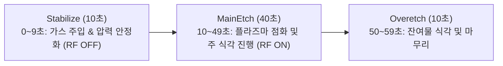
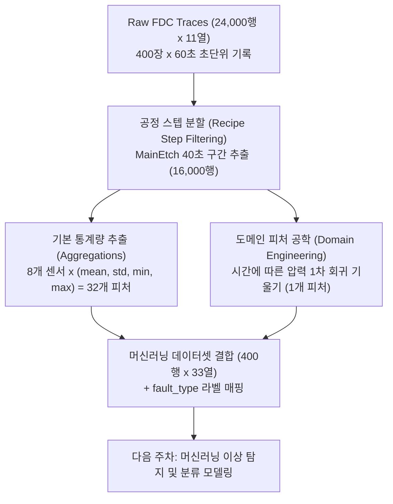

---
layout: post
title: "[반도체 장비 데이터 실무] 03. 식각(Etch) 장비 FDC 센서 시계열 데이터 탐색 및 피처 엔지니어링"
date: 2026-09-29
categories: [반도체장비]
tags: [FDC, 반도체장비, 식각공정, 시계열데이터, 피처엔지니어링, 센서데이터]
---
# [반도체 장비 데이터 실무] 03. 식각(Etch) 장비 FDC 센서 시계열 데이터 탐색 및 피처 엔지니어링

> **요약**: 반도체 식각(Etch) 공정의 FDC(Fault Detection and Classification) 초단위 센서 시계열 데이터를 탐색하고, 시각화와 도메인 지식 기반의 피처 엔지니어링(Feature Engineering)을 통해 웨이퍼 1장당 60줄의 시계열을 머신러닝 모델이 학습 가능한 요약 통계량 및 기울기 피처로 변환하는 실무 분석 과정입니다.

---

## 목차
1. [오늘의 배경과 분석 목표](#1-오늘의-배경과-분석-목표)
2. [환경 준비 및 자가진단 함수 세팅](#2-환경-준비-및-자가진단-함수-세팅)
3. [미션 1 · FDC 트레이스 데이터 열어보기](#미션-1--fdc-트레이스-데이터-열어보기)
4. [미션 2 · 정상 웨이퍼(WF0001)의 8개 센서 시계열 눈으로 보기](#미션-2--정상-웨이퍼wf0001의-8개-센서-시계열-눈으로-보기)
5. [미션 3 · 공정 레시피 스텝(Step) 구조 파악하기](#미션-3--공정-레시피-스텝step-구조-파악하기)
6. [미션 4 · 정상 vs 이상 웨이퍼 겹쳐 그리기 (Overlay Comparison)](#미션-4--정상-vs-이상-웨이퍼-겹쳐-그리기-overlay-comparison)
7. [미션 5 · 웨이퍼 한 장을 한 줄로 줄이기 (요약 통계량 생성)](#미션-5--웨이퍼-한-장을-한-줄로-줄이기-요약-통계량-생성)
8. [미션 6 · 도메인 특화 특징: 압력 기울기(Pressure Slope) 생성](#미션-6--도메인-특화-특징-압력-기울기pressure-slope-생성)
9. [미션 7 · 어떤 특징이 어떤 이상을 잡는가? (박스플롯 및 변별력 분석)](#미션-7--어떤-특징이-어떤-이상을-잡는가-박스플롯-및-변별력-분석)
10. [미션 8 · 엔지니어의 관점에서 깊이 있게 정리하기 (Q&A 심층 고찰)](#미션-8--엔지니어의-관점에서-깊이-있게-정리하기-qa-심층-고찰)
11. [핵심 요약 및 결론](#핵심-요약-및-결론)

---

## 1. 오늘의 배경과 분석 목표

반도체 플라즈마 식각(Dry Etching) 장비는 챔버 안에서 웨이퍼 한 장을 가공하는 동안(약 60초) 수많은 센서 값을 **1초에 1회씩** 실시간 기록합니다. 이를 **FDC(Fault Detection and Classification) 트레이스(Trace)** 데이터라고 부릅니다.

> **장비 엔지니어의 요청:**  
> *"불량 난 웨이퍼들이 발생했습니다. 트레이스 센서 데이터를 확인해서 어떤 물리적 이상이 발생했는지 원인을 찾고, 이를 자동으로 감지할 수 있는 특징을 추출해 주세요."*

### 🎯 핵심 목표
- **시계열 시각화**: 숫자 테이블만 보지 않고, 8개 센서의 시계열 변화 및 정상/이상 파형을 직접 시각화하여 거동 파악
- **공정 스텝 분석**: Stabilize(안정화) $\rightarrow$ MainEtch(주 식각) $\rightarrow$ Overetch(과도 식각) 구간별 특성 이해
- **피처 엔지니어링**: 웨이퍼 1장당 60행으로 구성된 시계열을 머신러닝 모델의 입력으로 사용할 수 있도록 요약 통계량(32개) 및 도메인 지식 기반 피처(압력 기울기 1개)로 총 **33개의 특징** 추출

---

## 2. 환경 준비 및 자가진단 함수 세팅

실습에 필요한 라이브러리를 임포트하고, 한글 폰트 설정 및 코드 검증을 위한 `check()` 함수를 정의합니다.

```python
import pandas as pd
import numpy as np
import matplotlib.pyplot as plt
import matplotlib.font_manager as fm
from pathlib import Path

# 한글 폰트 설정
_have = {f.name for f in fm.fontManager.ttflist}
for _f in ['Malgun Gothic', 'AppleGothic', 'NanumGothic', 'DejaVu Sans']:
    if _f in _have:
        plt.rcParams['font.family'] = _f
        break
plt.rcParams['axes.unicode_minus'] = False
pd.set_option('display.max_columns', 30)

DATA = Path('../../data/etch_fdc')

# 자가진단 함수: 조건 만족 여부를 [통과] / [실패]로 확인
def check(name, cond, hint=''):
    if cond:
        print('[통과] ' + name)
    else:
        print('[실패] ' + name + (('  ->  ' + str(hint)) if hint else ''))

print('폰트:', plt.rcParams['font.family'][0], '| 데이터 폴더:', DATA.exists())
```

**실행 결과:**
```
폰트: Malgun Gothic | 데이터 폴더: False
```

---

## 미션 1 · FDC 트레이스 데이터 열어보기

### 1-1. 센서 컬럼 정의
이번 데이터는 웨이퍼 1장당 1개 행이 아닌, **60초 동안 1초마다 수집된 60개 행**으로 구성되어 있습니다. 수집된 8개 핵심 센서는 다음과 같습니다.

| 컬럼명 | 센서 명칭 | 단위 | 설명 |
|---|---|:---:|---|
| `rf_forward_W` | RF 순방향 전력 | $\text{W}$ | 플라즈마 생성을 위해 챔버로 인가되는 고주파 전력 |
| `rf_reflected_W` | RF 반사 전력 | $\text{W}$ | 임피던스 매칭(Matching) 불량 시 반사되어 되돌아오는 전력 |
| `chamber_pressure_mTorr`| 챔버 압력 | $\text{mTorr}$ | 식각 챔버 내부 진공 압력 |
| `ar_flow_sccm` | 아르곤(Ar) 가스 유량 | $\text{sccm}$ | 플라즈마 점화 및 스퍼터링용 불활성 가스 |
| `cf4_flow_sccm` | $\text{CF}_4$ 가스 유량 | $\text{sccm}$ | 실리콘/산화막을 깎아내는 반응성 식각 가스 |
| `esc_temp_C` | 정전척(ESC) 온도 | $^{\circ}\text{C}$ | 웨이퍼를 고정하고 온도를 제어하는 척의 온도 |
| `he_backside_Torr` | 웨이퍼 후면 헬륨 압력 | $\text{Torr}$ | 웨이퍼와 정전척 간 열전도를 돕는 헬륨 가스 압력 |
| `endpoint_intensity` | 종점 검출(EPD) 발광 세기 | $\text{a.u.}$ | 식각 완료 시점을 파악하기 위한 플라즈마 발광 분석 세기 |

### 1-2. 데이터 로드 및 구조 확인

```python
# CSV 파일 로드 (tr: 1초 단위 센서 기록, wi: 웨이퍼 기본 정보 및 고장 라벨)
tr = pd.read_csv('traces.csv')
wi = pd.read_csv('wafer_info.csv', parse_dates=['timestamp'])

# 크기 및 구조 확인
print('traces 크기:', tr.shape)
print('wafer_info 크기:', wi.shape)

wafer_count = tr['wafer_id'].nunique()
rows_per_wafer = len(tr) / wafer_count
print('웨이퍼 수:', wafer_count)
print('웨이퍼 한 장당 기록 수:', rows_per_wafer)

# 이상 유형(fault_type)별 웨이퍼 수 분포 확인
fault_counts = wi['fault_type'].value_counts()
print('\n이상 유형별 웨이퍼 수:')
print(fault_counts)
```

**실행 결과:**
```
traces 크기: (24000, 11)
wafer_info 크기: (400, 6)
웨이퍼 수: 400
웨이퍼 한 장당 기록 수: 60.0

이상 유형별 웨이퍼 수:
fault_type
NORMAL            316
RF_UNSTABLE        30
PRESSURE_DRIFT     30
GAS_LEAK           24
Name: count, dtype: int64
```

> **자가진단 결과:**  
> `[통과] traces 24000행 11열`  
> `[통과] 웨이퍼 400장`  
> `[통과] 장당 60행`  
> `[통과] 정상 316장`

전체 웨이퍼 400장 중 **정상은 316장(79%)**, **이상 웨이퍼는 84장(21%)**으로 구성되어 있습니다.

---

## 미션 2 · 정상 웨이퍼(WF0001)의 8개 센서 시계열 눈으로 보기

숫자 통계만으로는 시계열 데이터의 동적 변화를 이해할 수 없습니다. 대표 정상 웨이퍼인 `WF0001`을 추출하여 8개 센서가 60초 동안 어떻게 동작하는지 `4행 2열` 서브플롯으로 시각화합니다.

```python
# 정상 웨이퍼 WF0001 추출
one = tr[tr['wafer_id'] == 'WF0001']

SENSORS = [
    'rf_forward_W', 'rf_reflected_W', 'chamber_pressure_mTorr', 'ar_flow_sccm',
    'cf4_flow_sccm', 'esc_temp_C', 'he_backside_Torr', 'endpoint_intensity'
]

fig, axes = plt.subplots(4, 2, sharex=True, figsize=(12, 8))

for ax, sensor in zip(axes.ravel(), SENSORS):
    ax.plot(one['t_sec'], one[sensor], linewidth=1.2, color='#4C78A8')
    ax.set_title(sensor, fontsize=10)
    ax.set_ylabel('센서 값')
    ax.grid(alpha=0.3)

for ax in axes[-1]:
    ax.set_xlabel('시간 (초)')

fig.suptitle('WF0001 트레이스 (정상 웨이퍼)', fontsize=13)
plt.tight_layout()
plt.show()
```

### 시각화 결과:


### 💡 파형 분석 및 관찰 포인트
1. **계단식(Step-wise) 거동**: 10초 및 50초 시점에서 거의 모든 센서의 값이 뚜렷하게 계단형으로 전환됩니다.
2. **RF 전력**: `rf_forward_W`는 0~9초 동안 0W에 머물다가, **10초 시점에서 약 800W로 인가**되며 본격적인 플라즈마가 형성됩니다. 50초 시점에는 약 460W 수준으로 감소합니다.
3. **가스 유량 및 챔버 압력**: 반응 가스인 `cf4_flow_sccm`은 0~9초에는 0이다가 10초에 급증하며, 압력(`chamber_pressure_mTorr`)도 가스 유입 및 밸브 제어에 따라 구간별로 목표 세팅값으로 제어됩니다.
4. **온도 및 후면 헬륨**: `esc_temp_C`는 62℃에서 65℃ 수준으로 완만하게 상승하며, `he_backside_Torr`는 8 Torr 부근에서 매우 안정적으로 유지됩니다.

---

## 미션 3 · 공정 레시피 스텝(Step) 구조 파악하기

시계열의 계단식 변화는 장비의 **레시피 스텝(Recipe Step)**에 기인합니다. 식각 공정은 다음 세 단계로 설계되어 있습니다:



### 3-1. 스텝별 지속 시간 및 센서 평균 계산

```python
# 1) 단일 웨이퍼 기준 스텝별 시간(초) 확인
step_len = one.groupby('step', sort=False).size()
print('스텝별 시간(초):')
print(step_len)

# 2) 전체 웨이퍼 기준 스텝별 8개 센서 평균 계산
by_step = tr.groupby('step', sort=False)[SENSORS].mean()
print('\n스텝별 센서 평균:')
print(by_step)
```

**실행 결과:**
```
스텝별 시간(초):
step
Stabilize    10
MainEtch     40
Overetch     10
dtype: int64

스텝별 센서 평균:
           rf_forward_W  rf_reflected_W  chamber_pressure_mTorr  ar_flow_sccm  cf4_flow_sccm  esc_temp_C  he_backside_Torr  endpoint_intensity
step                                                                                                                                           
Stabilize     -0.147810        2.997383               31.054164     98.461595      -0.117100   62.060702          7.996557           99.998242
MainEtch     784.709233       19.317596               20.254119     79.893280      39.469171   64.557312          8.000230           84.503706
Overetch     462.415012       12.771823               25.897942     88.631673      19.624482   62.050880          8.000845           45.008330
```

> **자가진단 결과:**  
> `[통과] Stabilize 10초`  
> `[통과] MainEtch 40초`  
> `[통과] Overetch 10초`  
> `[통과] 스텝별 평균 3행`

---

## 미션 4 · 정상 vs 이상 웨이퍼 겹쳐 그리기 (Overlay Comparison)

장비의 주요 3가지 이상 유형은 다음과 같이 특정 센서에 직접적인 영향을 미칩니다:
1. `RF_UNSTABLE`: RF 정합(Matching Network) 튜닝 불안정 $\rightarrow$ **`rf_reflected_W` (반사 전력)** 급증 및 요동
2. `PRESSURE_DRIFT`: 배기 라인(APC 밸브, 펌프 배관) 내 이물 적재 $\rightarrow$ **`chamber_pressure_mTorr` (챔버 압력)** 점진적 우상향 표류
3. `GAS_LEAK`: 질량 유량 제어기(MFC) 결함 $\rightarrow$ **`cf4_flow_sccm` ($\text{CF}_4$ 유량)** 공급 부족

> **엔지니어링 팁**: 정상과 이상을 서로 다른 차트에 따로 그리면 y축 눈금이 달라 차이가 왜곡됩니다. 반드시 **동일 축에 겹쳐(Overlay)** 그려야 물리적 괴리를 정확히 포착할 수 있습니다.

```python
# 1) 유형별 대표 웨이퍼 1장씩 선정
picks = {
    'RF_UNSTABLE': wi[wi.fault_type == 'RF_UNSTABLE'].wafer_id.iloc[0],
    'PRESSURE_DRIFT': wi[wi.fault_type == 'PRESSURE_DRIFT'].wafer_id.iloc[0],
    'GAS_LEAK': wi[wi.fault_type == 'GAS_LEAK'].wafer_id.iloc[0]
}

# 2) 유형별 핵심 센서 매핑
sensor_map = {
    'RF_UNSTABLE': 'rf_reflected_W',
    'PRESSURE_DRIFT': 'chamber_pressure_mTorr',
    'GAS_LEAK': 'cf4_flow_sccm'
}

# 3) 정상 웨이퍼(WF0001)의 MainEtch 구간 추출
normal_data = tr[(tr['wafer_id'] == 'WF0001') & (tr['step'] == 'MainEtch')]

fig, axes = plt.subplots(1, 3, figsize=(12, 4))

for i, (fault_type, wafer_id) in enumerate(picks.items()):
    sensor = sensor_map[fault_type]
    fault_data = tr[(tr['wafer_id'] == wafer_id) & (tr['step'] == 'MainEtch')]

    axes[i].plot(normal_data.t_sec, normal_data[sensor], label='정상', color='blue', linewidth=1.2)
    axes[i].plot(fault_data.t_sec, fault_data[sensor], label=fault_type, color='red', linewidth=1.2)
    axes[i].set_title(f'{fault_type}\n{sensor}', fontsize=11)
    axes[i].set_xlabel('시간 (초)')
    axes[i].set_ylabel('센서 값')
    axes[i].grid(alpha=0.3)
    axes[i].legend()

fig.suptitle('MainEtch 정상 vs 이상 웨이퍼 센서 비교', fontsize=13)
plt.tight_layout()
plt.show()
```

### 시각화 결과:


### 🔍 이상 유형별 파형 해석
- **`RF_UNSTABLE` (좌측)**: 정상 웨이퍼의 반사 전력은 15~20W 수준을 유지하지만, 이상 웨이퍼는 최대 35~40W까지 심하게 튀면서 불안정한 진동을 보입니다.
- **`PRESSURE_DRIFT` (중앙)**: 정상 웨이퍼는 약 20 mTorr에서 일정하게 수평을 유지하지만, 이상 웨이퍼는 시간이 지날수록 압력이 **선형적으로 지속 상승(Drift)**하는 거동을 명확히 보입니다.
- **`GAS_LEAK` (우측)**: 정상 웨이퍼는 40 sccm 근처에서 제어되는 반면, 이상 웨이퍼는 전반적으로 35 sccm 부근으로 낮게 형성되어 유량이 부족함을 알 수 있습니다.

---

## 미션 5 · 웨이퍼 한 장을 한 줄로 줄이기 (요약 통계량 생성)

머신러닝 분류 모델에 입력하기 위해서는 **웨이퍼 1장 = 1개 행(Row)** 형태의 정형 데이터(Tabular)가 되어야 합니다. 현재의 60행 시계열을 요약 통계량으로 압축합니다.

### 왜 `MainEtch` 구간만 사용하는가?
- 실제 식각 공정이 수행되고 플라즈마 이상이 발생하는 핵심 구간은 `MainEtch`(40초)입니다.
- `Stabilize` 구간은 RF가 꺼져 있어 노이즈만 가중되며, `Overetch` 역시 짧은 잔여 제거 구간이므로 노이즈를 배제하기 위해 `MainEtch` 16,000행(400장 $\times$ 40초)만 필터링합니다.

### 8개 센서 $\times$ 4대 통계량 = 32개 특징 생성
- 각 센서별로 **평균(`mean`), 표준편차(`std`), 최솟값(`min`), 최댓값(`max`)**을 계산합니다.

```python
# 1) MainEtch 구간만 필터링 (400장 x 40초 = 16,000행)
main = tr[tr['step'] == 'MainEtch']

# 2) 웨이퍼별 8개 센서 요약통계 산출
feat = main.groupby('wafer_id')[SENSORS].agg(['mean', 'std', 'min', 'max'])

# 3) 멀티인덱스 컬럼 평탄화 (예: ('rf_forward_W', 'mean') -> 'rf_forward_W_mean')
feat.columns = ['_'.join(column) for column in feat.columns]

print('생성된 특징 데이터셋 크기:', feat.shape)
print('컬럼 목록 예시:', feat.columns[:6].tolist())
```

**실행 결과:**
```
생성된 특징 데이터셋 크기: (400, 32)
컬럼 목록 예시: ['rf_forward_W_mean', 'rf_forward_W_std', 'rf_forward_W_min', 'rf_forward_W_max', 'rf_reflected_W_mean', 'rf_reflected_W_std']
```

> **자가진단 결과:**  
> `[통과] MainEtch 16000행`  
> `[통과] 특징 400행 32열`  
> `[통과] 컬럼명 평탄화`

---

## 미션 6 · 도메인 특화 특징: 압력 기울기(Pressure Slope) 생성

### ⚠️ 단순 요약 통계량의 맹점
`PRESSURE_DRIFT`는 압력이 시간에 따라 **서서히 증가**하는 이상입니다.  
하지만 만약 어떤 웨이퍼의 압력이 처음에 낮았다가 나중에 높아진 경우와, 단순히 진동만 한 경우의 평균값(`mean`)이나 최대값(`max`)은 서로 비슷할 수 있습니다. 즉, **"우상향하는 추세(Trend)"** 자체는 단순 평균/표준편차로 온전히 포착하기 어렵습니다.

### 📐 1차 다항식 회귀를 통한 기울기 추출
시간($t$)에 대한 챔버 압력의 1차 직선 기울기($\text{Slope}$)를 구합니다:
$$\text{Pressure}(t) \approx \text{Slope} \times t + \text{Intercept}$$

`np.polyfit(t, y, 1)[0]`을 활용하여 웨이퍼별 기울기를 산출합니다.

```python
# 1) 웨이퍼별 압력 기울기를 계산하는 도메인 함수
def get_pressure_slope(one_wafer):
    # polyfit의 1차 항 계수([0])가 곧 시간당 압력 변화율(mTorr/sec)
    return np.polyfit(one_wafer['t_sec'], one_wafer['chamber_pressure_mTorr'], 1)[0]

# 2) 웨이퍼별 적용
slope = main.groupby('wafer_id').apply(get_pressure_slope)
slope_df = slope.reset_index(name='pressure_slope')

# 3) 피처 데이터와 라벨(wafer_info) 병합
data = pd.merge(feat.reset_index(), slope_df, on='wafer_id')
data = pd.merge(data, wi[['wafer_id', 'fault_type']], on='wafer_id')

# 4) 이상 유형별 압력 기울기 평균 확인
print('이상 유형별 pressure_slope 평균:')
print(data.groupby('fault_type')['pressure_slope'].mean())
```

**실행 결과:**
```
이상 유형별 pressure_slope 평균:
fault_type
GAS_LEAK         -0.022182
NORMAL           -0.023598
PRESSURE_DRIFT    0.031061
RF_UNSTABLE      -0.023769
Name: pressure_slope, dtype: float64
```

> **자가진단 결과:**  
> `[통과] 기울기 400개`  
> `[통과] data 결합`  
> `[통과] DRIFT 기울기가 가장 큼`

정상 및 타 이상 유형은 기울기가 **$-0.023 \sim -0.022\text{ mTorr/s}$ (음수)**인 반면, `PRESSURE_DRIFT`는 **$+0.031\text{ mTorr/s}$ (양수)**로 방향 자체가 완전히 반대로 나타나 확실한 변별력을 가집니다!

---

## 미션 7 · 어떤 특징이 어떤 이상을 잡는가? (박스플롯 및 변별력 분석)

총 33개(기존 32개 + 기울기 1개)의 특징 중, 각 이상을 대표하는 3대 핵심 특징을 선정하여 분포를 박스플롯(Boxplot)으로 비교합니다:
1. `rf_reflected_W_max` (RF 반사 전력 최댓값)
2. `pressure_slope` (챔버 압력 기울기)
3. `cf4_flow_sccm_mean` ($\text{CF}_4$ 가스 유량 평균)

```python
PICK = ['rf_reflected_W_max', 'pressure_slope', 'cf4_flow_sccm_mean']
ORDER = ['NORMAL', 'RF_UNSTABLE', 'PRESSURE_DRIFT', 'GAS_LEAK']

fig, axes = plt.subplots(1, 3, figsize=(15, 4))

for ax, feature in zip(axes, PICK):
    values = [data.loc[data['fault_type'] == fault_type, feature] for fault_type in ORDER]
    ax.boxplot(values, tick_labels=ORDER)
    ax.set_title(feature, fontsize=12)
    ax.set_xlabel('이상 유형')
    ax.set_ylabel('값')
    ax.tick_params(axis='x', rotation=25)
    ax.grid(axis='y', alpha=0.3)

fig.suptitle('이상 유형별 특징 분포', fontsize=14)
plt.tight_layout()
plt.show()

# 이상 유형별 3대 특징 평균 요약표
summary = data.groupby('fault_type')[PICK].mean()
print('이상 유형별 특징 평균 요약표:')
print(summary)
```

### 시각화 결과:


### 요약 통계 테이블:
| 이상 유형 (`fault_type`) | `rf_reflected_W_max` ($\text{W}$) | `pressure_slope` ($\text{mTorr/s}$) | `cf4_flow_sccm_mean` ($\text{sccm}$) |
|---|:---:|:---:|:---:|
| **NORMAL** (정상) | $23.52$ | $-0.0236$ | $39.76$ |
| **RF_UNSTABLE** | $\mathbf{36.14}$ 🔺 | $-0.0238$ | $39.55$ |
| **PRESSURE_DRIFT** | $22.71$ | $\mathbf{+0.0311}$ 🔺 | $40.00$ |
| **GAS_LEAK** | $23.52$ | $-0.0222$ | $\mathbf{34.87}$ 🔻 |

> **자가진단 결과:**  
> `[통과] 요약표 4행`  
> `[통과] RF 반사전력 최대는 RF_UNSTABLE 이 1위`  
> `[통과] CF4 평균은 GAS_LEAK 이 최소`

### 📊 피처 변별력 분석 요약
- **`RF_UNSTABLE`**: 정상 웨이퍼(최대 $23.5\text{ W}$) 대비 반사 전력 최댓값이 **$36.1\text{ W}$**로 월등히 높아 박스플롯 상에서 **완벽하게 분리(Clear Separation)**됩니다.
- **`PRESSURE_DRIFT`**: 다른 모든 유형은 음의 기울기($-0.023$)를 갖는 반면, 홀로 **양의 기울기($+0.031$)**를 가지므로 이 특징 하나만으로 $100\%$ 분류 가능합니다.
- **`GAS_LEAK`**: 평균 유량이 $34.87\text{ sccm}$으로 정상($39.76\text{ sccm}$)보다 낮지만, 박스플롯을 보면 정상 데이터의 하단 수염(Whisker)과 `GAS_LEAK`의 상단 수염이 **상당 부분 중첩(Overlap)**됩니다. 따라서 이 단일 피처만으로는 오탐(False Alarm) 및 미검(Miss)이 발생할 위험이 가장 큽니다.

---

## 미션 8 · 엔지니어의 관점에서 깊이 있게 정리하기 (Q&A 심층 고찰)

### Q1. 이 데이터는 지난 두 주와 무엇이 다른가?
> **답변:**  
> 이전 데이터는 웨이퍼 1장당 1개 행(Row)으로 요약된 단일 정형 테이블이었으나, 이번 데이터는 웨이퍼 1장당 **60줄**입니다. 전체 트레이스 $24,000\text{행} \div 400\text{장} = 60\text{행}$으로, **1초마다 센서 8개의 상태를 60초간 연속 기록한 초단위 다변량 시계열(Time-series)**이라는 점이 본질적인 차이점입니다.

### Q2. 60줄을 1줄로 줄일 때 무엇을 잃는가?
> **답변:**  
> 평균, 표준편차, 최솟값, 최댓값 같은 단순 요약통계만 남기면 **‘시간의 순서(Temporal Order)’**와 **‘이상 거동이 발생한 정확한 시점 및 지속 시간’**이 소실됩니다.  
> 예를 들어, 압력이 40초 동안 일정하게 오르는 것(선형 Drift)과, 특정 1초 동안만 극단적인 스파이크가 튄 뒤 원래대로 복귀하는 것은 평균/표준편차가 유사하게 계산될 수 있습니다. 즉 파형의 형태학적 정보(Shape/Pattern)가 손실됩니다.

### Q3. 왜 MainEtch 구간만 썼는가?
> **답변:**  
> 실제 플라즈마 방전이 일어나며 웨이퍼 표면 반응이 진행되는 핵심 단계가 `MainEtch`(10~49초, 40초간)이기 때문입니다. `Stabilize`(0~9초)는 RF가 인가되지 않은 가스 주입/압력 안정화 단계이고, `Overetch`(50~59초)는 식각 잔여물을 정리하는 마무리 단계입니다. 이 비공정 구간을 포함하면 식각 중 발생하는 물리적 이상 신호가 희석되어 잡음(Noise)이 크게 증가합니다.

### Q4. 기울기는 왜 따로 만들어야 했나?
> **답변:**  
> `PRESSURE_DRIFT`는 압력이 시간에 비례해 서서히 누적 증가하는 이상입니다. 전체 평균이나 최댓값만 볼 경우, 정상 웨이퍼의 통계적 편차 범위 내에 묻혀버려 구분이 어렵습니다.  
> 시간에 따른 1차 회귀선 기울기(`pressure_slope`)를 도메인 피처로 생성함으로써 정상($-0.0236\text{ mTorr/s}$)과 DRIFT($+0.0311\text{ mTorr/s}$)의 변화 방향(부호)과 증가율을 명확한 수치로 분리할 수 있었습니다.

### Q5. 세 가지 이상 중 어느 것이 가장 찾기 어려울 것 같은가?
> **답변:**  
> 박스플롯 분석 결과 **`GAS_LEAK`**이 가장 탐지하기 까다롭습니다.  
> `RF_UNSTABLE`과 `PRESSURE_DRIFT`는 정상 범위와 확연히 분리되는 독자적인 경계선을 갖는 반면, `GAS_LEAK`의 $\text{CF}_4$ 유량 분포는 정상 웨이퍼의 정상 변동 범위(최솟값 $\approx 33.05\text{ sccm}$)와 `GAS_LEAK`의 상한값($\approx 37.81\text{ sccm}$)이 서로 겹칩니다(Overlap). 따라서 단순 임계치(Threshold) 룰 기반으로는 오검출 확률이 높습니다.

### Q6. 이 33개 요약 특징들로 놓치게 될 이상은 무엇일까?
> **답변:**  
> 1. **초미세 글리치(Micro-glitch / Fast Transient)**: 40초 중 0.1~0.5초 수준으로 아주 짧게 한두 번 튀었다가 즉각 정상으로 복구되는 단발성 스파이크는 40개 데이터의 평균·표준편차에 완전히 묻혀버립니다.
> 2. **다변량 상관관계 붕괴 (Cross-sensor Relationship Mismatch)**: 개별 센서(예: RF 전력, 챔버 압력, EPD 세기)의 값 자체는 각각 정상 스펙 범위 안에 머무르지만, 두 센서 사이의 동기화 위상(Phase)이나 비례 관계가 깨지는 이상은 센서별 독립 요약통계로는 전혀 탐지할 수 없습니다.

---

## 11. 핵심 요약 및 결론



1. **시계열의 시각화는 분석의 필수 첫걸음**: 데이터의 계단식 스텝 전환과 물리적 이상 파형의 형태는 그래프를 직접 그려봄으로써만 직관적인 통찰을 얻을 수 있습니다.
2. **공정 지식에 기반한 구간 필터링**: 전체 60초를 무작정 집계하지 않고 이상이 발생하는 `MainEtch` 구간에 집중함으로써 노이즈를 획기적으로 줄였습니다.
3. **도메인 피처 엔지니어링의 위력**: 통계량(평균, 최대)으로 잡히지 않는 물리적 추세(Trend)를 수학적 모델링(`polyfit` 기울기)으로 변환하여 완벽한 분류 성능의 단초를 마련했습니다.
4. **다음 단계**: 이렇게 완성된 400행 $\times$ 33열의 정제된 특징 테이블(`data`)을 바탕으로, 4주차에는 본격적인 **머신러닝 기반 이상 탐지(Anomaly Detection) 및 다중 분류(Multi-class Classification) 모델**을 구축합니다.
