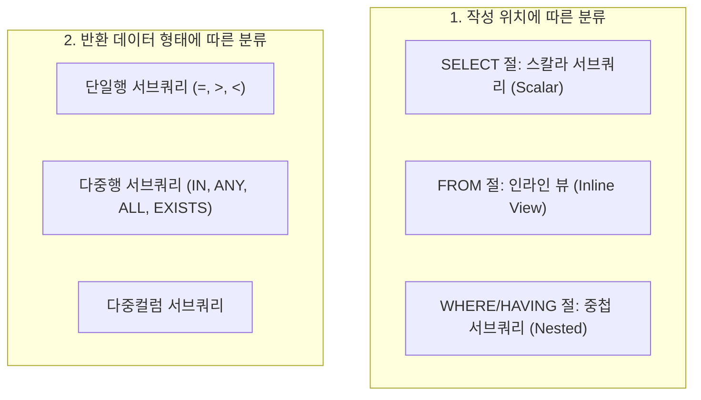
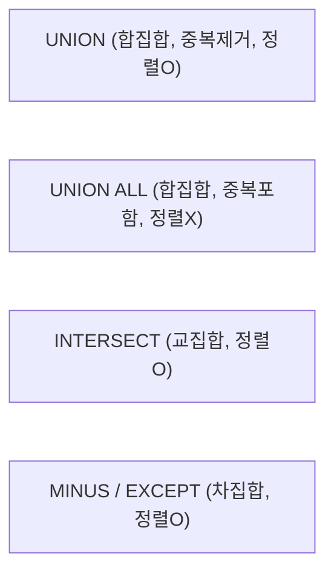

---
layout: post
title: "[SQLD 2024] 05. 제2과목 SQL 활용 - 서브쿼리, 집합연산자, 그룹함수"
date: 2026-09-30
categories: [SQLD]
tags: [SQLD, 제2과목, 서브쿼리, 인라인뷰, 스칼라서브쿼리, 집합연산자, ROLLUP, CUBE]
---
> **출제 비중**: 제2과목 40문항 중 약 6~8문항 출제 (계산 및 결과 행 수 맞추기 빈출!)  
> **핵심 키워드**: 스칼라 서브쿼리, 인라인 뷰, 다중행 연산자(ANY, ALL, EXISTS), NOT IN의 NULL 함정, UNION vs UNION ALL, ROLLUP vs CUBE 차이, GROUPING 함수

---

## 1. 서브쿼리 (Subquery) 의 분류 체계

서브쿼리는 메인 쿼리를 보조하는 하위 쿼리로, 반드시 소괄호 `()`로 감싸서 작성합니다.



---

## 2. 위치에 따른 서브쿼리 특징

### 1) 스칼라 서브쿼리 (Scalar Subquery) - SELECT 절
- **단 1개의 행과 1개의 열(1행 1열)**만 반환해야 합니다. (2개 이상의 행 반환 시 런타임 에러 발생)
- 메인쿼리의 행 수만큼 반복 수행되므로 일종의 `OUTER JOIN`처럼 동작합니다.
```sql
SELECT E.EMPNO, E.ENAME,
       (SELECT D.DNAME FROM DEPT D WHERE D.DEPTNO = E.DEPTNO) AS DNAME
FROM EMP E;
```

### 2) 인라인 뷰 (Inline View) - FROM 절
- SQL 실행 시점에 메모리 상에서 동적으로 생성되는 가상 테이블입니다.
- 인라인 뷰 내부에서 정의한 컬럼 별칭(Alias)을 메인쿼리에서 테이블 컬럼처럼 사용할 수 있습니다.
```sql
SELECT V.DEPTNO, V.AVG_SAL
FROM (SELECT DEPTNO, AVG(SAL) AS AVG_SAL FROM EMP GROUP BY DEPTNO) V
WHERE V.AVG_SAL >= 2500;
```

---

## 3. 다중행 서브쿼리 연산자 (시험 단골! ⭐⭐⭐)

서브쿼리의 결과가 2건 이상 반환될 가능성이 있다면 반드시 다중행 연산자를 사용해야 합니다.

| 연산자 | 문법 예시 | 설명 및 판정 조건 |
| :--- | :--- | :--- |
| **`IN`** | `SAL IN (SELECT ...)` | 서브쿼리 반환 값 중 **하나라도 일치**하면 참 |
| **`> ANY`** | `SAL > ANY (100, 200)` | 목록 중 **최소값(100)보다 크면** 참 |
| **`< ANY`** | `SAL < ANY (100, 200)` | 목록 중 **최대값(200)보다 작으면** 참 |
| **`> ALL`** | `SAL > ALL (100, 200)` | 목록의 모든 값보다 커야 하므로 **최대값(200)보다 크면** 참 |
| **`< ALL`** | `SAL < ALL (100, 200)` | 목록의 모든 값보다 작아야 하므로 **최소값(100)보다 작으면** 참 |
| **`EXISTS`** | `WHERE EXISTS (SELECT 1 ...)` | 서브쿼리의 조건을 만족하는 행이 **단 1건이라도 존재하면** 참 (성능 최적화) |

> 🚨 **초특급 함정: `NOT IN` 과 NULL**  
> 만약 서브쿼리 결과에 **`NULL` 값이 단 1개라도 포함**되어 있다면, `NOT IN` 조건은 `UNKNOWN`으로 평가되어 **전체 메인 쿼리 결과가 0건(공집합)**이 되어버립니다!  
> 반드시 서브쿼리에 `WHERE 컬럼 IS NOT NULL` 조건을 걸거나 `NOT EXISTS`를 사용하는 것이 안전합니다.

---

## 4. 집합 연산자 (Set Operators)

여러 개의 SELECT 문 결과를 하나로 병합하는 연산자입니다.



### 📋 집합 연산자 비교 요약표
| 연산자 | 수학적 의미 | 중복 행 처리 | 정렬 발생 여부 | 성능 비교 |
| :--- | :--- | :--- | :--- | :--- |
| **`UNION`** | 합집합 | **중복 제거** | 정렬(Sort) 발생 | 보통 |
| **`UNION ALL`** | 합집합 | **중복 그대로 유지** | **정렬 안 함** | **가장 빠름 (최우선 고려)** |
| **`INTERSECT`** | 교집합 | 중복 제거 | 정렬(Sort) 발생 | 보통 |
| **`MINUS / EXCEPT`** | 차집합 | 중복 제거 | 정렬(Sort) 발생 | 보통 (Oracle: MINUS, SQL Server: EXCEPT) |

> 💡 **집합 연산자 필수 작성 규칙**:  
> 1. 개별 SELECT 절의 **컬럼 수와 데이터 타입이 서로 일치**해야 합니다. (컬럼 이름은 달라도 무관하며, 첫 번째 쿼리의 컬럼명이 최종 출력됩니다.)  
> 2. `ORDER BY` 절은 **가장 마지막 SELECT 문의 끝에 단 한 번만 기술**할 수 있습니다.

---

## 5. 그룹 함수 (Group Functions): ROLLUP vs CUBE vs GROUPING SETS

데이터 분석 시 계층적인 소계(Subtotal)와 총계(Grand Total)를 생성하는 고급 집계 함수입니다.

### 1) ROLLUP (계층형 소계 생성)
- 주어진 인수의 **왼쪽부터 오른쪽 순서대로 계층적 소계**를 생성합니다.
- 인수 개수가 $N$개일 때, 생성되는 그룹핑 레벨은 **$N + 1$개**입니다.
```sql
SELECT DNAME, JOB, SUM(SAL)
FROM EMP E, DEPT D
WHERE E.DEPTNO = D.DEPTNO
GROUP BY ROLLUP (DNAME, JOB);
-- 집계 단계 (총 3단계):
-- 1단계: (DNAME, JOB)별 합계
-- 2단계: (DNAME)별 소계
-- 3단계: () 전체 총계
```
> ⚠️ **인수 순서 주의**: `ROLLUP(A, B)`와 `ROLLUP(B, A)`는 **소계의 기준이 달라져 완전히 다른 결과**가 나옵니다!

### 2) CUBE (모든 조합의 소계 생성)
- 결합 가능한 **모든 다차원 조합의 소계 및 총계**를 산출합니다.
- 인수 개수가 $N$개일 때, 생성되는 그룹핑 레벨은 **$2^N$개**입니다.
```sql
SELECT DNAME, JOB, SUM(SAL)
FROM EMP E, DEPT D
WHERE E.DEPTNO = D.DEPTNO
GROUP BY CUBE (DNAME, JOB);
-- 집계 단계 (총 4단계): (DNAME, JOB), (DNAME), (JOB), () 전체 총계
```

### 3) GROUPING SETS (평면적 개별 집계)
- 계층 관계없이 **사용자가 명시한 개별 컬럼 그룹별 집계 결과만 결합**합니다.
```sql
GROUP BY GROUPING SETS (DNAME, JOB);
-- (DNAME)별 집계와 (JOB)별 집계만 각각 생성 (총계나 복합 소계 없음)
```

---

## 6. GROUPING 함수 & GROUPING_ID

소계/총계로 인해 생성된 가상의 집계 행(NULL로 표시되는 행)을 식별하기 위한 함수입니다.

```sql
SELECT 
    CASE WHEN GROUPING(DNAME) = 1 THEN '전체부서' ELSE DNAME END AS DNAME,
    CASE WHEN GROUPING(JOB) = 1 THEN '소계' ELSE JOB END AS JOB,
    SUM(SAL) AS TOTAL_SAL
FROM EMP
GROUP BY ROLLUP (DNAME, JOB);
```
- **`GROUPING(컬럼) = 1`**: ROLLUP/CUBE에 의해 **소계/총계로 생성된 행** (값 채우기용)
- **`GROUPING(컬럼) = 0`**: 원본 데이터에서 집계된 실제 행
