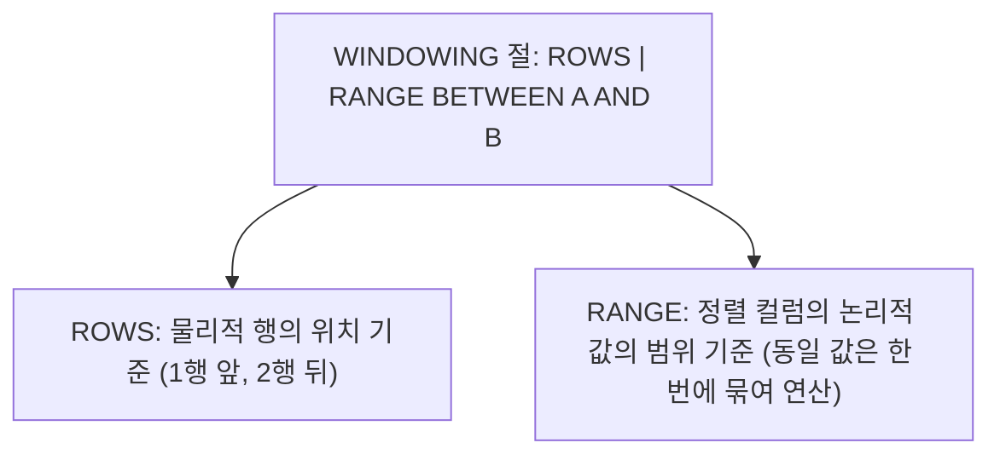

> **출제 비중**: 제2과목 40문항 중 약 8~10문항 출제 (2024년 최신 개정 집중 출제 파트!)  
> **핵심 키워드**: RANK 3형제 차이, 윈도우 프레임(ROWS vs RANGE), LAG/LEAD, ROWNUM과 FETCH 절, 계층형 쿼리(PRIOR 방향), PIVOT vs UNPIVOT, 정규식 함수

---

## 1. 윈도우 함수 (Window Functions) 구조와 순위 함수

### 📌 기본 문법
```sql
SELECT 컬럼명,
       함수명(인자) OVER (
           [PARTITION BY 컬럼]      -- 그룹화 기준 (GROUP BY와 유사하나 행을 합치지 않음)
           [ORDER BY 컬럼]          -- 파티션 내부 정렬 기준
           [ROWS | RANGE BETWEEN ...] -- 윈도우 프레임 연산 범위
       ) AS 별칭
FROM 테이블명;
```

### 🥇 순위 함수 3총사 비교 (시험 필수! ⭐⭐⭐⭐⭐)
급여가 `[3000, 3000, 2000, 1000]` 일 때:

| 함수명 | 순위 부여 방식 | 결과 예시 | 특징 및 비고 |
| :--- | :--- | :--- | :--- |
| **`RANK()`** | 동일한 값에 같은 순위를 부여하고, **다음 순위는 건너뜀** | **1, 1, 3, 4** | 2위가 생략됨 |
| **`DENSE_RANK()`** | 동일한 값에 같은 순위를 부여하되, **다음 순위를 건너뛰지 않음** | **1, 1, 2, 3** | 순위가 빽빽하게 이어짐 |
| **`ROW_NUMBER()`** | 동일한 값이라도 정렬 순서대로 **고유한 일련번호를 순차 부여** | **1, 2, 3, 4** | 중복 없는 고유 순위 |

---

## 2. 윈도우 연산 범위 (ROWS vs RANGE 프레임)

집계 대상이 되는 행의 범위를 세밀하게 지정할 때 사용합니다.



### 🧭 주요 프레임 키워드
- `UNBOUNDED PRECEDING`: 파티션의 첫 번째 행 (맨 처음부터)
- `UNBOUNDED FOLLOWING`: 파티션의 마지막 행 (맨 끝까지)
- `CURRENT ROW`: 현재 행
- `n PRECEDING` / `n FOLLOWING`: 현재 행 기준 $n$개 앞 행 / $n$개 뒤 행

```sql
-- 처음부터 현재 사원의 급여까지 누적 합계 구하기
SELECT ENAME, SAL,
       SUM(SAL) OVER (
           ORDER BY SAL 
           ROWS BETWEEN UNBOUNDED PRECEDING AND CURRENT ROW
       ) AS 누적급여
FROM EMP;
```

---

## 3. 행 순서 & 비율 함수

### 🔄 행 순서 함수
- **`LAG(컬럼, n, [기본값])`**: 현재 행 기준 **이전 $n$번째 행의 값** 조회 (과거 데이터 비교)
- **`LEAD(컬럼, n, [기본값])`**: 현재 행 기준 **다음 $n$번째 행의 값** 조회 (미래 데이터 비교)
- **`FIRST_VALUE(컬럼)`**: 파티션별 첫 번째 행의 값 반환
- **`LAST_VALUE(컬럼)`**: 파티션별 마지막 행의 값 반환
  - ⚠️ **주의**: `ORDER BY` 사용 시 기본 프레임이 `CURRENT ROW`까지이므로 전체의 마지막 값을 보려면 `RANGE BETWEEN CURRENT ROW AND UNBOUNDED FOLLOWING` 명시 필요!

### 📊 비율 관련 함수
- **`RATIO_TO_REPORT(컬럼)`**: 파티션 내 전체 합계에서 현재 행이 차지하는 **백분율 비율 **($0 \sim 1$) 반환
- **`PERCENT_RANK()`**: 파티션 내 순위 백분율 ($0 \sim 1$, 첫 번째 행은 0, 마지막 행은 1)
- **`CUME_DIST()`**: 파티션 내 현재 행보다 작거나 같은 행의 누적 백분율 ($0$ 초과 $\sim 1$)
- **`NTILE(n)`**: 전체 데이터를 $n$개의 버킷(등급)으로 균등하게 1/n 분할

---

## 4. TOP N 쿼리 & FETCH 절

### 1) Oracle `ROWNUM` 주의사항 (오답률 80%!)
- `ROWNUM`은 행이 반환되는 순간 1번부터 순차적으로 부여되는 가상 컬럼(Pseudo Column)입니다.
```sql
-- ❌ 오답: 아무 결과도 나오지 않음 (0건 반환!)
SELECT * FROM EMP WHERE ROWNUM = 2;
SELECT * FROM EMP WHERE ROWNUM > 3;

-- ❌ 오답: 급여 상위 3명이 아니라 무작위 3명을 뽑아서 정렬함 (WHERE가 ORDER BY보다 먼저 실행!)
SELECT * FROM EMP WHERE ROWNUM <= 3 ORDER BY SAL DESC;

-- ⭕ 정답: 반드시 인라인 뷰(서브쿼리)를 사용하여 먼저 정렬한 후 ROWNUM 필터링!
SELECT *
FROM (SELECT * FROM EMP ORDER BY SAL DESC)
WHERE ROWNUM <= 3;
```

### 2) ANSI 표준 `OFFSET ... FETCH` 절 (Oracle 12c+ 지원)
```sql
SELECT EMPNO, ENAME, SAL
FROM EMP
ORDER BY SAL DESC
OFFSET 0 ROWS               -- 건너뛸 행 수 (0이면 처음부터)
FETCH FIRST 3 ROWS ONLY;    -- 상위 3개 행만 출력 (WITH TIES 옵션 시 동순위 포함)
```

---

## 5. 계층형 질의 (Hierarchical Query)

조직도, 카테고리 트리 등 하나의 테이블 안에서 상하 계층 관계를 갖는 데이터를 조회합니다.

```sql
SELECT LEVEL,
       LPAD(' ', (LEVEL - 1) * 2) || ENAME AS 사원명,
       SYS_CONNECT_BY_PATH(ENAME, '/') AS 경로
FROM EMP
START WITH MGR IS NULL                -- 1) 시작점: 최상위 관리자(루트 노드)
CONNECT BY PRIOR EMPNO = MGR          -- 2) 전개 방향: 직전의 사원번호 = 관리자번호 (순방향 전개)
ORDER SIBLINGS BY ENAME;              -- 3) 계층 구조를 깨지 않고 형제 노드끼리만 정렬
```

> 💡 **순방향 vs 역방향 완벽 구분법**:  
> - `PRIOR 자식 = 부모` $\implies$ **역방향 전개** (하위 $\r\rightarrow$ 상위, 부하직원에서 사장님으로)  
> - `PRIOR 부모 = 자식` $\implies$ **순방향 전개** (상위 $\r\rightarrow$ 하위, 사장님에서 말단 사원으로)

### 🏷️ 계층형 질의 가상 컬럼 & 함수
- **`LEVEL`**: 루트(1)부터 시작하는 깊이 레벨
- **`CONNECT_BY_ISLEAF`**: 자식이 없는 최하위 노드(Leaf)이면 1, 아니면 0
- **`CONNECT_BY_ISCYCLE`**: 순환 참조 루프가 발생하면 1, 아니면 0
- **`SYS_CONNECT_BY_PATH(컬럼, 구분자)`**: 루트부터 현재 노드까지의 계층 경로 문자열 생성

---

## 6. PIVOT & UNPIVOT 절 (2024 개정 신규 출제! ⭐⭐⭐)

데이터의 행(Row)과 열(Column) 형태를 서로 전환하는 데이터 재구조화 기능입니다.


### 1) PIVOT (행 $\r\rightarrow$ 열 변환)
부서별 직무별 급여 합계를 직무(CLERK, MANAGER, ANALYST)를 컬럼으로 올려서 조회:
```sql
SELECT *
FROM (SELECT DEPTNO, JOB, SAL FROM EMP)
PIVOT (
    SUM(SAL) 
    FOR JOB IN ('CLERK' AS 사원, 'MANAGER' AS 관리자, 'ANALYST' AS 분석가)
);
```

### 2) UNPIVOT (열 $\r\rightarrow$ 행 변환)
가로로 나열된 여러 컬럼을 세로 행 데이터로 내리기:
```sql
SELECT DEPTNO, 직무, 급여
FROM PIVOT_RESULT_TABLE
UNPIVOT (
    급여 FOR 직무 IN (사원, 관리자, 분석가)
);
```

---

## 7. 정규 표현식 (Regular Expression) (2024 개정 신규! ⭐⭐⭐)

복잡한 문자열 패턴을 유연하게 검색, 치환, 추출할 수 있는 고급 함수군입니다.

| 함수명 | 설명 | 예시 |
| :--- | :--- | :--- |
| **`REGEXP_LIKE(src, pattern)`** | 정규식 패턴과 일치하는지 검사 (`WHERE` 절에서 주로 사용) | `WHERE REGEXP_LIKE(PHONE, '^010-\d{4}-\d{4}$')` |
| **`REGEXP_SUBSTR(src, pattern)`** | 정규식 패턴에 매칭되는 부분 문자열 추출 | `REGEXP_SUBSTR('ABC-1234', '\d+')` → `'1234'` |
| **`REGEXP_REPLACE(src, pat, rep)`** | 일치하는 패턴을 다른 문자열로 치환 | `REGEXP_REPLACE('010.1234.5678', '\.', '-')` |
| **`REGEXP_INSTR(src, pattern)`** | 일치하는 패턴이 처음 등장하는 위치(인덱스) 반환 | `REGEXP_INSTR('ABC123', '\d')` → `4` |
| **`REGEXP_COUNT(src, pattern)`** | 일치하는 패턴의 출현 빈도 횟수 반환 | `REGEXP_COUNT('BANANA', 'A')` → `3` |

### 🔣 핵심 정규식 메타문자
- `^`: 문자열의 시작 (`^A`: A로 시작)
- `$`: 문자열의 끝 (`Z$`: Z로 끝남)
- `\d`: 숫자 1개 (`[0-9]`와 동일)
- `\D`: 숫자가 아닌 문자 1개
- `+`: 1회 이상 반복
- `*`: 0회 이상 반복
- `?`: 0회 또는 1회
- `[A-Z]`: 대문자 알파벳 1개
