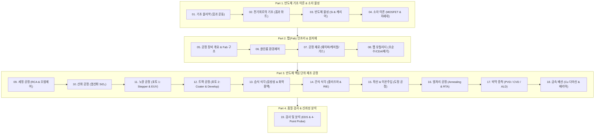

> **시리즈 안내**: 본 블로그 시리즈는 반도체 제조의 기초 물리/회로 이론부터 소자 물성, 팹(Fab) 환경 및 유틸리티, 그리고 핵심 8대 단위 제조 공정과 차세대 나노 소자 기술까지 체계적으로 정리한 프리미엄 학습 가이드입니다.

---

## 📌 전체 커리큘럼 로드맵 (19 Chapters)

반도체 칩(IC)은 단순히 하나의 기술이 아니라 **물리학, 화학, 재료공학, 전자공학, 기계/로봇 제어 기술의 집합체**입니다. 본 시리즈는 19개의 원본 수업 교재를 바탕으로 아래와 같이 4개의 대단원, 총 19개 챕터로 재구성되었습니다.

---

## 📚 챕터별 상세 목차 및 바로가기

### [Part 1] 기초 과학 및 반도체 소자 이론 (Foundation)
반도체 제조 기술을 지탱하는 기본 물리 법칙과 전자회로, 반도체 결정 물성 및 트랜지스터 동작 원리를 다룹니다.
* **[01강. 물리학의 기초: 직선에서의 힘과 운동](/반도체제조공정-01-물리학의-기초-운동과-힘.html)**
  * 위치, 변위, 속도와 속력의 차이, 가속도
  * 뉴턴의 운동 제2법칙($F=ma$)과 정적 평형, 알짜힘
* **[02강. 전기회로의 기초: 옴의 법칙과 전력](/반도체제조공정-02-전기회로의-기초-옴의법칙과-전력.html)**
  * 전압(V), 전류(I), 저항(R)의 본질적 의미
  * 옴의 법칙($V=IR$)과 와트의 법칙($P=VI=I^2R$), 전력량 계산
* **[03강. 반도체 물성의 기초: 실리콘과 캐리어 이론](/반도체제조공정-03-반도체-물성의-기초-실리콘과-캐리어.html)**
  * 도체, 부도체, 반도체의 에너지 밴드갭 구분
  * Si의 공유결합, 진성 반도체와 외인성 반도체 (3족 억셉터 p형 vs 5족 도너 n형)
  * 캐리어 드리프트(전기장)와 확산(농도차), PN 접합 다이오드
* **[04강. 반도체 소자 이론 심화: MOSFET 동작 원리와 차세대 소자](/반도체제조공정-04-반도체-소자이론-mosfet-원리와-차세대소자.html)**
  * 진공관에서 BJT, MOSFET으로의 진화
  * MOSFET 동작 메커니즘 (수도꼭지 비유, 문턱전압 $V_{th}$, 채널 반전)
  * 미세화 한계 극복: High-k/Metal Gate, FinFET(3D), GAA(나노시트), 차세대 Post-CMOS(TFET, NCFET)

---

### [Part 2] 반도체 팹(Fab) 제조 인프라 & 핵심 원자재
먼지 한 톨도 허용되지 않는 첨단 반도체 공장이 어떻게 유지되고 원자재가 공급되는지 살펴봅니다.
* **[05강. 반도체 제조 공정 개요와 팹(Fab) 장비 시스템](/반도체제조공정-05-반도체-제조공정-개요와-8대공정-로드맵.html)**
  * 반도체 3대 원재료 (웨이퍼, 마스크, 리드프레임)
  * 제조 8대 공정 흐름 및 전공정(Front-end)/후공정(Back-end)
  * 공정 장비의 5대 핵심 모듈 (EFEM, 진공 트랜스퍼, 프로세스 챔버, 전원/제어 랙, 펌프/스크러버)
  * 팹의 층별 구성 (Cleanroom, Sub-Fab, Plenum)
* **[06강. 반도체 클린룸(Cleanroom) 환경 제어와 청정 관리](/반도체제조공정-06-클린룸-환경제어와-오염관리-원칙.html)**
  * 클린룸의 정의 및 Class 규격 (Class 1 ~ Class 1000)
  * 클린룸 관리의 4원칙 + 1원칙
  * 공조 필터 시스템 (HEPA/ULPA, FFU, BFU)
  * 방진복 착용 순서 및 에어샤워, 클린룸 내 행동 수칙
* **[07강. 반도체 핵심 공정 재료: 실리콘 웨이퍼, 케미컬, 특수가스](/반도체제조공정-07-반도체-핵심재료-실리콘웨이퍼와-케미컬-특수가스.html)**
  * 규석에서 웨이퍼까지 (MG-Si, 폴리실리콘, Cz법 단결정 잉곳, 래핑, CMP)
  * 웨이퍼 규격 (200mm vs 300mm), 결정면(100/111), 노치(Notch)
  * 반도체 케미컬 (산, 염기, 유기용제, 특히 불산 HF의 위험성)
  * 반도체 특수가스 6대 분류 (불연성, 가연성, 산화성, 독성 TLV, 부식성, 자연발화성)
* **[08강. 반도체 팹 유틸리티: 초순수, CDA, 냉각수, 배기 시스템](/반도체제조공정-08-팹-유틸리티-인프라-초순수-cda-배기-모니터링.html)**
  * 초순수(DI Water) 제조 공정 (RO 역삼투압, UV 살균, MBD 이온교환, 18.2 MΩ·cm)
  * 청정압축공기(CDA) 및 공정냉각수(PCW) 순환계통
  * 고순도 질소(GN2/PN2 Purifier) 및 배수/폐수 처리
  * 산배기(Wet Scrubber), 유기/열 배기, 중앙 FMS 모니터링

---

### [Part 3] 반도체 핵심 단위 제조 공정 (Unit Processes)
실제 웨이퍼 위에 미세 회로를 깎고 쌓아 올리는 핵심 단위 공정 10가지를 완벽 해부합니다.
* **[09강. 세정 공정 (Cleaning): 표면 오염 제어와 RCA 세정](/반도체제조공정-09-세정-공정-rca세정과-표면오염-제어.html)**
  * 4대 오염물 (파티클, 유기물, 금속이온, 자연산화막)
  * RCA 표준 습식 세정법 (SPM Piranha, SC-1, SC-2, DHF)
  * QDR(Quick Drain Rinse) 린스와 HAD 건조 메커니즘, Wet Station 설비
* **[10강. 산화 공정 (Oxidation): 열산화와 실리콘 산화막(SiO₂)](/반도체제조공정-10-산화-공정-열산화-건식습식과-절연막형성.html)**
  * 실리콘 열산화(Thermal Oxidation)의 원리와 $SiO_2$ 용도 (Gate, STI, Mask)
  * 건식 산화(Dry) vs 습식 산화(Wet)의 반응식 및 막질/성장속도 비교
  * Deal-Grove 산화 속도 모델 (선형 영역 vs 포물선 영역)
  * Oxidation Furnace 장비 구성 및 스크러버 안전 인터록
* **[11강. 노광 공정 (Exposure): 빛으로 그리는 미세 회로와 EUV](/반도체제조공정-11-노광-공정-포토리소그래피와-차세대-euv.html)**
  * 포토공정의 위상 (비용 35%, 시간 60%)
  * 노광 방식의 발전: Contact/Proximity $\rightarrow$ Stepper $\rightarrow$ Scanner
  * 광원의 진화: g/i-line $\rightarrow$ KrF $\rightarrow$ ArF $\rightarrow$ ArFi 액침 $\rightarrow$ EUV(13.5nm)
  * 레일리 해상도 공식($R=k_1\lambda/NA$), 초점심도($DOF$), 포토마스크 및 광학계
* **[12강. 트랙 공정 (Track): 감광액 도포부터 현상 검사까지](/반도체제조공정-12-트랙-공정-hmds-pr코팅-베이크-현상검사.html)**
  * 인라인 트랙(Coater-Developer) 일관 공정 플로우
  * HMDS 프라이밍(접착력 개선) $\rightarrow$ PR 스핀 코팅 (rpm vs 두께, EBR)
  * Soft Bake $\rightarrow$ 노광 $\rightarrow$ PEB(정재파 제거) $\rightarrow$ 현상(Development) $\rightarrow$ Hard Bake
  * ADI 현상 후 검사: Over/Under Develop 결함, CD 및 오버레이 측정
* **[13강. 습식 식각 (Wet Etch): 화학 반응과 등방성 식각](/반도체제조공정-13-습식-식각-등방성식각과-선택비-언더컷.html)**
  * 식각 공정 정의 및 3대 핵심 지표 (식각률, 균일도, 선택비)
  * 등방성(Isotropic) 식각 프로파일과 언더컷(Undercut) 현상
  * 주요 식각 용액 화학 반응 (Si 질산+불산, $SiO_2$ DHF/BOE, 질화막 인산)
* **[14강. 건식 식각 (Dry Etch): 플라즈마 원리와 반응성 이온 식각(RIE)](/반도체제조공정-14-건식-식각-플라즈마원리와-이방성-rie식각.html)**
  * 플라즈마의 정의와 RF 글로우 방전 메커니즘 (전자, 이온, 활성 라디칼)
  * 건식 식각 3대 방식: 물리적 스퍼터 식각 vs 화학적 식각 vs RIE
  * 고밀도 플라즈마 장치 (ICP-RIE / TCP)
  * 건식 식각기 장비 구성 (진공챔버, RF Generator, 임피던스 매처, 쓰로틀 밸브)
* **[15강. 도핑 공정: 열확산(Diffusion)과 이온주입(Ion Implantation)](/반도체제조공정-15-도핑-공정-열확산과-이온주입기술-비교.html)**
  * 반도체 도핑의 목적과 도판트 (3족 붕소 B, 5족 인 P / 비소 As)
  * 열확산($POCl_3$ 전구체 기상 반응, 고온로)과 그 한계점
  * 이온주입(Ion Implantation) 기술의 원리 및 5대 구성 유닛
  * 열확산 vs 이온주입 장단점 종합 비교
* **[16강. 열처리 공정 (Annealing): 격자 결함 복원과 급속 열처리(RTA)](/반도체제조공정-16-열처리-공정-어닐링-furnace와-rta-도판트활성화.html)**
  * 이온주입 후 발생하는 결정 격자 손상(Damage)과 도판트 비활성화
  * 어닐링의 2대 목적: 결정성 회복(Regrowth) 및 도판트 활성화(Activation)
  * 전기로(Furnace) 어닐링 vs 급속 열처리(RTA: Rapid Thermal Annealing)
  * RTA 장비 구성: 할로겐 램프 가열, 파이로미터/열전대 온도제어, 안전 인터록
* **[17강. 박막 증착 공정 (Thin Film): PVD, CVD, ALD와 PECVD 시스템](/반도체제조공정-17-박막-증착-pvd-cvd-ald와-pecvd장비구조.html)**
  * 박막($<1000\text{Å}$)의 역할과 증착 기술 분류 (PVD vs CVD vs ALD)
  * CVD 표면 반응 메커니즘 5단계 및 압력별 분류 (APCVD, LPCVD, PECVD)
  * 원자층 증착(ALD)의 자기제한적 표면반응과 완벽한 단차피복성(Step Coverage)
  * PECVD 장비 핵심 유닛 상세 (진공챔버, RF/매처, APC 쓰로틀밸브, Baratron 게이지, MFC)
* **[18강. 금속 배선 공정 (Metallization): Al 배선에서 Cu 다마신 공정까지](/반도체제조공정-18-금속-배선-al에서-cu다마신공정과-배리어메탈.html)**
  * 금속 배선(Interconnect)의 역할과 도체 재료 요구조건
  * 알루미늄(Al) 배선의 한계: 정션 스파이킹(Spiking)과 일렉트로마이그레이션(EM)
  * 구리(Cu) 배선의 도입과 식각 불가 극복: 다마신(Damascene) & 듀얼 다마신 공정
  * 구리 확산 방지 배리어 메탈(Ti/TiN, Ta/TaN) 및 저유전율(Low-k) 절연막
  * 금속 증착 장비 (PVD Sputtering & Thermal Evaporation)
---

### [Part 4] 반도체 품질 검사 및 신뢰성 분석
완성된 칩이 정상 동작하는지 테스트하고, 결함을 분석하여 수율을 끌어올리는 기술입니다.
* **[19강. 반도체 검사 및 신뢰성 분석: EDS 테스트와 불량 분석 기법](/반도체제조공정-19-검사-및-분석-공정-eds-4포인트프로브-번인시험.html)**
  * 반도체 수율(Yield)의 경제성과 EDS(Electrical Die Sorting) 테스트
  * 프로브 카드(Probe Card)와 프로버 스테이션 동작 원리
  * 4-Point Probe를 이용한 박막 면저항($R_s, \Omega/\square$) 측정 원리와 보정계수($F$)
  * 광학현미경 검사: 현상/식각 불량(Under/Over Develop, Bridge, Necking) 패턴 분석
  * 신뢰성 가속 시험: 번인 테스트(Burn-in Test) 및 고온 작동 수명 시험(HTOL)
  * 불량 분석 핵심 분석 장비 (SEM, TEM, FIB, AFM)

---

## 🎯 본 블로그 시리즈의 특징 및 활용법

1. **체계적인 학습 흐름**: 기초 물리/전기 회로부터 시작하여 소자, 공정, 장비, 검사까지 물 흐르듯 이어집니다.
2. **현장 엔지니어링 지식**: 실제 반도체 팹(Fab)에서 사용되는 장비 부품 명칭, 제어 파라미터(MFC, APC, Baratron, RF 등), 결함 대책을 상세히 다룹니다.
3. **핵심 개념 점검 & 실무 Q&A**: 각 챕터 하단에 **"핵심 개념 점검 & 실무 Q&A"**를 수록하여 공정 및 장비 제어의 핵심 원리를 확실하게 점검하고 복습할 수 있도록 구성했습니다.

> 오른쪽 또는 상단의 목차 링크를 클릭하여 **[01강. 물리학의 기초: 직선에서의 힘과 운동](/반도체제조공정-01-물리학의-기초-운동과-힘.html)**부터 학습을 시작해보세요!
