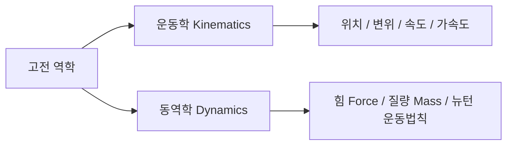
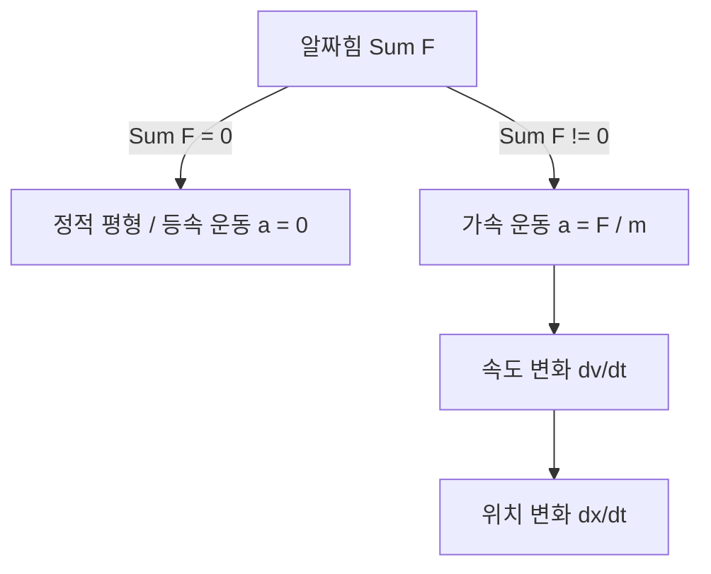

> **카테고리**: Part 1. 반도체 기초 이론 & 소자 물성  
> **태그**: #반도체물리 #역학 #뉴턴의법칙 #변위 #속도 #가속도 #알짜힘 #공정엔지니어링  
> **추천 독자**: 반도체 장비 제어 및 설비 엔지니어를 지망하는 학생 및 취업준비생

---

> 💡 **핵심 요약 (3줄 정리)**  
> 1. **운동학(Kinematics)**은 물체의 위치, 변위, 속도, 가속도를 기술하며, **동역학(Dynamics)**은 운동의 원인이 되는 '힘'과의 관계를 규명합니다.  
> 2. **변위**($\Delta \vec{r}$)는 출발점과 도착점을 잇는 최단 벡터이며, **속도(Velocity)**는 변위의 시간에 따른 변화율로 방향을 갖는 벡터량입니다.  
> 3. 반도체 로봇 및 정밀 웨이퍼 스테이지 제어의 핵심은 **뉴턴의 제2법칙**($\Sigma \vec{F} = m\vec{a}$)에 따른 가감속 제어와 정적 평형 상태($\Sigma \vec{F} = 0$)의 이해입니다.  

---

## 1. 운동학(Kinematics) vs 동역학(Dynamics)

반도체 팹(Fab) 내에서 웨이퍼를 나노미터 단위의 정밀도로 이동시키는 로봇 암(Robot Arm)과 노광 장비 스테이지(Wafer Stage)의 구동을 이해하기 위해서는 고전역학의 기본 개념이 필수적입니다.

* **운동학 (Kinematics)**: 물체가 '왜' 움직이는지는 고려하지 않고, 물체의 **위치(Position), 변위(Displacement), 속도(Velocity), 가속도(Acceleration)** 간의 수학적 관계만을 다룹니다.
* **동역학 (Dynamics)**: 물체의 운동과 그 원인이 되는 **힘(Force)** 및 **질량(Mass)**의 상호작용(뉴턴의 운동법칙)을 다룹니다.

---

## 2. 위치(Position)와 변위(Displacement)

### (1) 위치 (Position, $\vec{r}$)
* 공간 상에서 기준점(원점, Origin)으로부터의 **거리**와 **방향**을 나타내는 벡터(Vector) 물리량입니다.
* 기준점이 달라지면 위치 좌표도 달라집니다.

### (2) 변위 (Displacement, $\Delta \vec{r}$)

  
*▲ [그림 1-1] 기준점으로부터의 위치와 변위(위치의 변화량) 좌표계 (출처: 물리학의 기초 Chap 3)*

* 물체의 **위치 변화량**을 의미하며, 이동 경로와 무관하게 **'최종 위치 $-$ 초기 위치'**로 정의되는 벡터량입니다.

$$\Delta \vec{r} = \vec{r}_f - \vec{r}_0$$

> **💡 예제 (교재 수록 Example 3.1 & Problem 3.1)**  
> * 기차가 기준점(철교)으로부터 동쪽으로 $3\text{km}$ 떨어진 지점($\vec{r}_0 = +3\text{km}$)에서 출발하여, 서쪽 방향으로 $7\text{km}$를 이동하여 $\vec{r}_f$에 도달했다.  
> * 최종 위치: $\vec{r}_f = +3\text{km} - 7\text{km} = -4\text{km}$ (철교 서쪽 $4\text{km}$)  
> * 변위: $\Delta \vec{r} = \vec{r}_f - \vec{r}_0 = -4\text{km} - (+3\text{km}) = -7\text{km}$ (서쪽으로 $7\text{km}$)

---

## 3. 속도(Velocity)와 속력(Speed)의 본질적 차이

반도체 장비 제어에서는 단순히 '빠른 정도'뿐 아니라 '어느 방향으로 움직이는가'가 치명적으로 중요합니다.

| 구분 | 속도 (Velocity, $\vec{v}$) | 속력 (Speed, $v$) |
| :--- | :--- | :--- |
| **물리량의 성질** | **벡터 (Vector)** : 크기 + 방향 | **스칼라 (Scalar)** : 크기만 존재 |
| **수학적 정의** | 단위 시간당 변위 ($\frac{\Delta \vec{r}}{\Delta t}$) | 단위 시간당 총 이동거리 ($\frac{s}{\Delta t}$) |
| **부호** | 방향에 따라 $(+)$ 또는 $(-)$ 가능 | 항상 $0$ 이상 ($v \ge 0$) |
| **설비 적용** | 웨이퍼 이송 로봇의 방향 벡터 제어 | 모터의 단순 회전수(RPM) 등 |

  
*▲ [그림 1-3] 시간에 따른 물체의 위치 변화와 속도의 부호 관계 (출처: 물리학의 기초 Chap 3)*

  
*▲ [그림 1-4] 위치-시간 그래프에서 현의 기울기(평균속도)와 접선의 기울기(순간속도) (출처: 물리학의 기초 Chap 3)*

### 평균속도 vs 순간속도
* **평균속도 (Average Velocity)**: 전체 이동 시간 동안의 총 변위  
  $$\vec{v}_{avg} = \frac{\vec{r}_f - \vec{r}_0}{t_f - t_0} = \frac{\Delta \vec{r}}{\Delta t}$$
  * 위치-시간($x-t$) 그래프에서 **두 점을 잇는 할선(현)의 기울기**입니다.
* **순간속도 (Instantaneous Velocity)**: 특정 순간($\Delta t → 0$)에서의 속도  
  $$\vec{v} = \lim_{\Delta t → 0} \frac{\Delta \vec{r}}{\Delta t} = \frac{d\vec{r}}{dt}$$
  * 위치-시간($x-t$) 그래프에서 **그 순간 접선의 기울기**입니다.

---

## 4. 가속도(Acceleration)와 뉴턴의 제2법칙

### (1) 가속도 ($\vec{a}$)
* 단위 시간당 **속도의 변화율**입니다.

$$\vec{a}_{avg} = \frac{\Delta \vec{v}}{\Delta t}, \quad \vec{a} = \frac{d\vec{v}}{dt} = \frac{d^2\vec{r}}{dt^2} \quad [\text{m/s}^2]$$

  
*▲ [그림 1-5] 시간에 따른 속도의 변화율(가속도)과 접선 기울기 (출처: 물리학의 기초 Chap 3)*

### (2) 뉴턴의 제2법칙 (Newton's 2nd Law)
물체에 작용하는 알짜힘(Net Force, $\Sigma \vec{F}$)이 $0$이 아닐 때, 물체는 그 힘의 방향으로 가속됩니다.

$$\Sigma \vec{F} = m\vec{a}$$

* **알짜힘이 $0$인 경우 ($\Sigma \vec{F} = 0$)**: **정적 평형 상태(Static Equilibrium)** 또는 등속 직선 운동을 합니다.
* **알짜힘이 존재하는 경우 **($\Sigma \vec{F} \neq 0$): 가속도 운동을 하며, 질량 $m$이 클수록 가속시키기 위해 더 큰 힘이 필요합니다 (관성의 척도).

  
*▲ [그림 1-2] Example 3.1) 고집센 노새와 알짜힘의 평형 상태 (출처: 물리학의 기초 Chap 3)*

> **💡 교재 예제 (고집 센 노새 문제)**  
> 농부가 동쪽으로 끄는 힘 $\vec{F}_f = 320\text{N}$, 아들이 뒤에서 미는 힘 $\vec{F}_b = 110\text{N}$, 노새가 서쪽으로 버티는 힘 $\vec{F}_g = 430\text{N}$일 때:  
> $$\Sigma F_x = F_f + F_b - F_g = 320 + 110 - 430 = 0\text{N}$$  
> 따라서 알짜힘이 $0$이므로 노새는 움직이지 않는 **정적 평형 상태**를 유지합니다.

---

## 5. 반도체 장비 관점에서의 시사점

1. **웨이퍼 이송 로봇(EFEM / Transfer Robot)**:  
   * 웨이퍼를 빠르게 이송하면서도 웨이퍼가 슬립(Slip)되거나 파손되지 않도록 하기 위해서는 급격한 가속도 변화(Jerk, 가가속도)를 최소화하는 S-Curve 모션 프로파일 제어가 필수적입니다.
  
*▲ [그림 1-6] 도르래 시스템에서의 힘의 작용과 장력(T), 가속도(a) 평형 관계 (출처: 물리학의 기초 Chap 3)*

2. **도르래 및 수직 승강 기구(Elevator Unit)**:  
   * 수직 확산로(Vertical Furnace)의 보트 엘리베이터(Boat Elevator) 설계 시, 중력($mg$)과 구동 모터의 토크/장력($T$) 평형을 정밀하게 제어하여 충격 없이 웨이퍼를 챔버 내로 로딩해야 합니다.

---

## 💡 핵심 개념 점검 & 실무 Q&A

**Q1. 변위(Displacement)와 이동거리(Distance)의 차이점과 반도체 장비 제어에서의 의미는 무엇인가요?**  
* **핵심 해설**: 이동거리는 물체가 실제로 움직인 경로의 총 길이를 나타내는 스칼라량인 반면, 변위는 시작점과 끝점 사이의 최단 직선거리와 방향을 나타내는 벡터량입니다. 반도체 노광 장비나 웨이퍼 트랜스퍼 로봇의 경우, 스테이지의 누적 이동거리는 마모도 및 소모품 수명 관리에 사용되고, 정밀 위치 결정(Align)에는 기준점으로부터의 정확한 변위 벡터 제어가 활용됩니다.

**Q2. 뉴턴의 제2법칙($F=ma$)이 반도체 장비의 고속 이송 시스템에 어떻게 적용되나요?**  
* **핵심 해설**: 웨이퍼 팹의 생산성(Throughput)을 높이려면 이송 시간을 줄여야 하므로 높은 가속도($a$)가 필요합니다. 하지만 $F=ma$에 의해 높은 가속도는 로봇 핸드와 모터에 큰 관성력($F$)을 유발하며, 이는 웨이퍼의 파티클 발생이나 이탈을 초래할 수 있습니다. 따라서 정밀 제어에서는 가동부 질량 $m$을 경량화하고 최적의 가감속 궤적을 설계하는 것이 핵심입니다.

---

> **다음 글 예고**: [02강. 전기회로의 기초 - 옴의 법칙과 와트의 법칙](/반도체제조공정-02-전기회로의-기초-옴의법칙과-전력.html)  
> 전압, 전류, 저항의 상호작용과 장비 전원부 및 발열 제어의 기초 원리를 탐구합니다.
