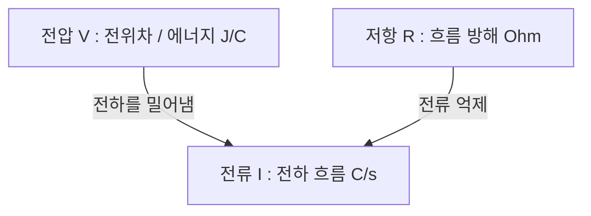

> **카테고리**: Part 1. 반도체 기초 이론 & 소자 물성  
> **태그**: #전기회로 #옴의법칙 #와트의법칙 #전압 #전류 #저항 #소비전력 #발열제어  
> **추천 독자**: 전기전자 기초를 다지고 반도체 설비 전원/히터 제어를 이해하려는 엔지니어

---

> 💡 **핵심 요약 (3줄 정리)**  
> 1. **전압**($V$)은 단위 전하당 위치에너지, **전류**($I$)는 단위 시간당 흐르는 전하량, **저항**($R$)은 전류의 흐름을 방해하는 정도입니다.  
> 2. **옴의 법칙**($V = IR$)에 의해 전류는 전압에 비례하고 저항에 반비례하며, **와트의 법칙**($P = VI = I^2R = \frac{V^2}{R}$)으로 장비의 소비 전력과 줄열(Joule heat)을 계산합니다.  
> 3. 반도체 공정 장비의 고온 히터(Furnace/RTA), 플라즈마 RF 전원, 인터록 전장 시스템 해석의 출발점이 되는 핵심 법칙입니다.  

---

## 1. 전압, 전류, 저항의 물리적 본질

전기회로를 이해하기 위한 3대 핵심 물리량의 정의와 단위는 다음과 같습니다.

  
*▲ [그림 2-1] 전위차(전압), 전하의 흐름(전류), 흐름 방해(저항)의 상호작용 (출처: 2. 전기회로의 기초)*

### (1) 전압 (Voltage, $V$)
* **정의**: 회로의 두 점 사이의 **전위차(Electric Potential Difference)**로, 단위 전하($1\text{C}$)당 갖는 전기적 에너지입니다.
* **단위**: 볼트 ($\text{V}$, $\text{J/C}$)
* 물 공급 시스템에서 물을 밀어내는 **수압(Water Pressure)**에 비유할 수 있습니다.

### (2) 전류 (Current, $I$)
* **정의**: 도선의 단면을 단위 시간($1\text{s}$) 동안 통과하는 **전하의 양**입니다.
* **단위**: 암페어 ($\text{A}$, $\text{C/sec}$)
* 파이프를 타고 흐르는 **물의 유량**에 해당합니다.

### (3) 저항 (Resistance, $R$)
* **정의**: 물질 내부에서 전하(전자)의 이동을 방해하는 정도입니다.
* **단위**: 옴 ($\Omega$, $\text{V/A}$)
* 파이프 내벽의 거칠기나 좁은 밸브에 해당합니다. 물질의 비저항($\rho$), 길이($L$), 단면적($A$)에 의해 $R = \rho \frac{L}{A}$로 결정됩니다.

---

## 2. 옴의 법칙 (Ohm's Law)

  
*▲ [그림 2-2] 전압 증가에 따른 전류와 전하 에너지의 비례 관계 (출처: 2. 전기회로의 기초)*

  
*▲ [그림 2-3] 회로 저항과 전류 흐름의 반비례 관계 (출처: 2. 전기회로의 기초)*

1826년 독일의 물리학자 옴(G. S. Ohm)이 발견한 법칙으로, 도체에 흐르는 전류는 양단에 가해진 전압에 비례하고 저항에 반비례합니다.

$$V = IR \iff I = \frac{V}{R} \iff R = \frac{V}{I}$$

* **$1\,\Omega$의 정의**: 도체 양단에 $1\text{V}$의 전압을 걸었을 때 $1\text{A}$의 전류가 흐르면, 이 도체의 저항은 $1\,\Omega$입니다.
* **비례 관계**:
  * 저항($R$)이 일정할 때: 전압($V$)이 증가하면 전류($I$)도 비례하여 증가합니다 (램프가 밝아짐).
  * 전압($V$)이 일정할 때: 저항($R$)이 증가하면 전류($I$)는 반비례하여 감소합니다.

> **💡 교재 수록 실전 계산 예제**  
> 1. $12\text{V}$ 전원에 연결된 전구의 필라멘트 저항이 $3\,\Omega$일 때 회로에 흐르는 전류는?  
>    $$I = \frac{V}{R} = \frac{12\text{V}}{3\,\Omega} = 4\text{A}$$  
> 2. 저항 $20\,\Omega$에 $0.5\text{A}$의 전류가 흐를 때 양단에 걸리는 전압 강하는?  
>    $$V = I \times R = 0.5\text{A} \times 20\,\Omega = 10\text{V}$$

---

## 3. 와트의 법칙과 전력 (Electric Power)

  
*▲ [그림 2-4] 1와트(W), 1초(s), 1볼트(V), 1쿨롱(C) 간의 에너지 변환 관계 (출처: 2. 전기회로의 기초)*

  
*▲ [그림 2-5] 옴의 법칙을 결합한 소비전력 공식 (P = VI = I²R = V²/R) (출처: 2. 전기회로의 기초)*

전기 에너지가 빛, 열, 기계적 운동 등 다른 형태의 에너지로 변환되는 비율을 **전력(Power, $P$)**이라고 합니다.

### (1) 전력의 정의와 와트의 법칙
* **정의**: 단위 시간($1\text{s}$)당 소비되거나 공급되는 전기 에너지($\text{J/s}$)입니다.
* **단위**: 와트 ($\text{W}$, $\text{J/s}$)

$$P = V \times I$$

* 옴의 법칙($V=IR$, $I=V/R$)을 결합하면 다음과 같이 변형됩니다:

$$P = VI = I^2 R = \frac{V^2}{R} \quad [\text{W}]$$

| 공식 형태 | 주 사용처 |
| :--- | :--- |
| $P = VI$ | 전원 공급 장치(Power Supply) 및 전체 시스템 소비전력 계산 |
| $P = I^2 R$ | 케이블의 줄열 손실(Joule Loss) 및 직렬 히터 발열량 계산 |
| $P = \frac{V^2}{R}$ | 정전압(220V/380V) 환경에서 병렬 히터 부하 용량 설계 |

  
*▲ [그림 2-6] 시간 경과에 따른 총 소비 전력량(W = P·t) 계산 (출처: 2. 전기회로의 기초)*

### (2) 전력량 (Electric Energy, $W$)
* 어떤 기간 동안 사용된 총 전기 에너지의 양입니다.
* **단위**: 줄($\text{J} = \text{W}\cdot\text{s}$) 또는 킬로와트시($\text{kWh}$)

$$W = P \times t = V I t \quad [\text{J}]$$

> **💡 교재 예제 (전력 및 전력량 계산)**  
> * 정격 전압 $220\text{V}$, 저항 $22\,\Omega$인 반도체 확산로(Furnace) 히터의 소비전력:  
>   $$P = \frac{V^2}{R} = \frac{220^2}{22} = 2200\text{W} = 2.2\text{kW}$$  
> * 이 히터를 10시간 동안 연속 가동했을 때 소비된 전력량:  
>   $$W = 2.2\text{kW} \times 10\text{h} = 22\text{kWh}$$

---

## 4. 반도체 장비 엔지니어링 적용 사례

1. **열처리 장비(Furnace & RTA) 히터 뱅크 설계**:  
   * $1000^\circ\text{C}$ 이상의 고온을 내기 위해 저항 발열체(SiC, Kanthal선 등)를 다단 존(Zone)으로 배치하고, $P = I^2 R$ 발열량에 따라 SCR(Silicon Controlled Rectifier) 위상 제어로 정밀 온도를 유지합니다.
2. **배선 허용 전류와 화재 예방**:  
   * 대전류가 흐르는 배선에서 도선의 내부 저항 $R_{wire}$에 의해 발생하는 $I^2 R$ 열이 절연 피복을 녹이지 않도록 충분한 단면적(AWG 규격)의 케이블을 선정해야 합니다.

---

## 💡 핵심 개념 점검 & 실무 Q&A

**Q1. 동일한 정격 전압에서 저항이 2배가 되면 소비 전력은 어떻게 변하나요?**  
* **핵심 해설**: 정전압 회로에서 전력 공식은 $P = \frac{V^2}{R}$입니다. 전압 $V$가 일정할 때 전력은 저항에 반비례하므로, 저항이 2배가 되면 소비 전력은 절반($1/2$)으로 감소합니다.

**Q2. 반도체 칩에서 전력 소모를 줄이기 위해 동작 전압(VDD)을 낮추는 이유는 무엇인가요?**  
* **핵심 해설**: MOSFET의 동적 전력 소모(Dynamic Power)는 $P \propto f \cdot C \cdot V_{DD}^2$으로 동작 전압의 제곱에 비례합니다. 따라서 공정 미세화와 함께 동작 전압을 5V → 3.3V → 1.8V → 0.7V 수준으로 낮춤으로써 발열을 획기적으로 줄이고 전력 효율을 극대화할 수 있습니다.

---

> **다음 글 예고**: [03강. 반도체 물성의 기초 - 실리콘과 캐리어 이론](/반도체제조공정-03-반도체-물성의-기초-실리콘과-캐리어.html)  
> 도체와 부도체 사이에서 전류를 자유자재로 제어하는 반도체의 기적, 실리콘과 도핑의 세계로 들어갑니다.
