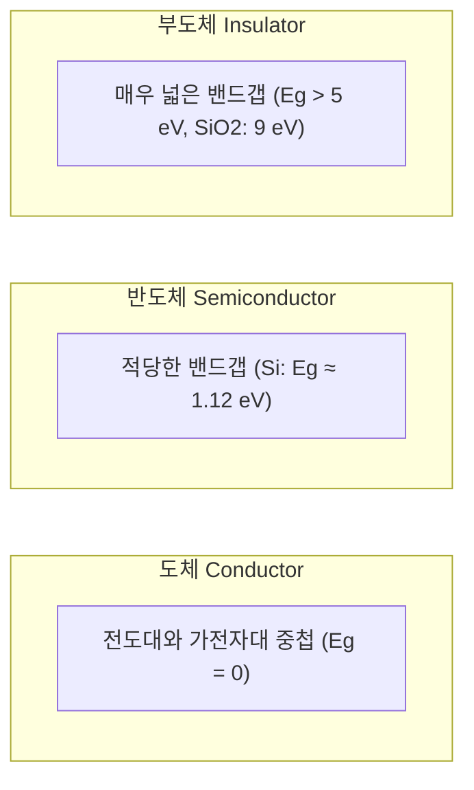
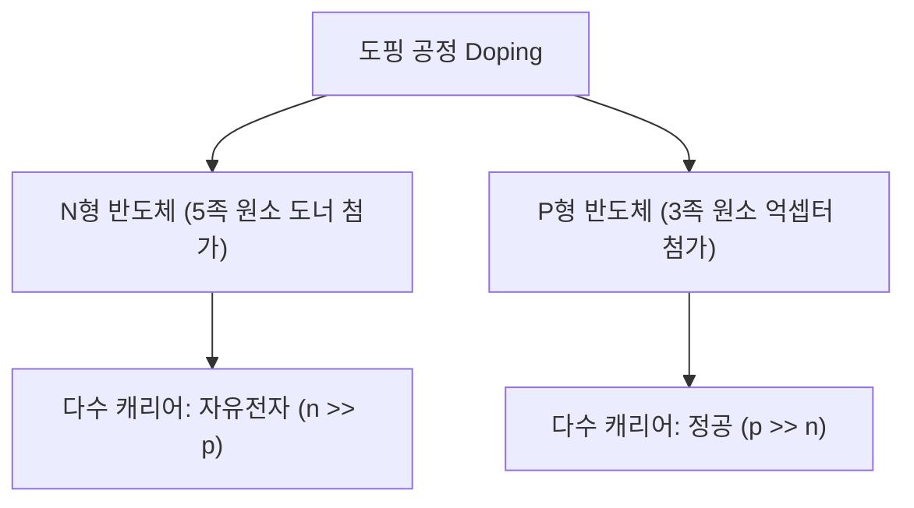
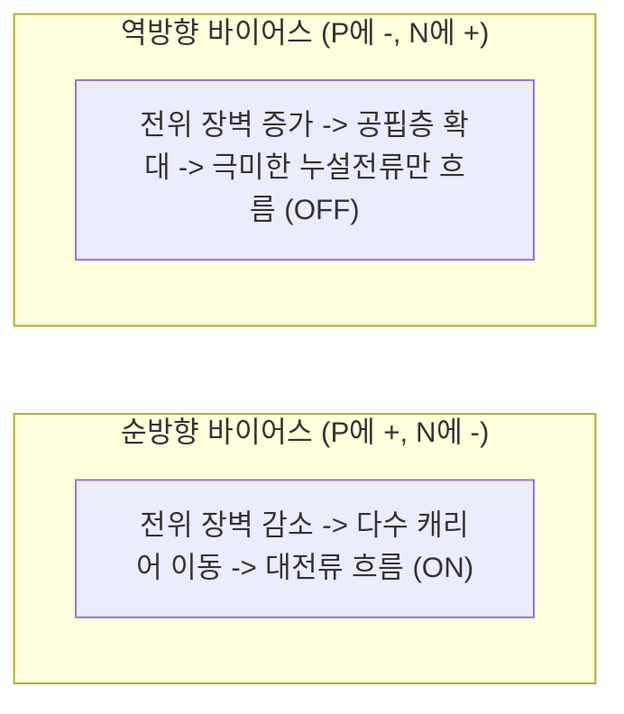

> **카테고리**: Part 1. 반도체 기초 이론 & 소자 물성  
> **태그**: #반도체물성 #실리콘 #에너지밴드갭 #진성반도체 #외인성반도체 #도핑 #드리프트 #확산  
> **추천 독자**: 반도체 재료 물성과 전자/정공의 전도 원리를 명확히 이해하고자 하는 분

---

> 💡 **핵심 요약 (3줄 정리)**  
> 1. **반도체(Semiconductor)**는 밴드갭($E_g \approx 1.12\text{eV}$)을 가져 빛, 열, 도핑을 통해 전기전도도를 $10^{10}$배 이상 자유롭게 제어할 수 있는 물질입니다.  
> 2. 순수한 **진성 반도체**에 3족(붕소 B)을 넣으면 **P형(정공 다수)**, 5족(인 P, 비소 As)을 넣으면 **N형(전도전자 다수)** 반도체가 됩니다.  
> 3. 반도체 내부 전류는 전기장에 의한 **드리프트 전류(Drift Current)**와 농도 기울기에 의한 **확산 전류(Diffusion Current)**의 합으로 결정됩니다.  

---

## 1. 도체, 부도체, 반도체의 구분: 에너지 밴드갭 ($E_g$)

  
*▲ [그림 3-1] 도체, 부도체, 반도체의 전도 특성과 전하 캐리어 (출처: 13. 반도체)*

물질 내 전자는 양자역학적으로 허용된 에너지 대역인 **가전자대(Valence Band)**와 **전도대(Conduction Band)**에 존재하며, 그 사이의 전자가 존재할 수 없는 금지된 영역을 **금지대(Forbidden Band) 혹은 밴드갭($E_g$)**이라고 합니다.

* **도체 (Conductor)**: 금, 구리, 알루미늄 등. 밴드갭이 없어 상온에서 무수히 많은 자유전자가 존재하여 전류가 매우 잘 흐릅니다.
* **부도체 (Insulator)**: 다이아몬드, 유리, 석영($SiO_2$) 등. 밴드갭이 매우 커($E_g > 5\text{eV}$) 전자가 전도대로 여기(Excite)되지 못해 전기가 흐르지 않습니다.
* **반도체 (Semiconductor)**: 실리콘(Si), 저마늄(Ge), 갈륨비소(GaAs) 등. 밴드갭이 적당하여 상온에서는 부도체에 가깝지만, **빛, 열, 전기장, 불순물 첨가(도핑)**를 통해 저항률을 극적으로 조절할 수 있습니다.

---

## 2. 왜 실리콘(Si, 규소)이 반도체의 제왕인가?

  
*▲ [그림 3-2] 원자번호 14번 실리콘 원자의 최외각 4개 전자와 공유결합 구조 (출처: 13. 반도체)*

1. **원자 번호 14번, 4족 원소**: 최외각 전자가 4개로, 인접한 4개의 실리콘 원자와 전자 1쌍씩을 공유하는 견고한 **다이아몬드 입방 격자(Diamond Cubic Lattice) 공유결합**을 형성합니다.
2. **지구상에 풍부한 매장량**: 지각 구성 원소 중 산소 다음으로 풍부한 모래(규석, $SiO_2$)로부터 저렴하게 대량 정제 가능합니다.
3. **우수한 산화막($SiO_2$) 형성**: 열산화를 통해 매우 얇고 절연 특성이 뛰어난 실리콘 산화막을 자연스럽게 성장시킬 수 있습니다 (MOSFET 탄생의 일등공신).

---

## 3. 진성 반도체 vs 외인성 반도체 (도핑의 마법)

  
*▲ [그림 3-3] 진성 반도체의 가전자대, 전도대 및 전자-정공 쌍 생성 (출처: 13. 반도체)*

  
*▲ [그림 3-4] 3족 붕소(B) 도핑에 의한 정공(Hole) 형성 원리 (출처: 13. 반도체)*

### (1) 진성 반도체 (Intrinsic Semiconductor)
* 어떠한 불순물도 섞이지 않은 $99.9999999\%(9N)$ 이상의 초고순도 단결정 실리콘입니다.
* 절대영도($0\text{K}$)에서는 모든 전자가 공유결합에 묶여 부도체 상태입니다.
* 상온($300\text{K}$)이 되면 열에너지에 의해 극소수의 전자가 결합을 깨고 전도대로 올라가 **자유전자(Electron)**가 되고, 그 빈자리에 **정공(Hole, 양의 유효 전하 $+q$)**이 남습니다.
* **전자-정공 쌍(EHP: Electron-Hole Pair)**이 동시에 생성되므로 전자의 농도($n$)와 정공의 농도($p$)가 같습니다:

$$n = p = n_i \quad (\text{Si 상온에서 } n_i \approx 1.5 \times 10^{10} \,\text{cm}^{-3})$$

### (2) 외인성 반도체 (Extrinsic Semiconductor): 도핑 (Doping)
진성 실리콘에 $10^5 \sim 10^8$개의 Si 원자당 1개 꼴로 미량의 불순물을 첨가하여 캐리어 농도를 수억 배 높이는 공정을 **도핑(Doping)**이라고 합니다.

| 구분 | N형 반도체 (N-type) | P형 반도체 (P-type) |
| :--- | :--- | :--- |
| **도판트 (Dopant)** | **5족 원소 (도너, Donor)**: P(인), As(비소), Sb(안티모니) | **3족 원소 (억셉터, Acceptor)**: B(붕소), Al(알루미늄), Ga(갈륨) |
| **메커니즘** | 결합 후 남는 5번째 전자가 작은 에너지($\approx 0.05\text{eV}$)로 자유전자가 됨 | 결합에 전자 1개가 부족하여 주변 전자를 끌어당겨 정공(Hole)을 생성함 |
| **다수 캐리어** | **자유전자 (Electrons)** ($n \approx N_D$) | **정공 (Holes)** ($p \approx N_A$) |
| **소수 캐리어** | 정공 ($p = \frac{n_i^2}{N_D}$) | 전자 ($n = \frac{n_i^2}{N_A}$) |
| **질량 작용 법칙** | $$n \cdot p = n_i^2$$ (열평형 상태에서 항상 성립) | $$n \cdot p = n_i^2$$ |

---

## 4. 반도체 내의 2가지 전류 메커니즘

  
*▲ [그림 3-5] 전기장에 의한 전자의 드리프트(Drift) 이동 원리 (출처: 13. 반도체)*

  
*▲ [그림 3-6] 농도 기울기에 의한 캐리어의 확산(Diffusion) 현상 (출처: 13. 반도체)*

반도체에 전류가 흐르는 원리는 금속과 달리 **드리프트(Drift)**와 **확산(Diffusion)** 두 가지입니다.

### (1) 드리프트 전류 (Drift Current)
* 외부에서 가해진 **전기장**($\vec{E}$)에 의해 전하가 끌려가며 발생하는 전류입니다.
* 전자는 전기장의 반대 방향으로, 정공은 전기장 방향으로 이동합니다.
* 드리프트 속도: $v_d = \mu E$ (여기서 $\mu$는 **이동도 Mobility**)
* 총 드리프트 전류 밀도:

$$J_{drift} = q(n\mu_n + p\mu_p)E = \sigma E$$

> **💡 이동도($\mu$) 비교**: 전자의 유효 질량이 정공보다 작기 때문에 실리콘에서 전자의 이동도($\mu_n \approx 1400\,\text{cm}^2/\text{V}\cdot\text{s}$)는 정공의 이동도($\mu_p \approx 450\,\text{cm}^2/\text{V}\cdot\text{s}$)보다 약 3배 큽니다! (따라서 NMOS가 PMOS보다 빠릅니다.)

### (2) 확산 전류 (Diffusion Current)
* 전하 캐리어의 **농도 불균형(농도 기울기, Concentration Gradient)**으로 인해 고농도 영역에서 저농도 영역으로 캐리어가 퍼져나갈 때 흐르는 전류입니다.
* 총 확산 전류 밀도:

$$J_{diff} = q D_n \frac{dn}{dx} - q D_p \frac{dp}{dx}$$

---

## 5. PN 접합 (PN Junction) 다이오드

  
*▲ [그림 3-7] P형 반도체와 N형 반도체의 접합 및 공핍층 형성 (출처: 13. 반도체)*

  
*▲ [그림 3-8] PN 접합 다이오드의 순방향 바이어스 인가 시 대전류 흐름 (출처: 13. 반도체)*

  
*▲ [그림 3-9] PN 접합 다이오드의 실제 전압-전류(I-V) 특성 곡선 (출처: 13. 반도체)*

P형 반도체와 N형 반도체를 결합하면 접합면에서 전도성 캐리어가 사라진 **공핍층(Depletion Region)**과 내부 전위 장벽(내장 전위, Built-in Potential $V_{bi} \approx 0.7\text{V}$)이 형성됩니다.

### 특수 목적 다이오드 종류
* **제너 다이오드 (Zener Diode)**: 고농도 도핑으로 역방향 항복(Breakdown) 전압에서 일정한 전압을 유지하는 정전압 소자.
* **쇼키 다이오드 (Schottky Diode)**: 금속-반도체 접합을 이용하여 역회복 시간($t_{rr}$)이 거의 없는 초고속 스위칭 소자.
* **발광 다이오드 (LED)**: 전자와 정공이 결합할 때 밴드갭 에너지를 빛(Photon)으로 방출하는 직접 천이형(GaAs, GaN 등) 소자.
* **포토다이오드 & 태양전지**: 빛을 흡수하여 EHP를 생성하고 이를 전기 에너지로 변환하는 수광 소자.

---

## 💡 핵심 개념 점검 & 실무 Q&A

**Q1. 실리콘에서 전자의 이동도($\mu_n$)가 정공의 이동도($\mu_p$)보다 약 3배 높은 물리적 이유는 무엇인가요?**  
* **핵심 해설**: 전자는 에너지 밴드 구조상 전도대 바닥 부근에서 결정 격자의 주기적 포텐셜과 상호작용할 때 곡률이 커서 **유효 질량**($m^\ast$)이 정공보다 작습니다. 이동도는 $\mu = \frac{q\tau}{m^\ast}$로 유효 질량에 반비례하므로, 유효 질량이 작은 전자가 격자 진동(Phonon) 산란을 덜 받고 더 민첩하게 이동합니다.

**Q2. 순수한 진성 반도체에 온도($T$)를 올리면 저항은 증가하나요, 감소하나요?**  
* **핵심 해설**: 금속 도체는 온도가 오르면 격자 산란이 심해져 저항이 증가하지만, 반도체는 열에너지에 의해 공유결합이 깨지며 전도 캐리어 농도($n_i \propto T^{3/2} e^{-E_g / 2kT}$)가 지수함수적으로 급증합니다. 따라서 캐리어 증가 효과가 이동도 감소 효과를 압도하여 **온도가 올라갈수록 저항이 급격히 감소(음의 저항 온도 계수, NTC)**합니다.

---

> **다음 글 예고**: [04강. 반도체 소자 이론 심화 - MOSFET 동작 원리와 차세대 소자](/반도체제조공정-04-반도체-소자이론-mosfet-원리와-차세대소자.html)  
> 현대 디지털 혁명의 심장, 트랜지스터(MOSFET)의 동작 메커니즘과 무어의 법칙을 잇는 3D FinFET, GAA 나노시트를 분석합니다.
