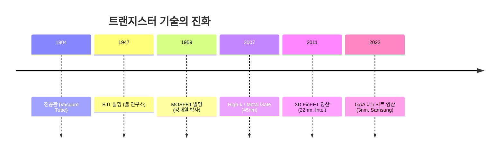
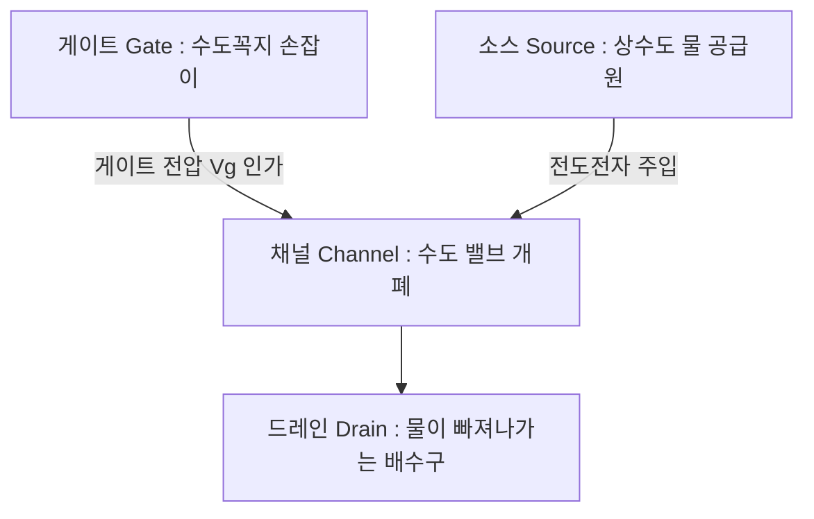
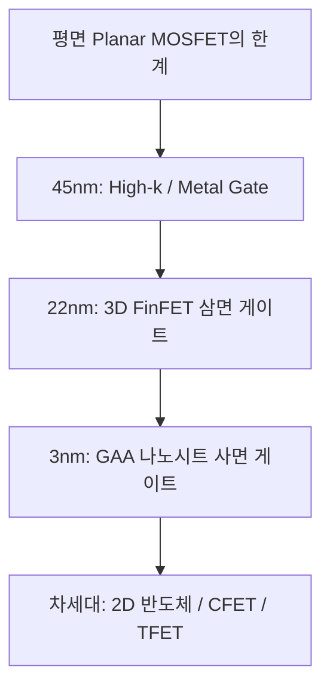

> **카테고리**: Part 1. 반도체 기초 이론 & 소자 물성  
> **태그**: #MOSFET #트랜지스터 #문턱전압 #FinFET #GAA #나노시트 #HighKMetalGate #무어의법칙  
> **추천 독자**: 반도체 장비 제어 및 소자 공정 실무를 체계적으로 학습하려는 엔지니어 및 학생

---

> 💡 **핵심 요약 (3줄 정리)**  
> 1. **MOSFET**은 게이트 전압($V_G$)으로 반도체 표면에 전도 채널(Channel)을 형성하여 소스(Source)와 드레인(Drain) 사이의 전류를 제어하는 전압 제어 스위치입니다.  
> 2. 미세화가 90nm 이하로 진행되면서 단채널 효과(SCE)와 누설 전류 한계가 발생했고, 이를 극복하기 위해 **Strained Si**, **High-k/Metal Gate**, **3차원 FinFET**이 도입되었습니다.  
> 3. 3nm 이하 초미세 공정에서는 4면을 게이트로 감싸는 **GAA(Gate-All-Around) MBCFET(나노시트)** 구조가 표준이 되었으며, 차세대 소자로 TFET, NCFET이 연구되고 있습니다.  

---

## 1. 전자 소자의 진화: 진공관 → BJT → MOSFET

  
*▲ [그림 4-1] 반도체 기술에 사용되는 주기율표 상의 핵심 원소들 (출처: 삼성전자 최상기 교수 교재 / Intel)*

  
*▲ [그림 4-2] 실리콘 원자 격자 배열과 원통형 잉곳(Ingot), 웨이퍼(Wafer) (출처: 삼성전자 최상기 교수 교재)*

* **진공관 (Vacuum Tube, 1904)**: 플레밍의 2극 진공관과 드포레스트의 3극관. 필라멘트 가열로 열전자를 방출시켜 부피가 크고 전력 소모 및 발열이 극심했습니다.
* **바이폴라 트랜지스터 (BJT, 1947)**: 바딘, 브래튼, 쇼클리의 벨 연구소 발명. 전자와 정공 둘 다 동작에 관여하는 전류 제어형 소자였으나, 집적화 시 발열 한계가 존재했습니다.
* **MOSFET (Metal-Oxide-Semiconductor Field-Effect Transistor, 1959)**: 강대원 박사와 마틴 아탈라 발명. 입력 게이트로 전류가 흐르지 않고 정전기장으로 채널을 제어하므로 **집적도와 소비전력 면에서 압도적 우위**를 점하여 현대 반도체 IC의 표준이 되었습니다.

---

## 2. MOSFET의 구조와 동작 메커니즘 (수도꼭지 비유)

  
*▲ [그림 4-3] 최초의 진공관부터 트랜지스터로의 발전 (출처: 삼성전자 최상기 교수 교재)*

  
*▲ [그림 4-4] 게이트 전압을 통한 소스-드레인 전류 제어의 수도꼭지 비유 (출처: 삼성전자 최상기 교수 교재)*

  
*▲ [그림 4-5] (a) 게이트 전압 무인가, (b) 낮은 전압 인가, (c) 문턱전압 이상 인가 시 반전층 형성 (출처: 삼성전자 최상기 교수 교재)*

NMOS 트랜지스터는 P형 기판(Substrate) 위에 고농도 N형($N^+$) 소스(Source)와 드레인(Drain) 영역을 형성하고, 그 사이에 얇은 절연막(Gate Oxide)과 게이트 전극을 얹은 구조입니다.

### (1) 게이트 전압이 없을 때 ($V_G = 0$)
* 소스($N^+$) - 기판($P$) - 드레인($N^+$) 사이에 역방향 PN 접합이 존재하므로 전류가 흐르지 않는 **OFF 상태(수도꼭지가 잠김)**입니다.

### (2) 낮은 게이트 전압 인가 ($0 < V_G < V_{th}$)
* 양(+)의 게이트 전압이 P형 기판 표면의 정공을 밀어내어 전하가 없는 **공핍 영역(Depletion Layer)**이 형성됩니다. 아직 전자가 모이지 않아 전류는 흐르지 않습니다.

### (3) 문턱전압 이상의 게이트 전압 인가 ($V_G > V_{th}$)
* 강한 양(+)의 전기장에 의해 소수 캐리어인 전자들이 산화막 바로 아래 기판 표면으로 강하게 끌어당겨져 모입니다.
* P형 실리콘 표면이 N형처럼 행동하는 **반전층(Inversion Layer, 전자 채널)**이 형성됩니다.
* 이제 드레인에 전압($V_D > 0$)을 걸어주면 소스에서 드레인으로 전자가 쏟아져 들어가 **ON 전류**($I_D$)가 흐릅니다!

---

## 3. MOSFET의 전류-전압($I_D - V_D$) 특성 영역

1. **차단 영역 (Cut-off Region)**: $V_{GS} < V_{th} \implies I_D \approx 0$
2. **선형 영역 (Linear / Triode Region)**: $V_{GS} > V_{th}$ 이고 $V_{DS} < V_{GS} - V_{th}$
   * 드레인 전압에 비례하여 전류가 선형적으로 증가 (옴성 저항처럼 동작)
   $$I_D = \mu_n C_{ox} \frac{W}{L} \left[ (V_{GS} - V_{th})V_{DS} - \frac{1}{2}V_{DS}^2 \right]$$
3. **포화 영역 (Saturation Region)**: $V_{DS} \ge V_{GS} - V_{th}$
   * 드레인 끝단에서 채널이 꼬집히는 **핀치오프(Pinch-off)**가 발생하여, 드레인 전압이 증가해도 전류가 일정하게 유지됩니다.
   $$I_{D,sat} = \frac{1}{2} \mu_n C_{ox} \frac{W}{L} (V_{GS} - V_{th})^2$$

---

## 4. 미세화 한계 극복을 위한 나노 기술 혁신

  
*▲ [그림 4-6] 무어의 법칙에 따른 반도체 소자 스케일링과 물리적 한계 (출처: 삼성전자 최상기 교수 교재)*

  
*▲ [그림 4-7] (왼쪽) 기존 Poly/SiO2 구조 vs (오른쪽) 45nm 혁신 Metal Gate / High-k 절연막 구조 (출처: 삼성전자 최상기 교수 교재 / Intel)*

  
*▲ [그림 4-8] 평면 구조(1면 제어)와 3차원 FinFET(3면 제어)의 게이트 장악력 비교 (출처: 삼성전자 최상기 교수 교재)*

  
*▲ [그림 4-9] 3nm 이하 초미세 공정을 위한 나노와이어 및 GAA 나노시트(MBCFET) 구조 (출처: 삼성전자 최상기 교수 교재 / Samsung)*

2000년대 초반, 게이트 길이($L$)가 수십 나노미터로 줄어들면서 소스와 드레인이 너무 가까워져 게이트가 채널을 통제하지 못하는 **단채널 효과(Short Channel Effects, SCE)**와 **드레인 유도 장벽 감소(DIBL)**, **게이트 양자 터널링 누설전류**가 폭발했습니다.

### (1) High-k 절연막 & 금속 게이트 (HKMG, 45nm)
* 산화막($SiO_2$) 두께가 $1\text{nm}$(원자 수 개 층) 이하로 얇아져 터널링 전류가 급증하자, 유전율이 높은 하프늄 옥사이드($HfO_2$, 유전율 $k \approx 25$)를 절연막으로 사용하고 폴리실리콘 대신 금속 게이트를 도입하여 정전용량($C_{ox} = \frac{\kappa \epsilon_0}{t_{ox}}$)은 높이고 누설 전류를 획기적으로 차단했습니다.

### (2) 3차원 FinFET (Fin Field-Effect Transistor, 22nm~5nm)
* 채널을 물고기 지느러미(Fin) 모양의 3차원 입체 입체 기둥으로 세우고, 게이트가 **상단과 양 측면 3면을 감싸도록** 설계했습니다.
* 게이트의 정전기적 채널 장악력이 획기적으로 향상되어 단채널 효과를 억제하고 구동 전류를 2배 이상 높였습니다.

### (3) GAA (Gate-All-Around) / MBCFET (3nm 이하)
* Fin 구조를 수평으로 눕혀 얇은 종이 형태의 나노시트(Nanosheet) 여러 장을 수직 적층한 뒤, 게이트가 **채널의 4면 전체를 360도 완벽히 둘러싸는 구조**입니다.
* 채널 제어 능력이 궁극에 도달하여 누설 전류를 극한으로 억제하며, 나노시트 폭($W$)을 조절하여 성능과 전력을 최적화할 수 있습니다 (삼성전자 3nm GAA MBCFET 양산 적용).

---

## 5. 포스트 무어(Post-CMOS) 시대의 미래 소자

무어의 법칙(Moore's Law)이 물리적 한계에 부딪히면서 새로운 작동 메커니즘을 적용한 초저전력 소자가 활발히 연구되고 있습니다:
* **TFET (Tunneling FET)**: 밴드 간 양자 터널링(Band-to-Band Tunneling)을 이용하여 상온 서브스레숄드 스윙(SS)의 물리적 한계인 $60\text{mV/dec}$ 이하를 달성하는 초저전력 소자.
* **NCFET (Negative Capacitance FET)**: 게이트 산화막에 강유전체(Ferroelectric, $HfZrO_x$)를 삽입하여 음의 정전용량 효과로 내부 전압을 증폭시키는 소자.
* **CFET (Complementary FET)**: NMOS 위에 PMOS를 3차원으로 수직 적층하여 면적을 50% 절감하는 궁극의 3D 적층 아키텍처.

---

## 💡 핵심 개념 점검 & 실무 Q&A

**Q1. 평면(Planar) MOSFET과 비교하여 FinFET과 GAA가 단채널 효과(SCE)를 억제할 수 있는 핵심 원리는 무엇인가요?**  
* **핵심 해설**: 평면 MOSFET은 게이트가 채널의 상부 1개 면만 제어하므로 채널 길이가 짧아지면 드레인 전계가 기판 하부를 침범하여 누설 전류(DIBL)가 발생합니다. 반면 FinFET은 3면, GAA는 4면 전체를 게이트가 감싸기 때문에 채널 내부의 전위 장벽을 게이트가 완벽히 장악합니다. 이에 따라 드레인 전압에 의한 간섭을 차단하고 오프 상태 누설전류를 극적으로 줄일 수 있습니다.

**Q2. 문턱전압($V_{th}$)의 물리적 정의와 이를 결정하는 요인은 무엇인가요?**  
* **핵심 해설**: 문턱전압은 반도체 표면의 페르미 준위가 진성 에너지 준위를 지나 강한 반전(Strong Inversion)이 일어나는 순간의 게이트 전압($\phi_s = 2\phi_B$)입니다. 결정 요인으로는 게이트와 실리콘의 일함수 차이($\Phi_{ms}$), 기판 도핑 농도($N_A$), 게이트 절연막의 단위면적당 정전용량($C_{ox}$), 산화막 내 고정 전하($Q_{ox}$) 등이 있습니다.

---

> **다음 글 예고**: [05강. 반도체 제조 공정 개요와 팹(Fab) 장비 시스템](/반도체제조공정-05-반도체-제조공정-개요와-8대공정-로드맵.html)  
> 소자 이론을 바탕으로, 실제 반도체 팹이 어떻게 구축되고 웨이퍼가 500개 공정을 거쳐 칩이 되는지 전체 로드맵을 조망합니다.
