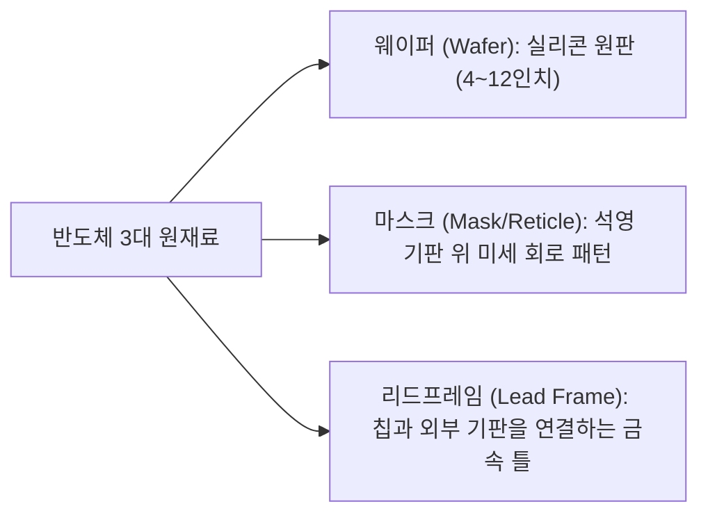
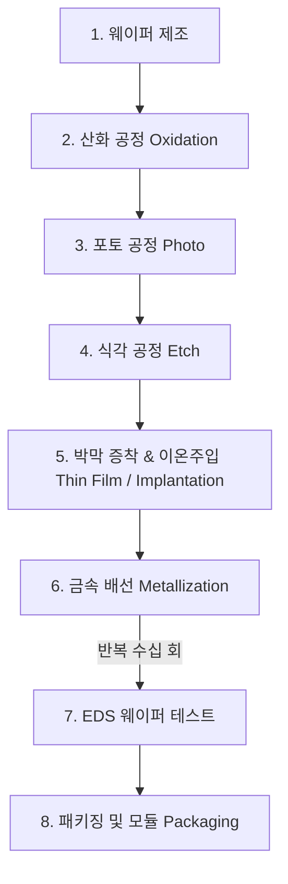
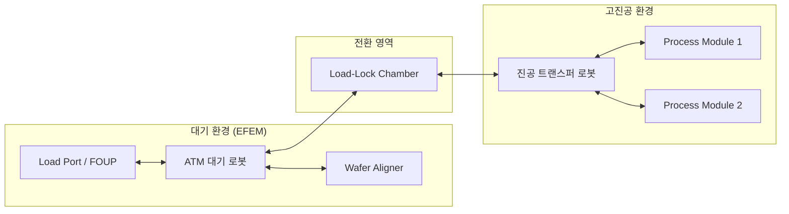

> **카테고리**: Part 2. 반도체 팹 제조 인프라 & 핵심 원자재  
> **태그**: #반도체공정 #8대공정 #Fab구조 #EFEM #진공로봇 #설비엔지니어 #SubFab  
> **추천 독자**: 반도체 팹의 물리적 구조와 공정 장비의 하드웨어 구성을 한눈에 파악하려는 엔지니어

---

> 💡 **핵심 요약 (3줄 정리)**  
> 1. 반도체 제조는 **웨이퍼 제조 → 산화 → 포토 → 식각 → 박막/이온주입 → 금속배선 → EDS → 패키징**의 핵심 8대 공정으로 구성됩니다.  
> 2. 단위 공정 장비는 **EFEM(대기 로봇/얼라이너), 트랜스퍼 챔버(진공 로봇), 프로세스 모듈, 전원/제어 랙, 진공/스크러버**의 5대 핵심 유닛으로 모듈화되어 있습니다.  
> 3. 반도체 팹(Fab)은 **3층 클린룸(장비/OHT), 2층 서브팹(펌프/전원/RF), 1층/지하 플레넘(배기/폐수/가스 공급)**의 3단계 입체 구조로 운영됩니다.  

---

## 1. 반도체 산업 구조와 3대 핵심 원재료

### (1) 반도체 산업의 비즈니스 생태계
* **IDM (Integrated Device Manufacturer)**: 회로 설계부터 팹 제조, 패키징, 판매까지 전 과정을 수행 (삼성전자, SK하이닉스, 인텔 등).
* **팹리스 (Fabless)**: 제조 공장(Fab) 없이 반도체 회로 설계와 마케팅에만 집중 (엔비디아, 퀄컴, 애플 등).
* **파운드리 (Foundry)**: 팹리스가 설계한 칩을 전문적으로 위탁 생산 (TSMC, 삼성전자 파운드리 등).
* **OSAT (Outsourced Semiconductor Assembly and Test)**: 제조된 웨이퍼의 패키징 및 최종 테스트 전문 외주 기업.

### (2) 반도체의 3대 원재료

  
*▲ [그림 5-1] 반도체 3대 핵심 원재료: 실리콘 웨이퍼, 마스크(레티클), 리드프레임 (출처: 반도체공정장비 #1)*

---

## 2. 반도체 핵심 8대 공정 로드맵

  
*▲ [그림 5-2] 웨이퍼 가공(FAB 500개 공정)부터 EDS 검사, 패키지 및 모듈 공정 로드맵 (출처: 반도체공정장비 #1)*

하나의 실리콘 웨이퍼에 복잡한 집적회로(IC)가 완성되기까지는 약 **500여 단계의 단위 공정**을 2~3개월간 반복 수행합니다.

* **전공정 (Front-end Process / FAB)**: 실리콘 웨이퍼 위에 트랜지스터와 다층 금속 배선을 제조하는 1~6단계.
* **후공정 (Back-end Process)**: 웨이퍼를 개별 다이(Die)로 잘라내어 리드프레임에 실장하고 플라스틱 수지로 몰딩한 뒤 신뢰성을 검증하는 7~8단계.

---

## 3. 반도체 공정 장비의 5대 핵심 요소 (Hardware Module)

  
*▲ [그림 5-3] 반도체 공정 장비의 5대 핵심 구성: EFEM, Transfer Chamber, Process Module, Power & Control, Scrubber (출처: 반도체공정장비 #1)*

  
*▲ [그림 5-4] EFEM 대기 로봇과 진공 트랜스퍼 챔버의 도킹 구조 (출처: 반도체공정장비 #1)*

최신 반도체 클러스터 장비(Cluster Tool)는 완벽한 파티클 차단과 진공 유지를 위해 다음과 같이 5대 모듈로 설계됩니다.

1. **웨이퍼 로딩 유닛 (EFEM: Equipment Front End Module)**:  
   * **Load Port**: 웨이퍼 보송 용기(FOUP)가 안착되는 곳.
   * **ATM Robot**: 대기압 상태에서 FOUP과 로드락 챔버 간에 웨이퍼를 이송하는 정밀 다관절 로봇.
   * **Wafer Aligner**: 웨이퍼의 노치(Notch)를 광학 센서로 감지하여 중심축과 각도를 정확히 정렬.
2. **웨이퍼 트랜스퍼 유닛 (Transfer Unit)**:  
   * **Load-Lock Chamber**: 대기압과 고진공 사이를 오가며 압력을 전환하는 버퍼 챔버.
   * **Transfer Chamber**: 고진공($10^{-6}\text{ Torr}$) 상태를 유지하며 중앙의 **진공 로봇(Vacuum Robot)**이 각 반응 챔버로 웨이퍼를 전달.
3. **프로세스 모듈 (Process Module, PM)**:  
   * 실제 식각, 증착, 세정 등 물리/화학적 반응이 일어나는 메인 챔버.
4. **전원 및 제어 유닛 (Power & Control Unit)**:  
   * **Main Power Box**: $380\text{V}/220\text{V}$ 동력 공급 및 비상 정지(EMO) 인터록 회로.
   * **Remote Control Rack**: PLC(Programmable Logic Controller)와 센서 통신(RS-232, DeviceNet).
5. **진공 및 가스 중화 유닛 (Vacuum & Scrubber Unit)**:  
   * **진공 펌프(Dry Pump / Turbo Pump)**: 챔버 내부를 초고진공으로 배기.
   * **Local Scrubber**: 배출되는 유독 가스($SiH_4, Cl_2, F_2$ 등)를 플라즈마/열/습식으로 1차 무해화.

---

## 4. 반도체 팹(Fab)의 3층 입체 구조

  
*▲ [그림 5-5] 반도체 팹의 3층 입체 구조: 3층 클린룸 라인, 2층 서브팹(Sub-FAB), 1층 플레넘(Plenum) (출처: 반도체공정장비 #1)*

  
*▲ [그림 5-6] 팹 하부 유틸리티 배관 및 가스, 전기, 초순수, 냉각수 공급 계통 (출처: 반도체공정장비 #1)*

반도체 팹은 진동을 차단하고 장비 유지보수 효율을 극대화하기 위해 다층 구조로 건설됩니다.

| 층별 구분 | 명칭 | 주요 설비 및 역할 |
| :--- | :--- | :--- |
| **3층** | **라인 (Cleanroom Floor)** | * 메인 공정 장비 (Process Module, EFEM) * 천장 자동 물류 이송 레일 (OHT: Overhead Hoist Transport) * FFU를 통한 초청정 층류 공조 |
| **2층** | **서브팹 (Sub-FAB Floor)** | * 진공 펌프 (Dry Pump, Turbo Pump Controller) * 플라즈마 RF Generator 및 매칭 박스 * 장비 메인 전원 박스 및 제어 랙 * 열교환 칠러(Chiller) 유닛 |
| **1층 / 지하** | **플레넘 (Plenum / Utility)** | * 유독가스 2차 대형 스크러버 및 덕트 배기 설비 * 산/알칼리/불산 폐수 배관 및 중화 처리조 * 초순수(DIW), 고순도 질소/특수가스 공급 메인 배관 |

---

## 5. 설비 엔지니어가 갖추어야 할 4대 핵심 기술

1. **전장 기술**: 고전압 배전반, 차단기, 릴레이, 노이즈 필터, 전원 분배기 점검 능력.
2. **제어 기술**: 센서 신호(온도, 압력, 유량) 처리 및 PLC 시퀀스 로직 해석.
3. **로봇 기술**: 서보 모터(Servo Motor) 엔코더 캘리브레이션, 진공 로봇 티칭(Teaching) 및 웨이퍼 안착 정밀도 제어.
4. **예방 보전 (PM: Preventive Maintenance)**: 부품 마모도 관리, 진공 씰(O-ring) 교체, 파티클 소스 세정.

---

## 💡 핵심 개념 점검 & 실무 Q&A

**Q1. 반도체 공정 장비에서 대기 영역(EFEM)과 공정 챔버(PM) 사이에 로드락(Load-Lock) 챔버를 두는 이유는 무엇인가요?**  
* **핵심 해설**: 공정 챔버는 $10^{-3} \sim 10^{-6}\text{ Torr}$의 초고진공과 청정도를 유지해야 합니다. 웨이퍼를 넣을 때마다 메인 챔버를 대기에 노출시키면 진공 배기에 막대한 시간이 소요되고 대기 중의 수분과 파티클로 인해 챔버가 심각하게 오염됩니다. 로드락 챔버를 통해 대기압과 진공 사이를 완충함으로써 공정 챔버의 환경을 일정하게 보존하고 생산성(Throughput)을 극대화합니다.

**Q2. 서브팹(Sub-Fab)을 클린룸 하부에 별도로 분리하여 운영하는 이점은 무엇인가요?**  
* **핵심 해설**: 첫째, 모터와 펌프에서 발생하는 강한 진동과 소음, 열기를 청정실 공정 장비로부터 격리하여 미세 패턴의 정렬 오차를 방지합니다. 둘째, 정기적인 펌프 오버홀이나 케미컬 교체 등 유지보수 작업(PM) 시 방진복 착용 구역인 클린룸에 진입하지 않고 작업할 수 있어 오염을 예방하고 공간 효율성을 높입니다.

---

> **다음 글 예고**: [06강. 반도체 클린룸(Cleanroom) 환경 제어와 청정 관리](/반도체제조공정-06-클린룸-환경제어와-오염관리-원칙.html)  
> 나노미터 세계에서 먼지 한 톨이 미치는 치명적 영향과, 이를 막기 위한 클린룸 4원칙 및 공조 시스템을 해부합니다.
