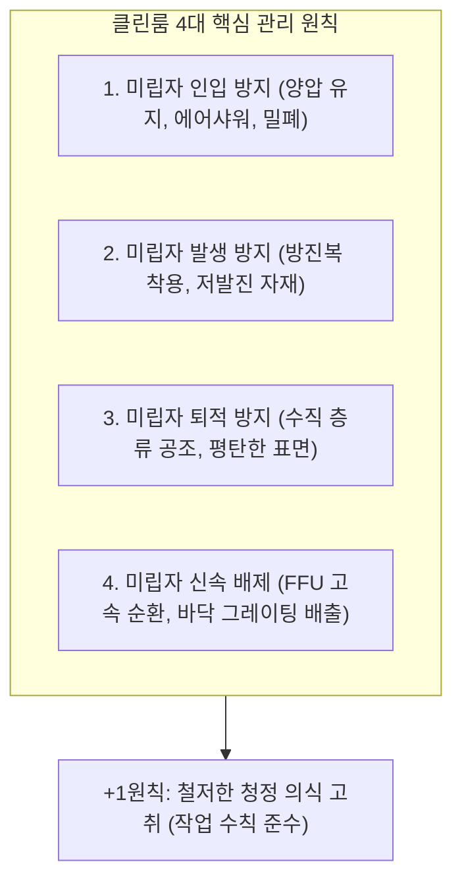
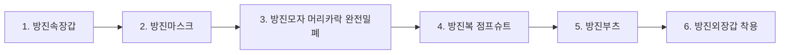

> **카테고리**: Part 2. 반도체 팹 제조 인프라 & 핵심 원자재  
> **태그**: #클린룸 #CleanClass #미립자 #파티클 #HEPA필터 #ULPA #방진복 #에어샤워  
> **추천 독자**: 반도체 생산 현장의 청정 환경 기준과 엔지니어 필수 수칙을 숙지하려는 분

---

> 💡 **핵심 요약 (3줄 정리)**  
> 1. **클린룸(Cleanroom)**은 제품의 신뢰성을 확보하기 위해 미립자(Particle), 온·습도, 실내 압력을 극한으로 통제하는 특수 청정실입니다.  
> 2. 청정도는 $1\text{ft}^3$ 내 $0.5\mu\text{m}$ 크기의 먼지 개수를 기준으로 **Class 1 ~ Class 1000**으로 엄격히 분류됩니다.  
> 3. 클린룸의 기본 원칙은 **미립자 인입 방지, 발생 방지, 퇴적 방지, 신속 배제(4원칙)** 및 **청정 의식 고취(+1원칙)**입니다.  

---

## 1. 클린룸(Cleanroom)의 정의와 필요성

  
*▲ [그림 6-1] 클린룸의 정의 및 머리카락 굵기와 미립자(Particle)의 크기 비교 (출처: 반도체공정장비 #2)*

반도체 칩에 형성되는 회로 선폭은 수 나노미터($\text{nm}$)에 불과합니다. 인간의 머리카락 굵기($\approx 100\mu\text{m}$)와 비교하면 회로 선폭은 수만 분의 1 수준입니다.
* 눈에 보이지 않는 **$0.1\mu\text{m}$ 크기의 미립자(Particle)** 하나만 웨이퍼 표면에 떨어져도 회로가 끊어지는 단선(Open)이나 들러붙는 단락(Short)이 발생하여 칩 전체가 폐기됩니다.
* 따라서 반도체 생산 라인은 공기 중 미립자를 완벽히 걸러내고 일정한 온·습도($22 \pm 1^\circ\text{C}$, $45 \pm 5\%$)와 기압을 유지하는 **클린룸(청정실)** 구축이 필수적입니다.

---

## 2. 클린룸 청정도 규격: Clean Class

  
*▲ [그림 6-2] 1세제곱피트 내 입자 수에 따른 Clean Class 규격 기준 (출처: 반도체공정장비 #2)*

클린룸의 규격은 전통적으로 미국 연방 규격(FED-STD-209E)인 **Clean Class**로 표기합니다.

$$\text{Class N} \iff 1\,\text{ft}^3(0.0283\,\text{m}^3) \text{ 공기 중에 } 0.5\,\mu\text{m} \text{ 이상 크기의 입자가 } N\text{개 이하}$$

| 구분 | $1\,\text{ft}^3$ 당 입자 수 ($>0.5\mu\text{m}$) | 적용 공정 라인 |
| :--- | :--- | :--- |
| **Class 1** | **1개 이하** | 최첨단 포토리소그래피(EUV), 초미세 게이트 산화/확산 구역 |
| **Class 10** | 10개 이하 | 박막 증착, 고밀도 식각 공정 구역 |
| **Class 100** | 100개 이하 | 일반 반도체 제조 메인 라인 |
| **Class 1,000** | 1,000개 이하 | 웨이퍼 프로브 검사(EDS), 패키징 라인 |
| **일반 대기** | $1,000,000 \sim 5,000,000$개 | 일반 사무실, 주택 실내 환경 |

---

## 3. 클린룸 관리의 4원칙 + 1원칙

1. **미립자 인입 방지**: 실내 압력을 외부보다 높게 유지(**양압 Positive Pressure**)하여 문이 열려도 바깥 공기가 들어오지 못하게 차단.
2. **미립자 발생 방지**: 작업자는 인체 탈락 세포나 비말을 막아주는 특수 방진복을 착용하고, 클린룸 내부에는 무진종이(Clean Paper)만 반입.
3. **미립자 퇴적 방지**: 기류의 와류(Vortex)가 생기지 않도록 천장에서 바닥으로 흐르는 **수직 층류(Laminar Flow)**를 유지.
4. **미립자 신속 배제**: 발생된 미립자는 즉시 천장 팬필터유닛(FFU)과 바닥 다공판(Grating)을 통해 하부 플레넘으로 배출.
5. **+1원칙 (청정 의식)**: 아무리 훌륭한 설비도 작업자의 부주의로 오염될 수 있으므로 정기적인 청정 마인드 교육을 실시.

---

## 4. 공조 및 필터 시스템 설비

  
*▲ [그림 6-3] 클린룸의 주요 공조 부품: 패스박스(Pass Box), HEPA/ULPA 필터, FFU 유닛 (출처: 반도체공정장비 #2)*

* **HEPA 필터 (High Efficiency Particulate Air)**:  
  * $0.3\mu\text{m}$ 크기의 입자를 $99.97\%$ 이상 포집.
* **ULPA 필터 (Ultra Low Penetration Air)**:  
  * $0.12\mu\text{m}$ 크기의 극미세 입자를 $99.9995\%$ 이상 걸러내는 최첨단 반도체 라인 표준 필터.
* **FFU (Fan Filter Unit)**:  
  * 모터 팬과 ULPA 필터가 일체화된 유닛으로, 천장 전면에 촘촘히 배열되어 하향 순환 기류를 형성.
* **BFU (Blower Filter Unit)**:  
  * Class 1,000 이하의 보조 구역에 외기를 흡입하여 정화 공급하는 장치.
* **Pass Box**:  
  * 작업자 없이 물품만 클린룸으로 반입할 때 자외선 살균 및 에어샤워를 수행하는 밀폐 통로.

---

## 5. 수막룸(Smock Room) 방진복 착용 및 행동 수칙

작업자는 클린룸 내부에서 가장 큰 파티클 발생원입니다 (사람이 걷거나 숨 쉴 때 분당 수백만 개의 입자 방출).

### (1) 방진복 착용 순서 (위에서 아래로!)

  
*▲ [그림 6-4] 수막룸(Smock Room)에서의 정밀 방진복 착용 순서 1단계 (출처: 반도체공정장비 #2)*

  
*▲ [그림 6-5] 방진모, 마스크, 방진복, 방진화 완벽 착용 후 점검 (출처: 반도체공정장비 #2)*

  
*▲ [그림 6-6] 클린룸 출입 시 360도 회전 에어샤워(Air Shower) 요령 (출처: 반도체공정장비 #2)*

### (2) 클린룸 내 화장 절대 금지 이유!
* 스킨, 로션 외의 **선크림, 비비크림, 파운데이션, 파우더, 색조 화장, 향수**는 엄격히 금지됩니다.
* 화장품 성분에는 미세 광물 분말인 **탈크(Talc), 실리카, 이산화티타늄($TiO_2$)**과 중금속 및 유기 화합물이 포함되어 있어, 피부에서 탈락될 경우 웨이퍼 표면에 치명적인 금속 오염 및 미세 결함을 유발합니다.

### (3) 에어샤워(Air Shower) 요령
* 에어샤워실에 입실 후 양손을 높이 들고 좌우로 360도 천천히 회전하며 $15 \sim 30$초간 고속 청정 제트 기류로 의복에 붙은 미세 먼지를 털어냅니다.

---

## 💡 핵심 개념 점검 & 실무 Q&A

**Q1. 클린룸에서 양압(Positive Pressure)을 유지하는 이유와 그 제어 메커니즘은 무엇인가요?**  
* **핵심 해설**: 클린룸 내부 기압을 외부 복도나 비청정 구역보다 높게 유지하면(약 $10 \sim 30\text{ Pa}$ 차압), 출입문이 열리거나 틈새가 발생해도 내부의 청정 공기가 바깥으로 밀려 나갈 뿐 외부의 오염된 공기가 역류해 들어오지 못합니다. 이는 급기 팬의 풍량을 배기 풍량보다 항상 일정 비율 많게 제어함으로써 달성합니다.

**Q2. ULPA 필터가 0.12마이크로미터 입자까지 완벽에 가깝게 포집할 수 있는 물리적 포집 원리는 무엇인가요?**  
* **핵심 해설**: 공기 필터는 단순한 체(Sieve)가 아니라 3가지 복합 메커니즘으로 동작합니다. 입자가 클 때는 기류를 따라가다 섬유에 부딪히는 **관성 충돌(Inertial Impaction)**과 섬유 표면에 닿는 **차단(Interception)**이 작용하고, $0.1\mu\text{m}$ 이하의 극미세 입자는 기체 분자와의 충돌로 지그재그로 불규칙하게 움직이는 **브라운 운동에 의한 확산(Diffusion)** 효과로 섬유에 부착되어 포집됩니다.

---

> **다음 글 예고**: [07강. 반도체 핵심 공정 재료 - 실리콘 웨이퍼, 케미컬, 특수가스](/반도체제조공정-07-반도체-핵심재료-실리콘웨이퍼와-케미컬-특수가스.html)  
> 모래에서 고순도 300mm 웨이퍼가 탄생하는 과정과 팹에서 사용되는 위험 화학물질 및 특수가스 안전 수칙을 알아봅니다.
