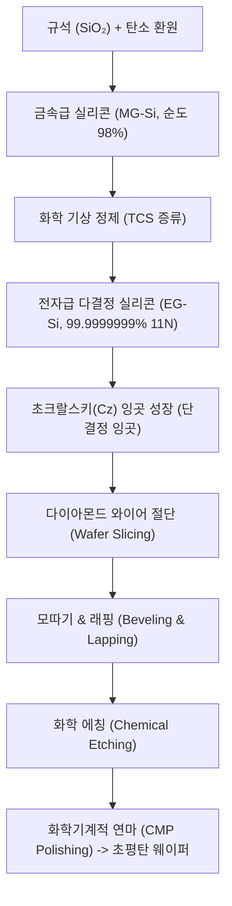
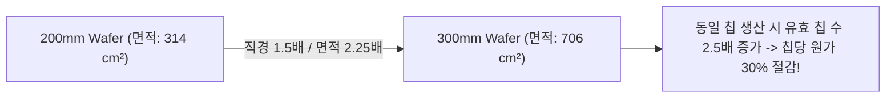
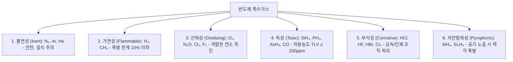

> **카테고리**: Part 2. 반도체 팹 제조 인프라 & 핵심 원자재  
> **태그**: #실리콘웨이퍼 #잉곳성장 #초크랄스키 #CMP #불산위험성 #특수가스 #자연발화  
> **추천 독자**: 반도체 원자재 제조 공정과 위험 케미컬/가스 취급 안전을 이해하려는 공정 엔지니어

---

> 💡 **핵심 요약 (3줄 정리)**  
> 1. 실리콘 웨이퍼는 규석($SiO_2$) 정제 후 **초크랄스키(Cz)법**으로 잉곳을 성장시켜 슬라이싱, 래핑, 화학식각, CMP 연마를 거쳐 제조됩니다.  
> 2. 웨이퍼 구경이 커질수록(현재 300mm/12인치 표준) 칩 생산량과 경제성이 비약적으로 증가하며, 결정면은 (100) 방향이 주로 사용됩니다.  
> 3. 반도체 공정에 쓰이는 **불산(HF)**은 인체 칼슘을 파괴하는 치명적인 산이며, **실란**($SiH_4$) 등 특수가스는 공기 노출 시 즉각 폭발하므로 철저한 인터록이 필수입니다.  

---

## 1. 모래(규석)에서 실리콘 웨이퍼까지의 제조 공정

우리가 바닷가에서 흔히 보는 모래(규석)가 어떻게 원자 수준으로 매끄러운 반도체 웨이퍼가 되는지 그 변신 과정을 살펴봅니다.

### (1) 초크랄스키(Cz) 단결정 성장법
* 석영 도가니에 고순도 폴리실리콘을 넣고 $1420^\circ\text{C}$ 이상 가열하여 녹입니다.
* 특정 결정 방향(예: <100>)을 가진 단결정 **씨앗 결정(Seed Crystal)**을 쇳물 표면에 접촉시킨 뒤, 천천히 회전시키며 위로 끌어올립니다.
* 용융액이 냉각되면서 씨앗 결정과 동일한 결정 격자를 가진 거대한 원통형 **단결정 잉곳(Ingot)**이 완성됩니다.

---

## 2. 웨이퍼 규격과 결정면 분류

### (1) 웨이퍼 크기(Size)의 발전

  
*▲ [그림 7-1] 실리콘 웨이퍼 크기(3인치 ~ 12인치/300mm)에 따른 구분 (출처: 반도체공정장비 #3)*

  
*▲ [그림 7-2] 200mm에서 300mm 웨이퍼로의 전환에 따른 유효 칩 수(Net Die) 급증 (출처: 반도체공정장비 #3)*

* $3\text{인치}(75\text{mm}) → 4\text{인치} → 6\text{인치} → 8\text{인치}(200\text{mm}) → 12\text{인치}(300\text{mm})$
* **경제성 효과**: 200mm에서 300mm로 직경이 1.5배 증가하면 표면적은 $2.25$배 증가하지만, 테두리 버려지는 영역 감소로 얻을 수 있는 유효 다이(Net Die) 수는 **약 2.5배 이상 급증**합니다.

### (2) 결정면과 구별 방식

  
*▲ [그림 7-3] (100) 및 (111) 결정면 방향과 P/N형 도핑에 따른 플랫존(Flat Zone) 식별법 (출처: 반도체공정장비 #3)*

  
*▲ [그림 7-4] 300mm 대구경 웨이퍼의 정밀 노치(Notch) 및 레이저 각인 일련번호 (출처: 반도체공정장비 #3)*

* **(100) 결정면**: 표면 결합 원자 밀도가 낮아 계면 결함(Surface State)이 적으므로 **MOSFET 소자** 제작에 주로 사용됩니다.
* **(111) 결정면**: 원자 충진율이 높아 BJT 소자에 일부 활용됩니다.
* **웨이퍼 정렬 기준**:
  * 200mm 이하: 웨이퍼 테두리를 직선으로 깎아낸 **플랫 존(Flat Zone)**의 각도와 위치로 P/N형 및 결정면 구분.
  * 300mm 이상: 원형 면적 낭비를 막기 위해 작은 V자 홈인 **노치(Notch)**와 레이저 각인 일련번호(Scribed ID) 사용.

---

## 3. 반도체 케미컬 3대 분류와 불산(HF)의 위험성

  
*▲ [그림 7-5] 반도체 공정에 사용되는 주요 산(Acid)과 불산(HF) 취급 안전 (출처: 반도체공정장비 #3)*

반도체 팹에서는 식각, 세정, 박막 제거를 위해 고순도 화학 약품을 사용합니다.

| 분류 | 주요 물질 | 용도 및 특성 |
| :--- | :--- | :--- |
| **산 (Acid)** | $H_2SO_4, HCl, HNO_3, H_3PO_4, HF$ | 금속/유기물 제거, 산화막 식각, $H^+$ 방출 |
| **염기 (Alkali)** | $NH_4OH, KOH, TMAH$ | 파티클 제거, Si 이방성 식각, $OH^-$ 방출, 단백질 부식 |
| **유기용제 (Solvent)** | $IPA, Acetone, PGMEA, NMP$ | PR 용해 및 현상, 최종 웨이퍼 린스/건조 |

### ⚠️ [초특급 주의] 불산(HF, Hydrofluoric Acid)의 치명적 위험성!
* **특성**: 실리콘 산화막($SiO_2$)을 상온에서 녹일 수 있는 유일한 산으로 세정과 식각에 필수적입니다 ($SiO_2 + 6HF → H_2SiF_6 + 2H_2O$).
* **체내 침투 메커니즘**:
  1. 약산이라 피부에 닿아도 염산이나 황산처럼 즉각적인 통증이 없어 노출 사실을 인지하기 어렵습니다.
  2. 피부와 세포벽을 뚫고 뼈 속까지 깊숙이 침투합니다.
  3. 혈액 속의 필수 칼슘($Ca^{2+}$) 및 마그네슘($Mg^{2+}$) 이온과 급격히 결합하여 불화칼슘($CaF_2$) 침전을 형성합니다.
  4. **저칼슘혈증(Hypocalcemia)**을 유발하여 심장마비를 일으키고 뼈를 녹여 괴사시킵니다.
* **응급 조치**: 접촉 즉시 대량의 물로 15분 이상 세척 후, 길항제인 **글루콘산칼슘(Calcium Gluconate) 젤**을 환부에 문지르고 즉시 병원으로 이송해야 합니다!

---

## 4. 반도체 특수가스 6대 분류

  
*▲ [그림 7-6] 반도체 팹에서 사용되는 특수가스의 위험도별 6대 분류 (출처: 반도체공정장비 #3)*

  
*▲ [그림 7-7] 공기 노출 시 즉각 폭발하는 자연발화성(Pyrophoric) 가스의 특성 (출처: 반도체공정장비 #3)*

공정 챔버 내부로 투입되는 가스는 반응성이 극도로 강하므로 다음과 같이 6대 위험 등급으로 엄격히 분류·관리됩니다.

* **자연발화성(Pyrophoric) 가스**: 실란($SiH_4$)과 다이실란($Si_2H_6$)은 CVD 박막 증착에 쓰이지만, 상온에서 공기(산소)와 접촉하는 즉시 불꽃 없이 대폭발을 일으킵니다 ($SiH_4 + 2O_2 → SiO_2 + 2H_2O$).
* 따라서 가스 공급 배관은 이중 동축관(Double Containment Pipe)을 사용하고, 질소 퍼지(N2 Purge) 라인과 자동 셧오프 밸브(Emergency Shut-off Valve)를 다중 연동합니다.

---

## 💡 핵심 개념 점검 & 실무 Q&A

**Q1. 웨이퍼 제조 시 다이아몬드 와이어 절단 후 CMP(Chemical Mechanical Polishing) 공정이 반드시 필요한 이유는 무엇인가요?**  
* **핵심 해설**: 기계적 톱질(Sawing)이나 래핑 직후의 웨이퍼 표면은 수 마이크로미터 단위의 거칠기와 결정 격자 크랙(Damage)을 가지고 있습니다. 포토리소그래피 공정에서 수십 나노미터 초점심도(DOF) 내에 완벽히 초점을 맞추기 위해서는 표면 단차가 수 나노미터 이하인 원자 수준의 평탄도가 요구됩니다. CMP는 화학 약품(Slurry)에 의한 표면 반응과 연마 패드의 기계적 마찰을 결합하여 표면 결함층을 제거하고 완벽한 거울면(Mirror Surface)을 형성합니다.

**Q2. 실란($SiH_4$) 가스 배관 라인에서 리크(Leak) 점검 시 비눗물 대신 헬륨 디텍터(He Leak Detector)를 사용하는 이유는 무엇인가요?**  
* **핵심 해설**: 실란 가스는 공기 중 산소나 수분과 접촉하는 순간 즉각 자연발화(Pyrophoric) 폭발을 일으키므로 일반적인 가압식 비눗물 검사가 불가능합니다. 또한 분자 크기가 매우 작아 극미량 누출도 대형 사고로 이어질 수 있으므로, 원자 반경이 가장 작은 불활성 헬륨($He$) 가스를 배관 내부에 가압 주입한 후 진공 질량분석기(Mass Spectrometer)로 감지하는 헬륨 리크 검사법을 적용합니다.

---

> **다음 글 예고**: [08강. 반도체 팹 유틸리티 - 초순수, CDA, 냉각수, 배기 시스템](/반도체제조공정-08-팹-유틸리티-인프라-초순수-cda-배기-모니터링.html)  
> 24시간 잠들지 않는 반도체 팹의 생명선, 초순수(DI Water) 제조 기술과 대기 방출 스크러버 계통을 분석합니다.
