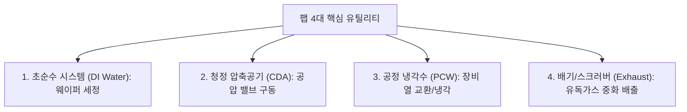
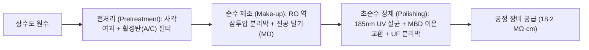
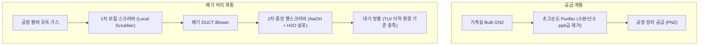

> **카테고리**: Part 2. 반도체 팹 제조 인프라 & 핵심 원자재  
> **태그**: #팹유틸리티 #초순수 #DIWater #CDA #PCW #웻스크러버 #배기시스템 #FMS  
> **추천 독자**: 반도체 팹 설비/인프라 기술 직무를 지망하는 엔지니어

---

> 💡 **핵심 요약 (3줄 정리)**  
> 1. **초순수(DI Water)**는 이온, 미립자, 유기물, 용존 산소를 극한으로 제거하여 이론상 한계 비저항인 $18.2\,\text{M}\Omega\cdot\text{cm}$를 달성한 순수입니다.  
> 2. 팹에는 장비 구동용 **CDA(청정압축공기)**, 열 제어용 **PCW(공정냉각수)**, 불활성 환경용 **고순도 질소(GN2/PN2)**가 24시간 무중단 공급됩니다.  
> 3. 배출되는 유독성 가스와 폐수는 **산배기 웻스크러버(Wet Scrubber)**와 유기/열 배기 시설, 중앙 FMS 모니터링을 통해 환경 기준치 이하로 정화 배출됩니다.  

---

## 1. 팹 유틸리티(Utility)의 중요성

반도체 공정 장비가 아무리 정밀해도, 이를 구동하는 전력, 물, 공기, 냉각수, 가스가 끊기거나 순도가 흔들리면 즉시 수십만 장의 웨이퍼가 전량 폐기됩니다. 팹 유틸리티는 팹이라는 거대한 생명체에 피와 산소를 공급하는 **순환계이자 장기**입니다.

---

## 2. 초순수 (DI Water: Deionized Water) 시스템

  
*▲ [그림 8-1] 초순수(DI Water) 제조 3단계 블록: 전처리, 순수제조(Make-up), 초순수정제(Polishing) (출처: 반도체공정장비 #4)*

  
*▲ [그림 8-2] RO(Reverse Osmosis) 역삼투압 멤브레인을 통한 용존 이온 98% 제거 메커니즘 (출처: 반도체공정장비 #4)*

  
*▲ [그림 8-3] 185nm/254nm 자외선 살균기를 통한 유기물(TOC) 광분해 및 멸균 장치 (출처: 반도체공정장비 #4)*

웨이퍼를 화학 약품으로 씻어낸 뒤 최종 헹굼(Rinse)에 사용되는 물로, 물 이외의 불순물이 전무한 궁극의 물입니다.

### (1) 초순수 제조 3단계 블록

1. **전처리 (Pretreatment & Make-Up Block)**:  
   * **마이크로 필터 & 활성탄(A/C) 필터**: 원수 속 흙, 모래 등 비이온성 부유 물질과 잔류 염소($Cl_2$), 유기물을 흡착 제거.
   * **RO (Reverse Osmosis, 역삼투압)**: 반투막에 삼투압 이상의 고압을 가해 순수한 물 분자만 통과시켜 물속 이온성 물질을 $98\%$ 이상 1차 제거.
2. **폴리싱 블록 (Polishing Block)**:  
   * **UV 살균기 (UV Sterilizer, $185\text{nm} / 254\text{nm}$)**: 단파장 자외선으로 유기물(TOC: Total Organic Carbon)을 이산화탄소로 광분해하고 박테리아를 멸균.
   * **MBD (Mixed Bed Deionizer, 혼상식 이온교환수지)**: 양이온 교환수지와 음이온 교환수지가 혼합된 탑을 통과시켜 미량 잔류 이온($Na^+, Cl^-$ 등)을 완벽 포집.
   * **UF (Ultrafilter, 한외여과막)**: 박테리아 사체 및 $0.05\mu\text{m}$ 이하의 미세 입자 최종 차단.
3. **초순수의 품질 지표**:  
   * **비저항(Resistivity)**: **$18.2\,\text{M}\Omega\cdot\text{cm}$ at $25^\circ\text{C}$** (물 자체의 이온화 $H^+, OH^-$ 외에 불순물 이온이 전혀 없음을 의미).
   * **TOC**: $1\,\text{ppb}$ 이하, **용존 산소(DO)**: $5\,\text{ppb}$ 이하.

---

## 3. CDA와 PCW 시스템

  
*▲ [그림 8-4] Air Compressor와 Receiver Tank, 에어 드라이어로 구성된 CDA 공급 계통 (출처: 반도체공정장비 #4)*

  
*▲ [그림 8-5] 7kg/cm² 일정한 압력으로 챔버 폐열을 회수하는 PCW 폐루프 순환 시스템 (출처: 반도체공정장비 #4)*

### (1) CDA (Clean Dry Air, 청정압축공기)
* **역할**: 진공 챔버의 슬릿 밸브, 공압 실린더, 웨이퍼 로더 구동원의 동력으로 사용.
* **요구 조건**: 공기 중의 먼지, 압축기 오일 미스트, 수분을 완벽 제거해야 함. 수분이 남아 있으면 밸브 부식 및 결로로 인한 파티클을 유발하므로 **노점(Dew Point)을 $-70^\circ\text{C}$ 이하**로 극저온 건조시킵니다.

### (2) PCW (Process Cooling Water, 공정냉각수)
* **역할**: 플라즈마 방전 장치, 고진공 터보 펌프, 이온주입기, 챔버 벽면에서 발생하는 막대한 열을 회수.
* **운영**: 일정한 수압($7\,\text{kg/cm}^2$)과 정밀 제어된 수온($20 \pm 0.5^\circ\text{C}$)을 유지하며 폐쇄 루프(Closed Loop)로 연속 순환 냉각.

---

## 4. 특수가스 공급 및 팹 배기/폐수 처리 시스템

### (1) 산배기 웻스크러버 (Acid Wet Scrubber)

  
*▲ [그림 8-6] 공정 챔버의 유독 산가스를 NaOH 수용액으로 중화 정화하는 웻스크러버 (출처: 반도체공정장비 #4)*

  
*▲ [그림 8-7] 가스실과 팹 유틸리티를 24시간 실시간 감시하는 중앙 모니터링 시스템 (출처: 반도체공정장비 #4)*

* 공정 장비에서 배출되는 유독성 산 가스($HCl, HF, Cl_2, F_2$)를 강력한 블로어(Blower)로 흡입.
* 웻스크러버 내부에서 알칼리 중화액($NaOH + H_2O$)을 분사하여 화학적 중화 반응 유도:
  $$HCl + NaOH → NaCl + H_2O$$
  $$HF + NaOH → NaF + H_2O$$
* 중화된 염은 폐수 처리장으로 보내고, 정화된 공기만 환경 허용 농도(TLV) 이하로 굴뚝을 통해 대기 방출.

### (2) 유기 및 열 배기 시스템
* 솔벤트(IPA, Acetone) 증기는 활성탄 필터 박스 및 RTO(축열식 연소산화장치)를 통해 $800^\circ\text{C}$ 이상에서 고온 연소시켜 물과 $CO_2$로 산화 분해.

### (3) FMS (Facility Monitoring System, 통합 감시 시스템)
* 클린룸 및 서브팹 전 구역의 가스 감지기, 차압계, 온습도계, 유량계를 중앙 관제실에서 24시간 실시간 모니터링하여 이상 감지 시 가스 자동 차단(Interlock) 실행.

---

## 💡 핵심 개념 점검 & 실무 Q&A

**Q1. 이론상 초순수(DI Water)의 최대 비저항이 $18.25\,\text{M}\Omega\cdot\text{cm}$ ($25^\circ\text{C}$)로 제한되는 물리화학적 이유는 무엇인가요?**  
* **핵심 해설**: 물($H_2O$) 속에 외부 불순물 이온이 단 한 개도 존재하지 않더라도, 물 분자 자체의 고유한 자체 이온화 평형($H_2O \rightleftharpoons H^+ + OH^-$)에 의해 $25^\circ\text{C}$에서 $[H^+] = [OH^-] = 1.0 \times 10^{-7}\,\text{mol/L}$의 수소 이온과 수산화 이온이 필연적으로 존재합니다. 이 두 이온의 이동도에 의해 발생하는 전도도를 저항률로 환산하면 정확히 $18.25\,\text{M}\Omega\cdot\text{cm}$가 되며, 이것이 순수의 물리적 한계치입니다.

**Q2. 웻스크러버(Wet Scrubber)에 중화제로 가성소다($NaOH$)를 투입할 때 pH 제어가 중요한 이유는 무엇인가요?**  
* **핵심 해설**: 산성 유독 가스를 완전히 중화하기 위해서는 스크러버 순환수 pH를 통상 $8.5 \sim 10$의 약알칼리 상태로 유지해야 합니다. pH가 너무 낮으면 산 가스가 중화되지 못하고 대기로 누출될 위험이 있고, 반대로 $NaOH$를 과다 주입하여 pH가 지나치게 높아지면 배관 내부에 탄산칼슘 등 스케일(Scale)이 침착되어 노즐 막힘 현상과 약품 낭비를 초래하기 때문입니다.

---

> **다음 글 예고**: [09강. 세정 공정 (Cleaning) - 표면 오염 제어와 RCA 세정 기술](/반도체제조공정-09-세정-공정-rca세정과-표면오염-제어.html)  
> 반도체 단위 공정의 시작과 끝! 웨이퍼 표면의 파티클, 금속, 유기물을 박멸하는 RCA 화학 세정법을 전격 분석합니다.
