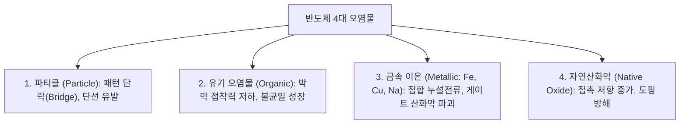
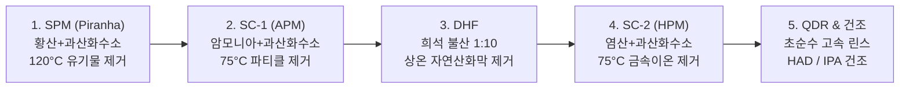

> **카테고리**: Part 3. 반도체 핵심 단위 제조 공정  
> **태그**: #세정공정 #Cleaning #RCA세정 #SPM #SC1 #SC2 #DHF #QDR #파티클제어  
> **추천 독자**: 반도체 수율 향상의 일등공신인 습식 화학 세정 메커니즘을 마스터하려는 공정 엔지니어

---

> 💡 **핵심 요약 (3줄 정리)**  
> 1. 세정 공정은 웨이퍼 표면의 **파티클, 유기물, 금속이온, 자연산화막**을 제거하는 공정으로, 전체 공정의 $30\%$ 이상 빈번하게 수행됩니다.  
> 2. 업계 표준인 **RCA 세정**은 **SPM(유기물 탄화) → SC-1(파티클/유기물 탈착) → DHF(산화막 제거) → SC-2(금속이온 제거)** 순서로 진행됩니다.  
> 3. 세정 후에는 **QDR(급속 배수 린스)**과 **HAD/IPA 건조**를 통해 워터마크 결함 없이 웨이퍼를 완벽히 건조시킵니다.  

---

## 1. 반도체 4대 오염물질과 그 영향

반도체 수율(Yield) 저하의 $70\%$ 이상은 표면 오염물에 의해 발생합니다.

---

## 2. RCA 표준 세정 공정 완벽 분석

  
*▲ [그림 9-1] RCA 세정 기술의 발전과 대표적인 SPM, SC-1, DHF, SC-2 세정 흐름 (출처: 반도체공정장비 #5)*

1970년 미국 RCA 연구소의 베르너 컨(Werner Kern) 박사가 확립한 화학 습식 세정법으로, 현재까지 전 세계 팹의 표준입니다.

### (1) SPM (Sulfuric acid - Hydrogen Peroxide Mixture / Piranha)
* **조성**: $H_2SO_4 : H_2O_2 = 4:1 \sim 5:1$ (온도: $100 \sim 130^\circ\text{C}$)
* **원리**: 농황산의 강력한 탈수 작용과 과산화수소의 산화력에 의해 매우 강력한 산화제인 카로산($H_2SO_5$)이 생성되어, 포토레지스트(PR) 찌꺼기 및 고분자 유기 오염물을 물과 $CO_2$로 완전 탄화 분해합니다.
* **표면 효과**: 소수성 표면을 친수성(Hydrophilic)으로 개질합니다.

### (2) SC-1 (Standard Clean 1 / APM)
* **조성**: $NH_4OH : H_2O_2 : DIW = 1 : 1 : 5$ (온도: $70 \sim 80^\circ\text{C}$)
* **원리 (Zeta Potential 메커니즘)**:
  1. $H_2O_2$가 실리콘 표면을 미세하게 산화시킵니다.
  2. $NH_4OH$ 알칼리가 산화막 표면을 수 $\text{\AA}$ 단위로 서서히 에칭(리프트 오프)합니다.
  3. 알칼리 용액 내에서 실리콘 표면과 파티클 표면 모두 음($-$)의 제타 전위(Zeta Potential)를 띠게 되어, **정전기적 척력(Repulsion)**에 의해 파티클이 떨어져 나옵니다.

### (3) DHF (Dilute Hydrofluoric acid)
* **조성**: $HF : DIW = 1 : 10 \sim 1 : 50$ (상온)
* **원리**: 실리콘 기판은 녹이지 않고 표면의 자연산화막($SiO_2$)만 선택적으로 용해 제거합니다.
  $$SiO_2 + 6HF → H_2SiF_6 + 2H_2O$$
* **표면 효과**: 산화막이 벗겨진 실리콘 표면은 수소 종단($Si-H$)되어 물을 밀어내는 **소수성(Hydrophobic)** 상태가 됩니다.

### (4) SC-2 (Standard Clean 2 / HPM)
* **조성**: $HCl : H_2O_2 : DIW = 1 : 1 : 5$ (온도: $70 \sim 80^\circ\text{C}$)
* **원리**: 알칼리 및 중금속($Fe, Cu, Al, Na$) 이온을 용해성 염화물 착이온($[FeCl_6]^{3-}$ 등) 형태로 착화시켜 용액 내에 가둠으로써 웨이퍼 표면 재흡착을 완벽히 방지합니다.

---

## 3. 린스(Rinse) 및 건조(Dry) 기술

  
*▲ [그림 9-2] 웨이퍼 표면의 화학 용액을 급속 배수 및 세척하는 QDR(Quick Drain Rinse) (출처: 반도체공정장비 #5)*

  
*▲ [그림 9-3] 세정 종료 후 웨이퍼를 수초 내에 건조시키는 HAD(Hot Air Dry) 및 제어 패널 (출처: 반도체공정장비 #5)*

아무리 화학 세정을 잘해도 헹굼과 건조에서 오염이 남으면 무용지물입니다.

* **QDR (Quick Drain Rinse)**: 수조 바닥의 대구경 밸브를 열어 약품을 순식간에 하부로 쏟아내고 초순수(DIW)를 즉시 주입하여 화학 약품의 잔류 및 역오염을 방지.
* **HAD (Hot Air Dry)**: 고온 청정 질소/공기 제트로 웨이퍼 표면 수분을 날려 건조.
* **마랑고니(Marangoni) 건조**: IPA(이소프로필알코올) 증기를 분사하여 물과 IPA 간의 표면장력 차이를 유도, 물방울이 뭉치지 않고 빨려 나가게 하여 **워터마크(Water Mark, 실리카 잔유물) 결함을 제로화**.

---

## 4. 세정 장비 구조: 웻 스테이션 (Wet Station)"

  
*▲ [그림 9-4] 자동화된 웨이퍼 캐리어 딥핑식 세정 장비: 웻 스테이션(Wet Station) 외관 (출처: 반도체공정장비 #5)*

  
*▲ [그림 9-5] 웨이퍼 캐리어가 딥핑되는 화학 약품별 Cleaning Bath 수조 내부 (출처: 반도체공정장비 #5)*

  
*▲ [그림 9-6] PLC에 의해 각 배스의 온도, 딥핑 시간, 이송을 제어하는 조작 판넬 (출처: 반도체공정장비 #5)*

* **배스(Bath) 구성**: 화학 약품조(SPM, SC-1, DHF, SC-2)와 각 린스조(QDR)가 일렬로 배치.
* **PLC 제어 시스템**: 웨이퍼 캐리어(Carrier)를 로봇 암이 집어 정확한 시간(초 단위) 동안 딥핑(Dipping) 후 다음 배스로 자동 이송.
* **안전 인터록**: 배스 내 히터 과열 방지 센서, 화학액 순환 유량 감지기, 배기압 센서 연동.

---

## 💡 핵심 개념 점검 & 실무 Q&A

**Q1. SC-1 세정액에서 과산화수소($H_2O_2$)와 암모니아($NH_4OH$)의 화학적 역할 분담은 무엇인가요?**  
* **핵심 해설**: 암모니아($NH_4OH$)만 단독으로 사용하면 실리콘 표면을 거칠게(Pitting) 비등방성 에칭하여 표면 거칠기(Roughness)를 악화시킵니다. 따라서 산화제인 과산화수소($H_2O_2$)가 표면에 균일하고 얇은 보호 산화막을 먼저 형성하고, 암모니아가 이를 아주 느린 속도로 균일하게 에칭함으로써 표면 손상 없이 파티클만 리프트 오프(Lift-off) 방식으로 안전하게 탈착시킵니다.

**Q2. 웨이퍼 건조 공정에서 발생하는 워터마크(Water Mark)의 발생 원인과 해결책은 무엇인가요?**  
* **핵심 해설**: 세정 후 웨이퍼 표면에 잔류한 물방울 속에 공기 중의 산소와 실리콘이 반응하여 규산($H_2SiO_3$)이 형성되고, 수분이 증발하면서 $SiO_2$ 결정(얼룩)으로 석출되는 현상입니다. 이를 방지하기 위해 불활성 질소($N_2$) 분위기에서 건조하거나, IPA 증기를 활용해 표면장력 구배를 만들어 물방울 자체를 남김없이 끌어내는 마랑고니 건조 기술을 적용합니다.

---

> **다음 글 예고**: [10강. 산화 공정 (Oxidation) - 열산화와 실리콘 산화막(SiO₂) 형성](/반도체제조공정-10-산화-공정-열산화-건식습식과-절연막형성.html)  
> 실리콘 기판 위에 흠잡을 데 없는 완벽한 절연막 $SiO_2$를 성장시키는 열산화 메커니즘과 Deal-Grove 모델을 분석합니다.
