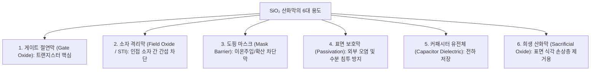
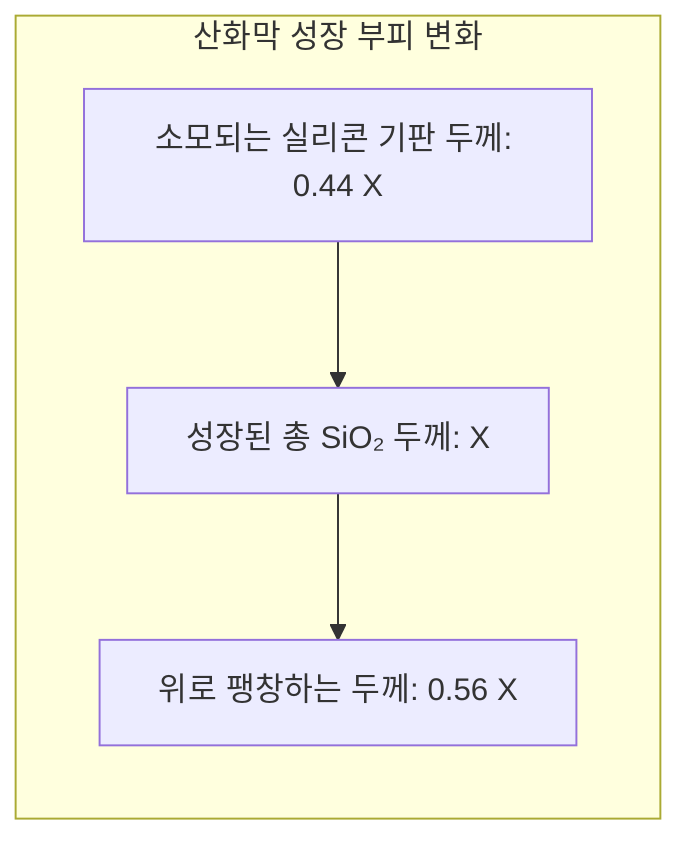
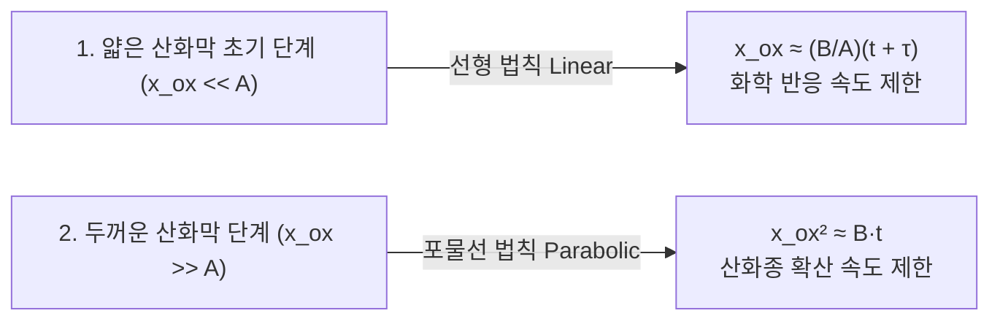

> **카테고리**: Part 3. 반도체 핵심 단위 제조 공정  
> **태그**: #산화공정 #열산화 #건식산화 #습식산화 #DealGrove모델 #GateOxide #Furnace  
> **추천 독자**: 절연막 형성 원리와 열역학적 산화 속도 모델을 완벽히 정복하려는 공정 엔지니어

---

> 💡 **핵심 요약 (3줄 정리)**  
> 1. **열산화(Thermal Oxidation)**는 $800 \sim 1200^\circ\text{C}$ 고온에서 실리콘 웨이퍼에 산소/수증기를 반응시켜 우수한 절연막인 $SiO_2$를 성장시키는 공정입니다.  
> 2. **건식 산화(Dry)**는 속도가 느리지만 막질이 치밀하여 **게이트 절연막**에 쓰이고, **습식 산화(Wet)**는 속도가 5~10배 빨라 **두꺼운 소자 격리막(STI/Field)**에 쓰입니다.  
> 3. 산화 속도는 초기 반응 속도 제한(선형)에서 확산 제한(포물선)으로 전이되는 **Deal-Grove 모델**을 따르며, 산화 시 실리콘 표면의 $44\%$가 소모됩니다.  

---

## 1. 실리콘 산화막($SiO_2$)의 6대 핵심 용도

  
*▲ [그림 10-1] 실리콘 웨이퍼 위에 SiO₂ 산화막을 성장시키는 목적과 주요 용도 (출처: 반도체공정장비 #6)*

  
*▲ [그림 10-2] 소자 격리용 필드 산화막(Field Oxide) 및 게이트 산화막(Gate Oxide) 단면 (출처: 반도체공정장비 #6)*

실리콘이 반도체의 제왕이 된 가장 결정적인 이유는 공기 중 산소와 반응하여 우수한 전기적 절연체인 이산화규소($SiO_2$)를 손쉽게 형성하기 때문입니다.

---

## 2. 열산화 반응 메커니즘과 실리콘 소모율

  
*▲ [그림 10-3] 열산화 시 실리콘 기판 44% 소모 및 산화막 56% 팽창 모식도 (출처: 반도체공정장비 #6)*

산화 반응은 기판 실리콘($Si$) 원자와 가스 산화종($O_2$ 또는 $H_2O$)이 반응하므로, **산화막이 두꺼워질수록 원래 실리콘 기판 내부로 파고들며 성장**합니다.

* **체적 팽창**: 분자량과 밀도 관계($\frac{\rho_{Si} M_{SiO_2}}{\rho_{SiO_2} M_{Si}}$)에 의해 **성장된 산화막 두께($X_{ox}$)의 $44\%$는 실리콘 기판 내부를 소모**하고, 나머지 $56\%$는 표면 위로 솟아오릅니다.

---

## 3. 건식 산화 (Dry) vs 습식 산화 (Wet) 비교

  
*▲ [그림 10-4] 습식 산화와 건식 산화 공정의 반응 속도, 막질 밀도 장단점 비교표 (출처: 반도체공정장비 #6)*

| 구분 | 건식 산화 (Dry Oxidation) | 습식 산화 (Wet Oxidation) |
| :--- | :--- | :--- |
| **반응 가스** | 고순도 산소 가스 ($O_2$) | 고순도 수증기 ($H_2O$) |
| **화학 반응식** | $$Si(s) + O_2(g) → SiO_2(s)$$ | $$Si(s) + 2H_2O(g) → SiO_2(s) + 2H_2(g)$$ |
| **산화 속도** | **느림** (습식의 $1/5 \sim 1/10$) | **매우 빠름** ($H_2O$ 분자의 용해도/확산속도가 큼) |
| **막질 (Density)** | **매우 치밀하고 우수함** (결함 밀도 최소) | 다소 덜 치밀함 (수소 부산물 $Si-OH$ 결합 잔류) |
| **절연 파괴 전계** | 매우 높음 ($\approx 10\,\text{MV/cm}$) | 상대적으로 낮음 |
| **주요 적용처** | **초박막 게이트 절연막 (Gate Oxide)** | **두꺼운 소자 격리막(STI), 마스킹 산화막** |

---

## 4. Deal-Grove 산화 속도 모델

1965년 브루스 딜(Bruce Deal)과 앤디 그로브(Andy Grove)가 정립한 열산화 속도 해석 모델입니다.

$$x_{ox}^2 + A x_{ox} = B(t + \tau)$$

1. **선형 영역 (Linear Regime, 얇은 산화막)**:  
   * 산화종이 산화막을 뚫고 표면에 도달하기 쉬우므로, **계면에서의 화학 반응 속도($k_s$)가 전체 속도를 지배**합니다.
   * 선형 속도 상수: $\frac{B}{A} \propto k_s$
2. **포물선 영역 (Parabolic Regime, 두꺼운 산화막)**:  
   * 산화막이 두꺼워지면 산화종($O_2, H_2O$)이 이미 형성된 산화막 내부를 뚫고 실리콘 계면까지 도달하는 확산(Diffusion) 과정이 병목이 됩니다.
   * **확산 속도($D$)가 전체 속도를 지배**하며, 두께는 시간의 제곱근에 비례($x_{ox} \propto \sqrt{t}$)하여 증가 속도가 급격히 둔화됩니다.
   * 포물선 속도 상수: $B \propto D_{eff}$

---

## 5. 산화 공정 장비: Oxidation Furnace

  
*▲ [그림 10-5] 고온 열산화 공정을 수행하는 Oxidation Furnace 장비 본체 (출처: 반도체공정장비 #6)*

  
*▲ [그림 10-6] 웨이퍼 보트를 장입하는 로더 모듈(Loader Module) 및 석영 튜브 구조 (출처: 반도체공정장비 #6)*

  
*▲ [그림 10-7] 고온 산화 반응 가스를 정화 배출하는 웻 스크러버(Wet Scrubber) 연동 설비 (출처: 반도체공정장비 #6)*

* **구조**: 고순도 석영 튜브(Quartz Tube) 외부에 3~5개 존(Zone)으로 나뉜 고온 저항 히터(Multi-zone Heater) 배치.
* **웨이퍼 로딩**: 석영 보트(Quartz Boat)에 수십~수백 장의 웨이퍼를 수납한 뒤 자동 캔틸레버 로더(Cantilever Loader)로 튜브 내부에 장입.
* **가스 패널 & 스크러버**: $O_2, H_2, N_2$ 유량을 MFC로 정밀 제어하며, 염소 가스(DCE/TCA)를 미량 첨가하여 알칼리 금속($Na^+$)을 포획(Gettering)하고 산화막 결함을 줄임. 미반응 가스는 웻스크러버로 안전 배출.

---

## 💡 핵심 개념 점검 & 실무 Q&A

**Q1. 습식 산화(Wet Oxidation) 속도가 건식 산화(Dry)보다 훨씬 빠른 물리화학적 이유는 무엇인가요?**  
* **핵심 해설**: 산화 속도 상수 $B$는 산화제 분자의 산화막 내 용해도($C^\ast$)와 확산 계수($D$)의 곱($B = 2DC^\ast/C_1$)에 비례합니다. 수증기($H_2O$) 분자는 산소($O_2$) 분자에 비해 확산 계수 $D$는 약간 작지만, $SiO_2$ 격자 내에서의 **용해도($C^\ast$)가 $O_2$보다 수백 배 이상 압도적으로 높습니다**. 따라서 계면으로 공급되는 산화종의 절대적인 플럭스(Flux)가 훨씬 많기 때문에 습식 산화 속도가 5~10배 빠릅니다.

**Q2. 산화 공정 시 염소계 가스(HCl, Trans-LC 등)를 첨가하는 이유는 무엇인가요?**  
* **핵심 해설**: 산화 가스에 염소($Cl$) 성분을 미량 첨가하면 세 가지 중요한 효과가 있습니다. 첫째, 절연 파괴의 주원인인 이동성 알칼리 이온($Na^+, K^+$)과 반응하여 중성화된 염화물($NaCl$)로 휘발 제거(Gettering)합니다. 둘째, 실리콘 표면의 적층 결함(Stacking Fault)을 줄여 계면 트랩 밀도를 감소시킵니다. 셋째, 금속 불순물을 제거하여 산화막의 유전 파괴 내압(Dielectric Breakdown Field)을 비약적으로 향상시킵니다.

---

> **다음 글 예고**: [11강. 노광 공정 (Exposure) - 빛으로 그리는 미세 회로와 EUV](/반도체제조공정-11-노광-공정-포토리소그래피와-차세대-euv.html)  
> 반도체 원가의 35%를 차지하는 최고 난도 공정! DUV에서 13.5nm 극자외선 EUV까지 빛의 한계를 뚫어온 노광 기술을 조망합니다.
