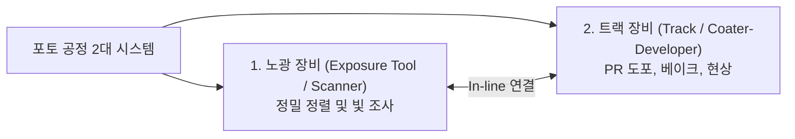
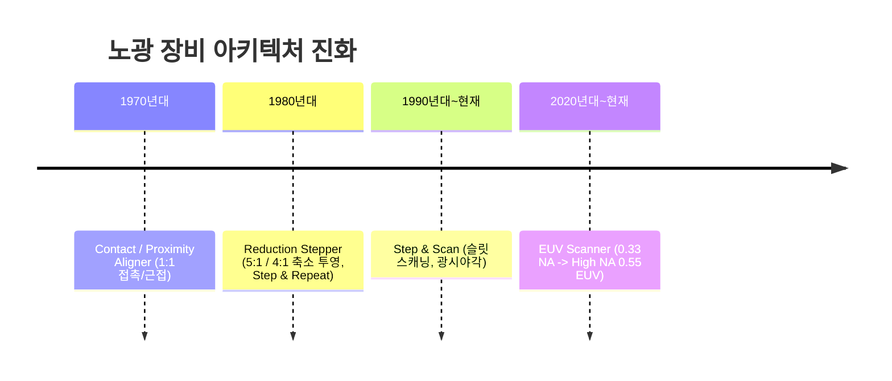

> **카테고리**: Part 3. 반도체 핵심 단위 제조 공정  
> **태그**: #포토공정 #노광공정 #포토리소그래피 #Stepper #Scanner #EUV #레일리공식 #ASML  
> **추천 독자**: 반도체 미세화의 심장인 광학 노광 시스템과 EUV 메커니즘을 마스터하려는 엔지니어

---

> 💡 **핵심 요약 (3줄 정리)**  
> 1. **노광(Exposure)**은 마스크(Mask)에 새겨진 미세 회로 패턴에 빛을 투과시켜 웨이퍼 표면의 감광제(PR)에 회로를 전사하는 핵심 공정입니다.  
> 2. 미세 패턴 해상도는 **레일리 공식**($R = k_1 \frac{\lambda}{NA}$)에 의해 결정되며, 광원은 **g-line → i-line → KrF → ArF → EUV(13.5nm)**로 진화했습니다.  
> 3. **EUV(극자외선)**는 모든 물질에 흡수되므로 굴절 렌즈 대신 **다층 반사 거울(Reflective Mirror)**과 진공 환경에서 작동하는 최고 난도의 광학 시스템입니다.  

---

## 1. 포토 공정(Photolithography)의 압도적 위상

  
*▲ [그림 11-1] 적층된 미세 회로 패턴 형성을 위한 포토공정(Photolithography)의 기본 개념 (출처: 반도체공정장비 #7)*

  
*▲ [그림 11-2] 전체 칩 제조 비용의 35%, 공정 시간의 60%를 차지하는 노광 공정의 위상 (출처: 반도체공정장비 #7)*


반도체 제조 라인에서 포토 공정은 전체 생산 비용의 **약 $35\%$**, 전체 소요 시간의 $60\%$를 차지합니다. 노광 장비 1대의 가격이 수천억 원에 달하는 이유가 바로 여기에 있습니다.



---

## 2. 노광 방식의 발전 역사: Contact → Stepper → Scanner

  
*▲ [그림 11-3] 축소 분할 노광기 Stepper와 동기 슬릿 스캐닝 Scanner의 비교 (출처: 반도체공정장비 #7)*

  
*▲ [그림 11-4] 노광 장비의 핵심 조명계, 마스크 레티클 스테이지, 투영 렌즈 광학계 (출처: 반도체공정장비 #7)*




1. **접촉/근접식 (Contact / Proximity)**: 마스크와 웨이퍼가 1:1로 직접 닿아 마스크 손상이 심하고 회절로 인해 미세화 불가.
2. **축소 투영 스테퍼 (Stepper)**: 마스크(레티클)의 회로를 렌즈를 통해 $4:1$ 또는 $5:1$로 축소 투영하여 웨이퍼의 1개 샷(Shot)을 노광하고 옆으로 이동(Step & Repeat).
3. **스캐너 (Scanner)**: 렌즈 중앙부의 가장 왜곡이 적은 좁은 슬릿(Slit) 빛만 통과시키며, 마스크 스테이지와 웨이퍼 스테이지를 반대 방향으로 고속 동기 스캔 노광하여 넓은 면적에 걸쳐 완벽한 해상도 구현.

---

## 3. 광원의 단파장화 진화와 레일리(Rayleigh) 공식

패턴의 최소 선폭(해상도, $R$)과 초점심도($DOF$)는 광학 물리 법칙인 **레일리 공식**에 의해 지배됩니다.

$$R = k_1 \frac{\lambda}{NA}, \quad DOF = k_2 \frac{\lambda}{NA^2}$$

* $R$ (해상도): 작을수록 더 미세한 회로 형성 가능.
* $\lambda$ (광원 파장): 짧을수록 유리.
* $NA$ (개구수, Numerical Aperture): 렌즈가 빛을 모으는 능력($NA = n \sin \theta$), 클수록 유리.
* $k_1$ (공정 상수): $0.25$가 광학적 물리 한계.

| 광원 명칭 | 파장 ($\lambda$) | 발생 방식 및 특징 | 한계 선폭 |
| :--- | :--- | :--- | :--- |
| **g-line** | $436\,\text{nm}$ | 수은 방전 램프 (가시광선 청색) | $\sim 1.0\,\mu\text{m}$ |
| **i-line** | $365\,\text{nm}$ | 수은 방전 램프 (자외선) | $\sim 0.35\,\mu\text{m}$ |
| **KrF DUV** | $248\,\text{nm}$ | 크립톤-불소 엑시머 레이저 | $\sim 130\,\text{nm}$ |
| **ArF DUV** | $193\,\text{nm}$ | 아르곤-불소 엑시머 레이저 (Dry) | $\sim 65\,\text{nm}$ |
| **ArFi (Immersion)** | $193\,\text{nm}$ | 렌즈-웨이퍼 사이에 물($n=1.44$) 채움 (등가 파장 $134\text{nm}$) | $\sim 38\,\text{nm}$ |
| **EUV (극자외선)** | $13.5\,\text{nm}$ | **주석(Sn) 액적 레이저 플라즈마 방전** | **수 나노미터 **($<3\text{nm}$) |

---

## 4. 차세대 게임 체인저: EUV (Extreme Ultra Violet)의 혁신

파장이 $13.5\text{nm}$인 EUV는 X선에 가까워 **공기(질소, 산소)를 포함한 지구상의 거의 모든 물질에 100% 흡수**됩니다!

```mermaid
graph TD
    subgraph DUV ["기존 DUV 노광기"]
        L1[레이저] --> T1[석영 투과 렌즈] --> M1[투과형 마스크] --> W1[웨이퍼]
    end
    subgraph EUV ["EUV 노광기 (ASML 독점)"]
        L2[CO2 고출력 레이저] --> Sn[주석 액적 플라즈마 13.5nm 광원]
        Sn --> R1[Mo/Si 다층 반사 거울계 (반사율 70%)]
        R1 --> R2[반사형 레티클 마스크]
        R2 --> Vac[초고진공 챔버 내 웨이퍼 전사]
    end
```

* **반사 광학계 (Reflective Optics)**: 유리를 통과할 수 없으므로 몰리브덴-실리콘(Mo/Si) 박막을 수십 층 코팅한 특수 브래그 반사경을 사용합니다.
* **초고진공 챔버**: 광선 경로 내에 공기 분자가 단 하나만 있어도 빛이 흡수되어 사라지므로 노광 챔버 전체를 초고진공 상태로 유지합니다.

---

## 5. 노광 장비의 정밀 기구계 (교재 수록 모델 분석)

  
*▲ [그림 11-5] 교재 수록 노광 장비(OFT Finetech OAM-110)의 외관 및 구조 (출처: 반도체공정장비 #7)*

  
*▲ [그림 11-6] 노광 장비의 전면 조작부 및 후면 인터록 유닛 (출처: 반도체공정장비 #7)*

  
*▲ [그림 11-7] 마스크와 웨이퍼의 나노미터 정렬을 위한 Alignment 현미경 조절계 (출처: 반도체공정장비 #7)*


노광기(OFT Finetech OAM-110 등)는 서브나노미터 정밀 제어를 위해 다음과 같은 하드웨어로 구성됩니다:
1. **조명계 (Illumination System)**: 빔 셰이퍼, 감쇠기, 조리개로 광속의 균일도와 간섭성(Coherence)을 최적화.
2. **Alignment 현미경**: 웨이퍼와 마스크에 각인된 나노 정렬 마크(Key)를 광학 이미지 센서로 인식 ($X, Y, \theta$ 축 오차 측정).
3. **초정밀 스테이지 (Piezo Stage)**: 레이저 간섭계(Laser Interferometer) 피드백을 통해 수 나노미터 단위로 오차를 보정하며 가속 이동.

---

## 💡 핵심 개념 점검 & 실무 Q&A

**Q1. ArF 액침(Immersion) 노광 기술에서 순수(DI Water)를 매질로 채웠을 때 해상도가 개선되는 원리는 무엇인가요?**  
* **핵심 해설**: 개구수 공식은 $NA = n \sin \theta$입니다. 기존 건식(Dry) 노광에서는 렌즈와 웨이퍼 사이가 굴절률 $n=1$인 공기였으므로 $NA$가 1을 넘을 수 없었습니다. 하지만 굴절률이 $n=1.44$인 초순수(DIW)를 렌즈와 웨이퍼 사이에 채우면, 빛의 파장이 매질 내에서 $\lambda_{eff} = \frac{\lambda_0}{n} \approx 134\text{nm}$로 단축되는 효과와 함께 $NA$를 $1.35$까지 끌어올릴 수 있어 해상도가 비약적으로 개선됩니다.

**Q2. 레일리 공식에서 개구수(NA)를 무작정 키우는 데 따르는 광학적 부작용은 무엇인가요?**  
* **핵심 해설**: 초점심도 공식은 $DOF = k_2 \frac{\lambda}{NA^2}$으로 개구수 $NA$의 제곱에 반비례합니다. 따라서 해상도를 높이기 위해 $NA$를 높이면 초점심도($DOF$)가 수십 나노미터 이하로 극도로 얕아집니다. 이 경우 웨이퍼 표면의 미세한 단차나 휨(Warpage)만으로도 초점이 벗어나 패턴이 뭉개지거나 박리되는 초점 이탈(Defocus) 불량이 발생하므로 고도의 CMP 평탄화 기술이 필수적으로 수반되어야 합니다.

---

> **다음 글 예고**: [12강. 트랙 공정 (Track) - 감광액 도포부터 현상 검사까지](/반도체제조공정-12-트랙-공정-hmds-pr코팅-베이크-현상검사.html)  
> 노광 장비와 인라인으로 결합하여 웨이퍼에 감광액을 깔고 회로를 현상해내는 트랙(Coater-Developer)의 모든 것을 파헤칩니다.
