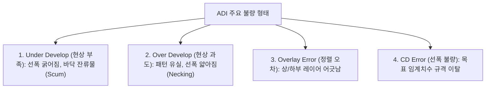

> **카테고리**: Part 3. 반도체 핵심 단위 제조 공정  
> **태그**: #트랙공정 #스핀코팅 #HMDS #PR코팅 #EBR #SoftBake #PEB #현상공정 #ADI  
> **추천 독자**: 포토 공정의 실질적 화학 처리와 인라인(In-line) 트랙 설비를 이해하려는 엔지니어

---

> 💡 **핵심 요약 (3줄 정리)**  
> 1. **트랙(Track)** 공정은 웨이퍼 세정 → **HMDS(접착력)** → **PR 스핀 코팅** → **Soft Bake** → 노광 → **PEB** → **현상(Develop)** → **Hard Bake**로 진행됩니다.  
> 2. 스핀 코팅 시 웨이퍼 가장자리에 뭉친 PR은 **EBR(Edge Bead Removal)** 노즐로 깎아내어 파티클 박리를 원천 차단합니다.  
> 3. 노광 후에는 **PEB(노광 후 굽기)**를 통해 정재파 효과를 제거하고, 현상 후 **ADI 검사**로 선폭(CD)과 정렬 오차(Overlay)를 전수 검증합니다.  

---

## 1. 트랙(Track) 장비의 역할과 인라인(In-line) 구조

  
*▲ [그림 12-1] 웨이퍼 로딩부터 HMDS, PR 코팅, 베이크, 노광, 현상, 검사까지의 트랙 일관 공정 (출처: 반도체공정장비 #8)*


노광기(Exposure Tool)가 빛을 쏘는 카메라라면, 트랙 장비는 **필름(감광제 PR)을 바르고, 말리고, 화학적으로 현상하는 암실 시스템**입니다. 노광기와 물리적으로 도킹되어 웨이퍼가 대기 중에 노출되지 않고 폐루프 안에서 초당 수십 장씩 자동 이송됩니다.

```mermaid
flowchart TD
    W[웨이퍼 투입] --> H[1. HMDS 증기 코팅 (소수성 표면 개질)]
    H --> C[2. PR 스핀 코팅 (Spin Coating & EBR)]
    C --> SB[3. Soft Bake (잔류 솔벤트 건조)]
    SB --> EXP[4. 노광 (Exposure - 노광기 연결)]
    EXP --> PEB[5. PEB (노광 후 굽기 - 정재파 제거)]
    PEB --> DEV[6. Development (현상액 분사)]
    DEV --> HB[7. Hard Bake (내식각성 강화)]
    HB --> ADI[8. 현상 후 검사 (ADI - CD/Overlay)]
```

---

## 2. 단위 단계별 상세 메커니즘

### (1) HMDS 코팅 (Vapor Priming)

  
*▲ [그림 12-2] 감광막(PR)과 실리콘 웨이퍼 표면의 접착력 증대를 위한 HMDS 개질 메커니즘 (출처: 반도체공정장비 #8)*

* **목적**: 감광막(PR)과 웨이퍼 표면의 **접착력(Adhesion) 증대**.
* **원리**: 실리콘 및 산화막 표면은 대기 중 수분과 결합하여 친수성($Si-OH$, 실란올기)을 띱니다. 반면 유기물인 PR은 소수성입니다. 물과 기름이 겉돌듯 PR이 들뜨는(Lifting) 현상을 막기 위해, 기화된 **HMDS (Hexamethyldisilazane)** 가스를 쬐어 표면을 메틸기($-CH_3$)로 치환된 소수성으로 개질합니다.

### (2) PR 스핀 코팅 (Spin Coating) & EBR

  
*▲ [그림 12-3] 스핀 코터 회전속도(3000~8000 RPM)에 따른 감광막 두께 및 균일도 상관관계 (출처: 반도체공정장비 #8)*

  
*▲ [그림 12-4] 웨이퍼 가장자리에 뭉친 PR을 솔벤트로 깎아내는 EBR(Edge Bead Removal) 공정 (출처: 반도체공정장비 #8)*

  
*▲ [그림 12-5] 고속 회전 척과 PR 디스펜스 노즐이 장착된 실제 스핀 코팅 모듈 (출처: 반도체공정장비 #8)*

* 웨이퍼를 진공 척(Vacuum Chuck)에 고정하고 중심부에 액체 감광제(PR)를 적하한 뒤, **$3000 \sim 8000\,\text{rpm}$의 초고속으로 회전**시켜 원심력으로 균일한 박막을 형성합니다.
* **막 두께 공식**: 회전 속도($\omega$)의 제곱근에 반비례 ($t \propto \frac{1}{\sqrt{\omega}}$).
* **EBR (Edge Bead Removal)**:
  * 회전 시 표면장력으로 웨이퍼 최외곽 테두리에 PR이 굵게 뭉치는 현상(Edge Bead)이 발생합니다.
  * 그대로 두면 이송 암이나 카세트에 닿아 깨지며 막대한 파티클을 뿜어내므로, 웨이퍼 가장자리 상/하부에 시너(Thinner) 노즐을 쏘아 테두리 $1 \sim 3\text{mm}$ 구간의 PR을 깨끗이 녹여 제거합니다.

### (3) Soft Bake (Pre-bake, SOB)
* **조건**: $90 \sim 100^\circ\text{C}$ 핫플레이트에서 수십 초간 가열.
* **효과**: 액체 PR 속 유기 용매(Solvent, $70\sim 80\%$)를 증발시켜 막을 고체화하고, 감광제의 민감도를 안정화합니다.

### (4) PEB (Post-Exposure Bake, 노광 후 굽기)
* **조건**: $100 \sim 120^\circ\text{C}$ 가열.
* **정재파 효과(Standing Wave Effect) 제거**: 기판 표면에서 반사된 빛과 입사광이 간섭을 일으켜 PR 측벽이 물결 모양으로 계단식 식각되는 현상을, 열에 의한 산(Acid) 분자의 미세 확산으로 매끄럽게 펴줍니다.
* 특히 DUV/EUV용 **화학증폭형 PR(CAR: Chemically Amplified Resist)**에서는 노광 시 발생한 광산발생제(PAG)의 산 촉매 연쇄 반응을 활성화시키는 결정적 단계입니다.

### (5) 현상 공정 (Development)

  
*▲ [그림 12-6] 광화학 반응에 따른 Positive Resist와 Negative Resist의 현상 결과 비교 (출처: 반도체공정장비 #8)*

* **원리**: 알칼리 현상액(TMAH 2.38% 수용액)을 웨이퍼 표면에 퍼들(Puddle) 또는 스프레이(Spray) 방식으로 분사.
* **Positive Resist (양화)**: 빛을 받은 영역의 고분자 결합이 끊겨 현상액에 녹아 나감 $	o$ 정밀 미세 패턴에 절대적 유리.
* **Negative Resist (음화)**: 빛을 받은 영역이 가교 결합(Cross-linking)되어 굳어 남고, 빛을 받지 않은 영역이 녹음.

### (6) Hard Bake
* 현상이 끝난 웨이퍼를 $110 \sim 130^\circ\text{C}$로 강하게 구워 잔류 현상액과 수분을 날리고, 후속 건식 식각(Etch)의 가혹한 플라즈마 충격을 견디도록 PR의 화학적 내식각성을 극대화합니다.

---

## 3. 현상 후 검사: ADI (After Develop Inspection)

  
*▲ [그림 12-7] ADI 검사에서 검출되는 주요 결함 패턴: 선폭 불량 및 현상 잔유물 (출처: 반도체공정장비 #8)*

  
*▲ [그림 12-8] Coater, Developer, Hot Plate 및 로더 파트로 구성된 트랙 장비 시스템 (출처: 반도체공정장비 #8)*


웨이퍼를 식각하기 전, 포토 공정이 제대로 되었는지 확인하는 **비파괴 검사** 단계입니다 (불량 시 PR을 벗겨내고 다시 노광하는 Re-work 가능!).



---

## 💡 핵심 개념 점검 & 실무 Q&A

**Q1. 포토레지스트(PR) 도포 전 웨이퍼에 HMDS(Hexamethyldisilazane) 처리를 생략하면 어떤 공정 결함이 발생하나요?**  
* **핵심 해설**: 실리콘 웨이퍼나 산화막 표면은 자연적으로 공기 중의 수산화기($-OH$)와 결합하여 친수성을 띠는 반면, PR은 유기 용매 기반의 소수성 폴리머입니다. HMDS 처리를 생략하면 표면 계면의 접착 에너지가 극도로 낮아져, 현상(Develop) 시 현상액의 표면장력이나 세정수의 수압에 의해 미세 PR 패턴이 통째로 뜯겨 나가는 패턴 리프팅(Pattern Lifting) 및 붕괴 결함이 발생합니다.

**Q2. 포토 공정에서 화학증폭형 PR(CAR)을 사용할 때 PEB(Post Exposure Bake) 온도가 임계선폭(CD)에 미치는 영향은 무엇인가요?**  
* **핵심 해설**: 화학증폭형 PR은 노광에 의해 생성된 산(Acid)이 PEB의 열에너지를 받아 주변 수백 개의 폴리머 사슬 탈보호(Deprotection) 반응을 촉매로서 연쇄 유도합니다. 따라서 PEB 온도가 기준보다 조금만 높아도 산의 열확산 거리와 반응량이 급증하여 빛을 덜 받은 영역까지 용해되므로 **패턴 선폭(CD)이 급격히 줄어들게(Positive PR 기준)** 됩니다. 즉, PEB 온도의 균일성(Uniformity)은 웨이퍼 전체의 CD 균일도를 결정하는 핵심 파라미터입니다.

---

> **다음 글 예고**: [13강. 습식 식각 (Wet Etch) - 등방성 식각과 선택비, 언더컷](/반도체제조공정-13-습식-식각-등방성식각과-선택비-언더컷.html)  
> 화학 약품으로 불필요한 박막을 깎아내는 식각 공정의 기초! 등방성 식각의 한계와 습식 세정/식각의 차이를 알아봅니다.
