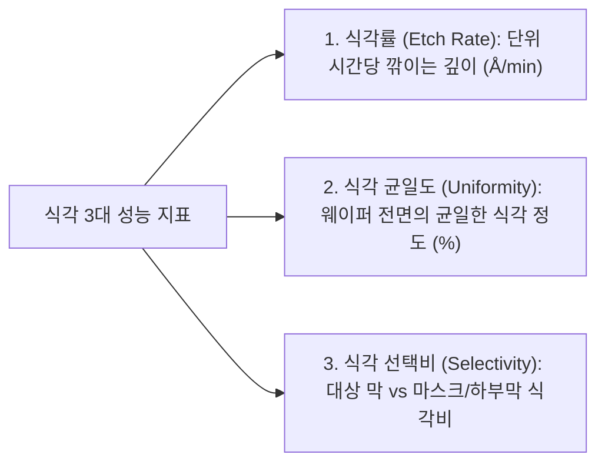
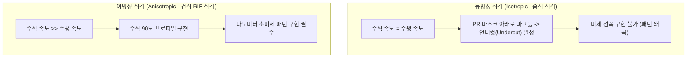

> **카테고리**: Part 3. 반도체 핵심 단위 제조 공정  
> **태그**: #식각공정 #습식식각 #등방성식각 #선택비 #식각율 #언더컷 #BOE #인산식각  
> **추천 독자**: 식각의 3대 핵심 성능 지표와 화학적 습식 식각의 한계 및 활용처를 이해하려는 분

---

> 💡 **핵심 요약 (3줄 정리)**  
> 1. **식각(Etching)**은 PR 패턴을 마스크 삼아 노출된 하부 박막을 화학적/물리적으로 깎아내어 영구적인 회로 패턴을 만드는 공정입니다.  
> 2. 식각의 3대 핵심 지표는 **식각률(Etch Rate)**, **균일도(Uniformity)**, 그리고 마스크 대비 대상 막의 선택적 제거비인 **선택비(Selectivity)**입니다.  
> 3. **습식 식각**은 모든 방향으로 동일하게 깎이는 **등방성(Isotropic)** 특성 때문에 PR 아래가 파고드는 **언더컷(Undercut)**이 발생하여 미세 패턴에는 한계가 있습니다.  

---

## 1. 식각(Etching) 공정의 정의와 비유

  
*▲ [그림 13-1] 웨이퍼 표면의 불필요한 박막을 선택적으로 제거하는 식각(Etching)의 정의 (출처: 반도체공정장비 #9)*

  
*▲ [그림 13-2] 화학 용액 수조에 웨이퍼를 담그거나 분사하여 부식시키는 습식 식각 (출처: 반도체공정장비 #9)*

송곳으로 금속판에 왁스를 긁어낸 뒤 산성 용액에 담가 원하는 그림을 부식시키는 '판화 기법(Etching)'에서 유래했습니다.
* 포토 공정에서 만들어진 감광막(PR) 패턴은 임시 마스크에 불과합니다.
* 식각 공정을 통해 노출된 산화막, 질화막, 폴리실리콘, 금속막을 선택적으로 제거해야만 비로소 웨이퍼 위에 영구적인 소자 구조가 새겨집니다.

---

## 2. 식각 공정의 3대 핵심 성능 지표

  
*▲ [그림 13-3] 식각 대상 막과 마스크 간의 식각률 비율인 식각 선택비(Selectivity) 개념 (출처: 반도체공정장비 #9)*

### (1) 식각률 (Etch Rate, $ER$)
* 단위 시간($t$)당 깎여 나가는 물질의 두께($x$)입니다.

$$ER = \frac{\Delta x}{\Delta t} \quad [\text{\AA/min} \text{ 또는 } \text{nm/min}]$$

### (2) 식각 균일도 (Etch Uniformity, $U$)
* 웨이퍼 한 장 내(Within-Wafer) 또는 웨이퍼 간(Wafer-to-Wafer) 식각 깊이의 편차를 나타냅니다. 값이 작을수록 우수합니다.

$$U(\%) = \frac{ER_{max} - ER_{min}}{2 \times ER_{avg}} \times 100$$

### (3) 식각 선택비 (Selectivity, $S$)
* 식각하고자 하는 대상 물질(Target Film)의 식각률과 보호막(Mask) 또는 하부 기판(Substrate)의 식각률 간의 비율입니다.

$$S = \frac{ER_{target}}{ER_{mask}} \quad (\text{또는 } \frac{ER_{target}}{ER_{underlayer}})$$

* 선택비가 높을수록 마스크가 손상되지 않고 대상 박막만 깨끗하게 깎아낼 수 있습니다.

---

## 3. 등방성(Isotropic) vs 이방성(Anisotropic)과 언더컷(Undercut)"

  
*▲ [그림 13-4] 모든 방향으로 깎이는 등방성(Isotropic)과 한 방향으로만 깎이는 이방성(Anisotropic) (출처: 반도체공정장비 #9)*

  
*▲ [그림 13-5] 습식 식각 시 PR 마스크 하부로 파고드는 언더컷(Undercut) 발생 전/후 단면 (출처: 반도체공정장비 #9)*

### ⚠️ 언더컷(Undercut)의 치명성
* 습식 식각액은 액체 분자의 화학 반응이므로 **모든 방향으로 동일한 속도**로 반응이 진행됩니다.
* 마스크 두께 아래로 식각 깊이($d$)만큼 수평으로도 파고들기 때문에, 패턴 선폭이 $3\mu\text{m}$ 이하로 미세화되면 양쪽 언더컷에 의해 PR 패턴이 완전히 무너져 내립니다!
* 이것이 최신 반도체 제조에서 회로 패터닝에 습식 식각을 쓸 수 없고 건식 플라즈마 식각을 쓰는 결정적 이유입니다.

---

## 4. 대표적인 습식 식각 화학 반응식

그럼에도 불구하고 습식 식각은 **압도적인 선택비**와 **저렴한 비용**, **표면 플라즈마 손상 제로**의 장점 덕분에 막 전체를 통째로 벗겨내는 스트립(Strip)이나 세정/에칭 공정에 활발히 쓰입니다.

### (1) 실리콘(Si) 식각 (질산 + 불산 수용액)
질산($HNO_3$)이 실리콘을 먼저 산화시키고, 불산($HF$)이 생성된 산화막을 연속 용해합니다:
$$Si + HNO_3 + H_2O → SiO_2 + HNO_2 + H_2$$
$$SiO_2 + 6HF → H_2SiF_6 + 2H_2O$$

### (2) 실리콘 산화막($SiO_2$) 식각: B.O.E (Buffered Oxide Etchant)
* 순수 $HF$만 쓰면 반응이 너무 빠르고 $F^-$ 이온 소모로 식각률이 계속 변합니다.
* 완충제인 불화암모늄($NH_4F$)을 혼합한 **B.O.E ($NH_4F : HF = 6:1$)**를 사용하여 pH를 일정하게 유지하고 안정적인 식각 속도를 확보합니다.

### (3) 질화막($Si_3N_4$) 식각: 고온 인산 ($H_3PO_4$)
* $160 \sim 180^\circ\text{C}$ 고온의 인산 수용액을 사용하여 산화막($SiO_2$)은 거의 깎지 않고 질화막만 $50:1$ 이상의 압도적 선택비로 선택 제거합니다 (하드마스크 제거용).

---

## 5. 습식 식각의 주요 공정 변수 (Parameters)

1. **Chemical 종류 및 농도**: 농도가 높을수록 식각률 증가.
2. **배스 온도(Bath Temperature)**: 아레니우스 법칙에 따라 온도가 $10^\circ\text{C}$ 상승할 때마다 반응 속도가 약 2배 증가.
3. **교반 및 에지테이션(Agitation)**: 웨이퍼 표면의 반응 부산물(기포)을 신속히 털어내지 않으면 국소적인 식각 불균일 발생.

---

## 💡 핵심 개념 점검 & 실무 Q&A

**Q1. 습식 식각(Wet Etch)이 초미세 패턴 패터닝에는 쓰이지 못하지만 여전히 반도체 양산 라인에서 필수적인 이유는 무엇인가요?**  
* **핵심 해설**: 습식 식각은 등방성 프로파일 때문에 미세 패터닝에는 부적합하지만, 화학적 선택비(Selectivity)가 건식 식각보다 압도적으로 높습니다(예: 고온 인산의 SiN 대 SiO2 선택비 50~100:1). 또한 플라즈마를 쓰지 않아 물리적 이온 충격에 의한 하부 결정 격자 손상(Substrate Damage)이 전혀 없습니다. 따라서 하드마스크 통박리(Strip), 불필요한 산화막 전면 제거, 습식 세정 공정에서 대체 불가능한 역할을 수행합니다.

**Q2. B.O.E (Buffered Oxide Etchant)에서 완충제(Buffer)로 불화암모늄($NH_4F$)을 첨가하는 화학적 원리는 무엇인가요?**  
* **핵심 해설**: 불산($HF$) 수용액으로 산화막을 식각하면 반응 과정에서 $HF$와 $HF_2^-$ 이온이 지속적으로 소모되어 용액의 pH가 상승하고 식각률(Etch Rate)이 시간에 따라 급격히 떨어집니다. 완충제인 $NH_4F$를 첨가하면 용액 내에서 $NH_4F \rightleftharpoons NH_4^+ + F^-$ 평형을 이루어 소모된 불소 이온을 지속적으로 보충해 줌으로써 용액 수명 동안 일정한 pH와 일정한 식각률을 유지시켜 줍니다.

---

> **다음 글 예고**: [14강. 건식 식각 (Dry Etch) - 플라즈마 원리와 반응성 이온 식각(RIE)](/반도체제조공정-14-건식-식각-플라즈마원리와-이방성-rie식각.html)  
> 나노 회로를 수직 90도로 깎아내는 마법! 플라즈마 방전 메커니즘과 현대 식각의 표준 RIE(반응성 이온 식각)를 파헤칩니다.
