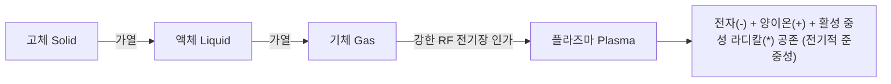
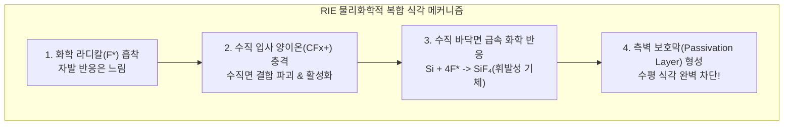

> **카테고리**: Part 3. 반도체 핵심 단위 제조 공정  
> **태그**: #건식식각 #플라즈마 #RIE #ICP #식각이방성 #RF제너레이터 #임피던스매칭  
> **추천 독자**: 나노미터 초미세 패턴을 수직 90도로 깎아내는 플라즈마 RIE 식각 원리를 마스터하려는 공정 엔지니어

---

> 💡 **핵심 요약 (3줄 정리)**  
> 1. **건식 식각(Dry Etch)**은 플라즈마(Plasma) 상태의 반응성 라디칼과 양이온을 이용하여 불필요한 박막을 수직 이방성으로 제거하는 핵심 공정입니다.  
> 2. **RIE (반응성 이온 식각)**는 물리적 이온 충격과 화학적 라디칼 반응의 시너지 효과로 **완벽한 수직 프로파일과 높은 선택비**를 동시에 달성합니다.  
> 3. 최신 식각 장비는 **고밀도 유도결합 플라즈마(ICP)** 방식을 채택하여 플라즈마 밀도와 이온 충격 에너지를 독립적으로 정밀 제어합니다.  

---

## 1. 물질의 제4상태: 플라즈마(Plasma)의 기초

  
*▲ [그림 14-1] 제4의 물질 상태인 플라즈마의 정의와 전자(-), 이온(+), 중성 입자들의 집단 운동 (출처: 반도체공정장비 #10)*

  
*▲ [그림 14-2] 고주파 RF 전계 인가 및 충돌 이온화에 의한 글로우 방전 발생 원리 (출처: 반도체공정장비 #10)*


고체에 열을 가하면 액체, 액체를 가열하면 기체가 되며, 기체에 더욱 강한 전기 에너지를 인가하면 기체 분자가 전자와 이온으로 분리되는 **플라즈마(제4의 물질 상태)**가 됩니다.



### (1) 플라즈마 발생 메커니즘 (RF 글로우 방전)
1. 진공 챔버에 공정 가스($CF_4, Cl_2, Ar$ 등)를 주입하고 고주파 RF 전원($13.56\,\text{MHz}$)을 인가합니다.
2. 챔버 내 잔류 자유전자가 강한 전기장에 의해 가속됩니다.
3. 고속 전자가 중성 가스 분자와 충돌하여 3가지 핵심 반응을 유도합니다:
   * **이온화 (Ionization)**: $e^- + Ar → Ar^+ + 2e^-$ (플라즈마 유지)
   * **해리 (Dissociation)**: $e^- + CF_4 → CF_3^\ast + F^\ast + e^-$ (반응성 높은 **라디칼 Radical** 대량 생성)
   * **여기 및 발광 (Excitation & Relaxation)**: 충돌로 들뜬 원자가 바닥상태로 떨어지며 고유한 빛 방출 (글로우 방전, OES 플라즈마 진단에 활용)

---

## 2. 건식 식각의 3대 방식 비교

  
*▲ [그림 14-3] 플라즈마 방전에 의한 반응 가스 생성, 확산, 표면 반응, 배기 4단계 메커니즘 (출처: 반도체공정장비 #10)*

  
*▲ [그림 14-4] 물리적 스퍼터 에칭과 화학적 반응성 이온 식각(RIE)의 원리 비교 (출처: 반도체공정장비 #10)*


| 구분 | 물리적 스퍼터 식각 (Sputter) | 화학적 플라즈마 식각 (Plasma) | 반응성 이온 식각 (RIE) |
| :--- | :--- | :--- | :--- |
| **작용 주체** | 비반응성 불활성 가스 이온 ($Ar^+$) | 중성 화학 활성 라디칼 ($F^\ast, Cl^\ast$) | **이온($Ar^+, CF_x^+$) + 라디칼($F^\ast$) 복합** |
| **식각 메커니즘** | 물리적 충돌 운동량 전달 (당구공 효과) | 표면 화학 반응 후 휘발성 가스 배출 | **물리적 결합 파괴 + 화학 반응 가속** |
| **식각 프로파일** | **완전 이방성 (Anisotropic, 수직)** | 등방성 (Isotropic, 측면 언더컷) | **완벽한 이방성 (수직 90도 프로파일)** |
| **선택비 (Selectivity)** | **매우 나쁨 (약 1:1, 마스크도 깎임)** | 매우 우수함 | **우수함 **($10:1 \sim 30:1$) |
| **기판 손상 (Damage)** | 큼 (결정 격자 파괴, 원자 주입) | 없음 | 조절 가능 (낮은 바이어스로 제어) |



---

## 3. 고밀도 플라즈마 소스: CCP vs ICP

* **용량 결합 플라즈마 (CCP: Capacitively Coupled Plasma)**:  
  * 평행 평판 전극에 RF 전원을 인가하는 전통적 방식.
  * 플라즈마 밀도가 상대적으로 낮고($10^9 \sim 10^{10}\,\text{cm}^{-3}$), 소스 파워를 올리면 이온 에너지까지 덩달아 올라가 기판 손상 위험이 큼.
* **유도 결합 플라즈마 (ICP: Inductively Coupled Plasma)**:  
  * 챔버 외벽의 나선형 유도 코일(Antenna)로 시변 자기장을 유도하여 전자를 원주 방향으로 가속.
  * **$10^{11} \sim 10^{12}\,\text{cm}^{-3}$의 고밀도 플라즈마**를 저압($<10\,\text{mTorr}$)에서 생성.
  * **핵심 장점**: 상단 코일 전력(Source Power)으로 플라즈마 밀도(라디칼 양)를 조절하고, 하단 웨이퍼 척 전력(Bias Power)으로 이온 가속 에너지를 **100% 독립 제어** 가능!

---

## 4. 건식 식각 장비의 하드웨어 구성

  
*▲ [그림 14-5] RIE(Reactive Ion Etching) 장비의 반응 챔버 및 가스 주입/배기 유닛 구성 (출처: 반도체공정장비 #10)*

  
*▲ [그림 14-6] 실제 건식 식각 장비의 반응 챔버 외관 및 제어계 조작 모듈 (출처: 반도체공정장비 #10)*


```mermaid
flowchart LR
    Gas[공정 가스 공급 MFC] --> Shower[상단 샤워헤드 / 유도 코일]
    Shower --> Chamber[진공 반응 챔버]
    Chamber --> Chuck[정전척 ESC (헬륨 후면 냉각)]
    Chamber --> Throttle[APC 쓰로틀 밸브]
    Throttle --> TMP[터보 분자 펌프 & 드라이 펌프]
    RF[RF Generator 13.56 MHz] --> Match[Impedance Matching Box]
    Match --> Chamber
```

1. **진공 챔버 & 정전척 (ESC: Electrostatic Chuck)**:  
   * 쿨롱 힘으로 웨이퍼를 물리적 클램프 없이 평탄하게 흡착 고정하며, 웨이퍼 후면에 헬륨($He$) 가스를 흘려 플라즈마 열을 칠러로 신속 배출.
2. **RF 발전기 & 임피던스 매칭 네트워크 (Matching Box)**:  
   * 플라즈마 임피던스는 가스 종류와 압력에 따라 계속 변하므로, 가변 인덕터($L$)와 커패시터($C$) 모터를 실시간 제어하여 반사 전력(Reflected Power)을 $0\text{W}$로 만들고 전송 효율($50\,\Omega$ 매칭)을 극대화.
3. **APC (Auto Pressure Controller) & 쓰로틀 밸브 (Throttle Valve)**:  
   * 챔버 내부의 압력을 바라트론 게이지로 측정하여 쓰로틀 밸브의 개폐 각도를 밀리초 단위로 제어, 공정 압력을 mTorr 단위로 정밀 유지.

---

## 💡 핵심 개념 점검 & 실무 Q&A

**Q1. RIE 식각 공정에서 수직 이방성(Anisotropic Profile)을 얻기 위한 측벽 보호막(Passivation)의 원리는 무엇인가요?**  
* **핵심 해설**: 실리콘 식각 시 가스로 $CF_4$나 $HBr, Cl_2$를 주입하면 식각 반응 부산물과 탄소-불소계 폴리머가 웨이퍼 표면 전체에 얇게 증착됩니다. 이때 수직으로 가속되어 내려오는 양이온들은 바닥면의 폴리머를 때려 깨부수고 식각을 진행시키지만, 수평 방향으로는 이온 충격이 없으므로 측벽에는 보호막(Passivation Layer)이 그대로 남아 중성 라디칼의 수평 공격을 차단합니다. 이로 인해 측면 언더컷 없이 완벽한 90도 수직 식각 프로파일을 얻게 됩니다.

**Q2. 임피던스 매칭 네트워크(Matching Network)가 제어에 실패했을 때 장비에 미치는 악영향은 무엇인가요?**  
* **핵심 해설**: 플라즈마 부하 임피던스와 RF 전원 임피던스($50\,\Omega$)가 일치하지 않으면 인가된 RF 파워의 상당량이 반사파(Reflected Power)로 되돌아옵니다. 이는 첫째, 플라즈마 방전을 불안정하게 만들어 식각률 저하 및 불균일을 초래하고, 둘째, 반사된 고출력 고주파 에너지가 RF 발전기 내부 증폭 소자를 과열시켜 고가의 전원 장치를 파손시킬 수 있습니다.

---

> **다음 글 예고**: [15강. 도핑 공정 - 열확산과 이온주입기술 비교](/반도체제조공정-15-도핑-공정-열확산과-이온주입기술-비교.html)  
> 부도체 실리콘에 전도성을 불어넣는 마법! 고전적 열확산 방식과 최첨단 이온주입기(Ion Implanter)의 하드웨어를 비교 분석합니다.
