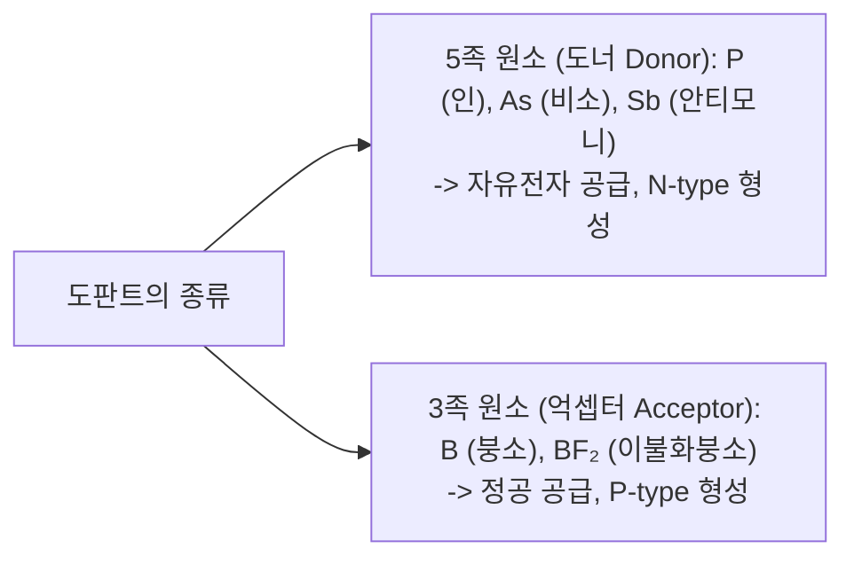
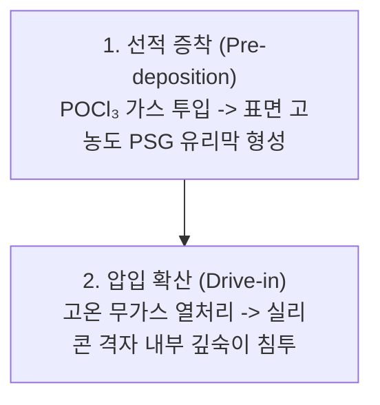

> **카테고리**: Part 3. 반도체 핵심 단위 제조 공정  
> **태그**: #도핑공정 #이온주입 #열확산 #POCl3 #이온주입기 #질량분석기 #Dose #도판트  
> **추천 독자**: 반도체 전기적 특성을 결정짓는 도핑 메커니즘과 이온주입 장비 하드웨어를 정복하려는 엔지니어

---

> 💡 **핵심 요약 (3줄 정리)**  
> 1. **도핑(Doping)**은 3족(B, P형) 또는 5족(P/As, N형) 불순물을 주입하여 반도체의 전도도를 수억 배 높이는 공정입니다.  
> 2. 고온 전기로를 이용하는 **열확산(Thermal Diffusion)**은 등방성 확산과 열예산 문제로 미세 공정에 한계가 있습니다.  
> 3. 현대 공정의 표준인 **이온주입(Ion Implantation)**은 이온 가속 에너지를 통해 **주입 깊이(Energy)와 도핑 농도(Dose)를 완벽히 독립 제어**합니다.  

---

## 1. 도핑의 목적과 도판트(Dopant) 원소

  
*▲ [그림 15-1] 반도체 전기적 특성 변환을 위한 도핑의 정의와 도너(Donor)/억셉터(Acceptor) 분류 (출처: 반도체공정장비 #11)*

  
*▲ [그림 15-2] 도핑에 따른 반도체 전자 에너지 밴드 구조 및 페르미 준위 변화 (출처: 반도체공정장비 #11)*

순수 실리콘은 상온에서 캐리어가 없어 전기가 통하지 않습니다. 원하는 영역에 미량의 불순물을 정밀하게 주입해야만 다이오드와 트랜지스터의 소스/드레인 영역을 만들 수 있습니다.

---

## 2. 열확산 공정 (Thermal Diffusion)의 원리와 한계

  
*▲ [그림 15-3] 고온 열처리로(Furnace)를 이용한 가스 불순물 침투 확산 공정 (출처: 반도체공정장비 #11)*

고온($900 \sim 1100^\circ\text{C}$) 확산로(Furnace)에 웨이퍼를 넣고 가스 상태의 불순물 전구체를 공급하여 실리콘 내부로 열확산 침투시키는 전통적 방식입니다.

* **대표 화학 반응: $POCl_3$ (염화포스포릴 / 포클 도핑)**:
  $$4POCl_3(g) + 3O_2(g) → 2P_2O_5(s) + 6Cl_2(g)$$
  $$2P_2O_5(s) + 5Si(s) → 4P(\text{Si 내부 확산}) + 5SiO_2(s)$$
* **열확산의 치명적 한계**:
  * 농도 기울기에 따른 **등방성 확산**: 수직뿐 아니라 마스크 아래 수평 방향으로도 도판트가 번져 나가 미세 채널 구현 불가.
  * 고온 장시간 공정으로 이미 형성된 하부 도핑 프로파일이 무너지는 **열예산(Thermal Budget) 낭비**.
  * 주입 깊이와 표면 농도를 독립적으로 제어할 수 없음 (표면 농도는 항상 고용도 한계에 묶임).

---

## 3. 현대 반도체의 표준: 이온주입 공정 (Ion Implantation)

  
*▲ [그림 15-4] 고에너지 이온주입기를 통한 불순물 이온 물리적 주입 메커니즘 (출처: 반도체공정장비 #11)*

가스 분자를 이온화한 뒤 수만~수십만 볼트($\text{keV} \sim \text{MeV}$)의 고전압으로 가속하여, 실리콘 표면에 총알을 쏘듯 물리적으로 박아 넣는 비평형 고정밀 공정입니다.

### 이온주입 장비의 5대 핵심 유닛 완벽 해부
1. **이온원 (Ion Source)**:  
   * 소스 가스($BF_3, PH_3, AsH_3$)를 필라멘트 아크 방전으로 충돌시켜 양이온($B^+, BF_2^+, P^+, As^+$) 생성.
2. **질량분석 전자석 (Mass Analyzer Magnet)**:  
   * 로렌츠 힘($F = qvB = \frac{mv^2}{r}$)에 의해 질량/전하비($m/q$)에 따라 이온 궤적의 회전 반경이 달라짐. 슬릿(Slit)을 통해 원하는 순수 동위원소 이온만 $99.99\%$ 정밀 선별!
3. **가속관 (Acceleration Tube)**:  
   * 다단 고전압 전극(DC High Voltage)으로 이온을 가속. 인가 전압(Energy, $\text{keV}$)이 **이온의 침투 깊이(투영 비정, Projected Range $R_p$)**를 결정.
4. **스캔 시스템 (Neutral Trap & Scan Plates)**:  
   * 전자기 편향 코일로 빔을 좌우/상하로 고속 주사하여 300mm 대구경 웨이퍼 전체에 $1\%$ 이내의 균일성으로 조사.
5. **엔드 스테이션 & 패러데이 컵 (Faraday Cup)**:  
   * 웨이퍼에 입사되는 총 전하량($Q = \int I dt$)을 측정하여, 단위 면적당 주입된 총 원자 수인 **도즈(Dose, $\text{atoms/cm}^2$)**를 실시간으로 모니터링하고 목표 도즈 달성 시 즉각 빔 차단.

---

## 4. 열확산 vs 이온주입 기술 비교

  
*▲ [그림 15-5] 열확산 공정과 이온주입 공정의 종합 장단점 비교표 (출처: 반도체공정장비 #11)*

  
*▲ [그림 15-6] 도핑 장비의 컨트롤 모듈, 로더 모듈, 히터 모듈, 가스 공급 모듈 (출처: 반도체공정장비 #11)*

| 비교 항목 | 열확산 공정 (Diffusion) | 이온주입 공정 (Ion Implantation) |
| :--- | :--- | :--- |
| **공정 온도** | 고온 ($900 \sim 1100^\circ\text{C}$) | **상온 **($<100^\circ\text{C}$) |
| **도핑 방향성** | **등방성 (수평 침투 심함)** | **완벽한 이방성 (수직 직진 주입)** |
| **프로파일 제어** | 농도와 깊이 연동 (독립 제어 불가) | **농도(Dose)와 깊이(Energy) 100% 독립 제어** |
| **도핑 농도 제어** | 고용도 한계에 의존 (저농도 제어 어려움) | 광범위 정밀 제어 ($10^{11} \sim 10^{16}\,\text{cm}^{-2}$) |
| **마스크 재료** | 고온을 견디는 $SiO_2, Si_3N_4$만 가능 | **일반 포토레지스트(PR) 마스크 직접 사용 가능** |
| **단점 및 한계** | 미세 얕은 접합(Shallow Junction) 불가 | **고에너지 충격으로 실리콘 격자 파괴 (어닐링 필수)** |

---

## 💡 핵심 개념 점검 & 실무 Q&A

**Q1. 이온주입 공정 시 웨이퍼를 수직($0^\circ$)으로 놓지 않고 $7^\circ$ 기울여서(Tilt) 주입하는 이유는 무엇인가요?**  
* **핵심 해설**: 단결정 실리콘은 격자 구조상 원자들이 규칙적으로 배열되어 있어 특정 각도에서 원자들 사이에 텅 빈 터널 같은 공간이 형성됩니다. 이온 빔이 이 터널 방향과 정확히 평행하게 입사되면 원자핵과의 충돌 없이 비정상적으로 깊숙이 뚫고 들어가는 **채널링(Channeling) 현상**이 발생하여 접합 깊이가 왜곡됩니다. 이를 방지하기 위해 고의로 웨이퍼를 $7^\circ$ 정도 기울이고 회전(Twist)시켜 비정질 물질처럼 이온이 무작위 충돌하도록 만듭니다.

**Q2. P형 도판트로 가벼운 붕소 단일 이온($B^+$) 대신 무거운 분자 이온인 $BF_2^+$를 사용하는 이유는 무엇인가요?**  
* **핵심 해설**: 붕소($B$)는 원자량이 11로 매우 가벼워 낮은 가속 에너지에서도 실리콘 격자 깊숙이 파고드는 경향이 있어 초미세 MOSFET의 얕은 접합(Ultra-Shallow Junction) 형성이 어렵습니다. 반면 불소가 결합된 $BF_2^+$ 분자 이온(분자량 49)은 훨씬 무겁기 때문에, 동일한 가속 전압을 가해도 분자가 표면 충돌 시 붕소와 불소로 쪼개지면서 붕소는 원래 에너지의 약 $11/49$ (약 $22\%$)에 불과한 에너지만 갖게 됩니다. 이를 통해 극히 얕은 깊이에 고농도로 붕소를 주입할 수 있습니다.

---

> **다음 글 예고**: [16강. 열처리 공정 (Annealing) - 격자 결함 복원과 급속 열처리(RTA)](/반도체제조공정-16-열처리-공정-어닐링-furnace와-rta-도판트활성화.html)  
> 이온주입으로 파괴된 실리콘 격자를 수초 만에 마법처럼 치유하고 도판트를 깨우는 RTA(급속 열처리) 장비의 비밀을 알아봅니다.
