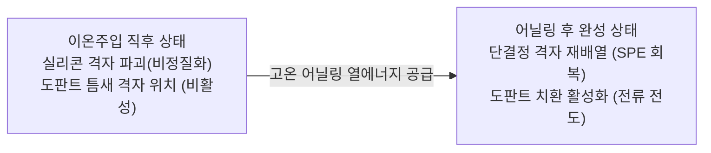
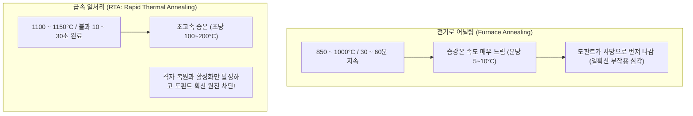

> **카테고리**: Part 3. 반도체 핵심 단위 제조 공정  
> **태그**: #열처리 #어닐링 #RTA #격자복원 #도판트활성화 #할로겐램프 #파이로미터 #열예산  
> **추천 독자**: 이온주입 후속 열역학적 치유 과정과 초고속 램프 가열 제어 메커니즘을 학습하려는 공정 엔지니어

---

> 💡 **핵심 요약 (3줄 정리)**  
> 1. **어닐링(Annealing)**은 이온주입 충격으로 비정질화된 실리콘의 **결정 격자 손상을 복원**하고, 도판트를 격자 자리로 치환하여 **전기적으로 활성화**하는 공정입니다.  
> 2. 전통적 전기로(Furnace) 어닐링은 열확산으로 접합이 깊어지는 문제가 있어, 수십 초 만에 열처리를 끝내는 **급속 열처리(RTA: Rapid Thermal Annealing)**가 필수적입니다.  
> 3. RTA 장비는 **텅스텐 할로겐 램프 어레이**로 초당 $100^\circ\text{C}$ 이상 급속 승온하며, **비접촉 광학 파이로미터**로 웨이퍼 온도를 정밀 피드백 제어합니다.  

---

## 1. 이온주입 직후의 실리콘 상태: 왜 열처리가 필요한가?

  
*▲ [그림 16-1] 이온주입 후 결정격자 Damage 제거 및 도판트 활성화를 위한 RTA 공정 개요 (출처: 반도체공정장비 #12)*

고에너지($\text{keV} \sim \text{MeV}$) 이온주입을 거친 직후의 웨이퍼는 정상이 아닙니다:
1. **격자 파괴 (Lattice Damage)**: 날아온 이온들이 실리콘 원자 수천 개를 격자 자리에서 튕겨내면서 표면 부근이 결정성을 잃고 엉망진창인 **비정질(Amorphous) 층**으로 전락합니다.
2. **비활성 도판트 (Inactive Dopants)**: 주입된 불순물($B, P, As$)들이 실리콘 격자 사이(Interstitial) 틈새에 끼어 있어 공유결합에 참여하지 못하므로, 전자를 내놓거나 흡수하지 못하는 **전기적 잉여 상태(Dead Dopant)**로 존재합니다.

---

## 2. 어닐링의 2대 핵심 목적

* **결정 격자 복원 (Recrystallization)**:  
  * 하부의 파괴되지 않은 단결정 실리콘 기판을 씨앗(Seed) 삼아, 열에너지를 받은 원자들이 본래의 다이아몬드 입방 격자로 착착 재배열되는 **고상 에피택시(SPE: Solid Phase Epitaxy)** 반응이 일어납니다.
* **도판트 전기적 활성화 (Dopant Activation)**:  
  * 도판트 원자가 빈 격자점(Vacancy)으로 이동하여 실리콘 원자 자리를 대신 차지(Substitutional Site 치환)함으로써, 4개의 공유결합을 형성하고 잉여 전자나 정공을 캐리어로 방출합니다.

---

## 3. 퍼니스(Furnace) 어닐링 vs 급속 열처리(RTA)

  
*▲ [그림 16-2] 고온을 정밀하게 제어하는 RTA 열처리 프로파일 곡선 (출처: 반도체공정장비 #12)*

반도체 집적도가 높아지면서 열처리 방식의 대전환이 일어났습니다.

### 왜 RTA의 짧은 시간이 결정적인가? (열예산: Thermal Budget)
* 격자 회복과 도판트의 치환 활성화는 **활성화 에너지($E_a$)가 매우 높아 초고온($1100^\circ\text{C}$)에서 수 초 내에 즉각 완결**됩니다.
* 반면 원하지 않는 도판트의 물리적 퍼짐(확산 거리는 $\sqrt{Dt}$)은 시간에 비례합니다.
* RTA는 온도는 높이되 시간을 극도로 단축($30\text{초}$)함으로써, **얕은 접합 깊이(Shallow Junction)를 원형 그대로 유지**하면서도 완벽한 전기적 활성화를 달성합니다!

---

## 4. RTA 장비 하드웨어 구성과 핵심 파라미터 (교재 상세 반영)

  
*▲ [그림 16-3] RTA 열처리 장비의 컨트롤 패널 및 챔버 모듈 구성 (출처: 반도체공정장비 #12)*

  
*▲ [그림 16-4] 최대 1200℃ 고속 가열이 가능한 히터 모듈 및 석영 챔버 (출처: 반도체공정장비 #12)*

  
*▲ [그림 16-5] 정밀 온도 조절기(온도 컨트롤러) 및 과열 방지 안전 장치 (출처: 반도체공정장비 #12)*

교재에 수록된 반도체 열처리 공정 장비의 주요 파트 분석입니다:

1. **히팅 모듈 (Heating Module)**:  
   * 최대 $1200^\circ\text{C}$ 가열이 가능한 **텅스텐 할로겐 램프(Tungsten-Halogen Lamp) 어레이**를 웨이퍼 상/하부에 배치하여 강력한 적외선 복사열로 초고속 가열.
2. **보트 & 트랜스퍼 모듈 (Boat & Transfer Module)**:  
   * 서보 모터(Servo Motor)로 구동되는 정밀 로봇이 웨이퍼를 챔버 내 석영 핀(Quartz Pin) 위에 점접촉으로 안착 (열전도 불균일 방지).
3. **온도 제어계 (Temperature Controller & Pyrometer)**:  
   * $1000^\circ\text{C}$ 고온에서 열전대(TC)를 직접 대면 웨이퍼가 오염되고 반응이 느리므로, 웨이퍼 후면에서 방출되는 적외선 복사 에너지를 감지하는 **비접촉식 광학 파이로미터(Optical Pyrometer)**를 적용하여 밀리초 단위로 closed-loop PID 전력 제어.
4. **플로우메터 및 가스 제어계 (Flowmeter & Gas Module)**:  
   * 고온에서 실리콘이 산화되는 것을 막기 위해 고순도 불활성 질소($N_2$) 또는 아르곤($Ar$) 가스 유량을 플로우메터로 정밀 공급.
5. **안전 인터록 (Safety Interlock)**:  
   * 냉각수 단수 감지(Water Flow Sensor), 공압 센서(Air Pressure Sensor), 과열 방지(Over-temperature) 감지 시 히터 전원을 즉각 차단하고 공압 밸브를 안전 닫힘(Fail-safe) 상태로 전환.

---

## 💡 핵심 개념 점검 & 실무 Q&A

**Q1. RTA 공정에서 비접촉식 파이로미터(Pyrometer)로 온도를 측정할 때 방사율(Emissivity) 오차가 발생하는 원인과 해결책은 무엇인가요?**  
* **핵심 해설**: 파이로미터는 슈테판-볼츠만 법칙($E = \epsilon \sigma T^4$)에 기반하여 복사 에너지를 온도로 환산하는데, 웨이퍼 후면에 증착된 박막의 종류(산화막, 질화막, 금속막)나 표면 거칠기에 따라 표면 방사율($\epsilon$)이 계속 달라집니다. 방사율이 틀리면 실제 온도와 측정 온도가 수십 도 이상 벌어지므로, 사전에 테스트 웨이퍼로 방사율을 보정(In-situ Emissivity Compensation)하거나 반사경을 설치해 흑체 복사 환경을 조성하는 기술을 적용합니다.

**Q2. 금속 실리사이드(Silicide) 형성 공정에서 RTA 2단계 열처리(2-Step Anneal)를 적용하는 이유는 무엇인가요?**  
* **핵심 해설**: 코발트 실리사이드($CoSi_2$)나 니켈 실리사이드($NiSi$) 형성 시, 1차 낮은 온도($400 \sim 500^\circ\text{C}$) RTA로 금속과 실리콘 계면에서만 제어된 1차 반응을 일으킨 뒤, 미반응 금속을 습식 식각(SPM)으로 선택 제거하고, 2차 높은 온도($700 \sim 800^\circ\text{C}$) RTA를 수행하여 가장 저항이 낮은 안정된 결정상으로 상전이시킵니다. 이를 통해 절연막 측벽으로 금속이 넘쳐 흘러 쇼트가 나는 브릿지(Bridge) 결함을 원천 방지합니다.

---

> **다음 글 예고**: [17강. 박막 증착 공정 (Thin Film) - PVD, CVD, ALD와 PECVD 시스템](/반도체제조공정-17-박막-증착-pvd-cvd-ald와-pecvd장비구조.html)  
> 나노 두께의 얇은 옷을 입히는 증착 기술의 삼총사! PVD, CVD, ALD의 원리와 플라즈마 PECVD 챔버 부품을 전격 분석합니다.
