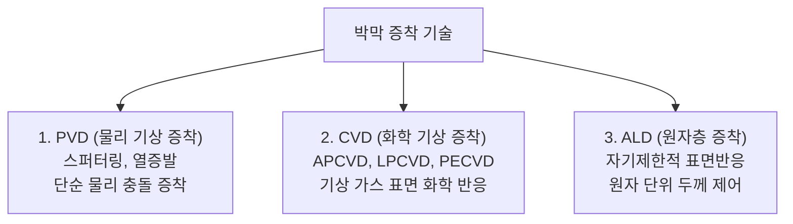
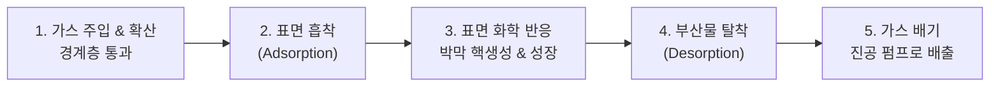
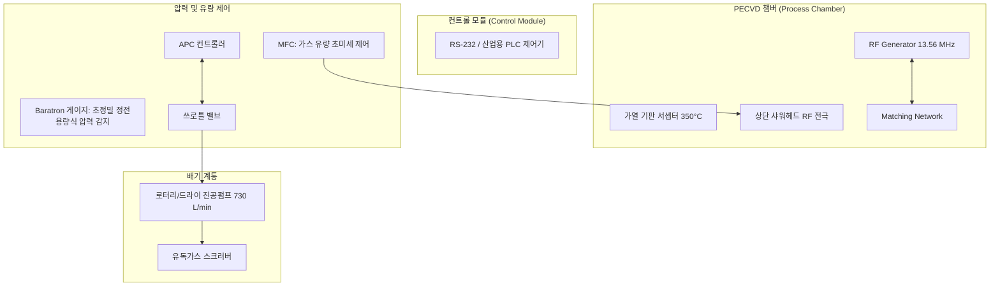

> **카테고리**: Part 3. 반도체 핵심 단위 제조 공정  
> **태그**: #박막증착 #ThinFilm #CVD #PVD #ALD #PECVD #단차피복성 #진공펌프 #MFC  
> **추천 독자**: 반도체 박막 형성의 화학/물리 메커니즘과 PECVD 장비 부품 엔지니어링을 마스터하려는 분

---

> 💡 **핵심 요약 (3줄 정리)**  
> 1. **박막 증착(Thin Film Deposition)**은 웨이퍼 표면에 $1000\text{\AA}(100\text{nm})$ 이하의 얇은 절연막, 반도체막, 전도성 금속막을 입히는 공정입니다.  
> 2. 증착 방식은 **PVD(물리 기상 증착)**, **CVD(화학 기상 증착)**, 원자 한 층씩 쌓는 궁극의 **ALD(원자층 증착)**로 분류됩니다.  
> 3. 플라즈마를 이용하는 **PECVD**는 $200 \sim 400^\circ\text{C}$ 저온에서 고속 증착이 가능하여 금속 배선 후공정에 필수적입니다.  

---

## 1. 박막(Thin Film)의 정의와 중요성

  
*▲ [그림 17-1] 1000Å (100nm) 이하의 얇은 막을 코팅하는 박막 증착 공정의 정의 (출처: 반도체공정장비 #13)*

  
*▲ [그림 17-2] 대표적인 박막 증착 방식인 CVD 장비와 PVD 장비의 외관 (출처: 반도체공정장비 #13)*

반도체에서 '박막'이란 두께가 **수 나노미터($\text{nm}$)에서 $1000\text{\AA}(100\text{nm})$ 이하**인 극도로 얇은 막을 의미합니다.
* 칩 내부에는 전기가 통하는 전도막(Al, Cu, W), 전기를 차단하는 층간 절연막(ILD/IMD, $SiO_2$, SiN, Low-k), 전하를 모으는 유전체막($HfO_2$) 등 수십 층의 박막이 샌드위치처럼 번갈아 쌓여 있습니다.
* 박막의 두께 균일도와 막질 순도는 트랜지스터의 속도와 수율을 직결합니다.

---

## 2. 박막 증착 기술 3대 분류: PVD vs CVD vs ALD

| 구분 | PVD (물리 기상 증착) | CVD (화학 기상 증착) | ALD (원자층 증착) |
| :--- | :--- | :--- | :--- |
| **원리** | 고체 타겟을 $Ar^+$ 이온으로 때려 튀어나온 원자를 웨이퍼에 코팅 | 가스 반응물을 챔버에 넣어 기판 표면 화학 반응으로 고체막 형성 | 전구체와 반응 가스를 번갈아 주입해 단분자층(Monolayer)씩 흡착 증착 |
| **공정 온도** | 저온 (상온 $\sim 200^\circ\text{C}$) | 중고온 ($300 \sim 800^\circ\text{C}$) | 저온 ($150 \sim 350^\circ\text{C}$) |
| **증착 속도** | 빠름 ($100 \sim 1000\,\text{\AA/min}$) | 매우 빠름 ($100 \sim 10000\,\text{\AA/min}$) | **매우 느림 **($0.5 \sim 2\,\text{\AA/cycle}$) |
| **단차피복성 (Step Coverage)** | **나쁨 (그림자 효과로 측면 얇음)** | 보통 $\sim$ 우수함 ($60 \sim 90\%$) | **완벽함 ($100\%$, 수직 벽면 균일)** |
| **주요 용도** | 금속 배선 시드층, 배리어 메탈(Ti, Cu) | 층간 절연막($SiO_2$, SiN), 폴리실리콘 | High-k 게이트 절연막, 3D V-NAND 전하트랩층 |

---

## 3. CVD 표면 화학 반응 5단계 메커니즘

  
*▲ [그림 17-3] 가스 공급부터 흡착, 표면 반응, 박막 형성, 부산물 배기까지의 CVD 메커니즘 (출처: 반도체공정장비 #13)*

가스 분자가 웨이퍼 표면에서 고체 박막으로 변하는 일련의 과정입니다:

---

## 4. 공정 압력에 따른 CVD의 진화: APCVD → LPCVD → PECVD

  
*▲ [그림 17-4] APCVD, LPCVD, PECVD의 압력 조건 및 장단점 비교표 (출처: 반도체공정장비 #13)*

1. **상압 CVD (APCVD: Atmospheric Pressure CVD)**:  
   * 대기압($760\text{ Torr}$)에서 진행. 장비가 단순하고 속도가 빠르지만, 기체 분자 충돌이 잦아 파티클이 많고 단차피복성이 매우 불량.
2. **저압 CVD (LPCVD: Low Pressure CVD)**:  
   * $0.1 \sim 1\text{ Torr}$ 진공에서 진행. 기체의 평균자유행정(MFP)이 길어져 반응물 공급이 균일하므로 **단차피복성과 막질이 우수**. 단, 화학 반응을 위해 $600 \sim 800^\circ\text{C}$ 고온이 필요하여 알루미늄 배선 형성 후에는 사용 불가.
3. **플라즈마 화학 기상 증착 (PECVD: Plasma-Enhanced CVD)**:  
   * 열 대신 RF 플라즈마 에너지로 가스 분자를 미리 라디칼로 분해.
   * **$200 \sim 400^\circ\text{C}$의 획기적인 저온에서 초고속 증착 가능**! (녹는점이 $660^\circ\text{C}$인 금속 배선 위에 절연막을 덮는 핵심 기술).

---

## 5. PECVD 장비 시스템 상세 분석 (교재 원본 부품 완벽 반영)

  
*▲ [그림 17-5] (a) 컨트롤 모듈과 (b) PECVD 진공 반응 챔버 본체 (출처: 반도체공정장비 #13)*

  
*▲ [그림 17-6] 챔버 압력을 절대 측정하는 바라트론 게이지(Baratron Gauge)와 쓰로틀 밸브 (출처: 반도체공정장비 #13)*

  
*▲ [그림 17-7] 가스 유량을 초미세 제어하는 MFC 컨트롤러와 RF Generator 매칭 유닛 (출처: 반도체공정장비 #13)*

반도체 교재에 수록된 실제 PECVD 장비의 주요 하드웨어 구성 요소입니다:

1. **컨트롤 모듈 (Control Module)**: 장비 시퀀스 및 RS-232 통신으로 APC, MFC, RF 발생기를 중앙 통합 제어.
2. **RF Generator & Matching Network Unit**: $13.56\,\text{MHz}$ 플라즈마 파워를 공급하며 반사파를 제로화하는 임피던스 정합 장치.
3. **MFC (Mass Flow Controller)**: 반응 가스($SiH_4, N_2O, NH_3$ 등)의 질량 유량을 sccm 단위로 정밀 제어.
4. **바라트론 게이지 (Baratron Gauge) & 쓰로틀 밸브 (Throttle Valve)**:  
   * 바라트론 게이지: 기체 종류와 무관하게 다이어프램의 정전용량 변화로 진공 압력을 절대 측정.
   * **APC (Auto Pressure Controller)**: 바라트론 게이지의 신호를 받아 쓰로틀 밸브 날개 각도를 고속 조절하여 챔버 내 공정 압력을 오차 없이 유지.
5. **진공 배기 펌프 (Rotary / Dry Vacuum Pump)**: 분당 수백 리터의 미반응 가스를 흡입하여 챔버를 진공 상태로 유지.

---

## 💡 핵심 개념 점검 & 실무 Q&A

**Q1. 차세대 3D V-NAND 플래시 메모리 제조에서 CVD 대신 ALD(원자층 증착) 공정이 필수적인 이유는 무엇인가요?**  
* **핵심 해설**: 3D V-NAND는 100층 이상 수직 적층된 수 마이크로미터 깊이의 채널 홀(Aspect Ratio > 50:1) 내벽에 균일한 두께의 전하 트랩 절연막(ONO)을 입혀야 합니다. 일반 CVD는 입구에서 가스가 먼저 반응하여 입구가 막히는 오버행(Overhang)과 내부에 빈 공간이 생기는 보이드(Void) 결함이 발생합니다. 반면 ALD는 기판 표면의 반응 사이트가 포화될 때까지만 흡착되는 **자기제한적 표면반응(Self-Limiting)** 특성을 가지므로, 깊은 구멍 바닥과 벽면 전체에 원자 단위로 **$100\%$ 완벽한 단차피복성(Step Coverage)**을 구현할 수 있습니다.

**Q2. PECVD 공정 챔버 내에서 샤워헤드(Showerhead)가 수행하는 2가지 핵심 역할은 무엇인가요?**  
* **핵심 해설**: 첫째, 유량 제어기(MFC)를 통해 공급된 반응 가스를 수천 개의 미세 노즐을 통해 웨이퍼 전면에 균일한 유속과 압력으로 분사하는 **가스 분배기 역할**을 합니다. 둘째, 샤워헤드 자체가 상부 전극(Top Electrode)으로 기능하여 RF 전원으로부터 고주파 전력을 전달받아 하부 서셉터 전극과의 사이에 균일한 플라즈마 방전을 형성하는 **RF 방전 전극 역할**을 동시에 수행합니다.

---

> **다음 글 예고**: [18강. 금속 배선 공정 (Metallization) - Al 배선에서 Cu 다마신 공정까지](/반도체제조공정-18-금속-배선-al에서-cu다마신공정과-배리어메탈.html)  
> 소자들을 하나로 엮는 반도체의 고속도로! 알루미늄 배선의 결함과 이를 뒤엎은 구리 듀얼 다마신 공정의 신화를 해부합니다.
