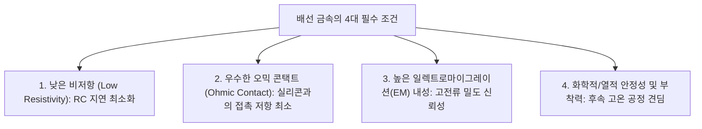
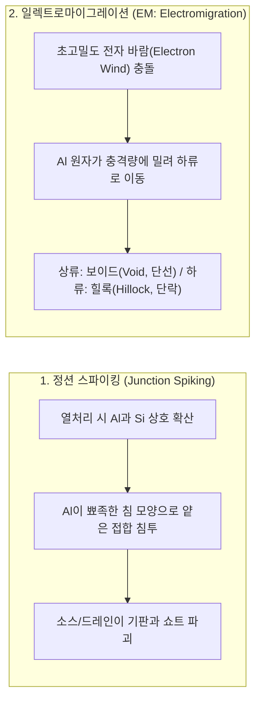
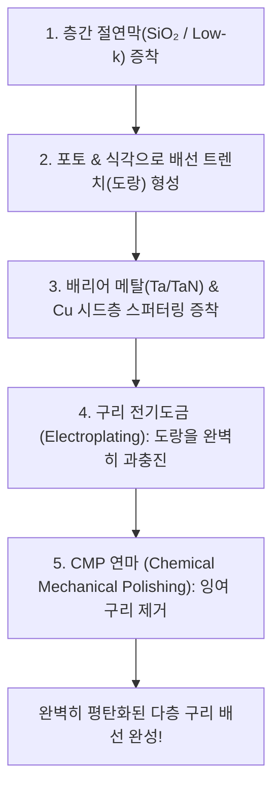

> **카테고리**: Part 3. 반도체 핵심 단위 제조 공정  
> **태그**: #금속배선 #Metallization #알루미늄배선 #구리배선 #다마신공정 #EM현상 #스파이킹 #스퍼터링  
> **추천 독자**: 반도체 상호연결(Interconnect) 기술과 구리 CMP/다마신 혁신 공정을 완벽히 이해하려는 엔지니어

---

> 💡 **핵심 요약 (3줄 정리)**  
> 1. **금속 배선 공정(Metallization)**은 웨이퍼 위에 만들어진 수십억 개의 개별 트랜지스터를 연결하여 완전한 회로를 구성하는 공정입니다.  
> 2. 기존 **알루미늄(Al)** 배선은 미세화에 따라 **정션 스파이킹(Spiking)**과 고전류에 의한 **일렉트로마이그레이션(EM)** 단선 결함의 한계에 부딪혔습니다.  
> 3. 저항이 낮고 EM 신뢰성이 우수한 **구리(Cu)**는 식각이 불가능하여, 절연막에 도랑을 파고 구리를 채운 뒤 CMP로 연마하는 **다마신(Damascene) 공정**으로 구현됩니다.  

---

## 1. 금속 배선(Interconnect)의 역할과 요구조건

  
*▲ [그림 18-1] 소자 내부 및 소자 간 전기적 신호 연결을 위한 금속 배선 공정 (출처: 반도체공정장비 #14)*

  
*▲ [그림 18-2] 금속 배선 물질로서 알루미늄(Al)과 구리(Cu)의 물리적 특성 비교 (출처: 반도체공정장비 #14)*

트랜지스터가 아무리 빨라도 이들을 연결하는 배선의 전기 저항($R$)과 정전용량($C$)이 크면 신호 지연($RC\text{ Delay}$)이 발생하여 칩 전체 속도가 저하됩니다.

---

## 2. 알루미늄(Al) 배선의 2대 치명적 결함

초기 집적회로의 표준이었던 알루미늄은 공정 선폭이 수 마이크로미터 이하로 좁아지면서 치명적인 문제를 드러냈습니다.

### (1) 정션 스파이킹 (Junction Spiking)
* $400^\circ\text{C}$ 이상의 후속 열처리 시, 실리콘이 알루미늄 배선 내부로 녹아 들어가고(용해도 한계), 그 빈자리를 알루미늄이 뾰족한 가시 모양으로 치고 들어가 얕은 PN 접합을 뚫어버려 영구 단락을 유발합니다.
* **해결책**: 배선 증착 시 Al에 미리 $1\%\,\text{Si}$를 포화 첨가하거나, 접촉면에 티타늄/질화티타늄(**Ti/TiN 배리어 메탈**)을 깔아 상호 확산을 차단합니다.

### (2) 일렉트로마이그레이션 (EM: Electromigration)
* 배선 단면적이 나노 단위로 좁아지면 전류 밀도가 수백만 $\text{A/cm}^2$에 도달합니다.
* 이때 고속으로 쏟아지는 전자들의 충격량(**전자 바람, Electron Wind**)에 의해 알루미늄 원자가 물리적으로 밀려나며, 원자가 빠져나간 곳에는 **보이드(Void, 끊어짐)**가 생기고 쌓인 곳에는 뿔 모양의 **힐록(Hillock, 층간 쇼트)**이 발생합니다.

---

## 3. 구리(Cu)의 도입과 상감기법: 다마신(Damascene) 공정

  
*▲ [그림 18-3] 절연막 트렌치 형성부터 배리어 증착, 구리 도금, CMP 연마 5단계 다마신 공정 (출처: 반도체공정장비 #14)*

  
*▲ [그림 18-4] 다층 금속 배선(Metallization)과 Low-k 층간 절연막의 실제 완성 단면 (출처: 반도체공정장비 #14)*

구리는 알루미늄보다 비저항이 $40\%$ 낮고($1.7\,\mu\Omega\cdot\text{cm}$), 원자 결합력이 강해 EM 내성이 100배 이상 뛰어납니다.

### ⚠️ 하지만 구리는 건식 RIE 식각이 불가능하다!
* 구리는 식각 가스($Cl_2, F_2$)와 반응해도 휘발성 화합물($CuCl_x$)의 끓는점이 수백 도 이상으로 높아 상온에서 기화되지 않고 표면에 끈적하게 들러붙습니다.
* **혁신적 발상 전환 (다마신 공정)**: "금속을 깎지 못한다면, 절연막에 도랑을 먼저 파고 구리를 부어 넣은 뒤 갈아내자!" (고대 다마스쿠스의 상감 보검 제작 기법에서 착안).

### (1) 듀얼 다마신 (Dual Damascene)
* 하부 층과 연결되는 **비아 홀(Via Hole)**과 수평 신호선인 **트렌치(Trench)**를 절연막에 한 번에 깎아내고, 구리를 단 한 번의 전기도금과 CMP로 동시에 채워 넣는 초고난도 양산 기술.
* **배리어 메탈 (Barrier Metal)**: 구리는 실리콘과 절연막 속으로 확산 속도가 빛의 속도처럼 빠르므로, 구리가 빠져나가지 못하게 트렌치 내벽에 **탄탈륨/질화탄탈륨(Ta/TaN)** 박막을 $1 \sim 2\text{nm}$ 두께로 완벽히 둘러싸야 합니다.

---

## 4. 금속 증착 장비: 스퍼터링(Sputtering) & 열증착(Evaporation)

  
*▲ [그림 18-5] Ar+ 이온 충돌을 통해 금속 타겟(Ti, Al, W, Cu) 원자를 튕겨내는 스퍼터링 원리 (출처: 반도체공정장비 #14)*

  
*▲ [그림 18-6] 진공 증착(Evaporation) 장비의 고진공 반응 챔버와 제어 모듈 외관 (출처: 반도체공정장비 #14)*

교재에 수록된 금속 박막 증착 설비 원리입니다:

* **스퍼터링 (Sputtering)**:  
  * 마그네트론 음극(Cathode)에 금속 타겟을 장착하고 강력한 영구자석으로 전자를 가두어 고밀도 아르곤 플라즈마 발생. 가속된 $Ar^+$ 이온이 타겟 원자를 쳐내어 웨이퍼에 증착.
* **진공 증착 (Thermal Evaporation)**:  
  * 고진공($10^{-6}\text{ Torr}$) 도가니 안의 금속을 텅스텐 저항선 가열 또는 전자빔(E-beam)으로 녹여 증발시킴.
* **설비 제어 및 인터록**: 진공 게이지(Pirani/Penning), 공압 밸브 센서, 확산 펌프 냉각수 유량 센서(Water Flow Sensor) 연동.

---

## 💡 핵심 개념 점검 & 실무 Q&A

**Q1. 구리 배선 공정에서 절연막과 구리 사이에 Ta/TaN 배리어 메탈(Barrier Metal)을 반드시 증착해야 하는 물리화학적 이유는 무엇인가요?**  
* **핵심 해설**: 구리($Cu$) 원자는 실리콘($Si$) 및 산화막($SiO_2$) 내부에서 확산 계수가 매우 높아 상온에서도 쉽게 절연막을 뚫고 기판으로 침투합니다. 실리콘 내부로 침투한 구리 원자는 밴드갭 중앙에 깊은 에너지 준위(Deep-level Trap)를 형성하여 접합 누설 전류를 급증시키고 게이트 산화막을 파괴하여 소자를 사망시킵니다. 따라서 구리의 확산을 물리적으로 완벽히 차단하고 접착력을 향상시키기 위해 조밀한 비정질 구조를 가진 Ta/TaN 배리어 박막을 필수적으로 코팅합니다.

**Q2. 금속 배선 미세화 시 신호 지연(RC Delay)을 줄이기 위해 도입된 Low-k 물질이란 무엇이며 어떤 원리인가요?**  
* **핵심 해설**: 배선 지연 시간은 저항과 정전용량의 곱($RC$)에 비례합니다. 배선 간격이 좁아지면 평행판 커패시턴스($C = \frac{\kappa \epsilon_0 A}{d}$)가 급증하여 신호 전달이 지연되고 크로스토크(Crosstalk) 노이즈가 발생합니다. 기존 절연막인 $SiO_2$의 유전율($k \approx 4.0$)보다 훨씬 낮은 $k \approx 2.0 \sim 2.5$ 수준의 탄소 도핑 산화막(SiOCH)이나 다공성(Porous) 구조를 가진 Low-k 물질을 층간 절연막으로 적용하여 배선 간 정전용량 $C$를 대폭 낮춤으로써 칩의 동작 속도를 향상시킵니다.

---

> **다음 글 예고**: [19강. 반도체 검사 및 신뢰성 분석 - EDS 테스트와 불량 분석 기법](/반도체제조공정-19-검사-및-분석-공정-eds-4포인트프로브-번인시험.html)  
> 500개 공정을 마친 웨이퍼의 성적표! EDS 전기 검사, 면저항 측정, 번인 가속 시험과 SEM 불량 분석의 모든 것을 최종 정리합니다.
