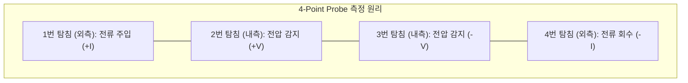
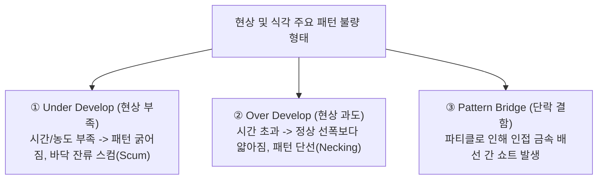
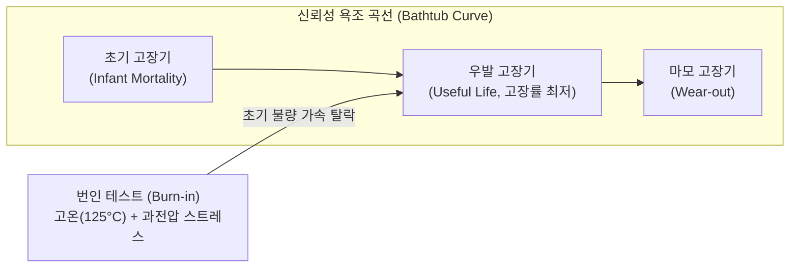

> **카테고리**: Part 4. 반도체 품질 검사 & 신뢰성 분석  
> **태그**: #검사공정 #EDS #4PointProbe #면저항 #번인테스트 #BurnIn #SEM #수율향상  
> **추천 독자**: 반도체 수율(Yield) 관리, 웨이퍼 레벨 전기 테스트 및 신뢰성 분석 기술을 정복하려는 엔지니어

---

> 💡 **핵심 요약 (3줄 정리)**  
> 1. **EDS (Electrical Die Sorting)** 공정은 웨이퍼 제조 완료 후 수천 개의 미세 바늘(Probe Card)을 접촉시켜 칩의 양품/불량을 전기적으로 선별하는 검사입니다.  
> 2. 박막의 전기적 균일도는 외곽에 전류를 흘리고 내측 전압을 재는 **4-Point Probe(면저항 $R_s$)** 시스템으로 정밀 계측합니다.  
> 3. 잠재적 불량을 조기에 걸러내기 위해 가혹한 고온·고전압을 인가하는 **번인(Burn-in) 가속 시험**과 전자현미경(SEM/TEM)을 통한 결함 분석이 필수적입니다.  

---

## 1. 반도체 검사 및 분석 공정의 경제적 가치

  
*▲ [그림 19-1] 웨이퍼 상의 전기적 프로빙 검사(EDS) 및 가속 통전 테스트(Burn-in) (출처: 반도체공정장비 #15)*

반도체는 500여 개 공정을 거치면서 수천억 원의 제조 비용이 투입됩니다.
* 만약 동작하지 않는 불량 칩을 걸러내지 않고 고가의 패키징(Packaging) 공정으로 넘긴다면 막대한 원가 낭비가 발생합니다.
* 따라서 웨이퍼 가공 직후 **EDS 테스트**를 통해 불량 칩을 즉시 마킹(전자 웨이퍼 맵 저장)하여 후속 공정을 차단하고, 피드백을 통해 공정 수율(Yield)을 조기에 끌어올리는 것이 반도체 비즈니스의 승패를 가릅니다.

---

## 2. 4-Point Probe (4탐침법)를 이용한 면저항($R_s$) 측정

  
*▲ [그림 19-2] 박막의 저항 균일도를 측정하는 4-Point Probe 면저항 측정 시스템 (출처: 반도체공정장비 #15)*

  
*▲ [그림 19-3] 4개의 탐침을 이용한 면저항(Rs) 측정 원리와 보정계수(F) 수식 (출처: 반도체공정장비 #15)*

도핑 공정(확산/이온주입)이나 금속 박막 증착 후, 박막의 저항 균일도를 비파괴로 측정하는 글로벌 표준 계측 기술입니다.

### (1) 측정 원리: 왜 2개가 아니라 4개의 탐침을 쓰는가?
* 일반 멀티미터처럼 2개의 탐침(2-Point)으로 측정하면 **탐침과 반도체 표면 간의 접촉 저항**($R_c$)과 도선 저항이 더해져 수 $\Omega$ 이상의 거대한 측정 오차가 발생합니다.
* 4-Point Probe는 바깥쪽 2개(1, 4번)로만 전류($I$)를 흘리고, 안쪽 2개(2, 3번)는 내부 임피던스가 무한대인 전압계로 전위차($\Delta V$)만 측정하므로, **접촉 저항의 영향을 $100\%$ 상쇄**하여 순수한 박막 고유 저항만 정확히 측정합니다!

### (2) 면저항 계산 공식 (교재 원본 반영)
탐침 간격이 $s$로 일정할 때, 반무한체 표면에서의 면저항($R_s$)은 다음과 같습니다:

$$R_s = \frac{\pi}{\ln 2} \times \frac{V}{I} \times F = 4.5324 \times \frac{V}{I} \times F \quad [\Omega/\square]$$

* $R_s$: 면저항 (Sheet Resistance, 단위: $\Omega/\square$, ohms per square)
* $V/I$: 측정된 전압-전류 비
* **$F$ (Correction Factor, 보정 계수)**: 웨이퍼의 유한한 두께($t$), 웨이퍼 직경, 탐침이 웨이퍼 가장자리에 가까울 때의 경계 효과(Boundary Effect)를 보정하는 기하학적 계수 ($F \le 1$).

---

## 3. 광학현미경 패턴 외관 검사와 주요 결함 형태

  
*▲ [그림 19-4] 패턴 표면 상태와 결함을 검사하는 광학 현미경의 구조 및 X-Y 미세 조절 나사 (출처: 반도체공정장비 #15)*

  
*▲ [그림 19-5] 현상 부족(Under develop, 스컴) 및 현상 과도(Over develop, 선폭 감소) 불량 패턴 실사 (출처: 반도체공정장비 #15)*

포토 및 식각 공정이 끝난 후 현미경(Microscope)을 통해 설계 치수(Dimension: 선폭, 피치) 일치 여부를 육안 검사합니다.

---

## 4. 번인 테스트 (Burn-in Test)와 신뢰성 가속 수명 시험

고객사(스마트폰, 서버, 자동차)에 칩이 납품된 후 조기에 고장 나는 것을 방지하기 위해 수행하는 혹독한 가속 스트레스 시험입니다.

* **번인 테스트 (Burn-in Test)**:  
  * 칩에 정상 동작 조건보다 훨씬 가혹한 **고온**($125 \sim 150^\circ\text{C}$)과 **높은 전압(정격의 $1.2 \sim 1.5$배)**을 수십~수백 시간 인가하여 작동시킵니다.
  * 잠재적 미세 결함(게이트 산화막 핀홀, 금속 배선 미세 노치 등)을 가진 불량 칩을 공장에서 미리 강제로 파괴(Fail)시켜 폐기함으로써, **시장에 출하되는 양품의 신뢰도를 $99.999\%$ 보증**합니다.
* **작동 수명 시험 (Operating Life Test)**:  
  * 수백~수천 개의 샘플을 $1,000$시간 이상 연속 가동하여 아레니우스 모델에 기반한 10년 이상의 칩 수명을 통계적으로 입증(Qualification).

---

## 5. 불량 분석(FA: Failure Analysis) 핵심 첨단 장비군

불량이 발생했을 때 원인을 원자 단위로 추적하는 첨단 분석 장비들입니다:

| 분석 장비 | 명칭 및 분석 원리 | 주요 분석 용도 |
| :--- | :--- | :--- |
| **SEM** | 주사전자현미경 (Scanning Electron Microscope) | 수 나노미터 해상도로 패턴 표면 형상 및 파티클 관찰 |
| **TEM** | 투과전자현미경 (Transmission Electron Microscope) | 전자빔을 박편에 투과시켜 원자 격자 결함 및 나노 박막 계면 두께 정밀 측정 |
| **FIB** | 집속이온빔 (Focused Ion Beam) | 갈륨($Ga^+$) 이온빔으로 불량 위치를 나노 단위로 국소 절단하여 TEM 시편 제작 |
| **EDS / EDX** | 에너지 분산형 X선 분광기 | 전자빔 충돌 시 방출되는 특성 X선 파장을 분석하여 이물질/파티클의 화학 원소 성분 분석 |
| **AFM** | 원자력간 현미경 (Atomic Force Microscope) | 캔틸레버 팁과 표면 간의 원자간 인력/척력으로 3차원 표면 거칠기(Roughness) 측정 |

---

## 💡 핵심 개념 점검 & 실무 Q&A

**Q1. 4-Point Probe 측정에서 보정 계수(Correction Factor, $F$)가 $1$보다 작아지는 물리적 배경은 무엇인가요?**  
* **핵심 해설**: 4탐침법의 기본 해석식은 반도체 기판이 무한히 넓고 두께가 무한한 반무한체(Semi-infinite Medium)라는 가정에서 유도되었습니다. 하지만 실제 웨이퍼는 유한한 두께($t$)를 가지며 가장자리(Edge) 경계면이 존재합니다. 전류가 바깥으로 퍼져나가지 못하고 좁은 단면과 경계벽에 갇히게 되면 전류 밀도가 인위적으로 높아져 측정 전압($V$)이 실제보다 과대평가됩니다. 따라서 이 기하학적 전류 왜곡 효과를 상쇄하기 위해 $1$보다 작은 기하 보정 계수($F$)를 곱해줍니다.

**Q2. 신뢰성 평가에서 번인(Burn-in) 시험의 필요성을 '욕조 곡선(Bathtub Curve)' 관점에서 설명하세요.**  
* **핵심 해설**: 제품의 수명주기 고장률 곡선은 초기에 고장률이 높다가 안정기를 거쳐 마모기에 다시 증가하는 '욕조(Bathtub) 모양'을 띱니다. 공정 중 유입된 잠재 결함은 가동 초기에 집중적으로 고장을 일으킵니다(초기 고장기). 번인 시험은 고온과 고전압 스트레스를 통해 이 초기 고장 구간을 제조 단계에서 인위적으로 빠르게 통과시켜 잠재 불량품을 사전에 전량 격리 탈락시킵니다. 이를 통해 고객에게 인도되는 제품은 고장률이 가장 낮고 안정적인 우발 고장기(Useful Life) 상태만을 유지하도록 보증합니다.

---

> **시리즈 완결 안내**: [00강. 반도체 제조 공정 전체 로드맵 및 종합 학습 가이드](/반도체제조공정-00-전체로드맵-학습가이드.html)  
> 축하합니다! 19강에 걸친 반도체 기초 과학, 팹 인프라, 8대 단위 제조 공정 및 신뢰성 검사 시리즈를 완주하셨습니다.
