> 본 통합본은 19개 원본 교재의 모든 물리, 회로, 소자 물성, 팹 인프라, 8대 단위 제조 공정 및 품질 검사 내용과 함께 **추출된 고해상도 장비/공정 이미지 및 원본 도표(총 340여 개)**를 블로그 포스트 형태로 집대성한 종합 핸드북입니다.

---


---

<!-- START OF 00_반도체제조공정_전체로드맵_학습가이드.md -->

# [반도체 공정 특강] 19강으로 끝내는 반도체 제조 공정 및 장비 완벽 가이드 🚀

> **시리즈 안내**: 본 블로그 시리즈는 반도체 제조의 기초 물리/회로 이론부터 소자 물성, 팹(Fab) 환경 및 유틸리티, 그리고 핵심 8대 단위 제조 공정과 차세대 나노 소자 기술까지 체계적으로 정리한 프리미엄 학습 가이드입니다.

---

## 📌 전체 커리큘럼 로드맵 (19 Chapters)

반도체 칩(IC)은 단순히 하나의 기술이 아니라 **물리학, 화학, 재료공학, 전자공학, 기계/로봇 제어 기술의 집합체**입니다. 본 시리즈는 19개의 원본 수업 교재를 바탕으로 아래와 같이 4개의 대단원, 총 19개 챕터로 재구성되었습니다.

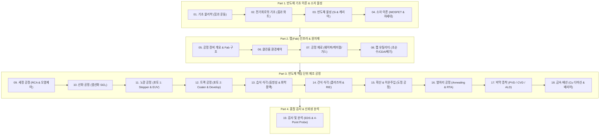

---

## 📚 챕터별 상세 목차 및 바로가기

### [Part 1] 기초 과학 및 반도체 소자 이론 (Foundation)
반도체 제조 기술을 지탱하는 기본 물리 법칙과 전자회로, 반도체 결정 물성 및 트랜지스터 동작 원리를 다룹니다.
* **[01강. 물리학의 기초: 직선에서의 힘과 운동](/반도체제조공정-01-물리학의-기초-운동과-힘.html)**
  * 위치, 변위, 속도와 속력의 차이, 가속도
  * 뉴턴의 운동 제2법칙($F=ma$)과 정적 평형, 알짜힘
* **[02강. 전기회로의 기초: 옴의 법칙과 전력](/반도체제조공정-02-전기회로의-기초-옴의법칙과-전력.html)**
  * 전압(V), 전류(I), 저항(R)의 본질적 의미
  * 옴의 법칙($V=IR$)과 와트의 법칙($P=VI=I^2R$), 전력량 계산
* **[03강. 반도체 물성의 기초: 실리콘과 캐리어 이론](/반도체제조공정-03-반도체-물성의-기초-실리콘과-캐리어.html)**
  * 도체, 부도체, 반도체의 에너지 밴드갭 구분
  * Si의 공유결합, 진성 반도체와 외인성 반도체 (3족 억셉터 p형 vs 5족 도너 n형)
  * 캐리어 드리프트(전기장)와 확산(농도차), PN 접합 다이오드
* **[04강. 반도체 소자 이론 심화: MOSFET 동작 원리와 차세대 소자](/반도체제조공정-04-반도체-소자이론-mosfet-원리와-차세대소자.html)**
  * 진공관에서 BJT, MOSFET으로의 진화
  * MOSFET 동작 메커니즘 (수도꼭지 비유, 문턱전압 $V_{th}$, 채널 반전)
  * 미세화 한계 극복: High-k/Metal Gate, FinFET(3D), GAA(나노시트), 차세대 Post-CMOS(TFET, NCFET)

---

### [Part 2] 반도체 팹(Fab) 제조 인프라 & 핵심 원자재
먼지 한 톨도 허용되지 않는 첨단 반도체 공장이 어떻게 유지되고 원자재가 공급되는지 살펴봅니다.
* **[05강. 반도체 제조 공정 개요와 팹(Fab) 장비 시스템](/반도체제조공정-05-반도체-제조공정-개요와-8대공정-로드맵.html)**
  * 반도체 3대 원재료 (웨이퍼, 마스크, 리드프레임)
  * 제조 8대 공정 흐름 및 전공정(Front-end)/후공정(Back-end)
  * 공정 장비의 5대 핵심 모듈 (EFEM, 진공 트랜스퍼, 프로세스 챔버, 전원/제어 랙, 펌프/스크러버)
  * 팹의 층별 구성 (Cleanroom, Sub-Fab, Plenum)
* **[06강. 반도체 클린룸(Cleanroom) 환경 제어와 청정 관리](/반도체제조공정-06-클린룸-환경제어와-오염관리-원칙.html)**
  * 클린룸의 정의 및 Class 규격 (Class 1 ~ Class 1000)
  * 클린룸 관리의 4원칙 + 1원칙
  * 공조 필터 시스템 (HEPA/ULPA, FFU, BFU)
  * 방진복 착용 순서 및 에어샤워, 클린룸 내 행동 수칙
* **[07강. 반도체 핵심 공정 재료: 실리콘 웨이퍼, 케미컬, 특수가스](/반도체제조공정-07-반도체-핵심재료-실리콘웨이퍼와-케미컬-특수가스.html)**
  * 규석에서 웨이퍼까지 (MG-Si, 폴리실리콘, Cz법 단결정 잉곳, 래핑, CMP)
  * 웨이퍼 규격 (200mm vs 300mm), 결정면(100/111), 노치(Notch)
  * 반도체 케미컬 (산, 염기, 유기용제, 특히 불산 HF의 위험성)
  * 반도체 특수가스 6대 분류 (불연성, 가연성, 산화성, 독성 TLV, 부식성, 자연발화성)
* **[08강. 반도체 팹 유틸리티: 초순수, CDA, 냉각수, 배기 시스템](/반도체제조공정-08-팹-유틸리티-인프라-초순수-cda-배기-모니터링.html)**
  * 초순수(DI Water) 제조 공정 (RO 역삼투압, UV 살균, MBD 이온교환, 18.2 MΩ·cm)
  * 청정압축공기(CDA) 및 공정냉각수(PCW) 순환계통
  * 고순도 질소(GN2/PN2 Purifier) 및 배수/폐수 처리
  * 산배기(Wet Scrubber), 유기/열 배기, 중앙 FMS 모니터링

---

### [Part 3] 반도체 핵심 단위 제조 공정 (Unit Processes)
실제 웨이퍼 위에 미세 회로를 깎고 쌓아 올리는 핵심 단위 공정 10가지를 완벽 해부합니다.
* **[09강. 세정 공정 (Cleaning): 표면 오염 제어와 RCA 세정](/반도체제조공정-09-세정-공정-rca세정과-표면오염-제어.html)**
  * 4대 오염물 (파티클, 유기물, 금속이온, 자연산화막)
  * RCA 표준 습식 세정법 (SPM Piranha, SC-1, SC-2, DHF)
  * QDR(Quick Drain Rinse) 린스와 HAD 건조 메커니즘, Wet Station 설비
* **[10강. 산화 공정 (Oxidation): 열산화와 실리콘 산화막(SiO₂)](/반도체제조공정-10-산화-공정-열산화-건식습식과-절연막형성.html)**
  * 실리콘 열산화(Thermal Oxidation)의 원리와 $SiO_2$ 용도 (Gate, STI, Mask)
  * 건식 산화(Dry) vs 습식 산화(Wet)의 반응식 및 막질/성장속도 비교
  * Deal-Grove 산화 속도 모델 (선형 영역 vs 포물선 영역)
  * Oxidation Furnace 장비 구성 및 스크러버 안전 인터록
* **[11강. 노광 공정 (Exposure): 빛으로 그리는 미세 회로와 EUV](/반도체제조공정-11-노광-공정-포토리소그래피와-차세대-euv.html)**
  * 포토공정의 위상 (비용 35%, 시간 60%)
  * 노광 방식의 발전: Contact/Proximity $\rightarrow$ Stepper $\rightarrow$ Scanner
  * 광원의 진화: g/i-line $\rightarrow$ KrF $\rightarrow$ ArF $\rightarrow$ ArFi 액침 $\rightarrow$ EUV(13.5nm)
  * 레일리 해상도 공식($R=k_1\lambda/NA$), 초점심도($DOF$), 포토마스크 및 광학계
* **[12강. 트랙 공정 (Track): 감광액 도포부터 현상 검사까지](/반도체제조공정-12-트랙-공정-hmds-pr코팅-베이크-현상검사.html)**
  * 인라인 트랙(Coater-Developer) 일관 공정 플로우
  * HMDS 프라이밍(접착력 개선) $\rightarrow$ PR 스핀 코팅 (rpm vs 두께, EBR)
  * Soft Bake $\rightarrow$ 노광 $\rightarrow$ PEB(정재파 제거) $\rightarrow$ 현상(Development) $\rightarrow$ Hard Bake
  * ADI 현상 후 검사: Over/Under Develop 결함, CD 및 오버레이 측정
* **[13강. 습식 식각 (Wet Etch): 화학 반응과 등방성 식각](/반도체제조공정-13-습식-식각-등방성식각과-선택비-언더컷.html)**
  * 식각 공정 정의 및 3대 핵심 지표 (식각률, 균일도, 선택비)
  * 등방성(Isotropic) 식각 프로파일과 언더컷(Undercut) 현상
  * 주요 식각 용액 화학 반응 (Si 질산+불산, $SiO_2$ DHF/BOE, 질화막 인산)
* **[14강. 건식 식각 (Dry Etch): 플라즈마 원리와 반응성 이온 식각(RIE)](/반도체제조공정-14-건식-식각-플라즈마원리와-이방성-rie식각.html)**
  * 플라즈마의 정의와 RF 글로우 방전 메커니즘 (전자, 이온, 활성 라디칼)
  * 건식 식각 3대 방식: 물리적 스퍼터 식각 vs 화학적 식각 vs RIE
  * 고밀도 플라즈마 장치 (ICP-RIE / TCP)
  * 건식 식각기 장비 구성 (진공챔버, RF Generator, 임피던스 매처, 쓰로틀 밸브)
* **[15강. 도핑 공정: 열확산(Diffusion)과 이온주입(Ion Implantation)](/반도체제조공정-15-도핑-공정-열확산과-이온주입기술-비교.html)**
  * 반도체 도핑의 목적과 도판트 (3족 붕소 B, 5족 인 P / 비소 As)
  * 열확산($POCl_3$ 전구체 기상 반응, 고온로)과 그 한계점
  * 이온주입(Ion Implantation) 기술의 원리 및 5대 구성 유닛
  * 열확산 vs 이온주입 장단점 종합 비교
* **[16강. 열처리 공정 (Annealing): 격자 결함 복원과 급속 열처리(RTA)](/반도체제조공정-16-열처리-공정-어닐링-furnace와-rta-도판트활성화.html)**
  * 이온주입 후 발생하는 결정 격자 손상(Damage)과 도판트 비활성화
  * 어닐링의 2대 목적: 결정성 회복(Regrowth) 및 도판트 활성화(Activation)
  * 전기로(Furnace) 어닐링 vs 급속 열처리(RTA: Rapid Thermal Annealing)
  * RTA 장비 구성: 할로겐 램프 가열, 파이로미터/열전대 온도제어, 안전 인터록
* **[17강. 박막 증착 공정 (Thin Film): PVD, CVD, ALD와 PECVD 시스템](/반도체제조공정-17-박막-증착-pvd-cvd-ald와-pecvd장비구조.html)**
  * 박막($<1000\text{Å}$)의 역할과 증착 기술 분류 (PVD vs CVD vs ALD)
  * CVD 표면 반응 메커니즘 5단계 및 압력별 분류 (APCVD, LPCVD, PECVD)
  * 원자층 증착(ALD)의 자기제한적 표면반응과 완벽한 단차피복성(Step Coverage)
  * PECVD 장비 핵심 유닛 상세 (진공챔버, RF/매처, APC 쓰로틀밸브, Baratron 게이지, MFC)
* **[18강. 금속 배선 공정 (Metallization): Al 배선에서 Cu 다마신 공정까지](/반도체제조공정-18-금속-배선-al에서-cu다마신공정과-배리어메탈.html)**
  * 금속 배선(Interconnect)의 역할과 도체 재료 요구조건
  * 알루미늄(Al) 배선의 한계: 정션 스파이킹(Spiking)과 일렉트로마이그레이션(EM)
  * 구리(Cu) 배선의 도입과 식각 불가 극복: 다마신(Damascene) & 듀얼 다마신 공정
  * 구리 확산 방지 배리어 메탈(Ti/TiN, Ta/TaN) 및 저유전율(Low-k) 절연막
  * 금속 증착 장비 (PVD Sputtering & Thermal Evaporation)
---

### [Part 4] 반도체 품질 검사 및 신뢰성 분석
완성된 칩이 정상 동작하는지 테스트하고, 결함을 분석하여 수율을 끌어올리는 기술입니다.
* **[19강. 반도체 검사 및 신뢰성 분석: EDS 테스트와 불량 분석 기법](/반도체제조공정-19-검사-및-분석-공정-eds-4포인트프로브-번인시험.html)**
  * 반도체 수율(Yield)의 경제성과 EDS(Electrical Die Sorting) 테스트
  * 프로브 카드(Probe Card)와 프로버 스테이션 동작 원리
  * 4-Point Probe를 이용한 박막 면저항($R_s, \Omega/\square$) 측정 원리와 보정계수($F$)
  * 광학현미경 검사: 현상/식각 불량(Under/Over Develop, Bridge, Necking) 패턴 분석
  * 신뢰성 가속 시험: 번인 테스트(Burn-in Test) 및 고온 작동 수명 시험(HTOL)
  * 불량 분석 핵심 분석 장비 (SEM, TEM, FIB, AFM)

---

## 🎯 본 블로그 시리즈의 특징 및 활용법

1. **체계적인 학습 흐름**: 기초 물리/전기 회로부터 시작하여 소자, 공정, 장비, 검사까지 물 흐르듯 이어집니다.
2. **현장 엔지니어링 지식**: 실제 반도체 팹(Fab)에서 사용되는 장비 부품 명칭, 제어 파라미터(MFC, APC, Baratron, RF 등), 결함 대책을 상세히 다룹니다.
3. **핵심 개념 점검 & 실무 Q&A**: 각 챕터 하단에 **"핵심 개념 점검 & 실무 Q&A"**를 수록하여 공정 및 장비 제어의 핵심 원리를 확실하게 점검하고 복습할 수 있도록 구성했습니다.

> 오른쪽 또는 상단의 목차 링크를 클릭하여 **[01강. 물리학의 기초: 직선에서의 힘과 운동](/반도체제조공정-01-물리학의-기초-운동과-힘.html)**부터 학습을 시작해보세요!
\n\n\n---\n\n<!-- START OF 01_물리학의_기초_운동과_힘.md -->\n\n# [반도체 기초물리] 01. 직선에서의 힘과 운동 - 반도체 역학의 기초 ⚙️

> **카테고리**: Part 1. 반도체 기초 이론 & 소자 물성  
> **태그**: #반도체물리 #역학 #뉴턴의법칙 #변위 #속도 #가속도 #알짜힘 #공정엔지니어링  
> **추천 독자**: 반도체 장비 제어 및 설비 엔지니어를 지망하는 학생 및 취업준비생

---

> 💡 **핵심 요약 (3줄 정리)**  
> 1. **운동학(Kinematics)**은 물체의 위치, 변위, 속도, 가속도를 기술하며, **동역학(Dynamics)**은 운동의 원인이 되는 '힘'과의 관계를 규명합니다.  
> 2. **변위**($\Delta \vec{r}$)는 출발점과 도착점을 잇는 최단 벡터이며, **속도(Velocity)**는 변위의 시간에 따른 변화율로 방향을 갖는 벡터량입니다.  
> 3. 반도체 로봇 및 정밀 웨이퍼 스테이지 제어의 핵심은 **뉴턴의 제2법칙**($\Sigma \vec{F} = m\vec{a}$)에 따른 가감속 제어와 정적 평형 상태($\Sigma \vec{F} = 0$)의 이해입니다.  

---

## 1. 운동학(Kinematics) vs 동역학(Dynamics)

반도체 팹(Fab) 내에서 웨이퍼를 나노미터 단위의 정밀도로 이동시키는 로봇 암(Robot Arm)과 노광 장비 스테이지(Wafer Stage)의 구동을 이해하기 위해서는 고전역학의 기본 개념이 필수적입니다.

* **운동학 (Kinematics)**: 물체가 '왜' 움직이는지는 고려하지 않고, 물체의 **위치(Position), 변위(Displacement), 속도(Velocity), 가속도(Acceleration)** 간의 수학적 관계만을 다룹니다.
* **동역학 (Dynamics)**: 물체의 운동과 그 원인이 되는 **힘(Force)** 및 **질량(Mass)**의 상호작용(뉴턴의 운동법칙)을 다룹니다.

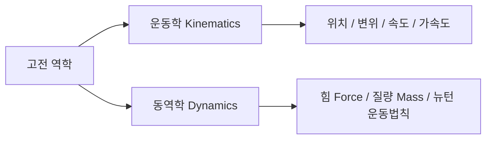

---

## 2. 위치(Position)와 변위(Displacement)

### (1) 위치 (Position, $\vec{r}$)
* 공간 상에서 기준점(원점, Origin)으로부터의 **거리**와 **방향**을 나타내는 벡터(Vector) 물리량입니다.
* 기준점이 달라지면 위치 좌표도 달라집니다.

### (2) 변위 (Displacement, $\Delta \vec{r}$)

  
*▲ [그림 1-1] 기준점으로부터의 위치와 변위(위치의 변화량) 좌표계 (출처: 물리학의 기초 Chap 3)*

* 물체의 **위치 변화량**을 의미하며, 이동 경로와 무관하게 **'최종 위치 $-$ 초기 위치'**로 정의되는 벡터량입니다.

$$\Delta \vec{r} = \vec{r}_f - \vec{r}_0$$

> **💡 예제 (교재 수록 Example 3.1 & Problem 3.1)**  
> * 기차가 기준점(철교)으로부터 동쪽으로 $3\text{km}$ 떨어진 지점($\vec{r}_0 = +3\text{km}$)에서 출발하여, 서쪽 방향으로 $7\text{km}$를 이동하여 $\vec{r}_f$에 도달했다.  
> * 최종 위치: $\vec{r}_f = +3\text{km} - 7\text{km} = -4\text{km}$ (철교 서쪽 $4\text{km}$)  
> * 변위: $\Delta \vec{r} = \vec{r}_f - \vec{r}_0 = -4\text{km} - (+3\text{km}) = -7\text{km}$ (서쪽으로 $7\text{km}$)

---

## 3. 속도(Velocity)와 속력(Speed)의 본질적 차이

반도체 장비 제어에서는 단순히 '빠른 정도'뿐 아니라 '어느 방향으로 움직이는가'가 치명적으로 중요합니다.

| 구분 | 속도 (Velocity, $\vec{v}$) | 속력 (Speed, $v$) |
| :--- | :--- | :--- |
| **물리량의 성질** | **벡터 (Vector)** : 크기 + 방향 | **스칼라 (Scalar)** : 크기만 존재 |
| **수학적 정의** | 단위 시간당 변위 ($\frac{\Delta \vec{r}}{\Delta t}$) | 단위 시간당 총 이동거리 ($\frac{s}{\Delta t}$) |
| **부호** | 방향에 따라 $(+)$ 또는 $(-)$ 가능 | 항상 $0$ 이상 ($v \ge 0$) |
| **설비 적용** | 웨이퍼 이송 로봇의 방향 벡터 제어 | 모터의 단순 회전수(RPM) 등 |

  
*▲ [그림 1-3] 시간에 따른 물체의 위치 변화와 속도의 부호 관계 (출처: 물리학의 기초 Chap 3)*

  
*▲ [그림 1-4] 위치-시간 그래프에서 현의 기울기(평균속도)와 접선의 기울기(순간속도) (출처: 물리학의 기초 Chap 3)*

### 평균속도 vs 순간속도
* **평균속도 (Average Velocity)**: 전체 이동 시간 동안의 총 변위  
  $$\vec{v}_{avg} = \frac{\vec{r}_f - \vec{r}_0}{t_f - t_0} = \frac{\Delta \vec{r}}{\Delta t}$$
  * 위치-시간($x-t$) 그래프에서 **두 점을 잇는 할선(현)의 기울기**입니다.
* **순간속도 (Instantaneous Velocity)**: 특정 순간($\Delta t → 0$)에서의 속도  
  $$\vec{v} = \lim_{\Delta t → 0} \frac{\Delta \vec{r}}{\Delta t} = \frac{d\vec{r}}{dt}$$
  * 위치-시간($x-t$) 그래프에서 **그 순간 접선의 기울기**입니다.

---

## 4. 가속도(Acceleration)와 뉴턴의 제2법칙

### (1) 가속도 ($\vec{a}$)
* 단위 시간당 **속도의 변화율**입니다.

$$\vec{a}_{avg} = \frac{\Delta \vec{v}}{\Delta t}, \quad \vec{a} = \frac{d\vec{v}}{dt} = \frac{d^2\vec{r}}{dt^2} \quad [\text{m/s}^2]$$

  
*▲ [그림 1-5] 시간에 따른 속도의 변화율(가속도)과 접선 기울기 (출처: 물리학의 기초 Chap 3)*

### (2) 뉴턴의 제2법칙 (Newton's 2nd Law)
물체에 작용하는 알짜힘(Net Force, $\Sigma \vec{F}$)이 $0$이 아닐 때, 물체는 그 힘의 방향으로 가속됩니다.

$$\Sigma \vec{F} = m\vec{a}$$

* **알짜힘이 $0$인 경우 ($\Sigma \vec{F} = 0$)**: **정적 평형 상태(Static Equilibrium)** 또는 등속 직선 운동을 합니다.
* **알짜힘이 존재하는 경우 **($\Sigma \vec{F} \neq 0$): 가속도 운동을 하며, 질량 $m$이 클수록 가속시키기 위해 더 큰 힘이 필요합니다 (관성의 척도).

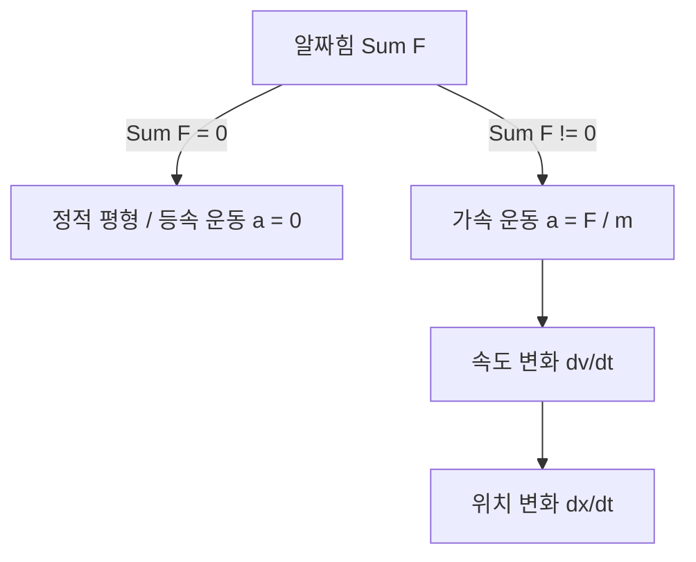

  
*▲ [그림 1-2] Example 3.1) 고집센 노새와 알짜힘의 평형 상태 (출처: 물리학의 기초 Chap 3)*

> **💡 교재 예제 (고집 센 노새 문제)**  
> 농부가 동쪽으로 끄는 힘 $\vec{F}_f = 320\text{N}$, 아들이 뒤에서 미는 힘 $\vec{F}_b = 110\text{N}$, 노새가 서쪽으로 버티는 힘 $\vec{F}_g = 430\text{N}$일 때:  
> $$\Sigma F_x = F_f + F_b - F_g = 320 + 110 - 430 = 0\text{N}$$  
> 따라서 알짜힘이 $0$이므로 노새는 움직이지 않는 **정적 평형 상태**를 유지합니다.

---

## 5. 반도체 장비 관점에서의 시사점

1. **웨이퍼 이송 로봇(EFEM / Transfer Robot)**:  
   * 웨이퍼를 빠르게 이송하면서도 웨이퍼가 슬립(Slip)되거나 파손되지 않도록 하기 위해서는 급격한 가속도 변화(Jerk, 가가속도)를 최소화하는 S-Curve 모션 프로파일 제어가 필수적입니다.
  
*▲ [그림 1-6] 도르래 시스템에서의 힘의 작용과 장력(T), 가속도(a) 평형 관계 (출처: 물리학의 기초 Chap 3)*

2. **도르래 및 수직 승강 기구(Elevator Unit)**:  
   * 수직 확산로(Vertical Furnace)의 보트 엘리베이터(Boat Elevator) 설계 시, 중력($mg$)과 구동 모터의 토크/장력($T$) 평형을 정밀하게 제어하여 충격 없이 웨이퍼를 챔버 내로 로딩해야 합니다.

---

## 💡 핵심 개념 점검 & 실무 Q&A

**Q1. 변위(Displacement)와 이동거리(Distance)의 차이점과 반도체 장비 제어에서의 의미는 무엇인가요?**  
* **핵심 해설**: 이동거리는 물체가 실제로 움직인 경로의 총 길이를 나타내는 스칼라량인 반면, 변위는 시작점과 끝점 사이의 최단 직선거리와 방향을 나타내는 벡터량입니다. 반도체 노광 장비나 웨이퍼 트랜스퍼 로봇의 경우, 스테이지의 누적 이동거리는 마모도 및 소모품 수명 관리에 사용되고, 정밀 위치 결정(Align)에는 기준점으로부터의 정확한 변위 벡터 제어가 활용됩니다.

**Q2. 뉴턴의 제2법칙($F=ma$)이 반도체 장비의 고속 이송 시스템에 어떻게 적용되나요?**  
* **핵심 해설**: 웨이퍼 팹의 생산성(Throughput)을 높이려면 이송 시간을 줄여야 하므로 높은 가속도($a$)가 필요합니다. 하지만 $F=ma$에 의해 높은 가속도는 로봇 핸드와 모터에 큰 관성력($F$)을 유발하며, 이는 웨이퍼의 파티클 발생이나 이탈을 초래할 수 있습니다. 따라서 정밀 제어에서는 가동부 질량 $m$을 경량화하고 최적의 가감속 궤적을 설계하는 것이 핵심입니다.

---

> **다음 글 예고**: [02강. 전기회로의 기초 - 옴의 법칙과 와트의 법칙](/반도체제조공정-02-전기회로의-기초-옴의법칙과-전력.html)  
> 전압, 전류, 저항의 상호작용과 장비 전원부 및 발열 제어의 기초 원리를 탐구합니다.
\n\n\n---\n\n<!-- START OF 02_전기회로의_기초_옴의법칙과_전력.md -->\n\n# [반도체 기초전자] 02. 전기회로의 기초 - 옴의 법칙과 와트의 법칙 ⚡

> **카테고리**: Part 1. 반도체 기초 이론 & 소자 물성  
> **태그**: #전기회로 #옴의법칙 #와트의법칙 #전압 #전류 #저항 #소비전력 #발열제어  
> **추천 독자**: 전기전자 기초를 다지고 반도체 설비 전원/히터 제어를 이해하려는 엔지니어

---

> 💡 **핵심 요약 (3줄 정리)**  
> 1. **전압**($V$)은 단위 전하당 위치에너지, **전류**($I$)는 단위 시간당 흐르는 전하량, **저항**($R$)은 전류의 흐름을 방해하는 정도입니다.  
> 2. **옴의 법칙**($V = IR$)에 의해 전류는 전압에 비례하고 저항에 반비례하며, **와트의 법칙**($P = VI = I^2R = \frac{V^2}{R}$)으로 장비의 소비 전력과 줄열(Joule heat)을 계산합니다.  
> 3. 반도체 공정 장비의 고온 히터(Furnace/RTA), 플라즈마 RF 전원, 인터록 전장 시스템 해석의 출발점이 되는 핵심 법칙입니다.  

---

## 1. 전압, 전류, 저항의 물리적 본질

전기회로를 이해하기 위한 3대 핵심 물리량의 정의와 단위는 다음과 같습니다.

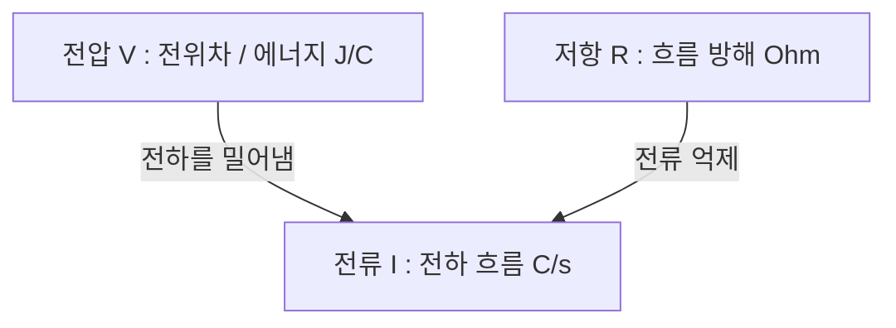

  
*▲ [그림 2-1] 전위차(전압), 전하의 흐름(전류), 흐름 방해(저항)의 상호작용 (출처: 2. 전기회로의 기초)*

### (1) 전압 (Voltage, $V$)
* **정의**: 회로의 두 점 사이의 **전위차(Electric Potential Difference)**로, 단위 전하($1\text{C}$)당 갖는 전기적 에너지입니다.
* **단위**: 볼트 ($\text{V}$, $\text{J/C}$)
* 물 공급 시스템에서 물을 밀어내는 **수압(Water Pressure)**에 비유할 수 있습니다.

### (2) 전류 (Current, $I$)
* **정의**: 도선의 단면을 단위 시간($1\text{s}$) 동안 통과하는 **전하의 양**입니다.
* **단위**: 암페어 ($\text{A}$, $\text{C/sec}$)
* 파이프를 타고 흐르는 **물의 유량**에 해당합니다.

### (3) 저항 (Resistance, $R$)
* **정의**: 물질 내부에서 전하(전자)의 이동을 방해하는 정도입니다.
* **단위**: 옴 ($\Omega$, $\text{V/A}$)
* 파이프 내벽의 거칠기나 좁은 밸브에 해당합니다. 물질의 비저항($\rho$), 길이($L$), 단면적($A$)에 의해 $R = \rho \frac{L}{A}$로 결정됩니다.

---

## 2. 옴의 법칙 (Ohm's Law)

  
*▲ [그림 2-2] 전압 증가에 따른 전류와 전하 에너지의 비례 관계 (출처: 2. 전기회로의 기초)*

  
*▲ [그림 2-3] 회로 저항과 전류 흐름의 반비례 관계 (출처: 2. 전기회로의 기초)*


1826년 독일의 물리학자 옴(G. S. Ohm)이 발견한 법칙으로, 도체에 흐르는 전류는 양단에 가해진 전압에 비례하고 저항에 반비례합니다.

$$V = IR \iff I = \frac{V}{R} \iff R = \frac{V}{I}$$

* **$1\,\Omega$의 정의**: 도체 양단에 $1\text{V}$의 전압을 걸었을 때 $1\text{A}$의 전류가 흐르면, 이 도체의 저항은 $1\,\Omega$입니다.
* **비례 관계**:
  * 저항($R$)이 일정할 때: 전압($V$)이 증가하면 전류($I$)도 비례하여 증가합니다 (램프가 밝아짐).
  * 전압($V$)이 일정할 때: 저항($R$)이 증가하면 전류($I$)는 반비례하여 감소합니다.

> **💡 교재 수록 실전 계산 예제**  
> 1. $12\text{V}$ 전원에 연결된 전구의 필라멘트 저항이 $3\,\Omega$일 때 회로에 흐르는 전류는?  
>    $$I = \frac{V}{R} = \frac{12\text{V}}{3\,\Omega} = 4\text{A}$$  
> 2. 저항 $20\,\Omega$에 $0.5\text{A}$의 전류가 흐를 때 양단에 걸리는 전압 강하는?  
>    $$V = I \times R = 0.5\text{A} \times 20\,\Omega = 10\text{V}$$

---

## 3. 와트의 법칙과 전력 (Electric Power)

  
*▲ [그림 2-4] 1와트(W), 1초(s), 1볼트(V), 1쿨롱(C) 간의 에너지 변환 관계 (출처: 2. 전기회로의 기초)*

  
*▲ [그림 2-5] 옴의 법칙을 결합한 소비전력 공식 (P = VI = I²R = V²/R) (출처: 2. 전기회로의 기초)*


전기 에너지가 빛, 열, 기계적 운동 등 다른 형태의 에너지로 변환되는 비율을 **전력(Power, $P$)**이라고 합니다.

### (1) 전력의 정의와 와트의 법칙
* **정의**: 단위 시간($1\text{s}$)당 소비되거나 공급되는 전기 에너지($\text{J/s}$)입니다.
* **단위**: 와트 ($\text{W}$, $\text{J/s}$)

$$P = V \times I$$

* 옴의 법칙($V=IR$, $I=V/R$)을 결합하면 다음과 같이 변형됩니다:

$$P = VI = I^2 R = \frac{V^2}{R} \quad [\text{W}]$$

| 공식 형태 | 주 사용처 |
| :--- | :--- |
| $P = VI$ | 전원 공급 장치(Power Supply) 및 전체 시스템 소비전력 계산 |
| $P = I^2 R$ | 케이블의 줄열 손실(Joule Loss) 및 직렬 히터 발열량 계산 |
| $P = \frac{V^2}{R}$ | 정전압(220V/380V) 환경에서 병렬 히터 부하 용량 설계 |

  
*▲ [그림 2-6] 시간 경과에 따른 총 소비 전력량(W = P·t) 계산 (출처: 2. 전기회로의 기초)*

### (2) 전력량 (Electric Energy, $W$)
* 어떤 기간 동안 사용된 총 전기 에너지의 양입니다.
* **단위**: 줄($\text{J} = \text{W}\cdot\text{s}$) 또는 킬로와트시($\text{kWh}$)

$$W = P \times t = V I t \quad [\text{J}]$$

> **💡 교재 예제 (전력 및 전력량 계산)**  
> * 정격 전압 $220\text{V}$, 저항 $22\,\Omega$인 반도체 확산로(Furnace) 히터의 소비전력:  
>   $$P = \frac{V^2}{R} = \frac{220^2}{22} = 2200\text{W} = 2.2\text{kW}$$  
> * 이 히터를 10시간 동안 연속 가동했을 때 소비된 전력량:  
>   $$W = 2.2\text{kW} \times 10\text{h} = 22\text{kWh}$$

---

## 4. 반도체 장비 엔지니어링 적용 사례

1. **열처리 장비(Furnace & RTA) 히터 뱅크 설계**:  
   * $1000^\circ\text{C}$ 이상의 고온을 내기 위해 저항 발열체(SiC, Kanthal선 등)를 다단 존(Zone)으로 배치하고, $P = I^2 R$ 발열량에 따라 SCR(Silicon Controlled Rectifier) 위상 제어로 정밀 온도를 유지합니다.
2. **배선 허용 전류와 화재 예방**:  
   * 대전류가 흐르는 배선에서 도선의 내부 저항 $R_{wire}$에 의해 발생하는 $I^2 R$ 열이 절연 피복을 녹이지 않도록 충분한 단면적(AWG 규격)의 케이블을 선정해야 합니다.

---

## 💡 핵심 개념 점검 & 실무 Q&A

**Q1. 동일한 정격 전압에서 저항이 2배가 되면 소비 전력은 어떻게 변하나요?**  
* **핵심 해설**: 정전압 회로에서 전력 공식은 $P = \frac{V^2}{R}$입니다. 전압 $V$가 일정할 때 전력은 저항에 반비례하므로, 저항이 2배가 되면 소비 전력은 절반($1/2$)으로 감소합니다.

**Q2. 반도체 칩에서 전력 소모를 줄이기 위해 동작 전압(VDD)을 낮추는 이유는 무엇인가요?**  
* **핵심 해설**: MOSFET의 동적 전력 소모(Dynamic Power)는 $P \propto f \cdot C \cdot V_{DD}^2$으로 동작 전압의 제곱에 비례합니다. 따라서 공정 미세화와 함께 동작 전압을 5V → 3.3V → 1.8V → 0.7V 수준으로 낮춤으로써 발열을 획기적으로 줄이고 전력 효율을 극대화할 수 있습니다.

---

> **다음 글 예고**: [03강. 반도체 물성의 기초 - 실리콘과 캐리어 이론](/반도체제조공정-03-반도체-물성의-기초-실리콘과-캐리어.html)  
> 도체와 부도체 사이에서 전류를 자유자재로 제어하는 반도체의 기적, 실리콘과 도핑의 세계로 들어갑니다.
\n\n\n---\n\n<!-- START OF 03_반도체_물성의_기초_실리콘과_캐리어.md -->\n\n# [반도체 기초물성] 03. 반도체 물성의 기초 - 실리콘(Si)과 캐리어 이론 🔬

> **카테고리**: Part 1. 반도체 기초 이론 & 소자 물성  
> **태그**: #반도체물성 #실리콘 #에너지밴드갭 #진성반도체 #외인성반도체 #도핑 #드리프트 #확산  
> **추천 독자**: 반도체 재료 물성과 전자/정공의 전도 원리를 명확히 이해하고자 하는 분

---

> 💡 **핵심 요약 (3줄 정리)**  
> 1. **반도체(Semiconductor)**는 밴드갭($E_g \approx 1.12\text{eV}$)을 가져 빛, 열, 도핑을 통해 전기전도도를 $10^{10}$배 이상 자유롭게 제어할 수 있는 물질입니다.  
> 2. 순수한 **진성 반도체**에 3족(붕소 B)을 넣으면 **P형(정공 다수)**, 5족(인 P, 비소 As)을 넣으면 **N형(전도전자 다수)** 반도체가 됩니다.  
> 3. 반도체 내부 전류는 전기장에 의한 **드리프트 전류(Drift Current)**와 농도 기울기에 의한 **확산 전류(Diffusion Current)**의 합으로 결정됩니다.  

---

## 1. 도체, 부도체, 반도체의 구분: 에너지 밴드갭 ($E_g$)

  
*▲ [그림 3-1] 도체, 부도체, 반도체의 전도 특성과 전하 캐리어 (출처: 13. 반도체)*


물질 내 전자는 양자역학적으로 허용된 에너지 대역인 **가전자대(Valence Band)**와 **전도대(Conduction Band)**에 존재하며, 그 사이의 전자가 존재할 수 없는 금지된 영역을 **금지대(Forbidden Band) 혹은 밴드갭($E_g$)**이라고 합니다.

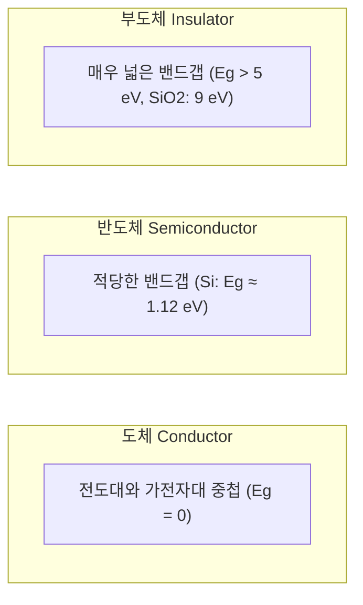

* **도체 (Conductor)**: 금, 구리, 알루미늄 등. 밴드갭이 없어 상온에서 무수히 많은 자유전자가 존재하여 전류가 매우 잘 흐릅니다.
* **부도체 (Insulator)**: 다이아몬드, 유리, 석영($SiO_2$) 등. 밴드갭이 매우 커($E_g > 5\text{eV}$) 전자가 전도대로 여기(Excite)되지 못해 전기가 흐르지 않습니다.
* **반도체 (Semiconductor)**: 실리콘(Si), 저마늄(Ge), 갈륨비소(GaAs) 등. 밴드갭이 적당하여 상온에서는 부도체에 가깝지만, **빛, 열, 전기장, 불순물 첨가(도핑)**를 통해 저항률을 극적으로 조절할 수 있습니다.

---

## 2. 왜 실리콘(Si, 규소)이 반도체의 제왕인가?

  
*▲ [그림 3-2] 원자번호 14번 실리콘 원자의 최외각 4개 전자와 공유결합 구조 (출처: 13. 반도체)*


1. **원자 번호 14번, 4족 원소**: 최외각 전자가 4개로, 인접한 4개의 실리콘 원자와 전자 1쌍씩을 공유하는 견고한 **다이아몬드 입방 격자(Diamond Cubic Lattice) 공유결합**을 형성합니다.
2. **지구상에 풍부한 매장량**: 지각 구성 원소 중 산소 다음으로 풍부한 모래(규석, $SiO_2$)로부터 저렴하게 대량 정제 가능합니다.
3. **우수한 산화막($SiO_2$) 형성**: 열산화를 통해 매우 얇고 절연 특성이 뛰어난 실리콘 산화막을 자연스럽게 성장시킬 수 있습니다 (MOSFET 탄생의 일등공신).

---

## 3. 진성 반도체 vs 외인성 반도체 (도핑의 마법)

  
*▲ [그림 3-3] 진성 반도체의 가전자대, 전도대 및 전자-정공 쌍 생성 (출처: 13. 반도체)*

  
*▲ [그림 3-4] 3족 붕소(B) 도핑에 의한 정공(Hole) 형성 원리 (출처: 13. 반도체)*


### (1) 진성 반도체 (Intrinsic Semiconductor)
* 어떠한 불순물도 섞이지 않은 $99.9999999\%(9N)$ 이상의 초고순도 단결정 실리콘입니다.
* 절대영도($0\text{K}$)에서는 모든 전자가 공유결합에 묶여 부도체 상태입니다.
* 상온($300\text{K}$)이 되면 열에너지에 의해 극소수의 전자가 결합을 깨고 전도대로 올라가 **자유전자(Electron)**가 되고, 그 빈자리에 **정공(Hole, 양의 유효 전하 $+q$)**이 남습니다.
* **전자-정공 쌍(EHP: Electron-Hole Pair)**이 동시에 생성되므로 전자의 농도($n$)와 정공의 농도($p$)가 같습니다:

$$n = p = n_i \quad (\text{Si 상온에서 } n_i \approx 1.5 \times 10^{10} \,\text{cm}^{-3})$$

### (2) 외인성 반도체 (Extrinsic Semiconductor): 도핑 (Doping)
진성 실리콘에 $10^5 \sim 10^8$개의 Si 원자당 1개 꼴로 미량의 불순물을 첨가하여 캐리어 농도를 수억 배 높이는 공정을 **도핑(Doping)**이라고 합니다.

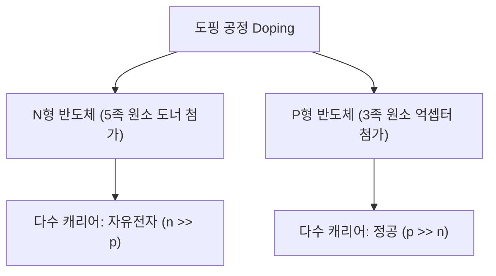

| 구분 | N형 반도체 (N-type) | P형 반도체 (P-type) |
| :--- | :--- | :--- |
| **도판트 (Dopant)** | **5족 원소 (도너, Donor)**: P(인), As(비소), Sb(안티모니) | **3족 원소 (억셉터, Acceptor)**: B(붕소), Al(알루미늄), Ga(갈륨) |
| **메커니즘** | 결합 후 남는 5번째 전자가 작은 에너지($\approx 0.05\text{eV}$)로 자유전자가 됨 | 결합에 전자 1개가 부족하여 주변 전자를 끌어당겨 정공(Hole)을 생성함 |
| **다수 캐리어** | **자유전자 (Electrons)** ($n \approx N_D$) | **정공 (Holes)** ($p \approx N_A$) |
| **소수 캐리어** | 정공 ($p = \frac{n_i^2}{N_D}$) | 전자 ($n = \frac{n_i^2}{N_A}$) |
| **질량 작용 법칙** | $$n \cdot p = n_i^2$$ (열평형 상태에서 항상 성립) | $$n \cdot p = n_i^2$$ |

---

## 4. 반도체 내의 2가지 전류 메커니즘

  
*▲ [그림 3-5] 전기장에 의한 전자의 드리프트(Drift) 이동 원리 (출처: 13. 반도체)*

  
*▲ [그림 3-6] 농도 기울기에 의한 캐리어의 확산(Diffusion) 현상 (출처: 13. 반도체)*


반도체에 전류가 흐르는 원리는 금속과 달리 **드리프트(Drift)**와 **확산(Diffusion)** 두 가지입니다.

### (1) 드리프트 전류 (Drift Current)
* 외부에서 가해진 **전기장**($\vec{E}$)에 의해 전하가 끌려가며 발생하는 전류입니다.
* 전자는 전기장의 반대 방향으로, 정공은 전기장 방향으로 이동합니다.
* 드리프트 속도: $v_d = \mu E$ (여기서 $\mu$는 **이동도 Mobility**)
* 총 드리프트 전류 밀도:

$$J_{drift} = q(n\mu_n + p\mu_p)E = \sigma E$$

> **💡 이동도($\mu$) 비교**: 전자의 유효 질량이 정공보다 작기 때문에 실리콘에서 전자의 이동도($\mu_n \approx 1400\,\text{cm}^2/\text{V}\cdot\text{s}$)는 정공의 이동도($\mu_p \approx 450\,\text{cm}^2/\text{V}\cdot\text{s}$)보다 약 3배 큽니다! (따라서 NMOS가 PMOS보다 빠릅니다.)

### (2) 확산 전류 (Diffusion Current)
* 전하 캐리어의 **농도 불균형(농도 기울기, Concentration Gradient)**으로 인해 고농도 영역에서 저농도 영역으로 캐리어가 퍼져나갈 때 흐르는 전류입니다.
* 총 확산 전류 밀도:

$$J_{diff} = q D_n \frac{dn}{dx} - q D_p \frac{dp}{dx}$$

---

## 5. PN 접합 (PN Junction) 다이오드

  
*▲ [그림 3-7] P형 반도체와 N형 반도체의 접합 및 공핍층 형성 (출처: 13. 반도체)*

  
*▲ [그림 3-8] PN 접합 다이오드의 순방향 바이어스 인가 시 대전류 흐름 (출처: 13. 반도체)*

  
*▲ [그림 3-9] PN 접합 다이오드의 실제 전압-전류(I-V) 특성 곡선 (출처: 13. 반도체)*


P형 반도체와 N형 반도체를 결합하면 접합면에서 전도성 캐리어가 사라진 **공핍층(Depletion Region)**과 내부 전위 장벽(내장 전위, Built-in Potential $V_{bi} \approx 0.7\text{V}$)이 형성됩니다.

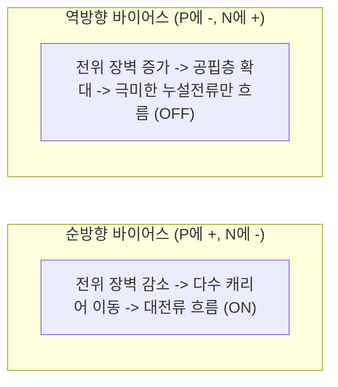

### 특수 목적 다이오드 종류
* **제너 다이오드 (Zener Diode)**: 고농도 도핑으로 역방향 항복(Breakdown) 전압에서 일정한 전압을 유지하는 정전압 소자.
* **쇼키 다이오드 (Schottky Diode)**: 금속-반도체 접합을 이용하여 역회복 시간($t_{rr}$)이 거의 없는 초고속 스위칭 소자.
* **발광 다이오드 (LED)**: 전자와 정공이 결합할 때 밴드갭 에너지를 빛(Photon)으로 방출하는 직접 천이형(GaAs, GaN 등) 소자.
* **포토다이오드 & 태양전지**: 빛을 흡수하여 EHP를 생성하고 이를 전기 에너지로 변환하는 수광 소자.

---

## 💡 핵심 개념 점검 & 실무 Q&A

**Q1. 실리콘에서 전자의 이동도($\mu_n$)가 정공의 이동도($\mu_p$)보다 약 3배 높은 물리적 이유는 무엇인가요?**  
* **핵심 해설**: 전자는 에너지 밴드 구조상 전도대 바닥 부근에서 결정 격자의 주기적 포텐셜과 상호작용할 때 곡률이 커서 **유효 질량**($m^\ast$)이 정공보다 작습니다. 이동도는 $\mu = \frac{q\tau}{m^\ast}$로 유효 질량에 반비례하므로, 유효 질량이 작은 전자가 격자 진동(Phonon) 산란을 덜 받고 더 민첩하게 이동합니다.

**Q2. 순수한 진성 반도체에 온도($T$)를 올리면 저항은 증가하나요, 감소하나요?**  
* **핵심 해설**: 금속 도체는 온도가 오르면 격자 산란이 심해져 저항이 증가하지만, 반도체는 열에너지에 의해 공유결합이 깨지며 전도 캐리어 농도($n_i \propto T^{3/2} e^{-E_g / 2kT}$)가 지수함수적으로 급증합니다. 따라서 캐리어 증가 효과가 이동도 감소 효과를 압도하여 **온도가 올라갈수록 저항이 급격히 감소(음의 저항 온도 계수, NTC)**합니다.

---

> **다음 글 예고**: [04강. 반도체 소자 이론 심화 - MOSFET 동작 원리와 차세대 소자](/반도체제조공정-04-반도체-소자이론-mosfet-원리와-차세대소자.html)  
> 현대 디지털 혁명의 심장, 트랜지스터(MOSFET)의 동작 메커니즘과 무어의 법칙을 잇는 3D FinFET, GAA 나노시트를 분석합니다.
\n\n\n---\n\n<!-- START OF 04_반도체_소자이론_MOSFET_원리와_차세대소자.md -->\n\n# [반도체 소자심화] 04. 반도체 소자 이론 - MOSFET 원리와 차세대 나노 소자 🏆

> **카테고리**: Part 1. 반도체 기초 이론 & 소자 물성  
> **태그**: #MOSFET #트랜지스터 #문턱전압 #FinFET #GAA #나노시트 #HighKMetalGate #무어의법칙  
> **추천 독자**: 반도체 장비 제어 및 소자 공정 실무를 체계적으로 학습하려는 엔지니어 및 학생

---

> 💡 **핵심 요약 (3줄 정리)**  
> 1. **MOSFET**은 게이트 전압($V_G$)으로 반도체 표면에 전도 채널(Channel)을 형성하여 소스(Source)와 드레인(Drain) 사이의 전류를 제어하는 전압 제어 스위치입니다.  
> 2. 미세화가 90nm 이하로 진행되면서 단채널 효과(SCE)와 누설 전류 한계가 발생했고, 이를 극복하기 위해 **Strained Si**, **High-k/Metal Gate**, **3차원 FinFET**이 도입되었습니다.  
> 3. 3nm 이하 초미세 공정에서는 4면을 게이트로 감싸는 **GAA(Gate-All-Around) MBCFET(나노시트)** 구조가 표준이 되었으며, 차세대 소자로 TFET, NCFET이 연구되고 있습니다.  

---

## 1. 전자 소자의 진화: 진공관 → BJT → MOSFET

  
*▲ [그림 4-1] 반도체 기술에 사용되는 주기율표 상의 핵심 원소들 (출처: 삼성전자 최상기 교수 교재 / Intel)*

  
*▲ [그림 4-2] 실리콘 원자 격자 배열과 원통형 잉곳(Ingot), 웨이퍼(Wafer) (출처: 삼성전자 최상기 교수 교재)*


* **진공관 (Vacuum Tube, 1904)**: 플레밍의 2극 진공관과 드포레스트의 3극관. 필라멘트 가열로 열전자를 방출시켜 부피가 크고 전력 소모 및 발열이 극심했습니다.
* **바이폴라 트랜지스터 (BJT, 1947)**: 바딘, 브래튼, 쇼클리의 벨 연구소 발명. 전자와 정공 둘 다 동작에 관여하는 전류 제어형 소자였으나, 집적화 시 발열 한계가 존재했습니다.
* **MOSFET (Metal-Oxide-Semiconductor Field-Effect Transistor, 1959)**: 강대원 박사와 마틴 아탈라 발명. 입력 게이트로 전류가 흐르지 않고 정전기장으로 채널을 제어하므로 **집적도와 소비전력 면에서 압도적 우위**를 점하여 현대 반도체 IC의 표준이 되었습니다.

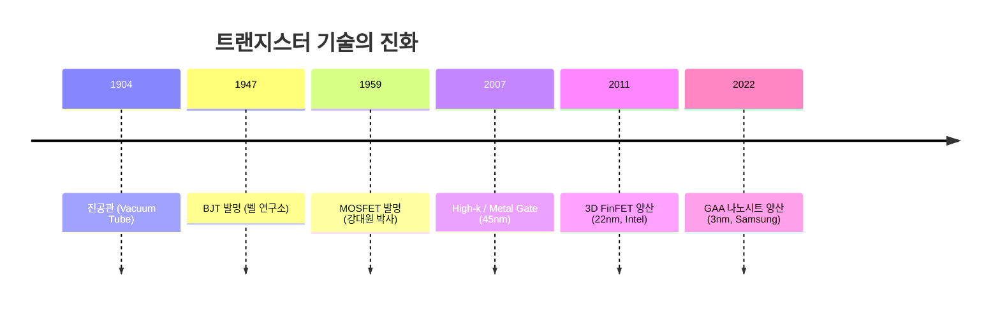

---

## 2. MOSFET의 구조와 동작 메커니즘 (수도꼭지 비유)

  
*▲ [그림 4-3] 최초의 진공관부터 트랜지스터로의 발전 (출처: 삼성전자 최상기 교수 교재)*

  
*▲ [그림 4-4] 게이트 전압을 통한 소스-드레인 전류 제어의 수도꼭지 비유 (출처: 삼성전자 최상기 교수 교재)*

  
*▲ [그림 4-5] (a) 게이트 전압 무인가, (b) 낮은 전압 인가, (c) 문턱전압 이상 인가 시 반전층 형성 (출처: 삼성전자 최상기 교수 교재)*


NMOS 트랜지스터는 P형 기판(Substrate) 위에 고농도 N형($N^+$) 소스(Source)와 드레인(Drain) 영역을 형성하고, 그 사이에 얇은 절연막(Gate Oxide)과 게이트 전극을 얹은 구조입니다.

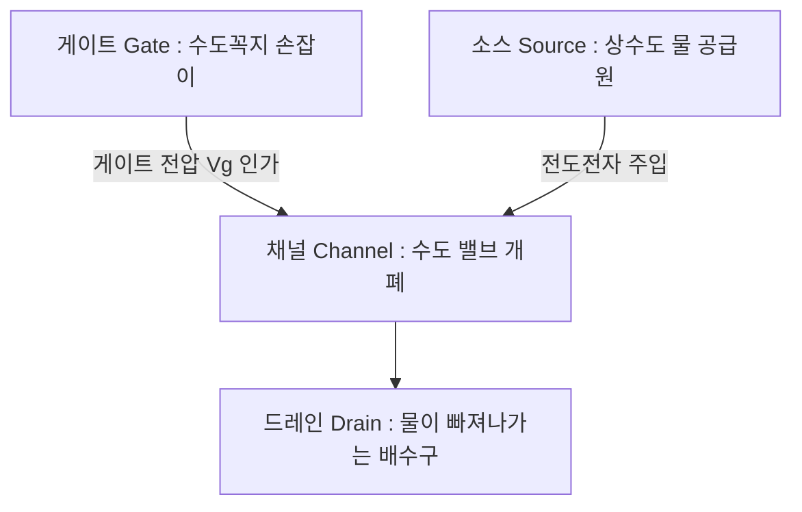

### (1) 게이트 전압이 없을 때 ($V_G = 0$)
* 소스($N^+$) - 기판($P$) - 드레인($N^+$) 사이에 역방향 PN 접합이 존재하므로 전류가 흐르지 않는 **OFF 상태(수도꼭지가 잠김)**입니다.

### (2) 낮은 게이트 전압 인가 ($0 < V_G < V_{th}$)
* 양(+)의 게이트 전압이 P형 기판 표면의 정공을 밀어내어 전하가 없는 **공핍 영역(Depletion Layer)**이 형성됩니다. 아직 전자가 모이지 않아 전류는 흐르지 않습니다.

### (3) 문턱전압 이상의 게이트 전압 인가 ($V_G > V_{th}$)
* 강한 양(+)의 전기장에 의해 소수 캐리어인 전자들이 산화막 바로 아래 기판 표면으로 강하게 끌어당겨져 모입니다.
* P형 실리콘 표면이 N형처럼 행동하는 **반전층(Inversion Layer, 전자 채널)**이 형성됩니다.
* 이제 드레인에 전압($V_D > 0$)을 걸어주면 소스에서 드레인으로 전자가 쏟아져 들어가 **ON 전류**($I_D$)가 흐릅니다!

---

## 3. MOSFET의 전류-전압($I_D - V_D$) 특성 영역

1. **차단 영역 (Cut-off Region)**: $V_{GS} < V_{th} \implies I_D \approx 0$
2. **선형 영역 (Linear / Triode Region)**: $V_{GS} > V_{th}$ 이고 $V_{DS} < V_{GS} - V_{th}$
   * 드레인 전압에 비례하여 전류가 선형적으로 증가 (옴성 저항처럼 동작)
   $$I_D = \mu_n C_{ox} \frac{W}{L} \left[ (V_{GS} - V_{th})V_{DS} - \frac{1}{2}V_{DS}^2 \right]$$
3. **포화 영역 (Saturation Region)**: $V_{DS} \ge V_{GS} - V_{th}$
   * 드레인 끝단에서 채널이 꼬집히는 **핀치오프(Pinch-off)**가 발생하여, 드레인 전압이 증가해도 전류가 일정하게 유지됩니다.
   $$I_{D,sat} = \frac{1}{2} \mu_n C_{ox} \frac{W}{L} (V_{GS} - V_{th})^2$$

---

## 4. 미세화 한계 극복을 위한 나노 기술 혁신

  
*▲ [그림 4-6] 무어의 법칙에 따른 반도체 소자 스케일링과 물리적 한계 (출처: 삼성전자 최상기 교수 교재)*

  
*▲ [그림 4-7] (왼쪽) 기존 Poly/SiO2 구조 vs (오른쪽) 45nm 혁신 Metal Gate / High-k 절연막 구조 (출처: 삼성전자 최상기 교수 교재 / Intel)*

  
*▲ [그림 4-8] 평면 구조(1면 제어)와 3차원 FinFET(3면 제어)의 게이트 장악력 비교 (출처: 삼성전자 최상기 교수 교재)*

  
*▲ [그림 4-9] 3nm 이하 초미세 공정을 위한 나노와이어 및 GAA 나노시트(MBCFET) 구조 (출처: 삼성전자 최상기 교수 교재 / Samsung)*


2000년대 초반, 게이트 길이($L$)가 수십 나노미터로 줄어들면서 소스와 드레인이 너무 가까워져 게이트가 채널을 통제하지 못하는 **단채널 효과(Short Channel Effects, SCE)**와 **드레인 유도 장벽 감소(DIBL)**, **게이트 양자 터널링 누설전류**가 폭발했습니다.

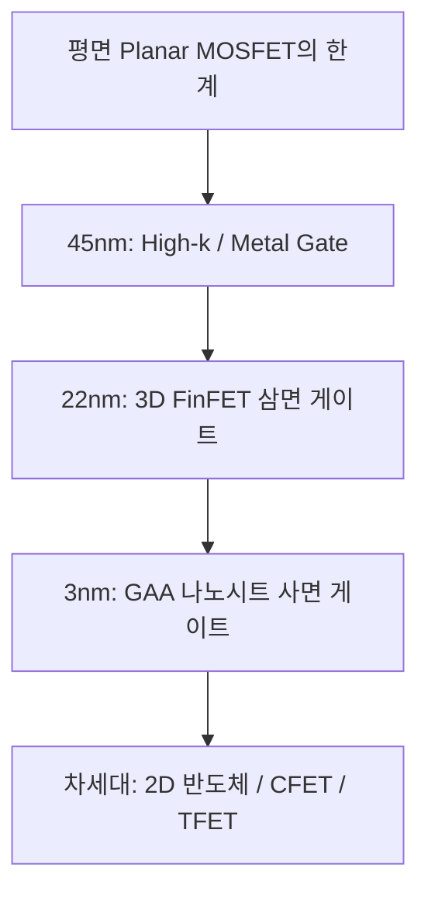

### (1) High-k 절연막 & 금속 게이트 (HKMG, 45nm)
* 산화막($SiO_2$) 두께가 $1\text{nm}$(원자 수 개 층) 이하로 얇아져 터널링 전류가 급증하자, 유전율이 높은 하프늄 옥사이드($HfO_2$, 유전율 $k \approx 25$)를 절연막으로 사용하고 폴리실리콘 대신 금속 게이트를 도입하여 정전용량($C_{ox} = \frac{\kappa \epsilon_0}{t_{ox}}$)은 높이고 누설 전류를 획기적으로 차단했습니다.

### (2) 3차원 FinFET (Fin Field-Effect Transistor, 22nm~5nm)
* 채널을 물고기 지느러미(Fin) 모양의 3차원 입체 입체 기둥으로 세우고, 게이트가 **상단과 양 측면 3면을 감싸도록** 설계했습니다.
* 게이트의 정전기적 채널 장악력이 획기적으로 향상되어 단채널 효과를 억제하고 구동 전류를 2배 이상 높였습니다.

### (3) GAA (Gate-All-Around) / MBCFET (3nm 이하)
* Fin 구조를 수평으로 눕혀 얇은 종이 형태의 나노시트(Nanosheet) 여러 장을 수직 적층한 뒤, 게이트가 **채널의 4면 전체를 360도 완벽히 둘러싸는 구조**입니다.
* 채널 제어 능력이 궁극에 도달하여 누설 전류를 극한으로 억제하며, 나노시트 폭($W$)을 조절하여 성능과 전력을 최적화할 수 있습니다 (삼성전자 3nm GAA MBCFET 양산 적용).

---

## 5. 포스트 무어(Post-CMOS) 시대의 미래 소자

무어의 법칙(Moore's Law)이 물리적 한계에 부딪히면서 새로운 작동 메커니즘을 적용한 초저전력 소자가 활발히 연구되고 있습니다:
* **TFET (Tunneling FET)**: 밴드 간 양자 터널링(Band-to-Band Tunneling)을 이용하여 상온 서브스레숄드 스윙(SS)의 물리적 한계인 $60\text{mV/dec}$ 이하를 달성하는 초저전력 소자.
* **NCFET (Negative Capacitance FET)**: 게이트 산화막에 강유전체(Ferroelectric, $HfZrO_x$)를 삽입하여 음의 정전용량 효과로 내부 전압을 증폭시키는 소자.
* **CFET (Complementary FET)**: NMOS 위에 PMOS를 3차원으로 수직 적층하여 면적을 50% 절감하는 궁극의 3D 적층 아키텍처.

---

## 💡 핵심 개념 점검 & 실무 Q&A

**Q1. 평면(Planar) MOSFET과 비교하여 FinFET과 GAA가 단채널 효과(SCE)를 억제할 수 있는 핵심 원리는 무엇인가요?**  
* **핵심 해설**: 평면 MOSFET은 게이트가 채널의 상부 1개 면만 제어하므로 채널 길이가 짧아지면 드레인 전계가 기판 하부를 침범하여 누설 전류(DIBL)가 발생합니다. 반면 FinFET은 3면, GAA는 4면 전체를 게이트가 감싸기 때문에 채널 내부의 전위 장벽을 게이트가 완벽히 장악합니다. 이에 따라 드레인 전압에 의한 간섭을 차단하고 오프 상태 누설전류를 극적으로 줄일 수 있습니다.

**Q2. 문턱전압($V_{th}$)의 물리적 정의와 이를 결정하는 요인은 무엇인가요?**  
* **핵심 해설**: 문턱전압은 반도체 표면의 페르미 준위가 진성 에너지 준위를 지나 강한 반전(Strong Inversion)이 일어나는 순간의 게이트 전압($\phi_s = 2\phi_B$)입니다. 결정 요인으로는 게이트와 실리콘의 일함수 차이($\Phi_{ms}$), 기판 도핑 농도($N_A$), 게이트 절연막의 단위면적당 정전용량($C_{ox}$), 산화막 내 고정 전하($Q_{ox}$) 등이 있습니다.

---

> **다음 글 예고**: [05강. 반도체 제조 공정 개요와 팹(Fab) 장비 시스템](/반도체제조공정-05-반도체-제조공정-개요와-8대공정-로드맵.html)  
> 소자 이론을 바탕으로, 실제 반도체 팹이 어떻게 구축되고 웨이퍼가 500개 공정을 거쳐 칩이 되는지 전체 로드맵을 조망합니다.
\n\n\n---\n\n<!-- START OF 05_반도체_제조공정_개요와_8대공정_로드맵.md -->\n\n# [팹 인프라] 05. 반도체 제조 공정 개요와 팹(Fab) 장비 시스템 🏭

> **카테고리**: Part 2. 반도체 팹 제조 인프라 & 핵심 원자재  
> **태그**: #반도체공정 #8대공정 #Fab구조 #EFEM #진공로봇 #설비엔지니어 #SubFab  
> **추천 독자**: 반도체 팹의 물리적 구조와 공정 장비의 하드웨어 구성을 한눈에 파악하려는 엔지니어

---

> 💡 **핵심 요약 (3줄 정리)**  
> 1. 반도체 제조는 **웨이퍼 제조 → 산화 → 포토 → 식각 → 박막/이온주입 → 금속배선 → EDS → 패키징**의 핵심 8대 공정으로 구성됩니다.  
> 2. 단위 공정 장비는 **EFEM(대기 로봇/얼라이너), 트랜스퍼 챔버(진공 로봇), 프로세스 모듈, 전원/제어 랙, 진공/스크러버**의 5대 핵심 유닛으로 모듈화되어 있습니다.  
> 3. 반도체 팹(Fab)은 **3층 클린룸(장비/OHT), 2층 서브팹(펌프/전원/RF), 1층/지하 플레넘(배기/폐수/가스 공급)**의 3단계 입체 구조로 운영됩니다.  

---

## 1. 반도체 산업 구조와 3대 핵심 원재료

### (1) 반도체 산업의 비즈니스 생태계
* **IDM (Integrated Device Manufacturer)**: 회로 설계부터 팹 제조, 패키징, 판매까지 전 과정을 수행 (삼성전자, SK하이닉스, 인텔 등).
* **팹리스 (Fabless)**: 제조 공장(Fab) 없이 반도체 회로 설계와 마케팅에만 집중 (엔비디아, 퀄컴, 애플 등).
* **파운드리 (Foundry)**: 팹리스가 설계한 칩을 전문적으로 위탁 생산 (TSMC, 삼성전자 파운드리 등).
* **OSAT (Outsourced Semiconductor Assembly and Test)**: 제조된 웨이퍼의 패키징 및 최종 테스트 전문 외주 기업.

### (2) 반도체의 3대 원재료

  
*▲ [그림 5-1] 반도체 3대 핵심 원재료: 실리콘 웨이퍼, 마스크(레티클), 리드프레임 (출처: 반도체공정장비 #1)*

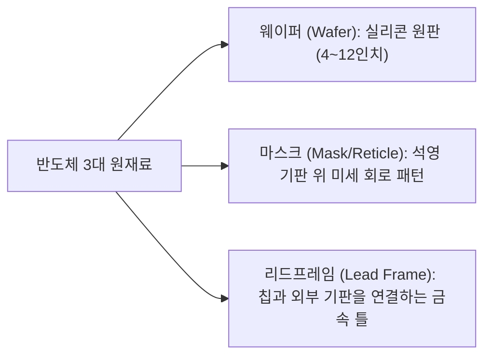

---

## 2. 반도체 핵심 8대 공정 로드맵

  
*▲ [그림 5-2] 웨이퍼 가공(FAB 500개 공정)부터 EDS 검사, 패키지 및 모듈 공정 로드맵 (출처: 반도체공정장비 #1)*


하나의 실리콘 웨이퍼에 복잡한 집적회로(IC)가 완성되기까지는 약 **500여 단계의 단위 공정**을 2~3개월간 반복 수행합니다.

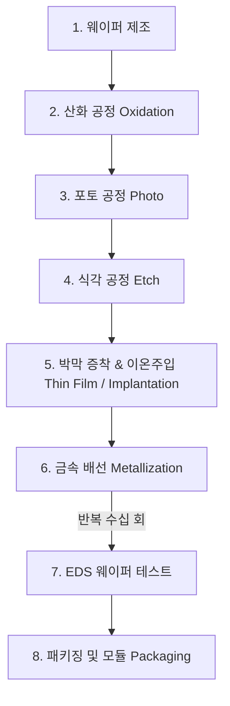

* **전공정 (Front-end Process / FAB)**: 실리콘 웨이퍼 위에 트랜지스터와 다층 금속 배선을 제조하는 1~6단계.
* **후공정 (Back-end Process)**: 웨이퍼를 개별 다이(Die)로 잘라내어 리드프레임에 실장하고 플라스틱 수지로 몰딩한 뒤 신뢰성을 검증하는 7~8단계.

---

## 3. 반도체 공정 장비의 5대 핵심 요소 (Hardware Module)

  
*▲ [그림 5-3] 반도체 공정 장비의 5대 핵심 구성: EFEM, Transfer Chamber, Process Module, Power & Control, Scrubber (출처: 반도체공정장비 #1)*

  
*▲ [그림 5-4] EFEM 대기 로봇과 진공 트랜스퍼 챔버의 도킹 구조 (출처: 반도체공정장비 #1)*


최신 반도체 클러스터 장비(Cluster Tool)는 완벽한 파티클 차단과 진공 유지를 위해 다음과 같이 5대 모듈로 설계됩니다.

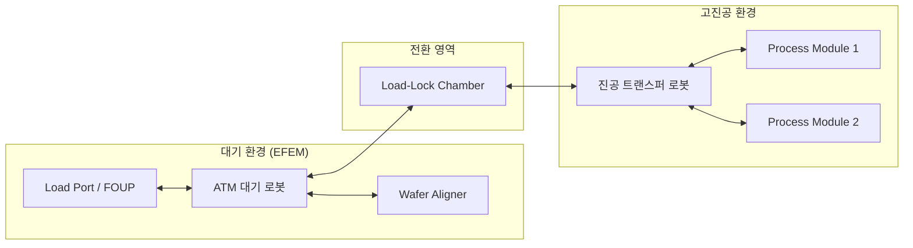

1. **웨이퍼 로딩 유닛 (EFEM: Equipment Front End Module)**:  
   * **Load Port**: 웨이퍼 보송 용기(FOUP)가 안착되는 곳.
   * **ATM Robot**: 대기압 상태에서 FOUP과 로드락 챔버 간에 웨이퍼를 이송하는 정밀 다관절 로봇.
   * **Wafer Aligner**: 웨이퍼의 노치(Notch)를 광학 센서로 감지하여 중심축과 각도를 정확히 정렬.
2. **웨이퍼 트랜스퍼 유닛 (Transfer Unit)**:  
   * **Load-Lock Chamber**: 대기압과 고진공 사이를 오가며 압력을 전환하는 버퍼 챔버.
   * **Transfer Chamber**: 고진공($10^{-6}\text{ Torr}$) 상태를 유지하며 중앙의 **진공 로봇(Vacuum Robot)**이 각 반응 챔버로 웨이퍼를 전달.
3. **프로세스 모듈 (Process Module, PM)**:  
   * 실제 식각, 증착, 세정 등 물리/화학적 반응이 일어나는 메인 챔버.
4. **전원 및 제어 유닛 (Power & Control Unit)**:  
   * **Main Power Box**: $380\text{V}/220\text{V}$ 동력 공급 및 비상 정지(EMO) 인터록 회로.
   * **Remote Control Rack**: PLC(Programmable Logic Controller)와 센서 통신(RS-232, DeviceNet).
5. **진공 및 가스 중화 유닛 (Vacuum & Scrubber Unit)**:  
   * **진공 펌프(Dry Pump / Turbo Pump)**: 챔버 내부를 초고진공으로 배기.
   * **Local Scrubber**: 배출되는 유독 가스($SiH_4, Cl_2, F_2$ 등)를 플라즈마/열/습식으로 1차 무해화.

---

## 4. 반도체 팹(Fab)의 3층 입체 구조

  
*▲ [그림 5-5] 반도체 팹의 3층 입체 구조: 3층 클린룸 라인, 2층 서브팹(Sub-FAB), 1층 플레넘(Plenum) (출처: 반도체공정장비 #1)*

  
*▲ [그림 5-6] 팹 하부 유틸리티 배관 및 가스, 전기, 초순수, 냉각수 공급 계통 (출처: 반도체공정장비 #1)*


반도체 팹은 진동을 차단하고 장비 유지보수 효율을 극대화하기 위해 다층 구조로 건설됩니다.

| 층별 구분 | 명칭 | 주요 설비 및 역할 |
| :--- | :--- | :--- |
| **3층** | **라인 (Cleanroom Floor)** | * 메인 공정 장비 (Process Module, EFEM)<br>* 천장 자동 물류 이송 레일 (OHT: Overhead Hoist Transport)<br>* FFU를 통한 초청정 층류 공조 |
| **2층** | **서브팹 (Sub-FAB Floor)** | * 진공 펌프 (Dry Pump, Turbo Pump Controller)<br>* 플라즈마 RF Generator 및 매칭 박스<br>* 장비 메인 전원 박스 및 제어 랙<br>* 열교환 칠러(Chiller) 유닛 |
| **1층 / 지하** | **플레넘 (Plenum / Utility)** | * 유독가스 2차 대형 스크러버 및 덕트 배기 설비<br>* 산/알칼리/불산 폐수 배관 및 중화 처리조<br>* 초순수(DIW), 고순도 질소/특수가스 공급 메인 배관 |

---

## 5. 설비 엔지니어가 갖추어야 할 4대 핵심 기술

1. **전장 기술**: 고전압 배전반, 차단기, 릴레이, 노이즈 필터, 전원 분배기 점검 능력.
2. **제어 기술**: 센서 신호(온도, 압력, 유량) 처리 및 PLC 시퀀스 로직 해석.
3. **로봇 기술**: 서보 모터(Servo Motor) 엔코더 캘리브레이션, 진공 로봇 티칭(Teaching) 및 웨이퍼 안착 정밀도 제어.
4. **예방 보전 (PM: Preventive Maintenance)**: 부품 마모도 관리, 진공 씰(O-ring) 교체, 파티클 소스 세정.

---

## 💡 핵심 개념 점검 & 실무 Q&A

**Q1. 반도체 공정 장비에서 대기 영역(EFEM)과 공정 챔버(PM) 사이에 로드락(Load-Lock) 챔버를 두는 이유는 무엇인가요?**  
* **핵심 해설**: 공정 챔버는 $10^{-3} \sim 10^{-6}\text{ Torr}$의 초고진공과 청정도를 유지해야 합니다. 웨이퍼를 넣을 때마다 메인 챔버를 대기에 노출시키면 진공 배기에 막대한 시간이 소요되고 대기 중의 수분과 파티클로 인해 챔버가 심각하게 오염됩니다. 로드락 챔버를 통해 대기압과 진공 사이를 완충함으로써 공정 챔버의 환경을 일정하게 보존하고 생산성(Throughput)을 극대화합니다.

**Q2. 서브팹(Sub-Fab)을 클린룸 하부에 별도로 분리하여 운영하는 이점은 무엇인가요?**  
* **핵심 해설**: 첫째, 모터와 펌프에서 발생하는 강한 진동과 소음, 열기를 청정실 공정 장비로부터 격리하여 미세 패턴의 정렬 오차를 방지합니다. 둘째, 정기적인 펌프 오버홀이나 케미컬 교체 등 유지보수 작업(PM) 시 방진복 착용 구역인 클린룸에 진입하지 않고 작업할 수 있어 오염을 예방하고 공간 효율성을 높입니다.

---

> **다음 글 예고**: [06강. 반도체 클린룸(Cleanroom) 환경 제어와 청정 관리](/반도체제조공정-06-클린룸-환경제어와-오염관리-원칙.html)  
> 나노미터 세계에서 먼지 한 톨이 미치는 치명적 영향과, 이를 막기 위한 클린룸 4원칙 및 공조 시스템을 해부합니다.
\n\n\n---\n\n<!-- START OF 06_클린룸_환경제어와_오염관리_원칙.md -->\n\n# [팹 인프라] 06. 반도체 클린룸(Cleanroom) 환경 제어와 청정 관리 🧼

> **카테고리**: Part 2. 반도체 팹 제조 인프라 & 핵심 원자재  
> **태그**: #클린룸 #CleanClass #미립자 #파티클 #HEPA필터 #ULPA #방진복 #에어샤워  
> **추천 독자**: 반도체 생산 현장의 청정 환경 기준과 엔지니어 필수 수칙을 숙지하려는 분

---

> 💡 **핵심 요약 (3줄 정리)**  
> 1. **클린룸(Cleanroom)**은 제품의 신뢰성을 확보하기 위해 미립자(Particle), 온·습도, 실내 압력을 극한으로 통제하는 특수 청정실입니다.  
> 2. 청정도는 $1\text{ft}^3$ 내 $0.5\mu\text{m}$ 크기의 먼지 개수를 기준으로 **Class 1 ~ Class 1000**으로 엄격히 분류됩니다.  
> 3. 클린룸의 기본 원칙은 **미립자 인입 방지, 발생 방지, 퇴적 방지, 신속 배제(4원칙)** 및 **청정 의식 고취(+1원칙)**입니다.  

---

## 1. 클린룸(Cleanroom)의 정의와 필요성

  
*▲ [그림 6-1] 클린룸의 정의 및 머리카락 굵기와 미립자(Particle)의 크기 비교 (출처: 반도체공정장비 #2)*


반도체 칩에 형성되는 회로 선폭은 수 나노미터($\text{nm}$)에 불과합니다. 인간의 머리카락 굵기($\approx 100\mu\text{m}$)와 비교하면 회로 선폭은 수만 분의 1 수준입니다.
* 눈에 보이지 않는 **$0.1\mu\text{m}$ 크기의 미립자(Particle)** 하나만 웨이퍼 표면에 떨어져도 회로가 끊어지는 단선(Open)이나 들러붙는 단락(Short)이 발생하여 칩 전체가 폐기됩니다.
* 따라서 반도체 생산 라인은 공기 중 미립자를 완벽히 걸러내고 일정한 온·습도($22 \pm 1^\circ\text{C}$, $45 \pm 5\%$)와 기압을 유지하는 **클린룸(청정실)** 구축이 필수적입니다.

---

## 2. 클린룸 청정도 규격: Clean Class

  
*▲ [그림 6-2] 1세제곱피트 내 입자 수에 따른 Clean Class 규격 기준 (출처: 반도체공정장비 #2)*


클린룸의 규격은 전통적으로 미국 연방 규격(FED-STD-209E)인 **Clean Class**로 표기합니다.

$$\text{Class N} \iff 1\,\text{ft}^3(0.0283\,\text{m}^3) \text{ 공기 중에 } 0.5\,\mu\text{m} \text{ 이상 크기의 입자가 } N\text{개 이하}$$

| 구분 | $1\,\text{ft}^3$ 당 입자 수 ($>0.5\mu\text{m}$) | 적용 공정 라인 |
| :--- | :--- | :--- |
| **Class 1** | **1개 이하** | 최첨단 포토리소그래피(EUV), 초미세 게이트 산화/확산 구역 |
| **Class 10** | 10개 이하 | 박막 증착, 고밀도 식각 공정 구역 |
| **Class 100** | 100개 이하 | 일반 반도체 제조 메인 라인 |
| **Class 1,000** | 1,000개 이하 | 웨이퍼 프로브 검사(EDS), 패키징 라인 |
| **일반 대기** | $1,000,000 \sim 5,000,000$개 | 일반 사무실, 주택 실내 환경 |

---

## 3. 클린룸 관리의 4원칙 + 1원칙

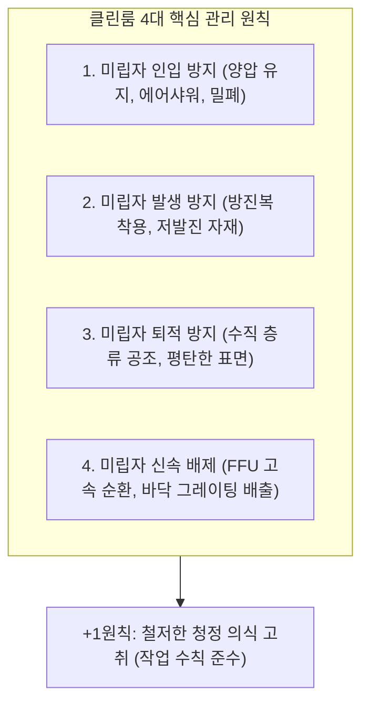

1. **미립자 인입 방지**: 실내 압력을 외부보다 높게 유지(**양압 Positive Pressure**)하여 문이 열려도 바깥 공기가 들어오지 못하게 차단.
2. **미립자 발생 방지**: 작업자는 인체 탈락 세포나 비말을 막아주는 특수 방진복을 착용하고, 클린룸 내부에는 무진종이(Clean Paper)만 반입.
3. **미립자 퇴적 방지**: 기류의 와류(Vortex)가 생기지 않도록 천장에서 바닥으로 흐르는 **수직 층류(Laminar Flow)**를 유지.
4. **미립자 신속 배제**: 발생된 미립자는 즉시 천장 팬필터유닛(FFU)과 바닥 다공판(Grating)을 통해 하부 플레넘으로 배출.
5. **+1원칙 (청정 의식)**: 아무리 훌륭한 설비도 작업자의 부주의로 오염될 수 있으므로 정기적인 청정 마인드 교육을 실시.

---

## 4. 공조 및 필터 시스템 설비

  
*▲ [그림 6-3] 클린룸의 주요 공조 부품: 패스박스(Pass Box), HEPA/ULPA 필터, FFU 유닛 (출처: 반도체공정장비 #2)*


* **HEPA 필터 (High Efficiency Particulate Air)**:  
  * $0.3\mu\text{m}$ 크기의 입자를 $99.97\%$ 이상 포집.
* **ULPA 필터 (Ultra Low Penetration Air)**:  
  * $0.12\mu\text{m}$ 크기의 극미세 입자를 $99.9995\%$ 이상 걸러내는 최첨단 반도체 라인 표준 필터.
* **FFU (Fan Filter Unit)**:  
  * 모터 팬과 ULPA 필터가 일체화된 유닛으로, 천장 전면에 촘촘히 배열되어 하향 순환 기류를 형성.
* **BFU (Blower Filter Unit)**:  
  * Class 1,000 이하의 보조 구역에 외기를 흡입하여 정화 공급하는 장치.
* **Pass Box**:  
  * 작업자 없이 물품만 클린룸으로 반입할 때 자외선 살균 및 에어샤워를 수행하는 밀폐 통로.

---

## 5. 수막룸(Smock Room) 방진복 착용 및 행동 수칙

작업자는 클린룸 내부에서 가장 큰 파티클 발생원입니다 (사람이 걷거나 숨 쉴 때 분당 수백만 개의 입자 방출).

### (1) 방진복 착용 순서 (위에서 아래로!)

  
*▲ [그림 6-4] 수막룸(Smock Room)에서의 정밀 방진복 착용 순서 1단계 (출처: 반도체공정장비 #2)*

  
*▲ [그림 6-5] 방진모, 마스크, 방진복, 방진화 완벽 착용 후 점검 (출처: 반도체공정장비 #2)*

  
*▲ [그림 6-6] 클린룸 출입 시 360도 회전 에어샤워(Air Shower) 요령 (출처: 반도체공정장비 #2)*


### (2) 클린룸 내 화장 절대 금지 이유!
* 스킨, 로션 외의 **선크림, 비비크림, 파운데이션, 파우더, 색조 화장, 향수**는 엄격히 금지됩니다.
* 화장품 성분에는 미세 광물 분말인 **탈크(Talc), 실리카, 이산화티타늄($TiO_2$)**과 중금속 및 유기 화합물이 포함되어 있어, 피부에서 탈락될 경우 웨이퍼 표면에 치명적인 금속 오염 및 미세 결함을 유발합니다.

### (3) 에어샤워(Air Shower) 요령
* 에어샤워실에 입실 후 양손을 높이 들고 좌우로 360도 천천히 회전하며 $15 \sim 30$초간 고속 청정 제트 기류로 의복에 붙은 미세 먼지를 털어냅니다.

---

## 💡 핵심 개념 점검 & 실무 Q&A

**Q1. 클린룸에서 양압(Positive Pressure)을 유지하는 이유와 그 제어 메커니즘은 무엇인가요?**  
* **핵심 해설**: 클린룸 내부 기압을 외부 복도나 비청정 구역보다 높게 유지하면(약 $10 \sim 30\text{ Pa}$ 차압), 출입문이 열리거나 틈새가 발생해도 내부의 청정 공기가 바깥으로 밀려 나갈 뿐 외부의 오염된 공기가 역류해 들어오지 못합니다. 이는 급기 팬의 풍량을 배기 풍량보다 항상 일정 비율 많게 제어함으로써 달성합니다.

**Q2. ULPA 필터가 0.12마이크로미터 입자까지 완벽에 가깝게 포집할 수 있는 물리적 포집 원리는 무엇인가요?**  
* **핵심 해설**: 공기 필터는 단순한 체(Sieve)가 아니라 3가지 복합 메커니즘으로 동작합니다. 입자가 클 때는 기류를 따라가다 섬유에 부딪히는 **관성 충돌(Inertial Impaction)**과 섬유 표면에 닿는 **차단(Interception)**이 작용하고, $0.1\mu\text{m}$ 이하의 극미세 입자는 기체 분자와의 충돌로 지그재그로 불규칙하게 움직이는 **브라운 운동에 의한 확산(Diffusion)** 효과로 섬유에 부착되어 포집됩니다.

---

> **다음 글 예고**: [07강. 반도체 핵심 공정 재료 - 실리콘 웨이퍼, 케미컬, 특수가스](/반도체제조공정-07-반도체-핵심재료-실리콘웨이퍼와-케미컬-특수가스.html)  
> 모래에서 고순도 300mm 웨이퍼가 탄생하는 과정과 팹에서 사용되는 위험 화학물질 및 특수가스 안전 수칙을 알아봅니다.
\n\n\n---\n\n<!-- START OF 07_반도체_핵심재료_실리콘웨이퍼와_케미컬_특수가스.md -->\n\n# [공정 재료] 07. 반도체 핵심 공정 재료 - 실리콘 웨이퍼, 케미컬, 특수가스 🧪

> **카테고리**: Part 2. 반도체 팹 제조 인프라 & 핵심 원자재  
> **태그**: #실리콘웨이퍼 #잉곳성장 #초크랄스키 #CMP #불산위험성 #특수가스 #자연발화  
> **추천 독자**: 반도체 원자재 제조 공정과 위험 케미컬/가스 취급 안전을 이해하려는 공정 엔지니어

---

> 💡 **핵심 요약 (3줄 정리)**  
> 1. 실리콘 웨이퍼는 규석($SiO_2$) 정제 후 **초크랄스키(Cz)법**으로 잉곳을 성장시켜 슬라이싱, 래핑, 화학식각, CMP 연마를 거쳐 제조됩니다.  
> 2. 웨이퍼 구경이 커질수록(현재 300mm/12인치 표준) 칩 생산량과 경제성이 비약적으로 증가하며, 결정면은 (100) 방향이 주로 사용됩니다.  
> 3. 반도체 공정에 쓰이는 **불산(HF)**은 인체 칼슘을 파괴하는 치명적인 산이며, **실란**($SiH_4$) 등 특수가스는 공기 노출 시 즉각 폭발하므로 철저한 인터록이 필수입니다.  

---

## 1. 모래(규석)에서 실리콘 웨이퍼까지의 제조 공정

우리가 바닷가에서 흔히 보는 모래(규석)가 어떻게 원자 수준으로 매끄러운 반도체 웨이퍼가 되는지 그 변신 과정을 살펴봅니다.

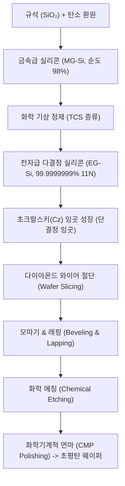

### (1) 초크랄스키(Cz) 단결정 성장법
* 석영 도가니에 고순도 폴리실리콘을 넣고 $1420^\circ\text{C}$ 이상 가열하여 녹입니다.
* 특정 결정 방향(예: <100>)을 가진 단결정 **씨앗 결정(Seed Crystal)**을 쇳물 표면에 접촉시킨 뒤, 천천히 회전시키며 위로 끌어올립니다.
* 용융액이 냉각되면서 씨앗 결정과 동일한 결정 격자를 가진 거대한 원통형 **단결정 잉곳(Ingot)**이 완성됩니다.

---

## 2. 웨이퍼 규격과 결정면 분류

### (1) 웨이퍼 크기(Size)의 발전

  
*▲ [그림 7-1] 실리콘 웨이퍼 크기(3인치 ~ 12인치/300mm)에 따른 구분 (출처: 반도체공정장비 #3)*

  
*▲ [그림 7-2] 200mm에서 300mm 웨이퍼로의 전환에 따른 유효 칩 수(Net Die) 급증 (출처: 반도체공정장비 #3)*

* $3\text{인치}(75\text{mm}) → 4\text{인치} → 6\text{인치} → 8\text{인치}(200\text{mm}) → 12\text{인치}(300\text{mm})$
* **경제성 효과**: 200mm에서 300mm로 직경이 1.5배 증가하면 표면적은 $2.25$배 증가하지만, 테두리 버려지는 영역 감소로 얻을 수 있는 유효 다이(Net Die) 수는 **약 2.5배 이상 급증**합니다.

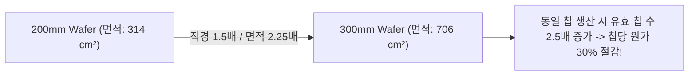

### (2) 결정면과 구별 방식

  
*▲ [그림 7-3] (100) 및 (111) 결정면 방향과 P/N형 도핑에 따른 플랫존(Flat Zone) 식별법 (출처: 반도체공정장비 #3)*

  
*▲ [그림 7-4] 300mm 대구경 웨이퍼의 정밀 노치(Notch) 및 레이저 각인 일련번호 (출처: 반도체공정장비 #3)*

* **(100) 결정면**: 표면 결합 원자 밀도가 낮아 계면 결함(Surface State)이 적으므로 **MOSFET 소자** 제작에 주로 사용됩니다.
* **(111) 결정면**: 원자 충진율이 높아 BJT 소자에 일부 활용됩니다.
* **웨이퍼 정렬 기준**:
  * 200mm 이하: 웨이퍼 테두리를 직선으로 깎아낸 **플랫 존(Flat Zone)**의 각도와 위치로 P/N형 및 결정면 구분.
  * 300mm 이상: 원형 면적 낭비를 막기 위해 작은 V자 홈인 **노치(Notch)**와 레이저 각인 일련번호(Scribed ID) 사용.

---

## 3. 반도체 케미컬 3대 분류와 불산(HF)의 위험성

  
*▲ [그림 7-5] 반도체 공정에 사용되는 주요 산(Acid)과 불산(HF) 취급 안전 (출처: 반도체공정장비 #3)*


반도체 팹에서는 식각, 세정, 박막 제거를 위해 고순도 화학 약품을 사용합니다.

| 분류 | 주요 물질 | 용도 및 특성 |
| :--- | :--- | :--- |
| **산 (Acid)** | $H_2SO_4, HCl, HNO_3, H_3PO_4, HF$ | 금속/유기물 제거, 산화막 식각, $H^+$ 방출 |
| **염기 (Alkali)** | $NH_4OH, KOH, TMAH$ | 파티클 제거, Si 이방성 식각, $OH^-$ 방출, 단백질 부식 |
| **유기용제 (Solvent)** | $IPA, Acetone, PGMEA, NMP$ | PR 용해 및 현상, 최종 웨이퍼 린스/건조 |

### ⚠️ [초특급 주의] 불산(HF, Hydrofluoric Acid)의 치명적 위험성!
* **특성**: 실리콘 산화막($SiO_2$)을 상온에서 녹일 수 있는 유일한 산으로 세정과 식각에 필수적입니다 ($SiO_2 + 6HF → H_2SiF_6 + 2H_2O$).
* **체내 침투 메커니즘**:
  1. 약산이라 피부에 닿아도 염산이나 황산처럼 즉각적인 통증이 없어 노출 사실을 인지하기 어렵습니다.
  2. 피부와 세포벽을 뚫고 뼈 속까지 깊숙이 침투합니다.
  3. 혈액 속의 필수 칼슘($Ca^{2+}$) 및 마그네슘($Mg^{2+}$) 이온과 급격히 결합하여 불화칼슘($CaF_2$) 침전을 형성합니다.
  4. **저칼슘혈증(Hypocalcemia)**을 유발하여 심장마비를 일으키고 뼈를 녹여 괴사시킵니다.
* **응급 조치**: 접촉 즉시 대량의 물로 15분 이상 세척 후, 길항제인 **글루콘산칼슘(Calcium Gluconate) 젤**을 환부에 문지르고 즉시 병원으로 이송해야 합니다!

---

## 4. 반도체 특수가스 6대 분류

  
*▲ [그림 7-6] 반도체 팹에서 사용되는 특수가스의 위험도별 6대 분류 (출처: 반도체공정장비 #3)*

  
*▲ [그림 7-7] 공기 노출 시 즉각 폭발하는 자연발화성(Pyrophoric) 가스의 특성 (출처: 반도체공정장비 #3)*


공정 챔버 내부로 투입되는 가스는 반응성이 극도로 강하므로 다음과 같이 6대 위험 등급으로 엄격히 분류·관리됩니다.

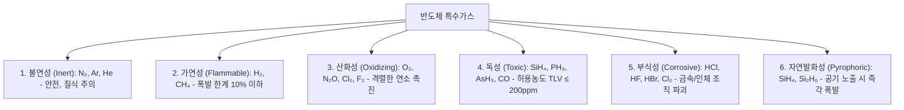

* **자연발화성(Pyrophoric) 가스**: 실란($SiH_4$)과 다이실란($Si_2H_6$)은 CVD 박막 증착에 쓰이지만, 상온에서 공기(산소)와 접촉하는 즉시 불꽃 없이 대폭발을 일으킵니다 ($SiH_4 + 2O_2 → SiO_2 + 2H_2O$).
* 따라서 가스 공급 배관은 이중 동축관(Double Containment Pipe)을 사용하고, 질소 퍼지(N2 Purge) 라인과 자동 셧오프 밸브(Emergency Shut-off Valve)를 다중 연동합니다.

---

## 💡 핵심 개념 점검 & 실무 Q&A

**Q1. 웨이퍼 제조 시 다이아몬드 와이어 절단 후 CMP(Chemical Mechanical Polishing) 공정이 반드시 필요한 이유는 무엇인가요?**  
* **핵심 해설**: 기계적 톱질(Sawing)이나 래핑 직후의 웨이퍼 표면은 수 마이크로미터 단위의 거칠기와 결정 격자 크랙(Damage)을 가지고 있습니다. 포토리소그래피 공정에서 수십 나노미터 초점심도(DOF) 내에 완벽히 초점을 맞추기 위해서는 표면 단차가 수 나노미터 이하인 원자 수준의 평탄도가 요구됩니다. CMP는 화학 약품(Slurry)에 의한 표면 반응과 연마 패드의 기계적 마찰을 결합하여 표면 결함층을 제거하고 완벽한 거울면(Mirror Surface)을 형성합니다.

**Q2. 실란($SiH_4$) 가스 배관 라인에서 리크(Leak) 점검 시 비눗물 대신 헬륨 디텍터(He Leak Detector)를 사용하는 이유는 무엇인가요?**  
* **핵심 해설**: 실란 가스는 공기 중 산소나 수분과 접촉하는 순간 즉각 자연발화(Pyrophoric) 폭발을 일으키므로 일반적인 가압식 비눗물 검사가 불가능합니다. 또한 분자 크기가 매우 작아 극미량 누출도 대형 사고로 이어질 수 있으므로, 원자 반경이 가장 작은 불활성 헬륨($He$) 가스를 배관 내부에 가압 주입한 후 진공 질량분석기(Mass Spectrometer)로 감지하는 헬륨 리크 검사법을 적용합니다.

---

> **다음 글 예고**: [08강. 반도체 팹 유틸리티 - 초순수, CDA, 냉각수, 배기 시스템](/반도체제조공정-08-팹-유틸리티-인프라-초순수-cda-배기-모니터링.html)  
> 24시간 잠들지 않는 반도체 팹의 생명선, 초순수(DI Water) 제조 기술과 대기 방출 스크러버 계통을 분석합니다.
\n\n\n---\n\n<!-- START OF 08_팹_유틸리티_인프라_초순수_CDA_배기_모니터링.md -->\n\n# [팹 인프라] 08. 반도체 팹 유틸리티 - 초순수, CDA, 냉각수, 배기 시스템 💧

> **카테고리**: Part 2. 반도체 팹 제조 인프라 & 핵심 원자재  
> **태그**: #팹유틸리티 #초순수 #DIWater #CDA #PCW #웻스크러버 #배기시스템 #FMS  
> **추천 독자**: 반도체 팹 설비/인프라 기술 직무를 지망하는 엔지니어

---

> 💡 **핵심 요약 (3줄 정리)**  
> 1. **초순수(DI Water)**는 이온, 미립자, 유기물, 용존 산소를 극한으로 제거하여 이론상 한계 비저항인 $18.2\,\text{M}\Omega\cdot\text{cm}$를 달성한 순수입니다.  
> 2. 팹에는 장비 구동용 **CDA(청정압축공기)**, 열 제어용 **PCW(공정냉각수)**, 불활성 환경용 **고순도 질소(GN2/PN2)**가 24시간 무중단 공급됩니다.  
> 3. 배출되는 유독성 가스와 폐수는 **산배기 웻스크러버(Wet Scrubber)**와 유기/열 배기 시설, 중앙 FMS 모니터링을 통해 환경 기준치 이하로 정화 배출됩니다.  

---

## 1. 팹 유틸리티(Utility)의 중요성

반도체 공정 장비가 아무리 정밀해도, 이를 구동하는 전력, 물, 공기, 냉각수, 가스가 끊기거나 순도가 흔들리면 즉시 수십만 장의 웨이퍼가 전량 폐기됩니다. 팹 유틸리티는 팹이라는 거대한 생명체에 피와 산소를 공급하는 **순환계이자 장기**입니다.

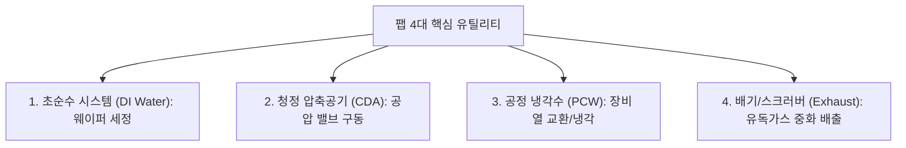

---

## 2. 초순수 (DI Water: Deionized Water) 시스템

  
*▲ [그림 8-1] 초순수(DI Water) 제조 3단계 블록: 전처리, 순수제조(Make-up), 초순수정제(Polishing) (출처: 반도체공정장비 #4)*

  
*▲ [그림 8-2] RO(Reverse Osmosis) 역삼투압 멤브레인을 통한 용존 이온 98% 제거 메커니즘 (출처: 반도체공정장비 #4)*

  
*▲ [그림 8-3] 185nm/254nm 자외선 살균기를 통한 유기물(TOC) 광분해 및 멸균 장치 (출처: 반도체공정장비 #4)*


웨이퍼를 화학 약품으로 씻어낸 뒤 최종 헹굼(Rinse)에 사용되는 물로, 물 이외의 불순물이 전무한 궁극의 물입니다.

### (1) 초순수 제조 3단계 블록
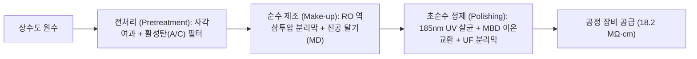

1. **전처리 (Pretreatment & Make-Up Block)**:  
   * **마이크로 필터 & 활성탄(A/C) 필터**: 원수 속 흙, 모래 등 비이온성 부유 물질과 잔류 염소($Cl_2$), 유기물을 흡착 제거.
   * **RO (Reverse Osmosis, 역삼투압)**: 반투막에 삼투압 이상의 고압을 가해 순수한 물 분자만 통과시켜 물속 이온성 물질을 $98\%$ 이상 1차 제거.
2. **폴리싱 블록 (Polishing Block)**:  
   * **UV 살균기 (UV Sterilizer, $185\text{nm} / 254\text{nm}$)**: 단파장 자외선으로 유기물(TOC: Total Organic Carbon)을 이산화탄소로 광분해하고 박테리아를 멸균.
   * **MBD (Mixed Bed Deionizer, 혼상식 이온교환수지)**: 양이온 교환수지와 음이온 교환수지가 혼합된 탑을 통과시켜 미량 잔류 이온($Na^+, Cl^-$ 등)을 완벽 포집.
   * **UF (Ultrafilter, 한외여과막)**: 박테리아 사체 및 $0.05\mu\text{m}$ 이하의 미세 입자 최종 차단.
3. **초순수의 품질 지표**:  
   * **비저항(Resistivity)**: **$18.2\,\text{M}\Omega\cdot\text{cm}$ at $25^\circ\text{C}$** (물 자체의 이온화 $H^+, OH^-$ 외에 불순물 이온이 전혀 없음을 의미).
   * **TOC**: $1\,\text{ppb}$ 이하, **용존 산소(DO)**: $5\,\text{ppb}$ 이하.

---

## 3. CDA와 PCW 시스템

  
*▲ [그림 8-4] Air Compressor와 Receiver Tank, 에어 드라이어로 구성된 CDA 공급 계통 (출처: 반도체공정장비 #4)*

  
*▲ [그림 8-5] 7kg/cm² 일정한 압력으로 챔버 폐열을 회수하는 PCW 폐루프 순환 시스템 (출처: 반도체공정장비 #4)*


### (1) CDA (Clean Dry Air, 청정압축공기)
* **역할**: 진공 챔버의 슬릿 밸브, 공압 실린더, 웨이퍼 로더 구동원의 동력으로 사용.
* **요구 조건**: 공기 중의 먼지, 압축기 오일 미스트, 수분을 완벽 제거해야 함. 수분이 남아 있으면 밸브 부식 및 결로로 인한 파티클을 유발하므로 **노점(Dew Point)을 $-70^\circ\text{C}$ 이하**로 극저온 건조시킵니다.

### (2) PCW (Process Cooling Water, 공정냉각수)
* **역할**: 플라즈마 방전 장치, 고진공 터보 펌프, 이온주입기, 챔버 벽면에서 발생하는 막대한 열을 회수.
* **운영**: 일정한 수압($7\,\text{kg/cm}^2$)과 정밀 제어된 수온($20 \pm 0.5^\circ\text{C}$)을 유지하며 폐쇄 루프(Closed Loop)로 연속 순환 냉각.

---

## 4. 특수가스 공급 및 팹 배기/폐수 처리 시스템

```mermaid
flowchart TD
    subgraph Supply ["공급 계통"]
        GN2["기계실 Bulk GN2"] --> Purifier["초고순도 Purifier (수분/산소 ppb급 제거)"]
        Purifier --> PN2["공정 장비 공급 (PN2)"]
    end
    subgraph Exhaust ["배기 처리 계통"]
        Chamber[공정 챔버 유독 가스] --> Scrubber1["1차 로컬 스크러버 (Local Scrubber)"]
        Scrubber1 --> Duct[배기 DUCT Blower]
        Duct --> Scrubber2["2차 중앙 웻스크러버 (NaOH + H2O 살포)"]
        Scrubber2 --> Atmosphere["대기 방출 (TLV 이하 환경 기준 충족)"]
    end
```

### (1) 산배기 웻스크러버 (Acid Wet Scrubber)

  
*▲ [그림 8-6] 공정 챔버의 유독 산가스를 NaOH 수용액으로 중화 정화하는 웻스크러버 (출처: 반도체공정장비 #4)*

  
*▲ [그림 8-7] 가스실과 팹 유틸리티를 24시간 실시간 감시하는 중앙 모니터링 시스템 (출처: 반도체공정장비 #4)*

* 공정 장비에서 배출되는 유독성 산 가스($HCl, HF, Cl_2, F_2$)를 강력한 블로어(Blower)로 흡입.
* 웻스크러버 내부에서 알칼리 중화액($NaOH + H_2O$)을 분사하여 화학적 중화 반응 유도:
  $$HCl + NaOH → NaCl + H_2O$$
  $$HF + NaOH → NaF + H_2O$$
* 중화된 염은 폐수 처리장으로 보내고, 정화된 공기만 환경 허용 농도(TLV) 이하로 굴뚝을 통해 대기 방출.

### (2) 유기 및 열 배기 시스템
* 솔벤트(IPA, Acetone) 증기는 활성탄 필터 박스 및 RTO(축열식 연소산화장치)를 통해 $800^\circ\text{C}$ 이상에서 고온 연소시켜 물과 $CO_2$로 산화 분해.

### (3) FMS (Facility Monitoring System, 통합 감시 시스템)
* 클린룸 및 서브팹 전 구역의 가스 감지기, 차압계, 온습도계, 유량계를 중앙 관제실에서 24시간 실시간 모니터링하여 이상 감지 시 가스 자동 차단(Interlock) 실행.

---

## 💡 핵심 개념 점검 & 실무 Q&A

**Q1. 이론상 초순수(DI Water)의 최대 비저항이 $18.25\,\text{M}\Omega\cdot\text{cm}$ ($25^\circ\text{C}$)로 제한되는 물리화학적 이유는 무엇인가요?**  
* **핵심 해설**: 물($H_2O$) 속에 외부 불순물 이온이 단 한 개도 존재하지 않더라도, 물 분자 자체의 고유한 자체 이온화 평형($H_2O \rightleftharpoons H^+ + OH^-$)에 의해 $25^\circ\text{C}$에서 $[H^+] = [OH^-] = 1.0 \times 10^{-7}\,\text{mol/L}$의 수소 이온과 수산화 이온이 필연적으로 존재합니다. 이 두 이온의 이동도에 의해 발생하는 전도도를 저항률로 환산하면 정확히 $18.25\,\text{M}\Omega\cdot\text{cm}$가 되며, 이것이 순수의 물리적 한계치입니다.

**Q2. 웻스크러버(Wet Scrubber)에 중화제로 가성소다($NaOH$)를 투입할 때 pH 제어가 중요한 이유는 무엇인가요?**  
* **핵심 해설**: 산성 유독 가스를 완전히 중화하기 위해서는 스크러버 순환수 pH를 통상 $8.5 \sim 10$의 약알칼리 상태로 유지해야 합니다. pH가 너무 낮으면 산 가스가 중화되지 못하고 대기로 누출될 위험이 있고, 반대로 $NaOH$를 과다 주입하여 pH가 지나치게 높아지면 배관 내부에 탄산칼슘 등 스케일(Scale)이 침착되어 노즐 막힘 현상과 약품 낭비를 초래하기 때문입니다.

---

> **다음 글 예고**: [09강. 세정 공정 (Cleaning) - 표면 오염 제어와 RCA 세정 기술](/반도체제조공정-09-세정-공정-rca세정과-표면오염-제어.html)  
> 반도체 단위 공정의 시작과 끝! 웨이퍼 표면의 파티클, 금속, 유기물을 박멸하는 RCA 화학 세정법을 전격 분석합니다.
\n\n\n---\n\n<!-- START OF 09_세정_공정_RCA세정과_표면오염_제어.md -->\n\n# [단위공정] 09. 세정 공정 (Cleaning) - 표면 오염 제어와 RCA 세정 기술 🧽

> **카테고리**: Part 3. 반도체 핵심 단위 제조 공정  
> **태그**: #세정공정 #Cleaning #RCA세정 #SPM #SC1 #SC2 #DHF #QDR #파티클제어  
> **추천 독자**: 반도체 수율 향상의 일등공신인 습식 화학 세정 메커니즘을 마스터하려는 공정 엔지니어

---

> 💡 **핵심 요약 (3줄 정리)**  
> 1. 세정 공정은 웨이퍼 표면의 **파티클, 유기물, 금속이온, 자연산화막**을 제거하는 공정으로, 전체 공정의 $30\%$ 이상 빈번하게 수행됩니다.  
> 2. 업계 표준인 **RCA 세정**은 **SPM(유기물 탄화) → SC-1(파티클/유기물 탈착) → DHF(산화막 제거) → SC-2(금속이온 제거)** 순서로 진행됩니다.  
> 3. 세정 후에는 **QDR(급속 배수 린스)**과 **HAD/IPA 건조**를 통해 워터마크 결함 없이 웨이퍼를 완벽히 건조시킵니다.  

---

## 1. 반도체 4대 오염물질과 그 영향

반도체 수율(Yield) 저하의 $70\%$ 이상은 표면 오염물에 의해 발생합니다.

```mermaid
graph TD
    Contam[반도체 4대 오염물] --> C1["1. 파티클 (Particle): 패턴 단락(Bridge), 단선 유발"]
    Contam --> C2["2. 유기 오염물 (Organic): 박막 접착력 저하, 불균일 성장"]
    Contam --> C3["3. 금속 이온 (Metallic: Fe, Cu, Na): 접합 누설전류, 게이트 산화막 파괴"]
    Contam --> C4["4. 자연산화막 (Native Oxide): 접촉 저항 증가, 도핑 방해"]
```

---

## 2. RCA 표준 세정 공정 완벽 분석

  
*▲ [그림 9-1] RCA 세정 기술의 발전과 대표적인 SPM, SC-1, DHF, SC-2 세정 흐름 (출처: 반도체공정장비 #5)*


1970년 미국 RCA 연구소의 베르너 컨(Werner Kern) 박사가 확립한 화학 습식 세정법으로, 현재까지 전 세계 팹의 표준입니다.

```mermaid
flowchart LR
    SPM["1. SPM (Piranha)<br>황산+과산화수소<br>120°C 유기물 제거"] --> SC1["2. SC-1 (APM)<br>암모니아+과산화수소<br>75°C 파티클 제거"]
    SC1 --> DHF["3. DHF<br>희석 불산 1:10<br>상온 자연산화막 제거"]
    DHF --> SC2["4. SC-2 (HPM)<br>염산+과산화수소<br>75°C 금속이온 제거"]
    SC2 --> QDR["5. QDR & 건조<br>초순수 고속 린스<br>HAD / IPA 건조"]
```

### (1) SPM (Sulfuric acid - Hydrogen Peroxide Mixture / Piranha)
* **조성**: $H_2SO_4 : H_2O_2 = 4:1 \sim 5:1$ (온도: $100 \sim 130^\circ\text{C}$)
* **원리**: 농황산의 강력한 탈수 작용과 과산화수소의 산화력에 의해 매우 강력한 산화제인 카로산($H_2SO_5$)이 생성되어, 포토레지스트(PR) 찌꺼기 및 고분자 유기 오염물을 물과 $CO_2$로 완전 탄화 분해합니다.
* **표면 효과**: 소수성 표면을 친수성(Hydrophilic)으로 개질합니다.

### (2) SC-1 (Standard Clean 1 / APM)
* **조성**: $NH_4OH : H_2O_2 : DIW = 1 : 1 : 5$ (온도: $70 \sim 80^\circ\text{C}$)
* **원리 (Zeta Potential 메커니즘)**:
  1. $H_2O_2$가 실리콘 표면을 미세하게 산화시킵니다.
  2. $NH_4OH$ 알칼리가 산화막 표면을 수 $\text{\AA}$ 단위로 서서히 에칭(리프트 오프)합니다.
  3. 알칼리 용액 내에서 실리콘 표면과 파티클 표면 모두 음($-$)의 제타 전위(Zeta Potential)를 띠게 되어, **정전기적 척력(Repulsion)**에 의해 파티클이 떨어져 나옵니다.

### (3) DHF (Dilute Hydrofluoric acid)
* **조성**: $HF : DIW = 1 : 10 \sim 1 : 50$ (상온)
* **원리**: 실리콘 기판은 녹이지 않고 표면의 자연산화막($SiO_2$)만 선택적으로 용해 제거합니다.
  $$SiO_2 + 6HF → H_2SiF_6 + 2H_2O$$
* **표면 효과**: 산화막이 벗겨진 실리콘 표면은 수소 종단($Si-H$)되어 물을 밀어내는 **소수성(Hydrophobic)** 상태가 됩니다.

### (4) SC-2 (Standard Clean 2 / HPM)
* **조성**: $HCl : H_2O_2 : DIW = 1 : 1 : 5$ (온도: $70 \sim 80^\circ\text{C}$)
* **원리**: 알칼리 및 중금속($Fe, Cu, Al, Na$) 이온을 용해성 염화물 착이온($[FeCl_6]^{3-}$ 등) 형태로 착화시켜 용액 내에 가둠으로써 웨이퍼 표면 재흡착을 완벽히 방지합니다.

---

## 3. 린스(Rinse) 및 건조(Dry) 기술

  
*▲ [그림 9-2] 웨이퍼 표면의 화학 용액을 급속 배수 및 세척하는 QDR(Quick Drain Rinse) (출처: 반도체공정장비 #5)*

  
*▲ [그림 9-3] 세정 종료 후 웨이퍼를 수초 내에 건조시키는 HAD(Hot Air Dry) 및 제어 패널 (출처: 반도체공정장비 #5)*


아무리 화학 세정을 잘해도 헹굼과 건조에서 오염이 남으면 무용지물입니다.

```mermaid
graph LR
    Bath[화학 배스] --> QDR[QDR : 수초 내 급속 배수 & 순수 급수]
    QDR --> DRY[건조 : HAD 고온풍 건조 or IPA 마랑고니 건조]
    DRY --> CleanWafer[워터마크 없는 초청정 웨이퍼]
```

* **QDR (Quick Drain Rinse)**: 수조 바닥의 대구경 밸브를 열어 약품을 순식간에 하부로 쏟아내고 초순수(DIW)를 즉시 주입하여 화학 약품의 잔류 및 역오염을 방지.
* **HAD (Hot Air Dry)**: 고온 청정 질소/공기 제트로 웨이퍼 표면 수분을 날려 건조.
* **마랑고니(Marangoni) 건조**: IPA(이소프로필알코올) 증기를 분사하여 물과 IPA 간의 표면장력 차이를 유도, 물방울이 뭉치지 않고 빨려 나가게 하여 **워터마크(Water Mark, 실리카 잔유물) 결함을 제로화**.

---

## 4. 세정 장비 구조: 웻 스테이션 (Wet Station)"

  
*▲ [그림 9-4] 자동화된 웨이퍼 캐리어 딥핑식 세정 장비: 웻 스테이션(Wet Station) 외관 (출처: 반도체공정장비 #5)*

  
*▲ [그림 9-5] 웨이퍼 캐리어가 딥핑되는 화학 약품별 Cleaning Bath 수조 내부 (출처: 반도체공정장비 #5)*

  
*▲ [그림 9-6] PLC에 의해 각 배스의 온도, 딥핑 시간, 이송을 제어하는 조작 판넬 (출처: 반도체공정장비 #5)*


* **배스(Bath) 구성**: 화학 약품조(SPM, SC-1, DHF, SC-2)와 각 린스조(QDR)가 일렬로 배치.
* **PLC 제어 시스템**: 웨이퍼 캐리어(Carrier)를 로봇 암이 집어 정확한 시간(초 단위) 동안 딥핑(Dipping) 후 다음 배스로 자동 이송.
* **안전 인터록**: 배스 내 히터 과열 방지 센서, 화학액 순환 유량 감지기, 배기압 센서 연동.

---

## 💡 핵심 개념 점검 & 실무 Q&A

**Q1. SC-1 세정액에서 과산화수소($H_2O_2$)와 암모니아($NH_4OH$)의 화학적 역할 분담은 무엇인가요?**  
* **핵심 해설**: 암모니아($NH_4OH$)만 단독으로 사용하면 실리콘 표면을 거칠게(Pitting) 비등방성 에칭하여 표면 거칠기(Roughness)를 악화시킵니다. 따라서 산화제인 과산화수소($H_2O_2$)가 표면에 균일하고 얇은 보호 산화막을 먼저 형성하고, 암모니아가 이를 아주 느린 속도로 균일하게 에칭함으로써 표면 손상 없이 파티클만 리프트 오프(Lift-off) 방식으로 안전하게 탈착시킵니다.

**Q2. 웨이퍼 건조 공정에서 발생하는 워터마크(Water Mark)의 발생 원인과 해결책은 무엇인가요?**  
* **핵심 해설**: 세정 후 웨이퍼 표면에 잔류한 물방울 속에 공기 중의 산소와 실리콘이 반응하여 규산($H_2SiO_3$)이 형성되고, 수분이 증발하면서 $SiO_2$ 결정(얼룩)으로 석출되는 현상입니다. 이를 방지하기 위해 불활성 질소($N_2$) 분위기에서 건조하거나, IPA 증기를 활용해 표면장력 구배를 만들어 물방울 자체를 남김없이 끌어내는 마랑고니 건조 기술을 적용합니다.

---

> **다음 글 예고**: [10강. 산화 공정 (Oxidation) - 열산화와 실리콘 산화막(SiO₂) 형성](/반도체제조공정-10-산화-공정-열산화-건식습식과-절연막형성.html)  
> 실리콘 기판 위에 흠잡을 데 없는 완벽한 절연막 $SiO_2$를 성장시키는 열산화 메커니즘과 Deal-Grove 모델을 분석합니다.
\n\n\n---\n\n<!-- START OF 10_산화_공정_열산화_건식습식과_절연막형성.md -->\n\n# [단위공정] 10. 산화 공정 (Oxidation) - 열산화와 실리콘 산화막(SiO₂) 🛡️

> **카테고리**: Part 3. 반도체 핵심 단위 제조 공정  
> **태그**: #산화공정 #열산화 #건식산화 #습식산화 #DealGrove모델 #GateOxide #Furnace  
> **추천 독자**: 절연막 형성 원리와 열역학적 산화 속도 모델을 완벽히 정복하려는 공정 엔지니어

---

> 💡 **핵심 요약 (3줄 정리)**  
> 1. **열산화(Thermal Oxidation)**는 $800 \sim 1200^\circ\text{C}$ 고온에서 실리콘 웨이퍼에 산소/수증기를 반응시켜 우수한 절연막인 $SiO_2$를 성장시키는 공정입니다.  
> 2. **건식 산화(Dry)**는 속도가 느리지만 막질이 치밀하여 **게이트 절연막**에 쓰이고, **습식 산화(Wet)**는 속도가 5~10배 빨라 **두꺼운 소자 격리막(STI/Field)**에 쓰입니다.  
> 3. 산화 속도는 초기 반응 속도 제한(선형)에서 확산 제한(포물선)으로 전이되는 **Deal-Grove 모델**을 따르며, 산화 시 실리콘 표면의 $44\%$가 소모됩니다.  

---

## 1. 실리콘 산화막($SiO_2$)의 6대 핵심 용도

  
*▲ [그림 10-1] 실리콘 웨이퍼 위에 SiO₂ 산화막을 성장시키는 목적과 주요 용도 (출처: 반도체공정장비 #6)*

  
*▲ [그림 10-2] 소자 격리용 필드 산화막(Field Oxide) 및 게이트 산화막(Gate Oxide) 단면 (출처: 반도체공정장비 #6)*


실리콘이 반도체의 제왕이 된 가장 결정적인 이유는 공기 중 산소와 반응하여 우수한 전기적 절연체인 이산화규소($SiO_2$)를 손쉽게 형성하기 때문입니다.

```mermaid
graph TD
    SiO2[SiO₂ 산화막의 6대 용도] --> U1["1. 게이트 절연막 (Gate Oxide): 트랜지스터 핵심"]
    SiO2 --> U2["2. 소자 격리막 (Field Oxide / STI): 인접 소자 간 간섭 차단"]
    SiO2 --> U3["3. 도핑 마스크 (Mask Barrier): 이온주입/확산 차단막"]
    SiO2 --> U4["4. 표면 보호막 (Passivation): 외부 오염 및 수분 침투 방지"]
    SiO2 --> U5["5. 커패시터 유전체 (Capacitor Dielectric): 전하 저장"]
    SiO2 --> U6["6. 희생 산화막 (Sacrificial Oxide): 표면 식각 손상층 제거용"]
```

---

## 2. 열산화 반응 메커니즘과 실리콘 소모율

  
*▲ [그림 10-3] 열산화 시 실리콘 기판 44% 소모 및 산화막 56% 팽창 모식도 (출처: 반도체공정장비 #6)*


산화 반응은 기판 실리콘($Si$) 원자와 가스 산화종($O_2$ 또는 $H_2O$)이 반응하므로, **산화막이 두꺼워질수록 원래 실리콘 기판 내부로 파고들며 성장**합니다.

```mermaid
graph LR
    subgraph Growth ["산화막 성장 부피 변화"]
        Si["소모되는 실리콘 기판 두께: 0.44 X"] --> Tox["성장된 총 SiO₂ 두께: X"]
        Tox --> Vol["위로 팽창하는 두께: 0.56 X"]
    end
```

* **체적 팽창**: 분자량과 밀도 관계($\frac{\rho_{Si} M_{SiO_2}}{\rho_{SiO_2} M_{Si}}$)에 의해 **성장된 산화막 두께($X_{ox}$)의 $44\%$는 실리콘 기판 내부를 소모**하고, 나머지 $56\%$는 표면 위로 솟아오릅니다.

---

## 3. 건식 산화 (Dry) vs 습식 산화 (Wet) 비교

  
*▲ [그림 10-4] 습식 산화와 건식 산화 공정의 반응 속도, 막질 밀도 장단점 비교표 (출처: 반도체공정장비 #6)*


| 구분 | 건식 산화 (Dry Oxidation) | 습식 산화 (Wet Oxidation) |
| :--- | :--- | :--- |
| **반응 가스** | 고순도 산소 가스 ($O_2$) | 고순도 수증기 ($H_2O$) |
| **화학 반응식** | $$Si(s) + O_2(g) → SiO_2(s)$$ | $$Si(s) + 2H_2O(g) → SiO_2(s) + 2H_2(g)$$ |
| **산화 속도** | **느림** (습식의 $1/5 \sim 1/10$) | **매우 빠름** ($H_2O$ 분자의 용해도/확산속도가 큼) |
| **막질 (Density)** | **매우 치밀하고 우수함** (결함 밀도 최소) | 다소 덜 치밀함 (수소 부산물 $Si-OH$ 결합 잔류) |
| **절연 파괴 전계** | 매우 높음 ($\approx 10\,\text{MV/cm}$) | 상대적으로 낮음 |
| **주요 적용처** | **초박막 게이트 절연막 (Gate Oxide)** | **두꺼운 소자 격리막(STI), 마스킹 산화막** |

---

## 4. Deal-Grove 산화 속도 모델

1965년 브루스 딜(Bruce Deal)과 앤디 그로브(Andy Grove)가 정립한 열산화 속도 해석 모델입니다.

$$x_{ox}^2 + A x_{ox} = B(t + \tau)$$

```mermaid
flowchart LR
    Thin["1. 얇은 산화막 초기 단계 (x_ox << A)"] -->|선형 법칙 Linear| ThinEq["x_ox ≈ (B/A)(t + τ)<br>화학 반응 속도 제한"]
    Thick["2. 두꺼운 산화막 단계 (x_ox >> A)"] -->|포물선 법칙 Parabolic| ThickEq["x_ox² ≈ B·t<br>산화종 확산 속도 제한"]
```

1. **선형 영역 (Linear Regime, 얇은 산화막)**:  
   * 산화종이 산화막을 뚫고 표면에 도달하기 쉬우므로, **계면에서의 화학 반응 속도($k_s$)가 전체 속도를 지배**합니다.
   * 선형 속도 상수: $\frac{B}{A} \propto k_s$
2. **포물선 영역 (Parabolic Regime, 두꺼운 산화막)**:  
   * 산화막이 두꺼워지면 산화종($O_2, H_2O$)이 이미 형성된 산화막 내부를 뚫고 실리콘 계면까지 도달하는 확산(Diffusion) 과정이 병목이 됩니다.
   * **확산 속도($D$)가 전체 속도를 지배**하며, 두께는 시간의 제곱근에 비례($x_{ox} \propto \sqrt{t}$)하여 증가 속도가 급격히 둔화됩니다.
   * 포물선 속도 상수: $B \propto D_{eff}$

---

## 5. 산화 공정 장비: Oxidation Furnace

  
*▲ [그림 10-5] 고온 열산화 공정을 수행하는 Oxidation Furnace 장비 본체 (출처: 반도체공정장비 #6)*

  
*▲ [그림 10-6] 웨이퍼 보트를 장입하는 로더 모듈(Loader Module) 및 석영 튜브 구조 (출처: 반도체공정장비 #6)*

  
*▲ [그림 10-7] 고온 산화 반응 가스를 정화 배출하는 웻 스크러버(Wet Scrubber) 연동 설비 (출처: 반도체공정장비 #6)*


* **구조**: 고순도 석영 튜브(Quartz Tube) 외부에 3~5개 존(Zone)으로 나뉜 고온 저항 히터(Multi-zone Heater) 배치.
* **웨이퍼 로딩**: 석영 보트(Quartz Boat)에 수십~수백 장의 웨이퍼를 수납한 뒤 자동 캔틸레버 로더(Cantilever Loader)로 튜브 내부에 장입.
* **가스 패널 & 스크러버**: $O_2, H_2, N_2$ 유량을 MFC로 정밀 제어하며, 염소 가스(DCE/TCA)를 미량 첨가하여 알칼리 금속($Na^+$)을 포획(Gettering)하고 산화막 결함을 줄임. 미반응 가스는 웻스크러버로 안전 배출.

---

## 💡 핵심 개념 점검 & 실무 Q&A

**Q1. 습식 산화(Wet Oxidation) 속도가 건식 산화(Dry)보다 훨씬 빠른 물리화학적 이유는 무엇인가요?**  
* **핵심 해설**: 산화 속도 상수 $B$는 산화제 분자의 산화막 내 용해도($C^\ast$)와 확산 계수($D$)의 곱($B = 2DC^\ast/C_1$)에 비례합니다. 수증기($H_2O$) 분자는 산소($O_2$) 분자에 비해 확산 계수 $D$는 약간 작지만, $SiO_2$ 격자 내에서의 **용해도($C^\ast$)가 $O_2$보다 수백 배 이상 압도적으로 높습니다**. 따라서 계면으로 공급되는 산화종의 절대적인 플럭스(Flux)가 훨씬 많기 때문에 습식 산화 속도가 5~10배 빠릅니다.

**Q2. 산화 공정 시 염소계 가스(HCl, Trans-LC 등)를 첨가하는 이유는 무엇인가요?**  
* **핵심 해설**: 산화 가스에 염소($Cl$) 성분을 미량 첨가하면 세 가지 중요한 효과가 있습니다. 첫째, 절연 파괴의 주원인인 이동성 알칼리 이온($Na^+, K^+$)과 반응하여 중성화된 염화물($NaCl$)로 휘발 제거(Gettering)합니다. 둘째, 실리콘 표면의 적층 결함(Stacking Fault)을 줄여 계면 트랩 밀도를 감소시킵니다. 셋째, 금속 불순물을 제거하여 산화막의 유전 파괴 내압(Dielectric Breakdown Field)을 비약적으로 향상시킵니다.

---

> **다음 글 예고**: [11강. 노광 공정 (Exposure) - 빛으로 그리는 미세 회로와 EUV](/반도체제조공정-11-노광-공정-포토리소그래피와-차세대-euv.html)  
> 반도체 원가의 35%를 차지하는 최고 난도 공정! DUV에서 13.5nm 극자외선 EUV까지 빛의 한계를 뚫어온 노광 기술을 조망합니다.
\n\n\n---\n\n<!-- START OF 11_노광_공정_포토리소그래피와_차세대_EUV.md -->\n\n# [단위공정] 11. 노광 공정 (Exposure) - 빛으로 그리는 미세 회로와 차세대 EUV 📸

> **카테고리**: Part 3. 반도체 핵심 단위 제조 공정  
> **태그**: #포토공정 #노광공정 #포토리소그래피 #Stepper #Scanner #EUV #레일리공식 #ASML  
> **추천 독자**: 반도체 미세화의 심장인 광학 노광 시스템과 EUV 메커니즘을 마스터하려는 엔지니어

---

> 💡 **핵심 요약 (3줄 정리)**  
> 1. **노광(Exposure)**은 마스크(Mask)에 새겨진 미세 회로 패턴에 빛을 투과시켜 웨이퍼 표면의 감광제(PR)에 회로를 전사하는 핵심 공정입니다.  
> 2. 미세 패턴 해상도는 **레일리 공식**($R = k_1 \frac{\lambda}{NA}$)에 의해 결정되며, 광원은 **g-line → i-line → KrF → ArF → EUV(13.5nm)**로 진화했습니다.  
> 3. **EUV(극자외선)**는 모든 물질에 흡수되므로 굴절 렌즈 대신 **다층 반사 거울(Reflective Mirror)**과 진공 환경에서 작동하는 최고 난도의 광학 시스템입니다.  

---

## 1. 포토 공정(Photolithography)의 압도적 위상

  
*▲ [그림 11-1] 적층된 미세 회로 패턴 형성을 위한 포토공정(Photolithography)의 기본 개념 (출처: 반도체공정장비 #7)*

  
*▲ [그림 11-2] 전체 칩 제조 비용의 35%, 공정 시간의 60%를 차지하는 노광 공정의 위상 (출처: 반도체공정장비 #7)*


반도체 제조 라인에서 포토 공정은 전체 생산 비용의 **약 $35\%$**, 전체 소요 시간의 $60\%$를 차지합니다. 노광 장비 1대의 가격이 수천억 원에 달하는 이유가 바로 여기에 있습니다.

```mermaid
graph LR
    A[포토 공정 2대 시스템] --> B["1. 노광 장비 (Exposure Tool / Scanner)<br>정밀 정렬 및 빛 조사"]
    A --> C["2. 트랙 장비 (Track / Coater-Developer)<br>PR 도포, 베이크, 현상"]
    B <-->|In-line 연결| C
```

---

## 2. 노광 방식의 발전 역사: Contact → Stepper → Scanner

  
*▲ [그림 11-3] 축소 분할 노광기 Stepper와 동기 슬릿 스캐닝 Scanner의 비교 (출처: 반도체공정장비 #7)*

  
*▲ [그림 11-4] 노광 장비의 핵심 조명계, 마스크 레티클 스테이지, 투영 렌즈 광학계 (출처: 반도체공정장비 #7)*


```mermaid
timeline
    title 노광 장비 아키텍처 진화
    1970년대 : Contact / Proximity Aligner (1:1 접촉/근접)
    1980년대 : Reduction Stepper (5:1 / 4:1 축소 투영, Step & Repeat)
    1990년대~현재 : Step & Scan (슬릿 스캐닝, 광시야각)
    2020년대~현재 : EUV Scanner (0.33 NA -> High NA 0.55 EUV)
```

1. **접촉/근접식 (Contact / Proximity)**: 마스크와 웨이퍼가 1:1로 직접 닿아 마스크 손상이 심하고 회절로 인해 미세화 불가.
2. **축소 투영 스테퍼 (Stepper)**: 마스크(레티클)의 회로를 렌즈를 통해 $4:1$ 또는 $5:1$로 축소 투영하여 웨이퍼의 1개 샷(Shot)을 노광하고 옆으로 이동(Step & Repeat).
3. **스캐너 (Scanner)**: 렌즈 중앙부의 가장 왜곡이 적은 좁은 슬릿(Slit) 빛만 통과시키며, 마스크 스테이지와 웨이퍼 스테이지를 반대 방향으로 고속 동기 스캔 노광하여 넓은 면적에 걸쳐 완벽한 해상도 구현.

---

## 3. 광원의 단파장화 진화와 레일리(Rayleigh) 공식

패턴의 최소 선폭(해상도, $R$)과 초점심도($DOF$)는 광학 물리 법칙인 **레일리 공식**에 의해 지배됩니다.

$$R = k_1 \frac{\lambda}{NA}, \quad DOF = k_2 \frac{\lambda}{NA^2}$$

* $R$ (해상도): 작을수록 더 미세한 회로 형성 가능.
* $\lambda$ (광원 파장): 짧을수록 유리.
* $NA$ (개구수, Numerical Aperture): 렌즈가 빛을 모으는 능력($NA = n \sin \theta$), 클수록 유리.
* $k_1$ (공정 상수): $0.25$가 광학적 물리 한계.

| 광원 명칭 | 파장 ($\lambda$) | 발생 방식 및 특징 | 한계 선폭 |
| :--- | :--- | :--- | :--- |
| **g-line** | $436\,\text{nm}$ | 수은 방전 램프 (가시광선 청색) | $\sim 1.0\,\mu\text{m}$ |
| **i-line** | $365\,\text{nm}$ | 수은 방전 램프 (자외선) | $\sim 0.35\,\mu\text{m}$ |
| **KrF DUV** | $248\,\text{nm}$ | 크립톤-불소 엑시머 레이저 | $\sim 130\,\text{nm}$ |
| **ArF DUV** | $193\,\text{nm}$ | 아르곤-불소 엑시머 레이저 (Dry) | $\sim 65\,\text{nm}$ |
| **ArFi (Immersion)** | $193\,\text{nm}$ | 렌즈-웨이퍼 사이에 물($n=1.44$) 채움 (등가 파장 $134\text{nm}$) | $\sim 38\,\text{nm}$ |
| **EUV (극자외선)** | $13.5\,\text{nm}$ | **주석(Sn) 액적 레이저 플라즈마 방전** | **수 나노미터 **($<3\text{nm}$) |

---

## 4. 차세대 게임 체인저: EUV (Extreme Ultra Violet)의 혁신

파장이 $13.5\text{nm}$인 EUV는 X선에 가까워 **공기(질소, 산소)를 포함한 지구상의 거의 모든 물질에 100% 흡수**됩니다!

```mermaid
graph TD
    subgraph DUV ["기존 DUV 노광기"]
        L1[레이저] --> T1[석영 투과 렌즈] --> M1[투과형 마스크] --> W1[웨이퍼]
    end
    subgraph EUV ["EUV 노광기 (ASML 독점)"]
        L2[CO2 고출력 레이저] --> Sn[주석 액적 플라즈마 13.5nm 광원]
        Sn --> R1[Mo/Si 다층 반사 거울계 (반사율 70%)]
        R1 --> R2[반사형 레티클 마스크]
        R2 --> Vac[초고진공 챔버 내 웨이퍼 전사]
    end
```

* **반사 광학계 (Reflective Optics)**: 유리를 통과할 수 없으므로 몰리브덴-실리콘(Mo/Si) 박막을 수십 층 코팅한 특수 브래그 반사경을 사용합니다.
* **초고진공 챔버**: 광선 경로 내에 공기 분자가 단 하나만 있어도 빛이 흡수되어 사라지므로 노광 챔버 전체를 초고진공 상태로 유지합니다.

---

## 5. 노광 장비의 정밀 기구계 (교재 수록 모델 분석)

  
*▲ [그림 11-5] 교재 수록 노광 장비(OFT Finetech OAM-110)의 외관 및 구조 (출처: 반도체공정장비 #7)*

  
*▲ [그림 11-6] 노광 장비의 전면 조작부 및 후면 인터록 유닛 (출처: 반도체공정장비 #7)*

  
*▲ [그림 11-7] 마스크와 웨이퍼의 나노미터 정렬을 위한 Alignment 현미경 조절계 (출처: 반도체공정장비 #7)*


노광기(OFT Finetech OAM-110 등)는 서브나노미터 정밀 제어를 위해 다음과 같은 하드웨어로 구성됩니다:
1. **조명계 (Illumination System)**: 빔 셰이퍼, 감쇠기, 조리개로 광속의 균일도와 간섭성(Coherence)을 최적화.
2. **Alignment 현미경**: 웨이퍼와 마스크에 각인된 나노 정렬 마크(Key)를 광학 이미지 센서로 인식 ($X, Y, \theta$ 축 오차 측정).
3. **초정밀 스테이지 (Piezo Stage)**: 레이저 간섭계(Laser Interferometer) 피드백을 통해 수 나노미터 단위로 오차를 보정하며 가속 이동.

---

## 💡 핵심 개념 점검 & 실무 Q&A

**Q1. ArF 액침(Immersion) 노광 기술에서 순수(DI Water)를 매질로 채웠을 때 해상도가 개선되는 원리는 무엇인가요?**  
* **핵심 해설**: 개구수 공식은 $NA = n \sin \theta$입니다. 기존 건식(Dry) 노광에서는 렌즈와 웨이퍼 사이가 굴절률 $n=1$인 공기였으므로 $NA$가 1을 넘을 수 없었습니다. 하지만 굴절률이 $n=1.44$인 초순수(DIW)를 렌즈와 웨이퍼 사이에 채우면, 빛의 파장이 매질 내에서 $\lambda_{eff} = \frac{\lambda_0}{n} \approx 134\text{nm}$로 단축되는 효과와 함께 $NA$를 $1.35$까지 끌어올릴 수 있어 해상도가 비약적으로 개선됩니다.

**Q2. 레일리 공식에서 개구수(NA)를 무작정 키우는 데 따르는 광학적 부작용은 무엇인가요?**  
* **핵심 해설**: 초점심도 공식은 $DOF = k_2 \frac{\lambda}{NA^2}$으로 개구수 $NA$의 제곱에 반비례합니다. 따라서 해상도를 높이기 위해 $NA$를 높이면 초점심도($DOF$)가 수십 나노미터 이하로 극도로 얕아집니다. 이 경우 웨이퍼 표면의 미세한 단차나 휨(Warpage)만으로도 초점이 벗어나 패턴이 뭉개지거나 박리되는 초점 이탈(Defocus) 불량이 발생하므로 고도의 CMP 평탄화 기술이 필수적으로 수반되어야 합니다.

---

> **다음 글 예고**: [12강. 트랙 공정 (Track) - 감광액 도포부터 현상 검사까지](/반도체제조공정-12-트랙-공정-hmds-pr코팅-베이크-현상검사.html)  
> 노광 장비와 인라인으로 결합하여 웨이퍼에 감광액을 깔고 회로를 현상해내는 트랙(Coater-Developer)의 모든 것을 파헤칩니다.
\n\n\n---\n\n<!-- START OF 12_트랙_공정_HMDS_PR코팅_베이크_현상검사.md -->\n\n# [단위공정] 12. 트랙 공정 (Track) - 감광액 도포부터 현상 검사까지 🔄

> **카테고리**: Part 3. 반도체 핵심 단위 제조 공정  
> **태그**: #트랙공정 #스핀코팅 #HMDS #PR코팅 #EBR #SoftBake #PEB #현상공정 #ADI  
> **추천 독자**: 포토 공정의 실질적 화학 처리와 인라인(In-line) 트랙 설비를 이해하려는 엔지니어

---

> 💡 **핵심 요약 (3줄 정리)**  
> 1. **트랙(Track)** 공정은 웨이퍼 세정 → **HMDS(접착력)** → **PR 스핀 코팅** → **Soft Bake** → 노광 → **PEB** → **현상(Develop)** → **Hard Bake**로 진행됩니다.  
> 2. 스핀 코팅 시 웨이퍼 가장자리에 뭉친 PR은 **EBR(Edge Bead Removal)** 노즐로 깎아내어 파티클 박리를 원천 차단합니다.  
> 3. 노광 후에는 **PEB(노광 후 굽기)**를 통해 정재파 효과를 제거하고, 현상 후 **ADI 검사**로 선폭(CD)과 정렬 오차(Overlay)를 전수 검증합니다.  

---

## 1. 트랙(Track) 장비의 역할과 인라인(In-line) 구조

  
*▲ [그림 12-1] 웨이퍼 로딩부터 HMDS, PR 코팅, 베이크, 노광, 현상, 검사까지의 트랙 일관 공정 (출처: 반도체공정장비 #8)*


노광기(Exposure Tool)가 빛을 쏘는 카메라라면, 트랙 장비는 **필름(감광제 PR)을 바르고, 말리고, 화학적으로 현상하는 암실 시스템**입니다. 노광기와 물리적으로 도킹되어 웨이퍼가 대기 중에 노출되지 않고 폐루프 안에서 초당 수십 장씩 자동 이송됩니다.

```mermaid
flowchart TD
    W[웨이퍼 투입] --> H[1. HMDS 증기 코팅 (소수성 표면 개질)]
    H --> C[2. PR 스핀 코팅 (Spin Coating & EBR)]
    C --> SB[3. Soft Bake (잔류 솔벤트 건조)]
    SB --> EXP[4. 노광 (Exposure - 노광기 연결)]
    EXP --> PEB[5. PEB (노광 후 굽기 - 정재파 제거)]
    PEB --> DEV[6. Development (현상액 분사)]
    DEV --> HB[7. Hard Bake (내식각성 강화)]
    HB --> ADI[8. 현상 후 검사 (ADI - CD/Overlay)]
```

---

## 2. 단위 단계별 상세 메커니즘

### (1) HMDS 코팅 (Vapor Priming)

  
*▲ [그림 12-2] 감광막(PR)과 실리콘 웨이퍼 표면의 접착력 증대를 위한 HMDS 개질 메커니즘 (출처: 반도체공정장비 #8)*

* **목적**: 감광막(PR)과 웨이퍼 표면의 **접착력(Adhesion) 증대**.
* **원리**: 실리콘 및 산화막 표면은 대기 중 수분과 결합하여 친수성($Si-OH$, 실란올기)을 띱니다. 반면 유기물인 PR은 소수성입니다. 물과 기름이 겉돌듯 PR이 들뜨는(Lifting) 현상을 막기 위해, 기화된 **HMDS (Hexamethyldisilazane)** 가스를 쬐어 표면을 메틸기($-CH_3$)로 치환된 소수성으로 개질합니다.

### (2) PR 스핀 코팅 (Spin Coating) & EBR

  
*▲ [그림 12-3] 스핀 코터 회전속도(3000~8000 RPM)에 따른 감광막 두께 및 균일도 상관관계 (출처: 반도체공정장비 #8)*

  
*▲ [그림 12-4] 웨이퍼 가장자리에 뭉친 PR을 솔벤트로 깎아내는 EBR(Edge Bead Removal) 공정 (출처: 반도체공정장비 #8)*

  
*▲ [그림 12-5] 고속 회전 척과 PR 디스펜스 노즐이 장착된 실제 스핀 코팅 모듈 (출처: 반도체공정장비 #8)*

* 웨이퍼를 진공 척(Vacuum Chuck)에 고정하고 중심부에 액체 감광제(PR)를 적하한 뒤, **$3000 \sim 8000\,\text{rpm}$의 초고속으로 회전**시켜 원심력으로 균일한 박막을 형성합니다.
* **막 두께 공식**: 회전 속도($\omega$)의 제곱근에 반비례 ($t \propto \frac{1}{\sqrt{\omega}}$).
* **EBR (Edge Bead Removal)**:
  * 회전 시 표면장력으로 웨이퍼 최외곽 테두리에 PR이 굵게 뭉치는 현상(Edge Bead)이 발생합니다.
  * 그대로 두면 이송 암이나 카세트에 닿아 깨지며 막대한 파티클을 뿜어내므로, 웨이퍼 가장자리 상/하부에 시너(Thinner) 노즐을 쏘아 테두리 $1 \sim 3\text{mm}$ 구간의 PR을 깨끗이 녹여 제거합니다.

### (3) Soft Bake (Pre-bake, SOB)
* **조건**: $90 \sim 100^\circ\text{C}$ 핫플레이트에서 수십 초간 가열.
* **효과**: 액체 PR 속 유기 용매(Solvent, $70\sim 80\%$)를 증발시켜 막을 고체화하고, 감광제의 민감도를 안정화합니다.

### (4) PEB (Post-Exposure Bake, 노광 후 굽기)
* **조건**: $100 \sim 120^\circ\text{C}$ 가열.
* **정재파 효과(Standing Wave Effect) 제거**: 기판 표면에서 반사된 빛과 입사광이 간섭을 일으켜 PR 측벽이 물결 모양으로 계단식 식각되는 현상을, 열에 의한 산(Acid) 분자의 미세 확산으로 매끄럽게 펴줍니다.
* 특히 DUV/EUV용 **화학증폭형 PR(CAR: Chemically Amplified Resist)**에서는 노광 시 발생한 광산발생제(PAG)의 산 촉매 연쇄 반응을 활성화시키는 결정적 단계입니다.

### (5) 현상 공정 (Development)

  
*▲ [그림 12-6] 광화학 반응에 따른 Positive Resist와 Negative Resist의 현상 결과 비교 (출처: 반도체공정장비 #8)*

* **원리**: 알칼리 현상액(TMAH 2.38% 수용액)을 웨이퍼 표면에 퍼들(Puddle) 또는 스프레이(Spray) 방식으로 분사.
* **Positive Resist (양화)**: 빛을 받은 영역의 고분자 결합이 끊겨 현상액에 녹아 나감 $	o$ 정밀 미세 패턴에 절대적 유리.
* **Negative Resist (음화)**: 빛을 받은 영역이 가교 결합(Cross-linking)되어 굳어 남고, 빛을 받지 않은 영역이 녹음.

### (6) Hard Bake
* 현상이 끝난 웨이퍼를 $110 \sim 130^\circ\text{C}$로 강하게 구워 잔류 현상액과 수분을 날리고, 후속 건식 식각(Etch)의 가혹한 플라즈마 충격을 견디도록 PR의 화학적 내식각성을 극대화합니다.

---

## 3. 현상 후 검사: ADI (After Develop Inspection)

  
*▲ [그림 12-7] ADI 검사에서 검출되는 주요 결함 패턴: 선폭 불량 및 현상 잔유물 (출처: 반도체공정장비 #8)*

  
*▲ [그림 12-8] Coater, Developer, Hot Plate 및 로더 파트로 구성된 트랙 장비 시스템 (출처: 반도체공정장비 #8)*


웨이퍼를 식각하기 전, 포토 공정이 제대로 되었는지 확인하는 **비파괴 검사** 단계입니다 (불량 시 PR을 벗겨내고 다시 노광하는 Re-work 가능!).

```mermaid
graph TD
    ADI[ADI 주요 불량 형태] --> D1["1. Under Develop (현상 부족): 선폭 굵어짐, 바닥 잔류물(Scum)"]
    ADI --> D2["2. Over Develop (현상 과도): 패턴 유실, 선폭 얇아짐(Necking)"]
    ADI --> D3["3. Overlay Error (정렬 오차): 상/하부 레이어 어긋남"]
    ADI --> D4["4. CD Error (선폭 불량): 목표 임계치수 규격 이탈"]
```

---

## 💡 핵심 개념 점검 & 실무 Q&A

**Q1. 포토레지스트(PR) 도포 전 웨이퍼에 HMDS(Hexamethyldisilazane) 처리를 생략하면 어떤 공정 결함이 발생하나요?**  
* **핵심 해설**: 실리콘 웨이퍼나 산화막 표면은 자연적으로 공기 중의 수산화기($-OH$)와 결합하여 친수성을 띠는 반면, PR은 유기 용매 기반의 소수성 폴리머입니다. HMDS 처리를 생략하면 표면 계면의 접착 에너지가 극도로 낮아져, 현상(Develop) 시 현상액의 표면장력이나 세정수의 수압에 의해 미세 PR 패턴이 통째로 뜯겨 나가는 패턴 리프팅(Pattern Lifting) 및 붕괴 결함이 발생합니다.

**Q2. 포토 공정에서 화학증폭형 PR(CAR)을 사용할 때 PEB(Post Exposure Bake) 온도가 임계선폭(CD)에 미치는 영향은 무엇인가요?**  
* **핵심 해설**: 화학증폭형 PR은 노광에 의해 생성된 산(Acid)이 PEB의 열에너지를 받아 주변 수백 개의 폴리머 사슬 탈보호(Deprotection) 반응을 촉매로서 연쇄 유도합니다. 따라서 PEB 온도가 기준보다 조금만 높아도 산의 열확산 거리와 반응량이 급증하여 빛을 덜 받은 영역까지 용해되므로 **패턴 선폭(CD)이 급격히 줄어들게(Positive PR 기준)** 됩니다. 즉, PEB 온도의 균일성(Uniformity)은 웨이퍼 전체의 CD 균일도를 결정하는 핵심 파라미터입니다.

---

> **다음 글 예고**: [13강. 습식 식각 (Wet Etch) - 등방성 식각과 선택비, 언더컷](/반도체제조공정-13-습식-식각-등방성식각과-선택비-언더컷.html)  
> 화학 약품으로 불필요한 박막을 깎아내는 식각 공정의 기초! 등방성 식각의 한계와 습식 세정/식각의 차이를 알아봅니다.
\n\n\n---\n\n<!-- START OF 13_습식_식각_등방성식각과_선택비_언더컷.md -->\n\n# [단위공정] 13. 습식 식각 (Wet Etch) - 등방성 식각과 선택비, 언더컷 🧪

> **카테고리**: Part 3. 반도체 핵심 단위 제조 공정  
> **태그**: #식각공정 #습식식각 #등방성식각 #선택비 #식각율 #언더컷 #BOE #인산식각  
> **추천 독자**: 식각의 3대 핵심 성능 지표와 화학적 습식 식각의 한계 및 활용처를 이해하려는 분

---

> 💡 **핵심 요약 (3줄 정리)**  
> 1. **식각(Etching)**은 PR 패턴을 마스크 삼아 노출된 하부 박막을 화학적/물리적으로 깎아내어 영구적인 회로 패턴을 만드는 공정입니다.  
> 2. 식각의 3대 핵심 지표는 **식각률(Etch Rate)**, **균일도(Uniformity)**, 그리고 마스크 대비 대상 막의 선택적 제거비인 **선택비(Selectivity)**입니다.  
> 3. **습식 식각**은 모든 방향으로 동일하게 깎이는 **등방성(Isotropic)** 특성 때문에 PR 아래가 파고드는 **언더컷(Undercut)**이 발생하여 미세 패턴에는 한계가 있습니다.  

---

## 1. 식각(Etching) 공정의 정의와 비유

  
*▲ [그림 13-1] 웨이퍼 표면의 불필요한 박막을 선택적으로 제거하는 식각(Etching)의 정의 (출처: 반도체공정장비 #9)*

  
*▲ [그림 13-2] 화학 용액 수조에 웨이퍼를 담그거나 분사하여 부식시키는 습식 식각 (출처: 반도체공정장비 #9)*


송곳으로 금속판에 왁스를 긁어낸 뒤 산성 용액에 담가 원하는 그림을 부식시키는 '판화 기법(Etching)'에서 유래했습니다.
* 포토 공정에서 만들어진 감광막(PR) 패턴은 임시 마스크에 불과합니다.
* 식각 공정을 통해 노출된 산화막, 질화막, 폴리실리콘, 금속막을 선택적으로 제거해야만 비로소 웨이퍼 위에 영구적인 소자 구조가 새겨집니다.

---

## 2. 식각 공정의 3대 핵심 성능 지표

  
*▲ [그림 13-3] 식각 대상 막과 마스크 간의 식각률 비율인 식각 선택비(Selectivity) 개념 (출처: 반도체공정장비 #9)*


```mermaid
graph LR
    Index[식각 3대 성능 지표] --> I1["1. 식각률 (Etch Rate): 단위 시간당 깎이는 깊이 (Å/min)"]
    Index --> I2["2. 식각 균일도 (Uniformity): 웨이퍼 전면의 균일한 식각 정도 (%)"]
    Index --> I3["3. 식각 선택비 (Selectivity): 대상 막 vs 마스크/하부막 식각비"]
```

### (1) 식각률 (Etch Rate, $ER$)
* 단위 시간($t$)당 깎여 나가는 물질의 두께($x$)입니다.

$$ER = \frac{\Delta x}{\Delta t} \quad [\text{\AA/min} \text{ 또는 } \text{nm/min}]$$

### (2) 식각 균일도 (Etch Uniformity, $U$)
* 웨이퍼 한 장 내(Within-Wafer) 또는 웨이퍼 간(Wafer-to-Wafer) 식각 깊이의 편차를 나타냅니다. 값이 작을수록 우수합니다.

$$U(\%) = \frac{ER_{max} - ER_{min}}{2 \times ER_{avg}} \times 100$$

### (3) 식각 선택비 (Selectivity, $S$)
* 식각하고자 하는 대상 물질(Target Film)의 식각률과 보호막(Mask) 또는 하부 기판(Substrate)의 식각률 간의 비율입니다.

$$S = \frac{ER_{target}}{ER_{mask}} \quad (\text{또는 } \frac{ER_{target}}{ER_{underlayer}})$$

* 선택비가 높을수록 마스크가 손상되지 않고 대상 박막만 깨끗하게 깎아낼 수 있습니다.

---

## 3. 등방성(Isotropic) vs 이방성(Anisotropic)과 언더컷(Undercut)"

  
*▲ [그림 13-4] 모든 방향으로 깎이는 등방성(Isotropic)과 한 방향으로만 깎이는 이방성(Anisotropic) (출처: 반도체공정장비 #9)*

  
*▲ [그림 13-5] 습식 식각 시 PR 마스크 하부로 파고드는 언더컷(Undercut) 발생 전/후 단면 (출처: 반도체공정장비 #9)*


```mermaid
graph TD
    subgraph Isotropic ["등방성 식각 (Isotropic - 습식 식각)"]
        Iso1["수직 속도 = 수평 속도"] --> Iso2["PR 마스크 아래로 파고듦 -> 언더컷(Undercut) 발생"]
        Iso2 --> Iso3["미세 선폭 구현 불가 (패턴 왜곡)"]
    end
    subgraph Anisotropic ["이방성 식각 (Anisotropic - 건식 RIE 식각)"]
        An1["수직 속도 >> 수평 속도"] --> An2["수직 90도 프로파일 구현"]
        An2 --> An3["나노미터 초미세 패턴 구현 필수"]
    end
```

### ⚠️ 언더컷(Undercut)의 치명성
* 습식 식각액은 액체 분자의 화학 반응이므로 **모든 방향으로 동일한 속도**로 반응이 진행됩니다.
* 마스크 두께 아래로 식각 깊이($d$)만큼 수평으로도 파고들기 때문에, 패턴 선폭이 $3\mu\text{m}$ 이하로 미세화되면 양쪽 언더컷에 의해 PR 패턴이 완전히 무너져 내립니다!
* 이것이 최신 반도체 제조에서 회로 패터닝에 습식 식각을 쓸 수 없고 건식 플라즈마 식각을 쓰는 결정적 이유입니다.

---

## 4. 대표적인 습식 식각 화학 반응식

그럼에도 불구하고 습식 식각은 **압도적인 선택비**와 **저렴한 비용**, **표면 플라즈마 손상 제로**의 장점 덕분에 막 전체를 통째로 벗겨내는 스트립(Strip)이나 세정/에칭 공정에 활발히 쓰입니다.

### (1) 실리콘(Si) 식각 (질산 + 불산 수용액)
질산($HNO_3$)이 실리콘을 먼저 산화시키고, 불산($HF$)이 생성된 산화막을 연속 용해합니다:
$$Si + HNO_3 + H_2O → SiO_2 + HNO_2 + H_2$$
$$SiO_2 + 6HF → H_2SiF_6 + 2H_2O$$

### (2) 실리콘 산화막($SiO_2$) 식각: B.O.E (Buffered Oxide Etchant)
* 순수 $HF$만 쓰면 반응이 너무 빠르고 $F^-$ 이온 소모로 식각률이 계속 변합니다.
* 완충제인 불화암모늄($NH_4F$)을 혼합한 **B.O.E ($NH_4F : HF = 6:1$)**를 사용하여 pH를 일정하게 유지하고 안정적인 식각 속도를 확보합니다.

### (3) 질화막($Si_3N_4$) 식각: 고온 인산 ($H_3PO_4$)
* $160 \sim 180^\circ\text{C}$ 고온의 인산 수용액을 사용하여 산화막($SiO_2$)은 거의 깎지 않고 질화막만 $50:1$ 이상의 압도적 선택비로 선택 제거합니다 (하드마스크 제거용).

---

## 5. 습식 식각의 주요 공정 변수 (Parameters)

1. **Chemical 종류 및 농도**: 농도가 높을수록 식각률 증가.
2. **배스 온도(Bath Temperature)**: 아레니우스 법칙에 따라 온도가 $10^\circ\text{C}$ 상승할 때마다 반응 속도가 약 2배 증가.
3. **교반 및 에지테이션(Agitation)**: 웨이퍼 표면의 반응 부산물(기포)을 신속히 털어내지 않으면 국소적인 식각 불균일 발생.

---

## 💡 핵심 개념 점검 & 실무 Q&A

**Q1. 습식 식각(Wet Etch)이 초미세 패턴 패터닝에는 쓰이지 못하지만 여전히 반도체 양산 라인에서 필수적인 이유는 무엇인가요?**  
* **핵심 해설**: 습식 식각은 등방성 프로파일 때문에 미세 패터닝에는 부적합하지만, 화학적 선택비(Selectivity)가 건식 식각보다 압도적으로 높습니다(예: 고온 인산의 SiN 대 SiO2 선택비 50~100:1). 또한 플라즈마를 쓰지 않아 물리적 이온 충격에 의한 하부 결정 격자 손상(Substrate Damage)이 전혀 없습니다. 따라서 하드마스크 통박리(Strip), 불필요한 산화막 전면 제거, 습식 세정 공정에서 대체 불가능한 역할을 수행합니다.

**Q2. B.O.E (Buffered Oxide Etchant)에서 완충제(Buffer)로 불화암모늄($NH_4F$)을 첨가하는 화학적 원리는 무엇인가요?**  
* **핵심 해설**: 불산($HF$) 수용액으로 산화막을 식각하면 반응 과정에서 $HF$와 $HF_2^-$ 이온이 지속적으로 소모되어 용액의 pH가 상승하고 식각률(Etch Rate)이 시간에 따라 급격히 떨어집니다. 완충제인 $NH_4F$를 첨가하면 용액 내에서 $NH_4F \rightleftharpoons NH_4^+ + F^-$ 평형을 이루어 소모된 불소 이온을 지속적으로 보충해 줌으로써 용액 수명 동안 일정한 pH와 일정한 식각률을 유지시켜 줍니다.

---

> **다음 글 예고**: [14강. 건식 식각 (Dry Etch) - 플라즈마 원리와 반응성 이온 식각(RIE)](/반도체제조공정-14-건식-식각-플라즈마원리와-이방성-rie식각.html)  
> 나노 회로를 수직 90도로 깎아내는 마법! 플라즈마 방전 메커니즘과 현대 식각의 표준 RIE(반응성 이온 식각)를 파헤칩니다.
\n\n\n---\n\n<!-- START OF 14_건식_식각_플라즈마원리와_이방성_RIE식각.md -->\n\n# [단위공정] 14. 건식 식각 (Dry Etch) - 플라즈마 원리와 반응성 이온 식각(RIE) ⚡

> **카테고리**: Part 3. 반도체 핵심 단위 제조 공정  
> **태그**: #건식식각 #플라즈마 #RIE #ICP #식각이방성 #RF제너레이터 #임피던스매칭  
> **추천 독자**: 나노미터 초미세 패턴을 수직 90도로 깎아내는 플라즈마 RIE 식각 원리를 마스터하려는 공정 엔지니어

---

> 💡 **핵심 요약 (3줄 정리)**  
> 1. **건식 식각(Dry Etch)**은 플라즈마(Plasma) 상태의 반응성 라디칼과 양이온을 이용하여 불필요한 박막을 수직 이방성으로 제거하는 핵심 공정입니다.  
> 2. **RIE (반응성 이온 식각)**는 물리적 이온 충격과 화학적 라디칼 반응의 시너지 효과로 **완벽한 수직 프로파일과 높은 선택비**를 동시에 달성합니다.  
> 3. 최신 식각 장비는 **고밀도 유도결합 플라즈마(ICP)** 방식을 채택하여 플라즈마 밀도와 이온 충격 에너지를 독립적으로 정밀 제어합니다.  

---

## 1. 물질의 제4상태: 플라즈마(Plasma)의 기초

  
*▲ [그림 14-1] 제4의 물질 상태인 플라즈마의 정의와 전자(-), 이온(+), 중성 입자들의 집단 운동 (출처: 반도체공정장비 #10)*

  
*▲ [그림 14-2] 고주파 RF 전계 인가 및 충돌 이온화에 의한 글로우 방전 발생 원리 (출처: 반도체공정장비 #10)*


고체에 열을 가하면 액체, 액체를 가열하면 기체가 되며, 기체에 더욱 강한 전기 에너지를 인가하면 기체 분자가 전자와 이온으로 분리되는 **플라즈마(제4의 물질 상태)**가 됩니다.

```mermaid
graph LR
    Solid[고체 Solid] -->|가열| Liquid[액체 Liquid]
    Liquid -->|가열| Gas[기체 Gas]
    Gas -->|강한 RF 전기장 인가| Plasma[플라즈마 Plasma]
    Plasma --> Comp["전자(-) + 양이온(+) + 활성 중성 라디칼(*) 공존 (전기적 준중성)"]
```

### (1) 플라즈마 발생 메커니즘 (RF 글로우 방전)
1. 진공 챔버에 공정 가스($CF_4, Cl_2, Ar$ 등)를 주입하고 고주파 RF 전원($13.56\,\text{MHz}$)을 인가합니다.
2. 챔버 내 잔류 자유전자가 강한 전기장에 의해 가속됩니다.
3. 고속 전자가 중성 가스 분자와 충돌하여 3가지 핵심 반응을 유도합니다:
   * **이온화 (Ionization)**: $e^- + Ar → Ar^+ + 2e^-$ (플라즈마 유지)
   * **해리 (Dissociation)**: $e^- + CF_4 → CF_3^\ast + F^\ast + e^-$ (반응성 높은 **라디칼 Radical** 대량 생성)
   * **여기 및 발광 (Excitation & Relaxation)**: 충돌로 들뜬 원자가 바닥상태로 떨어지며 고유한 빛 방출 (글로우 방전, OES 플라즈마 진단에 활용)

---

## 2. 건식 식각의 3대 방식 비교

  
*▲ [그림 14-3] 플라즈마 방전에 의한 반응 가스 생성, 확산, 표면 반응, 배기 4단계 메커니즘 (출처: 반도체공정장비 #10)*

  
*▲ [그림 14-4] 물리적 스퍼터 에칭과 화학적 반응성 이온 식각(RIE)의 원리 비교 (출처: 반도체공정장비 #10)*


| 구분 | 물리적 스퍼터 식각 (Sputter) | 화학적 플라즈마 식각 (Plasma) | 반응성 이온 식각 (RIE) |
| :--- | :--- | :--- | :--- |
| **작용 주체** | 비반응성 불활성 가스 이온 ($Ar^+$) | 중성 화학 활성 라디칼 ($F^\ast, Cl^\ast$) | **이온($Ar^+, CF_x^+$) + 라디칼($F^\ast$) 복합** |
| **식각 메커니즘** | 물리적 충돌 운동량 전달 (당구공 효과) | 표면 화학 반응 후 휘발성 가스 배출 | **물리적 결합 파괴 + 화학 반응 가속** |
| **식각 프로파일** | **완전 이방성 (Anisotropic, 수직)** | 등방성 (Isotropic, 측면 언더컷) | **완벽한 이방성 (수직 90도 프로파일)** |
| **선택비 (Selectivity)** | **매우 나쁨 (약 1:1, 마스크도 깎임)** | 매우 우수함 | **우수함 **($10:1 \sim 30:1$) |
| **기판 손상 (Damage)** | 큼 (결정 격자 파괴, 원자 주입) | 없음 | 조절 가능 (낮은 바이어스로 제어) |

```mermaid
flowchart TD
    subgraph RIE_Mechanism ["RIE 물리화학적 복합 식각 메커니즘"]
        Radical["1. 화학 라디칼(F*) 흡착<br>자발 반응은 느림"] --> Ion["2. 수직 입사 양이온(CFx+) 충격<br>수직면 결합 파괴 & 활성화"]
        Ion --> FastReact["3. 수직 바닥면 급속 화학 반응<br>Si + 4F* -> SiF₄(휘발성 기체)"]
        FastReact --> Passivation["4. 측벽 보호막(Passivation Layer) 형성<br>수평 식각 완벽 차단!"]
    end
```

---

## 3. 고밀도 플라즈마 소스: CCP vs ICP

* **용량 결합 플라즈마 (CCP: Capacitively Coupled Plasma)**:  
  * 평행 평판 전극에 RF 전원을 인가하는 전통적 방식.
  * 플라즈마 밀도가 상대적으로 낮고($10^9 \sim 10^{10}\,\text{cm}^{-3}$), 소스 파워를 올리면 이온 에너지까지 덩달아 올라가 기판 손상 위험이 큼.
* **유도 결합 플라즈마 (ICP: Inductively Coupled Plasma)**:  
  * 챔버 외벽의 나선형 유도 코일(Antenna)로 시변 자기장을 유도하여 전자를 원주 방향으로 가속.
  * **$10^{11} \sim 10^{12}\,\text{cm}^{-3}$의 고밀도 플라즈마**를 저압($<10\,\text{mTorr}$)에서 생성.
  * **핵심 장점**: 상단 코일 전력(Source Power)으로 플라즈마 밀도(라디칼 양)를 조절하고, 하단 웨이퍼 척 전력(Bias Power)으로 이온 가속 에너지를 **100% 독립 제어** 가능!

---

## 4. 건식 식각 장비의 하드웨어 구성

  
*▲ [그림 14-5] RIE(Reactive Ion Etching) 장비의 반응 챔버 및 가스 주입/배기 유닛 구성 (출처: 반도체공정장비 #10)*

  
*▲ [그림 14-6] 실제 건식 식각 장비의 반응 챔버 외관 및 제어계 조작 모듈 (출처: 반도체공정장비 #10)*


```mermaid
flowchart LR
    Gas[공정 가스 공급 MFC] --> Shower[상단 샤워헤드 / 유도 코일]
    Shower --> Chamber[진공 반응 챔버]
    Chamber --> Chuck[정전척 ESC (헬륨 후면 냉각)]
    Chamber --> Throttle[APC 쓰로틀 밸브]
    Throttle --> TMP[터보 분자 펌프 & 드라이 펌프]
    RF[RF Generator 13.56 MHz] --> Match[Impedance Matching Box]
    Match --> Chamber
```

1. **진공 챔버 & 정전척 (ESC: Electrostatic Chuck)**:  
   * 쿨롱 힘으로 웨이퍼를 물리적 클램프 없이 평탄하게 흡착 고정하며, 웨이퍼 후면에 헬륨($He$) 가스를 흘려 플라즈마 열을 칠러로 신속 배출.
2. **RF 발전기 & 임피던스 매칭 네트워크 (Matching Box)**:  
   * 플라즈마 임피던스는 가스 종류와 압력에 따라 계속 변하므로, 가변 인덕터($L$)와 커패시터($C$) 모터를 실시간 제어하여 반사 전력(Reflected Power)을 $0\text{W}$로 만들고 전송 효율($50\,\Omega$ 매칭)을 극대화.
3. **APC (Auto Pressure Controller) & 쓰로틀 밸브 (Throttle Valve)**:  
   * 챔버 내부의 압력을 바라트론 게이지로 측정하여 쓰로틀 밸브의 개폐 각도를 밀리초 단위로 제어, 공정 압력을 mTorr 단위로 정밀 유지.

---

## 💡 핵심 개념 점검 & 실무 Q&A

**Q1. RIE 식각 공정에서 수직 이방성(Anisotropic Profile)을 얻기 위한 측벽 보호막(Passivation)의 원리는 무엇인가요?**  
* **핵심 해설**: 실리콘 식각 시 가스로 $CF_4$나 $HBr, Cl_2$를 주입하면 식각 반응 부산물과 탄소-불소계 폴리머가 웨이퍼 표면 전체에 얇게 증착됩니다. 이때 수직으로 가속되어 내려오는 양이온들은 바닥면의 폴리머를 때려 깨부수고 식각을 진행시키지만, 수평 방향으로는 이온 충격이 없으므로 측벽에는 보호막(Passivation Layer)이 그대로 남아 중성 라디칼의 수평 공격을 차단합니다. 이로 인해 측면 언더컷 없이 완벽한 90도 수직 식각 프로파일을 얻게 됩니다.

**Q2. 임피던스 매칭 네트워크(Matching Network)가 제어에 실패했을 때 장비에 미치는 악영향은 무엇인가요?**  
* **핵심 해설**: 플라즈마 부하 임피던스와 RF 전원 임피던스($50\,\Omega$)가 일치하지 않으면 인가된 RF 파워의 상당량이 반사파(Reflected Power)로 되돌아옵니다. 이는 첫째, 플라즈마 방전을 불안정하게 만들어 식각률 저하 및 불균일을 초래하고, 둘째, 반사된 고출력 고주파 에너지가 RF 발전기 내부 증폭 소자를 과열시켜 고가의 전원 장치를 파손시킬 수 있습니다.

---

> **다음 글 예고**: [15강. 도핑 공정 - 열확산과 이온주입기술 비교](/반도체제조공정-15-도핑-공정-열확산과-이온주입기술-비교.html)  
> 부도체 실리콘에 전도성을 불어넣는 마법! 고전적 열확산 방식과 최첨단 이온주입기(Ion Implanter)의 하드웨어를 비교 분석합니다.
\n\n\n---\n\n<!-- START OF 15_도핑_공정_열확산과_이온주입기술_비교.md -->\n\n# [단위공정] 15. 도핑 공정 - 열확산과 이온주입(Ion Implantation) 기술 🎯

> **카테고리**: Part 3. 반도체 핵심 단위 제조 공정  
> **태그**: #도핑공정 #이온주입 #열확산 #POCl3 #이온주입기 #질량분석기 #Dose #도판트  
> **추천 독자**: 반도체 전기적 특성을 결정짓는 도핑 메커니즘과 이온주입 장비 하드웨어를 정복하려는 엔지니어

---

> 💡 **핵심 요약 (3줄 정리)**  
> 1. **도핑(Doping)**은 3족(B, P형) 또는 5족(P/As, N형) 불순물을 주입하여 반도체의 전도도를 수억 배 높이는 공정입니다.  
> 2. 고온 전기로를 이용하는 **열확산(Thermal Diffusion)**은 등방성 확산과 열예산 문제로 미세 공정에 한계가 있습니다.  
> 3. 현대 공정의 표준인 **이온주입(Ion Implantation)**은 이온 가속 에너지를 통해 **주입 깊이(Energy)와 도핑 농도(Dose)를 완벽히 독립 제어**합니다.  

---

## 1. 도핑의 목적과 도판트(Dopant) 원소

  
*▲ [그림 15-1] 반도체 전기적 특성 변환을 위한 도핑의 정의와 도너(Donor)/억셉터(Acceptor) 분류 (출처: 반도체공정장비 #11)*

  
*▲ [그림 15-2] 도핑에 따른 반도체 전자 에너지 밴드 구조 및 페르미 준위 변화 (출처: 반도체공정장비 #11)*


순수 실리콘은 상온에서 캐리어가 없어 전기가 통하지 않습니다. 원하는 영역에 미량의 불순물을 정밀하게 주입해야만 다이오드와 트랜지스터의 소스/드레인 영역을 만들 수 있습니다.

```mermaid
graph LR
    Dopant[도판트의 종류] --> N["5족 원소 (도너 Donor): P (인), As (비소), Sb (안티모니)<br>-> 자유전자 공급, N-type 형성"]
    Dopant --> P["3족 원소 (억셉터 Acceptor): B (붕소), BF₂ (이불화붕소)<br>-> 정공 공급, P-type 형성"]
```

---

## 2. 열확산 공정 (Thermal Diffusion)의 원리와 한계

  
*▲ [그림 15-3] 고온 열처리로(Furnace)를 이용한 가스 불순물 침투 확산 공정 (출처: 반도체공정장비 #11)*


고온($900 \sim 1100^\circ\text{C}$) 확산로(Furnace)에 웨이퍼를 넣고 가스 상태의 불순물 전구체를 공급하여 실리콘 내부로 열확산 침투시키는 전통적 방식입니다.

```mermaid
flowchart TD
    PreDep["1. 선적 증착 (Pre-deposition)<br>POCl₃ 가스 투입 -> 표면 고농도 PSG 유리막 형성"] --> DriveIn["2. 압입 확산 (Drive-in)<br>고온 무가스 열처리 -> 실리콘 격자 내부 깊숙이 침투"]
```

* **대표 화학 반응: $POCl_3$ (염화포스포릴 / 포클 도핑)**:
  $$4POCl_3(g) + 3O_2(g) → 2P_2O_5(s) + 6Cl_2(g)$$
  $$2P_2O_5(s) + 5Si(s) → 4P(\text{Si 내부 확산}) + 5SiO_2(s)$$
* **열확산의 치명적 한계**:
  * 농도 기울기에 따른 **등방성 확산**: 수직뿐 아니라 마스크 아래 수평 방향으로도 도판트가 번져 나가 미세 채널 구현 불가.
  * 고온 장시간 공정으로 이미 형성된 하부 도핑 프로파일이 무너지는 **열예산(Thermal Budget) 낭비**.
  * 주입 깊이와 표면 농도를 독립적으로 제어할 수 없음 (표면 농도는 항상 고용도 한계에 묶임).

---

## 3. 현대 반도체의 표준: 이온주입 공정 (Ion Implantation)

  
*▲ [그림 15-4] 고에너지 이온주입기를 통한 불순물 이온 물리적 주입 메커니즘 (출처: 반도체공정장비 #11)*


가스 분자를 이온화한 뒤 수만~수십만 볼트($\text{keV} \sim \text{MeV}$)의 고전압으로 가속하여, 실리콘 표면에 총알을 쏘듯 물리적으로 박아 넣는 비평형 고정밀 공정입니다.

```mermaid
flowchart LR
    Source["1. 이온원 (Ion Source)<br>가스 방전 이온화"] --> Magnet["2. 질량분석 자석<br>순수 도판트만 선별"]
    Magnet --> Accel["3. 가속관 (Accel Tube)<br>에너지 부여 (깊이 결정)"]
    Accel --> Scan["4. 정전 편향 주사판<br>웨이퍼 전면 스캔"]
    Scan --> Target["5. 공정 챔버 & Faraday Cup<br>Dose 실시간 전하 적분"]
```

### 이온주입 장비의 5대 핵심 유닛 완벽 해부
1. **이온원 (Ion Source)**:  
   * 소스 가스($BF_3, PH_3, AsH_3$)를 필라멘트 아크 방전으로 충돌시켜 양이온($B^+, BF_2^+, P^+, As^+$) 생성.
2. **질량분석 전자석 (Mass Analyzer Magnet)**:  
   * 로렌츠 힘($F = qvB = \frac{mv^2}{r}$)에 의해 질량/전하비($m/q$)에 따라 이온 궤적의 회전 반경이 달라짐. 슬릿(Slit)을 통해 원하는 순수 동위원소 이온만 $99.99\%$ 정밀 선별!
3. **가속관 (Acceleration Tube)**:  
   * 다단 고전압 전극(DC High Voltage)으로 이온을 가속. 인가 전압(Energy, $\text{keV}$)이 **이온의 침투 깊이(투영 비정, Projected Range $R_p$)**를 결정.
4. **스캔 시스템 (Neutral Trap & Scan Plates)**:  
   * 전자기 편향 코일로 빔을 좌우/상하로 고속 주사하여 300mm 대구경 웨이퍼 전체에 $1\%$ 이내의 균일성으로 조사.
5. **엔드 스테이션 & 패러데이 컵 (Faraday Cup)**:  
   * 웨이퍼에 입사되는 총 전하량($Q = \int I dt$)을 측정하여, 단위 면적당 주입된 총 원자 수인 **도즈(Dose, $\text{atoms/cm}^2$)**를 실시간으로 모니터링하고 목표 도즈 달성 시 즉각 빔 차단.

---

## 4. 열확산 vs 이온주입 기술 비교

  
*▲ [그림 15-5] 열확산 공정과 이온주입 공정의 종합 장단점 비교표 (출처: 반도체공정장비 #11)*

  
*▲ [그림 15-6] 도핑 장비의 컨트롤 모듈, 로더 모듈, 히터 모듈, 가스 공급 모듈 (출처: 반도체공정장비 #11)*


| 비교 항목 | 열확산 공정 (Diffusion) | 이온주입 공정 (Ion Implantation) |
| :--- | :--- | :--- |
| **공정 온도** | 고온 ($900 \sim 1100^\circ\text{C}$) | **상온 **($<100^\circ\text{C}$) |
| **도핑 방향성** | **등방성 (수평 침투 심함)** | **완벽한 이방성 (수직 직진 주입)** |
| **프로파일 제어** | 농도와 깊이 연동 (독립 제어 불가) | **농도(Dose)와 깊이(Energy) 100% 독립 제어** |
| **도핑 농도 제어** | 고용도 한계에 의존 (저농도 제어 어려움) | 광범위 정밀 제어 ($10^{11} \sim 10^{16}\,\text{cm}^{-2}$) |
| **마스크 재료** | 고온을 견디는 $SiO_2, Si_3N_4$만 가능 | **일반 포토레지스트(PR) 마스크 직접 사용 가능** |
| **단점 및 한계** | 미세 얕은 접합(Shallow Junction) 불가 | **고에너지 충격으로 실리콘 격자 파괴 (어닐링 필수)** |

---

## 💡 핵심 개념 점검 & 실무 Q&A

**Q1. 이온주입 공정 시 웨이퍼를 수직($0^\circ$)으로 놓지 않고 $7^\circ$ 기울여서(Tilt) 주입하는 이유는 무엇인가요?**  
* **핵심 해설**: 단결정 실리콘은 격자 구조상 원자들이 규칙적으로 배열되어 있어 특정 각도에서 원자들 사이에 텅 빈 터널 같은 공간이 형성됩니다. 이온 빔이 이 터널 방향과 정확히 평행하게 입사되면 원자핵과의 충돌 없이 비정상적으로 깊숙이 뚫고 들어가는 **채널링(Channeling) 현상**이 발생하여 접합 깊이가 왜곡됩니다. 이를 방지하기 위해 고의로 웨이퍼를 $7^\circ$ 정도 기울이고 회전(Twist)시켜 비정질 물질처럼 이온이 무작위 충돌하도록 만듭니다.

**Q2. P형 도판트로 가벼운 붕소 단일 이온($B^+$) 대신 무거운 분자 이온인 $BF_2^+$를 사용하는 이유는 무엇인가요?**  
* **핵심 해설**: 붕소($B$)는 원자량이 11로 매우 가벼워 낮은 가속 에너지에서도 실리콘 격자 깊숙이 파고드는 경향이 있어 초미세 MOSFET의 얕은 접합(Ultra-Shallow Junction) 형성이 어렵습니다. 반면 불소가 결합된 $BF_2^+$ 분자 이온(분자량 49)은 훨씬 무겁기 때문에, 동일한 가속 전압을 가해도 분자가 표면 충돌 시 붕소와 불소로 쪼개지면서 붕소는 원래 에너지의 약 $11/49$ (약 $22\%$)에 불과한 에너지만 갖게 됩니다. 이를 통해 극히 얕은 깊이에 고농도로 붕소를 주입할 수 있습니다.

---

> **다음 글 예고**: [16강. 열처리 공정 (Annealing) - 격자 결함 복원과 급속 열처리(RTA)](/반도체제조공정-16-열처리-공정-어닐링-furnace와-rta-도판트활성화.html)  
> 이온주입으로 파괴된 실리콘 격자를 수초 만에 마법처럼 치유하고 도판트를 깨우는 RTA(급속 열처리) 장비의 비밀을 알아봅니다.
\n\n\n---\n\n<!-- START OF 16_열처리_공정_어닐링_Furnace와_RTA_도판트활성화.md -->\n\n# [단위공정] 16. 열처리 공정 (Annealing) - 격자 결함 복원과 급속 열처리(RTA) 🔥

> **카테고리**: Part 3. 반도체 핵심 단위 제조 공정  
> **태그**: #열처리 #어닐링 #RTA #격자복원 #도판트활성화 #할로겐램프 #파이로미터 #열예산  
> **추천 독자**: 이온주입 후속 열역학적 치유 과정과 초고속 램프 가열 제어 메커니즘을 학습하려는 공정 엔지니어

---

> 💡 **핵심 요약 (3줄 정리)**  
> 1. **어닐링(Annealing)**은 이온주입 충격으로 비정질화된 실리콘의 **결정 격자 손상을 복원**하고, 도판트를 격자 자리로 치환하여 **전기적으로 활성화**하는 공정입니다.  
> 2. 전통적 전기로(Furnace) 어닐링은 열확산으로 접합이 깊어지는 문제가 있어, 수십 초 만에 열처리를 끝내는 **급속 열처리(RTA: Rapid Thermal Annealing)**가 필수적입니다.  
> 3. RTA 장비는 **텅스텐 할로겐 램프 어레이**로 초당 $100^\circ\text{C}$ 이상 급속 승온하며, **비접촉 광학 파이로미터**로 웨이퍼 온도를 정밀 피드백 제어합니다.  

---

## 1. 이온주입 직후의 실리콘 상태: 왜 열처리가 필요한가?

  
*▲ [그림 16-1] 이온주입 후 결정격자 Damage 제거 및 도판트 활성화를 위한 RTA 공정 개요 (출처: 반도체공정장비 #12)*


고에너지($\text{keV} \sim \text{MeV}$) 이온주입을 거친 직후의 웨이퍼는 정상이 아닙니다:
1. **격자 파괴 (Lattice Damage)**: 날아온 이온들이 실리콘 원자 수천 개를 격자 자리에서 튕겨내면서 표면 부근이 결정성을 잃고 엉망진창인 **비정질(Amorphous) 층**으로 전락합니다.
2. **비활성 도판트 (Inactive Dopants)**: 주입된 불순물($B, P, As$)들이 실리콘 격자 사이(Interstitial) 틈새에 끼어 있어 공유결합에 참여하지 못하므로, 전자를 내놓거나 흡수하지 못하는 **전기적 잉여 상태(Dead Dopant)**로 존재합니다.

```mermaid
flowchart LR
    Damaged["이온주입 직후 상태<br>실리콘 격자 파괴(비정질화)<br>도판트 틈새 격자 위치 (비활성)"] -->|고온 어닐링 열에너지 공급| Annealed["어닐링 후 완성 상태<br>단결정 격자 재배열 (SPE 회복)<br>도판트 치환 활성화 (전류 전도)"]
```

---

## 2. 어닐링의 2대 핵심 목적

* **결정 격자 복원 (Recrystallization)**:  
  * 하부의 파괴되지 않은 단결정 실리콘 기판을 씨앗(Seed) 삼아, 열에너지를 받은 원자들이 본래의 다이아몬드 입방 격자로 착착 재배열되는 **고상 에피택시(SPE: Solid Phase Epitaxy)** 반응이 일어납니다.
* **도판트 전기적 활성화 (Dopant Activation)**:  
  * 도판트 원자가 빈 격자점(Vacancy)으로 이동하여 실리콘 원자 자리를 대신 차지(Substitutional Site 치환)함으로써, 4개의 공유결합을 형성하고 잉여 전자나 정공을 캐리어로 방출합니다.

---

## 3. 퍼니스(Furnace) 어닐링 vs 급속 열처리(RTA)

  
*▲ [그림 16-2] 고온을 정밀하게 제어하는 RTA 열처리 프로파일 곡선 (출처: 반도체공정장비 #12)*


반도체 집적도가 높아지면서 열처리 방식의 대전환이 일어났습니다.

```mermaid
graph TD
    subgraph Furnace ["전기로 어닐링 (Furnace Annealing)"]
        F1["850 ~ 1000°C / 30 ~ 60분 지속"] --> F2["승강온 속도 매우 느림 (분당 5~10°C)"]
        F2 --> F3["도판트가 사방으로 번져 나감 (열확산 부작용 심각)"]
    end
    subgraph RTA ["급속 열처리 (RTA: Rapid Thermal Annealing)"]
        R1["1100 ~ 1150°C / 불과 10 ~ 30초 완료"] --> R2["초고속 승온 (초당 100~200°C)"]
        R3["격자 복원과 활성화만 달성하고 도판트 확산 원천 차단!"]
    end
```

### 왜 RTA의 짧은 시간이 결정적인가? (열예산: Thermal Budget)
* 격자 회복과 도판트의 치환 활성화는 **활성화 에너지($E_a$)가 매우 높아 초고온($1100^\circ\text{C}$)에서 수 초 내에 즉각 완결**됩니다.
* 반면 원하지 않는 도판트의 물리적 퍼짐(확산 거리는 $\sqrt{Dt}$)은 시간에 비례합니다.
* RTA는 온도는 높이되 시간을 극도로 단축($30\text{초}$)함으로써, **얕은 접합 깊이(Shallow Junction)를 원형 그대로 유지**하면서도 완벽한 전기적 활성화를 달성합니다!

---

## 4. RTA 장비 하드웨어 구성과 핵심 파라미터 (교재 상세 반영)

  
*▲ [그림 16-3] RTA 열처리 장비의 컨트롤 패널 및 챔버 모듈 구성 (출처: 반도체공정장비 #12)*

  
*▲ [그림 16-4] 최대 1200℃ 고속 가열이 가능한 히터 모듈 및 석영 챔버 (출처: 반도체공정장비 #12)*

  
*▲ [그림 16-5] 정밀 온도 조절기(온도 컨트롤러) 및 과열 방지 안전 장치 (출처: 반도체공정장비 #12)*


교재에 수록된 반도체 열처리 공정 장비의 주요 파트 분석입니다:

1. **히팅 모듈 (Heating Module)**:  
   * 최대 $1200^\circ\text{C}$ 가열이 가능한 **텅스텐 할로겐 램프(Tungsten-Halogen Lamp) 어레이**를 웨이퍼 상/하부에 배치하여 강력한 적외선 복사열로 초고속 가열.
2. **보트 & 트랜스퍼 모듈 (Boat & Transfer Module)**:  
   * 서보 모터(Servo Motor)로 구동되는 정밀 로봇이 웨이퍼를 챔버 내 석영 핀(Quartz Pin) 위에 점접촉으로 안착 (열전도 불균일 방지).
3. **온도 제어계 (Temperature Controller & Pyrometer)**:  
   * $1000^\circ\text{C}$ 고온에서 열전대(TC)를 직접 대면 웨이퍼가 오염되고 반응이 느리므로, 웨이퍼 후면에서 방출되는 적외선 복사 에너지를 감지하는 **비접촉식 광학 파이로미터(Optical Pyrometer)**를 적용하여 밀리초 단위로 closed-loop PID 전력 제어.
4. **플로우메터 및 가스 제어계 (Flowmeter & Gas Module)**:  
   * 고온에서 실리콘이 산화되는 것을 막기 위해 고순도 불활성 질소($N_2$) 또는 아르곤($Ar$) 가스 유량을 플로우메터로 정밀 공급.
5. **안전 인터록 (Safety Interlock)**:  
   * 냉각수 단수 감지(Water Flow Sensor), 공압 센서(Air Pressure Sensor), 과열 방지(Over-temperature) 감지 시 히터 전원을 즉각 차단하고 공압 밸브를 안전 닫힘(Fail-safe) 상태로 전환.

---

## 💡 핵심 개념 점검 & 실무 Q&A

**Q1. RTA 공정에서 비접촉식 파이로미터(Pyrometer)로 온도를 측정할 때 방사율(Emissivity) 오차가 발생하는 원인과 해결책은 무엇인가요?**  
* **핵심 해설**: 파이로미터는 슈테판-볼츠만 법칙($E = \epsilon \sigma T^4$)에 기반하여 복사 에너지를 온도로 환산하는데, 웨이퍼 후면에 증착된 박막의 종류(산화막, 질화막, 금속막)나 표면 거칠기에 따라 표면 방사율($\epsilon$)이 계속 달라집니다. 방사율이 틀리면 실제 온도와 측정 온도가 수십 도 이상 벌어지므로, 사전에 테스트 웨이퍼로 방사율을 보정(In-situ Emissivity Compensation)하거나 반사경을 설치해 흑체 복사 환경을 조성하는 기술을 적용합니다.

**Q2. 금속 실리사이드(Silicide) 형성 공정에서 RTA 2단계 열처리(2-Step Anneal)를 적용하는 이유는 무엇인가요?**  
* **핵심 해설**: 코발트 실리사이드($CoSi_2$)나 니켈 실리사이드($NiSi$) 형성 시, 1차 낮은 온도($400 \sim 500^\circ\text{C}$) RTA로 금속과 실리콘 계면에서만 제어된 1차 반응을 일으킨 뒤, 미반응 금속을 습식 식각(SPM)으로 선택 제거하고, 2차 높은 온도($700 \sim 800^\circ\text{C}$) RTA를 수행하여 가장 저항이 낮은 안정된 결정상으로 상전이시킵니다. 이를 통해 절연막 측벽으로 금속이 넘쳐 흘러 쇼트가 나는 브릿지(Bridge) 결함을 원천 방지합니다.

---

> **다음 글 예고**: [17강. 박막 증착 공정 (Thin Film) - PVD, CVD, ALD와 PECVD 시스템](/반도체제조공정-17-박막-증착-pvd-cvd-ald와-pecvd장비구조.html)  
> 나노 두께의 얇은 옷을 입히는 증착 기술의 삼총사! PVD, CVD, ALD의 원리와 플라즈마 PECVD 챔버 부품을 전격 분석합니다.
\n\n\n---\n\n<!-- START OF 17_박막_증착_PVD_CVD_ALD와_PECVD장비구조.md -->\n\n# [단위공정] 17. 박막 증착 공정 (Thin Film) - PVD, CVD, ALD와 PECVD 시스템 🌫️

> **카테고리**: Part 3. 반도체 핵심 단위 제조 공정  
> **태그**: #박막증착 #ThinFilm #CVD #PVD #ALD #PECVD #단차피복성 #진공펌프 #MFC  
> **추천 독자**: 반도체 박막 형성의 화학/물리 메커니즘과 PECVD 장비 부품 엔지니어링을 마스터하려는 분

---

> 💡 **핵심 요약 (3줄 정리)**  
> 1. **박막 증착(Thin Film Deposition)**은 웨이퍼 표면에 $1000\text{\AA}(100\text{nm})$ 이하의 얇은 절연막, 반도체막, 전도성 금속막을 입히는 공정입니다.  
> 2. 증착 방식은 **PVD(물리 기상 증착)**, **CVD(화학 기상 증착)**, 원자 한 층씩 쌓는 궁극의 **ALD(원자층 증착)**로 분류됩니다.  
> 3. 플라즈마를 이용하는 **PECVD**는 $200 \sim 400^\circ\text{C}$ 저온에서 고속 증착이 가능하여 금속 배선 후공정에 필수적입니다.  

---

## 1. 박막(Thin Film)의 정의와 중요성

  
*▲ [그림 17-1] 1000Å (100nm) 이하의 얇은 막을 코팅하는 박막 증착 공정의 정의 (출처: 반도체공정장비 #13)*

  
*▲ [그림 17-2] 대표적인 박막 증착 방식인 CVD 장비와 PVD 장비의 외관 (출처: 반도체공정장비 #13)*


반도체에서 '박막'이란 두께가 **수 나노미터($\text{nm}$)에서 $1000\text{\AA}(100\text{nm})$ 이하**인 극도로 얇은 막을 의미합니다.
* 칩 내부에는 전기가 통하는 전도막(Al, Cu, W), 전기를 차단하는 층간 절연막(ILD/IMD, $SiO_2$, SiN, Low-k), 전하를 모으는 유전체막($HfO_2$) 등 수십 층의 박막이 샌드위치처럼 번갈아 쌓여 있습니다.
* 박막의 두께 균일도와 막질 순도는 트랜지스터의 속도와 수율을 직결합니다.

---

## 2. 박막 증착 기술 3대 분류: PVD vs CVD vs ALD

```mermaid
graph TD
    Film[박막 증착 기술] --> PVD["1. PVD (물리 기상 증착)<br>스퍼터링, 열증발<br>단순 물리 충돌 증착"]
    Film --> CVD["2. CVD (화학 기상 증착)<br>APCVD, LPCVD, PECVD<br>기상 가스 표면 화학 반응"]
    Film --> ALD["3. ALD (원자층 증착)<br>자기제한적 표면반응<br>원자 단위 두께 제어"]
```

| 구분 | PVD (물리 기상 증착) | CVD (화학 기상 증착) | ALD (원자층 증착) |
| :--- | :--- | :--- | :--- |
| **원리** | 고체 타겟을 $Ar^+$ 이온으로 때려 튀어나온 원자를 웨이퍼에 코팅 | 가스 반응물을 챔버에 넣어 기판 표면 화학 반응으로 고체막 형성 | 전구체와 반응 가스를 번갈아 주입해 단분자층(Monolayer)씩 흡착 증착 |
| **공정 온도** | 저온 (상온 $\sim 200^\circ\text{C}$) | 중고온 ($300 \sim 800^\circ\text{C}$) | 저온 ($150 \sim 350^\circ\text{C}$) |
| **증착 속도** | 빠름 ($100 \sim 1000\,\text{\AA/min}$) | 매우 빠름 ($100 \sim 10000\,\text{\AA/min}$) | **매우 느림 **($0.5 \sim 2\,\text{\AA/cycle}$) |
| **단차피복성 (Step Coverage)** | **나쁨 (그림자 효과로 측면 얇음)** | 보통 $\sim$ 우수함 ($60 \sim 90\%$) | **완벽함 ($100\%$, 수직 벽면 균일)** |
| **주요 용도** | 금속 배선 시드층, 배리어 메탈(Ti, Cu) | 층간 절연막($SiO_2$, SiN), 폴리실리콘 | High-k 게이트 절연막, 3D V-NAND 전하트랩층 |

---

## 3. CVD 표면 화학 반응 5단계 메커니즘

  
*▲ [그림 17-3] 가스 공급부터 흡착, 표면 반응, 박막 형성, 부산물 배기까지의 CVD 메커니즘 (출처: 반도체공정장비 #13)*


가스 분자가 웨이퍼 표면에서 고체 박막으로 변하는 일련의 과정입니다:

```mermaid
flowchart LR
    S1["1. 가스 주입 & 확산<br>경계층 통과"] --> S2["2. 표면 흡착<br>(Adsorption)"]
    S2 --> S3["3. 표면 화학 반응<br>박막 핵생성 & 성장"]
    S3 --> S4["4. 부산물 탈착<br>(Desorption)"]
    S4 --> S5["5. 가스 배기<br>진공 펌프로 배출"]
```

---

## 4. 공정 압력에 따른 CVD의 진화: APCVD → LPCVD → PECVD

  
*▲ [그림 17-4] APCVD, LPCVD, PECVD의 압력 조건 및 장단점 비교표 (출처: 반도체공정장비 #13)*


1. **상압 CVD (APCVD: Atmospheric Pressure CVD)**:  
   * 대기압($760\text{ Torr}$)에서 진행. 장비가 단순하고 속도가 빠르지만, 기체 분자 충돌이 잦아 파티클이 많고 단차피복성이 매우 불량.
2. **저압 CVD (LPCVD: Low Pressure CVD)**:  
   * $0.1 \sim 1\text{ Torr}$ 진공에서 진행. 기체의 평균자유행정(MFP)이 길어져 반응물 공급이 균일하므로 **단차피복성과 막질이 우수**. 단, 화학 반응을 위해 $600 \sim 800^\circ\text{C}$ 고온이 필요하여 알루미늄 배선 형성 후에는 사용 불가.
3. **플라즈마 화학 기상 증착 (PECVD: Plasma-Enhanced CVD)**:  
   * 열 대신 RF 플라즈마 에너지로 가스 분자를 미리 라디칼로 분해.
   * **$200 \sim 400^\circ\text{C}$의 획기적인 저온에서 초고속 증착 가능**! (녹는점이 $660^\circ\text{C}$인 금속 배선 위에 절연막을 덮는 핵심 기술).

---

## 5. PECVD 장비 시스템 상세 분석 (교재 원본 부품 완벽 반영)

  
*▲ [그림 17-5] (a) 컨트롤 모듈과 (b) PECVD 진공 반응 챔버 본체 (출처: 반도체공정장비 #13)*

  
*▲ [그림 17-6] 챔버 압력을 절대 측정하는 바라트론 게이지(Baratron Gauge)와 쓰로틀 밸브 (출처: 반도체공정장비 #13)*

  
*▲ [그림 17-7] 가스 유량을 초미세 제어하는 MFC 컨트롤러와 RF Generator 매칭 유닛 (출처: 반도체공정장비 #13)*


반도체 교재에 수록된 실제 PECVD 장비의 주요 하드웨어 구성 요소입니다:

```mermaid
flowchart TD
    subgraph Control ["컨트롤 모듈 (Control Module)"]
        PLC[RS-232 / 산업용 PLC 제어기]
    end
    subgraph Chamber ["PECVD 챔버 (Process Chamber)"]
        Chuck[가열 기판 서셉터 350°C]
        Shower[상단 샤워헤드 RF 전극]
        RF[RF Generator 13.56 MHz] <--> Match[Matching Network]
    end
    subgraph Pressure ["압력 및 유량 제어"]
        MFC[MFC: 가스 유량 초미세 제어] --> Shower
        Baratron[Baratron 게이지: 초정밀 정전용량식 압력 감지]
        APC[APC 컨트롤러] <--> Throttle[쓰로틀 밸브]
    end
    subgraph Exhaust ["배기 계통"]
        Throttle --> Pump[로터리/드라이 진공펌프 730 L/min]
        Pump --> Scrubber[유독가스 스크러버]
    end
```

1. **컨트롤 모듈 (Control Module)**: 장비 시퀀스 및 RS-232 통신으로 APC, MFC, RF 발생기를 중앙 통합 제어.
2. **RF Generator & Matching Network Unit**: $13.56\,\text{MHz}$ 플라즈마 파워를 공급하며 반사파를 제로화하는 임피던스 정합 장치.
3. **MFC (Mass Flow Controller)**: 반응 가스($SiH_4, N_2O, NH_3$ 등)의 질량 유량을 sccm 단위로 정밀 제어.
4. **바라트론 게이지 (Baratron Gauge) & 쓰로틀 밸브 (Throttle Valve)**:  
   * 바라트론 게이지: 기체 종류와 무관하게 다이어프램의 정전용량 변화로 진공 압력을 절대 측정.
   * **APC (Auto Pressure Controller)**: 바라트론 게이지의 신호를 받아 쓰로틀 밸브 날개 각도를 고속 조절하여 챔버 내 공정 압력을 오차 없이 유지.
5. **진공 배기 펌프 (Rotary / Dry Vacuum Pump)**: 분당 수백 리터의 미반응 가스를 흡입하여 챔버를 진공 상태로 유지.

---

## 💡 핵심 개념 점검 & 실무 Q&A

**Q1. 차세대 3D V-NAND 플래시 메모리 제조에서 CVD 대신 ALD(원자층 증착) 공정이 필수적인 이유는 무엇인가요?**  
* **핵심 해설**: 3D V-NAND는 100층 이상 수직 적층된 수 마이크로미터 깊이의 채널 홀(Aspect Ratio > 50:1) 내벽에 균일한 두께의 전하 트랩 절연막(ONO)을 입혀야 합니다. 일반 CVD는 입구에서 가스가 먼저 반응하여 입구가 막히는 오버행(Overhang)과 내부에 빈 공간이 생기는 보이드(Void) 결함이 발생합니다. 반면 ALD는 기판 표면의 반응 사이트가 포화될 때까지만 흡착되는 **자기제한적 표면반응(Self-Limiting)** 특성을 가지므로, 깊은 구멍 바닥과 벽면 전체에 원자 단위로 **$100\%$ 완벽한 단차피복성(Step Coverage)**을 구현할 수 있습니다.

**Q2. PECVD 공정 챔버 내에서 샤워헤드(Showerhead)가 수행하는 2가지 핵심 역할은 무엇인가요?**  
* **핵심 해설**: 첫째, 유량 제어기(MFC)를 통해 공급된 반응 가스를 수천 개의 미세 노즐을 통해 웨이퍼 전면에 균일한 유속과 압력으로 분사하는 **가스 분배기 역할**을 합니다. 둘째, 샤워헤드 자체가 상부 전극(Top Electrode)으로 기능하여 RF 전원으로부터 고주파 전력을 전달받아 하부 서셉터 전극과의 사이에 균일한 플라즈마 방전을 형성하는 **RF 방전 전극 역할**을 동시에 수행합니다.

---

> **다음 글 예고**: [18강. 금속 배선 공정 (Metallization) - Al 배선에서 Cu 다마신 공정까지](/반도체제조공정-18-금속-배선-al에서-cu다마신공정과-배리어메탈.html)  
> 소자들을 하나로 엮는 반도체의 고속도로! 알루미늄 배선의 결함과 이를 뒤엎은 구리 듀얼 다마신 공정의 신화를 해부합니다.
\n\n\n---\n\n<!-- START OF 18_금속_배선_Al에서_Cu다마신공정과_배리어메탈.md -->\n\n# [단위공정] 18. 금속 배선 공정 (Metallization) - Al 배선에서 Cu 다마신 공정까지 🛣️

> **카테고리**: Part 3. 반도체 핵심 단위 제조 공정  
> **태그**: #금속배선 #Metallization #알루미늄배선 #구리배선 #다마신공정 #EM현상 #스파이킹 #스퍼터링  
> **추천 독자**: 반도체 상호연결(Interconnect) 기술과 구리 CMP/다마신 혁신 공정을 완벽히 이해하려는 엔지니어

---

> 💡 **핵심 요약 (3줄 정리)**  
> 1. **금속 배선 공정(Metallization)**은 웨이퍼 위에 만들어진 수십억 개의 개별 트랜지스터를 연결하여 완전한 회로를 구성하는 공정입니다.  
> 2. 기존 **알루미늄(Al)** 배선은 미세화에 따라 **정션 스파이킹(Spiking)**과 고전류에 의한 **일렉트로마이그레이션(EM)** 단선 결함의 한계에 부딪혔습니다.  
> 3. 저항이 낮고 EM 신뢰성이 우수한 **구리(Cu)**는 식각이 불가능하여, 절연막에 도랑을 파고 구리를 채운 뒤 CMP로 연마하는 **다마신(Damascene) 공정**으로 구현됩니다.  

---

## 1. 금속 배선(Interconnect)의 역할과 요구조건

  
*▲ [그림 18-1] 소자 내부 및 소자 간 전기적 신호 연결을 위한 금속 배선 공정 (출처: 반도체공정장비 #14)*

  
*▲ [그림 18-2] 금속 배선 물질로서 알루미늄(Al)과 구리(Cu)의 물리적 특성 비교 (출처: 반도체공정장비 #14)*


트랜지스터가 아무리 빨라도 이들을 연결하는 배선의 전기 저항($R$)과 정전용량($C$)이 크면 신호 지연($RC\text{ Delay}$)이 발생하여 칩 전체 속도가 저하됩니다.

```mermaid
graph TD
    Req[배선 금속의 4대 필수 조건] --> R1["1. 낮은 비저항 (Low Resistivity): RC 지연 최소화"]
    Req --> R2["2. 우수한 오믹 콘택트 (Ohmic Contact): 실리콘과의 접촉 저항 최소"]
    Req --> R3["3. 높은 일렉트로마이그레이션(EM) 내성: 고전류 밀도 신뢰성"]
    Req --> R4["4. 화학적/열적 안정성 및 부착력: 후속 고온 공정 견딤"]
```

---

## 2. 알루미늄(Al) 배선의 2대 치명적 결함

초기 집적회로의 표준이었던 알루미늄은 공정 선폭이 수 마이크로미터 이하로 좁아지면서 치명적인 문제를 드러냈습니다.

```mermaid
graph LR
    subgraph Spiking ["1. 정션 스파이킹 (Junction Spiking)"]
        S1["열처리 시 Al과 Si 상호 확산"] --> S2["Al이 뾰족한 침 모양으로 얕은 접합 침투"]
        S2 --> S3["소스/드레인이 기판과 쇼트 파괴"]
    end
    subgraph EM ["2. 일렉트로마이그레이션 (EM: Electromigration)"]
        E1["초고밀도 전자 바람(Electron Wind) 충돌"] --> E2["Al 원자가 충격량에 밀려 하류로 이동"]
        E2 --> E3["상류: 보이드(Void, 단선) / 하류: 힐록(Hillock, 단락)"]
    end
```

### (1) 정션 스파이킹 (Junction Spiking)
* $400^\circ\text{C}$ 이상의 후속 열처리 시, 실리콘이 알루미늄 배선 내부로 녹아 들어가고(용해도 한계), 그 빈자리를 알루미늄이 뾰족한 가시 모양으로 치고 들어가 얕은 PN 접합을 뚫어버려 영구 단락을 유발합니다.
* **해결책**: 배선 증착 시 Al에 미리 $1\%\,\text{Si}$를 포화 첨가하거나, 접촉면에 티타늄/질화티타늄(**Ti/TiN 배리어 메탈**)을 깔아 상호 확산을 차단합니다.

### (2) 일렉트로마이그레이션 (EM: Electromigration)
* 배선 단면적이 나노 단위로 좁아지면 전류 밀도가 수백만 $\text{A/cm}^2$에 도달합니다.
* 이때 고속으로 쏟아지는 전자들의 충격량(**전자 바람, Electron Wind**)에 의해 알루미늄 원자가 물리적으로 밀려나며, 원자가 빠져나간 곳에는 **보이드(Void, 끊어짐)**가 생기고 쌓인 곳에는 뿔 모양의 **힐록(Hillock, 층간 쇼트)**이 발생합니다.

---

## 3. 구리(Cu)의 도입과 상감기법: 다마신(Damascene) 공정

  
*▲ [그림 18-3] 절연막 트렌치 형성부터 배리어 증착, 구리 도금, CMP 연마 5단계 다마신 공정 (출처: 반도체공정장비 #14)*

  
*▲ [그림 18-4] 다층 금속 배선(Metallization)과 Low-k 층간 절연막의 실제 완성 단면 (출처: 반도체공정장비 #14)*


구리는 알루미늄보다 비저항이 $40\%$ 낮고($1.7\,\mu\Omega\cdot\text{cm}$), 원자 결합력이 강해 EM 내성이 100배 이상 뛰어납니다.

### ⚠️ 하지만 구리는 건식 RIE 식각이 불가능하다!
* 구리는 식각 가스($Cl_2, F_2$)와 반응해도 휘발성 화합물($CuCl_x$)의 끓는점이 수백 도 이상으로 높아 상온에서 기화되지 않고 표면에 끈적하게 들러붙습니다.
* **혁신적 발상 전환 (다마신 공정)**: "금속을 깎지 못한다면, 절연막에 도랑을 먼저 파고 구리를 부어 넣은 뒤 갈아내자!" (고대 다마스쿠스의 상감 보검 제작 기법에서 착안).

```mermaid
flowchart TD
    D1["1. 층간 절연막(SiO₂ / Low-k) 증착"] --> D2["2. 포토 & 식각으로 배선 트렌치(도랑) 형성"]
    D2 --> D3["3. 배리어 메탈(Ta/TaN) & Cu 시드층 스퍼터링 증착"]
    D3 --> D4["4. 구리 전기도금 (Electroplating): 도랑을 완벽히 과충진"]
    D4 --> D5["5. CMP 연마 (Chemical Mechanical Polishing): 잉여 구리 제거"]
    D5 --> D6["완벽히 평탄화된 다층 구리 배선 완성!"]
```

### (1) 듀얼 다마신 (Dual Damascene)
* 하부 층과 연결되는 **비아 홀(Via Hole)**과 수평 신호선인 **트렌치(Trench)**를 절연막에 한 번에 깎아내고, 구리를 단 한 번의 전기도금과 CMP로 동시에 채워 넣는 초고난도 양산 기술.
* **배리어 메탈 (Barrier Metal)**: 구리는 실리콘과 절연막 속으로 확산 속도가 빛의 속도처럼 빠르므로, 구리가 빠져나가지 못하게 트렌치 내벽에 **탄탈륨/질화탄탈륨(Ta/TaN)** 박막을 $1 \sim 2\text{nm}$ 두께로 완벽히 둘러싸야 합니다.

---

## 4. 금속 증착 장비: 스퍼터링(Sputtering) & 열증착(Evaporation)

  
*▲ [그림 18-5] Ar+ 이온 충돌을 통해 금속 타겟(Ti, Al, W, Cu) 원자를 튕겨내는 스퍼터링 원리 (출처: 반도체공정장비 #14)*

  
*▲ [그림 18-6] 진공 증착(Evaporation) 장비의 고진공 반응 챔버와 제어 모듈 외관 (출처: 반도체공정장비 #14)*


교재에 수록된 금속 박막 증착 설비 원리입니다:

```mermaid
graph LR
    Sputter[PVD 스퍼터링 장비] --> ArIon["Ar+ 이온 플라즈마 가속"]
    ArIon --> Target["금속 타겟 충돌 (Ti, Al, Ta, Cu)"]
    Target --> DepWafer["웨이퍼 표면에 균일 박막 형성"]
```

* **스퍼터링 (Sputtering)**:  
  * 마그네트론 음극(Cathode)에 금속 타겟을 장착하고 강력한 영구자석으로 전자를 가두어 고밀도 아르곤 플라즈마 발생. 가속된 $Ar^+$ 이온이 타겟 원자를 쳐내어 웨이퍼에 증착.
* **진공 증착 (Thermal Evaporation)**:  
  * 고진공($10^{-6}\text{ Torr}$) 도가니 안의 금속을 텅스텐 저항선 가열 또는 전자빔(E-beam)으로 녹여 증발시킴.
* **설비 제어 및 인터록**: 진공 게이지(Pirani/Penning), 공압 밸브 센서, 확산 펌프 냉각수 유량 센서(Water Flow Sensor) 연동.

---

## 💡 핵심 개념 점검 & 실무 Q&A

**Q1. 구리 배선 공정에서 절연막과 구리 사이에 Ta/TaN 배리어 메탈(Barrier Metal)을 반드시 증착해야 하는 물리화학적 이유는 무엇인가요?**  
* **핵심 해설**: 구리($Cu$) 원자는 실리콘($Si$) 및 산화막($SiO_2$) 내부에서 확산 계수가 매우 높아 상온에서도 쉽게 절연막을 뚫고 기판으로 침투합니다. 실리콘 내부로 침투한 구리 원자는 밴드갭 중앙에 깊은 에너지 준위(Deep-level Trap)를 형성하여 접합 누설 전류를 급증시키고 게이트 산화막을 파괴하여 소자를 사망시킵니다. 따라서 구리의 확산을 물리적으로 완벽히 차단하고 접착력을 향상시키기 위해 조밀한 비정질 구조를 가진 Ta/TaN 배리어 박막을 필수적으로 코팅합니다.

**Q2. 금속 배선 미세화 시 신호 지연(RC Delay)을 줄이기 위해 도입된 Low-k 물질이란 무엇이며 어떤 원리인가요?**  
* **핵심 해설**: 배선 지연 시간은 저항과 정전용량의 곱($RC$)에 비례합니다. 배선 간격이 좁아지면 평행판 커패시턴스($C = \frac{\kappa \epsilon_0 A}{d}$)가 급증하여 신호 전달이 지연되고 크로스토크(Crosstalk) 노이즈가 발생합니다. 기존 절연막인 $SiO_2$의 유전율($k \approx 4.0$)보다 훨씬 낮은 $k \approx 2.0 \sim 2.5$ 수준의 탄소 도핑 산화막(SiOCH)이나 다공성(Porous) 구조를 가진 Low-k 물질을 층간 절연막으로 적용하여 배선 간 정전용량 $C$를 대폭 낮춤으로써 칩의 동작 속도를 향상시킵니다.

---

> **다음 글 예고**: [19강. 반도체 검사 및 신뢰성 분석 - EDS 테스트와 불량 분석 기법](/반도체제조공정-19-검사-및-분석-공정-eds-4포인트프로브-번인시험.html)  
> 500개 공정을 마친 웨이퍼의 성적표! EDS 전기 검사, 면저항 측정, 번인 가속 시험과 SEM 불량 분석의 모든 것을 최종 정리합니다.
\n\n\n---\n\n<!-- START OF 19_검사_및_분석_공정_EDS_4포인트프로브_번인시험.md -->\n\n# [품질/검사] 19. 반도체 검사 및 신뢰성 분석 - EDS 테스트와 불량 분석 기법 🔍

> **카테고리**: Part 4. 반도체 품질 검사 & 신뢰성 분석  
> **태그**: #검사공정 #EDS #4PointProbe #면저항 #번인테스트 #BurnIn #SEM #수율향상  
> **추천 독자**: 반도체 수율(Yield) 관리, 웨이퍼 레벨 전기 테스트 및 신뢰성 분석 기술을 정복하려는 엔지니어

---

> 💡 **핵심 요약 (3줄 정리)**  
> 1. **EDS (Electrical Die Sorting)** 공정은 웨이퍼 제조 완료 후 수천 개의 미세 바늘(Probe Card)을 접촉시켜 칩의 양품/불량을 전기적으로 선별하는 검사입니다.  
> 2. 박막의 전기적 균일도는 외곽에 전류를 흘리고 내측 전압을 재는 **4-Point Probe(면저항 $R_s$)** 시스템으로 정밀 계측합니다.  
> 3. 잠재적 불량을 조기에 걸러내기 위해 가혹한 고온·고전압을 인가하는 **번인(Burn-in) 가속 시험**과 전자현미경(SEM/TEM)을 통한 결함 분석이 필수적입니다.  

---

## 1. 반도체 검사 및 분석 공정의 경제적 가치

  
*▲ [그림 19-1] 웨이퍼 상의 전기적 프로빙 검사(EDS) 및 가속 통전 테스트(Burn-in) (출처: 반도체공정장비 #15)*


반도체는 500여 개 공정을 거치면서 수천억 원의 제조 비용이 투입됩니다.
* 만약 동작하지 않는 불량 칩을 걸러내지 않고 고가의 패키징(Packaging) 공정으로 넘긴다면 막대한 원가 낭비가 발생합니다.
* 따라서 웨이퍼 가공 직후 **EDS 테스트**를 통해 불량 칩을 즉시 마킹(전자 웨이퍼 맵 저장)하여 후속 공정을 차단하고, 피드백을 통해 공정 수율(Yield)을 조기에 끌어올리는 것이 반도체 비즈니스의 승패를 가릅니다.

```mermaid
flowchart LR
    Fab[전공정 FAB 완료] --> EDS["EDS 웨이퍼 테스트<br>전기적 동작 전수 검사"]
    EDS --> Map["웨이퍼 맵 (Wafer Map) 작성<br>양품(Good Die) vs 불량품 선별"]
    Map -->|Good Die만| PKG[후공정 패키징 조립]
    Map -->|불량 원인 피드백| Analysis[결함 분석 & 공정 튜닝]
```

---

## 2. 4-Point Probe (4탐침법)를 이용한 면저항($R_s$) 측정

  
*▲ [그림 19-2] 박막의 저항 균일도를 측정하는 4-Point Probe 면저항 측정 시스템 (출처: 반도체공정장비 #15)*

  
*▲ [그림 19-3] 4개의 탐침을 이용한 면저항(Rs) 측정 원리와 보정계수(F) 수식 (출처: 반도체공정장비 #15)*


도핑 공정(확산/이온주입)이나 금속 박막 증착 후, 박막의 저항 균일도를 비파괴로 측정하는 글로벌 표준 계측 기술입니다.

```mermaid
flowchart TD
    subgraph ProbeSetup ["4-Point Probe 측정 원리"]
        P1["1번 탐침 (외측): 전류 주입 (+I)"]
        P2["2번 탐침 (내측): 전압 감지 (+V)"]
        P3["3번 탐침 (내측): 전압 감지 (-V)"]
        P4["4번 탐침 (외측): 전류 회수 (-I)"]
    end
    P1 --- P2 --- P3 --- P4
```

### (1) 측정 원리: 왜 2개가 아니라 4개의 탐침을 쓰는가?
* 일반 멀티미터처럼 2개의 탐침(2-Point)으로 측정하면 **탐침과 반도체 표면 간의 접촉 저항**($R_c$)과 도선 저항이 더해져 수 $\Omega$ 이상의 거대한 측정 오차가 발생합니다.
* 4-Point Probe는 바깥쪽 2개(1, 4번)로만 전류($I$)를 흘리고, 안쪽 2개(2, 3번)는 내부 임피던스가 무한대인 전압계로 전위차($\Delta V$)만 측정하므로, **접촉 저항의 영향을 $100\%$ 상쇄**하여 순수한 박막 고유 저항만 정확히 측정합니다!

### (2) 면저항 계산 공식 (교재 원본 반영)
탐침 간격이 $s$로 일정할 때, 반무한체 표면에서의 면저항($R_s$)은 다음과 같습니다:

$$R_s = \frac{\pi}{\ln 2} \times \frac{V}{I} \times F = 4.5324 \times \frac{V}{I} \times F \quad [\Omega/\square]$$

* $R_s$: 면저항 (Sheet Resistance, 단위: $\Omega/\square$, ohms per square)
* $V/I$: 측정된 전압-전류 비
* **$F$ (Correction Factor, 보정 계수)**: 웨이퍼의 유한한 두께($t$), 웨이퍼 직경, 탐침이 웨이퍼 가장자리에 가까울 때의 경계 효과(Boundary Effect)를 보정하는 기하학적 계수 ($F \le 1$).

---

## 3. 광학현미경 패턴 외관 검사와 주요 결함 형태

  
*▲ [그림 19-4] 패턴 표면 상태와 결함을 검사하는 광학 현미경의 구조 및 X-Y 미세 조절 나사 (출처: 반도체공정장비 #15)*

  
*▲ [그림 19-5] 현상 부족(Under develop, 스컴) 및 현상 과도(Over develop, 선폭 감소) 불량 패턴 실사 (출처: 반도체공정장비 #15)*


포토 및 식각 공정이 끝난 후 현미경(Microscope)을 통해 설계 치수(Dimension: 선폭, 피치) 일치 여부를 육안 검사합니다.

```mermaid
graph TD
    Defects[현상 및 식각 주요 패턴 불량 형태] --> D1["① Under Develop (현상 부족)<br>시간/농도 부족 -> 패턴 굵어짐, 바닥 잔류 스컴(Scum)"]
    Defects --> D2["② Over Develop (현상 과도)<br>시간 초과 -> 정상 선폭보다 얇아짐, 패턴 단선(Necking)"]
    Defects --> D3["③ Pattern Bridge (단락 결함)<br>파티클로 인해 인접 금속 배선 간 쇼트 발생"]
```

---

## 4. 번인 테스트 (Burn-in Test)와 신뢰성 가속 수명 시험

고객사(스마트폰, 서버, 자동차)에 칩이 납품된 후 조기에 고장 나는 것을 방지하기 위해 수행하는 혹독한 가속 스트레스 시험입니다.

```mermaid
graph LR
    subgraph BathtubCurve ["신뢰성 욕조 곡선 (Bathtub Curve)"]
        A["초기 고장기<br>(Infant Mortality)"] --> B["우발 고장기<br>(Useful Life, 고장률 최저)"]
        B --> C["마모 고장기<br>(Wear-out)"]
    end
    BurnIn["번인 테스트 (Burn-in)<br>고온(125°C) + 과전압 스트레스"] -->|초기 불량 가속 탈락| B
```

* **번인 테스트 (Burn-in Test)**:  
  * 칩에 정상 동작 조건보다 훨씬 가혹한 **고온**($125 \sim 150^\circ\text{C}$)과 **높은 전압(정격의 $1.2 \sim 1.5$배)**을 수십~수백 시간 인가하여 작동시킵니다.
  * 잠재적 미세 결함(게이트 산화막 핀홀, 금속 배선 미세 노치 등)을 가진 불량 칩을 공장에서 미리 강제로 파괴(Fail)시켜 폐기함으로써, **시장에 출하되는 양품의 신뢰도를 $99.999\%$ 보증**합니다.
* **작동 수명 시험 (Operating Life Test)**:  
  * 수백~수천 개의 샘플을 $1,000$시간 이상 연속 가동하여 아레니우스 모델에 기반한 10년 이상의 칩 수명을 통계적으로 입증(Qualification).

---

## 5. 불량 분석(FA: Failure Analysis) 핵심 첨단 장비군

불량이 발생했을 때 원인을 원자 단위로 추적하는 첨단 분석 장비들입니다:

| 분석 장비 | 명칭 및 분석 원리 | 주요 분석 용도 |
| :--- | :--- | :--- |
| **SEM** | 주사전자현미경 (Scanning Electron Microscope) | 수 나노미터 해상도로 패턴 표면 형상 및 파티클 관찰 |
| **TEM** | 투과전자현미경 (Transmission Electron Microscope) | 전자빔을 박편에 투과시켜 원자 격자 결함 및 나노 박막 계면 두께 정밀 측정 |
| **FIB** | 집속이온빔 (Focused Ion Beam) | 갈륨($Ga^+$) 이온빔으로 불량 위치를 나노 단위로 국소 절단하여 TEM 시편 제작 |
| **EDS / EDX** | 에너지 분산형 X선 분광기 | 전자빔 충돌 시 방출되는 특성 X선 파장을 분석하여 이물질/파티클의 화학 원소 성분 분석 |
| **AFM** | 원자력간 현미경 (Atomic Force Microscope) | 캔틸레버 팁과 표면 간의 원자간 인력/척력으로 3차원 표면 거칠기(Roughness) 측정 |

---

## 💡 핵심 개념 점검 & 실무 Q&A

**Q1. 4-Point Probe 측정에서 보정 계수(Correction Factor, $F$)가 $1$보다 작아지는 물리적 배경은 무엇인가요?**  
* **핵심 해설**: 4탐침법의 기본 해석식은 반도체 기판이 무한히 넓고 두께가 무한한 반무한체(Semi-infinite Medium)라는 가정에서 유도되었습니다. 하지만 실제 웨이퍼는 유한한 두께($t$)를 가지며 가장자리(Edge) 경계면이 존재합니다. 전류가 바깥으로 퍼져나가지 못하고 좁은 단면과 경계벽에 갇히게 되면 전류 밀도가 인위적으로 높아져 측정 전압($V$)이 실제보다 과대평가됩니다. 따라서 이 기하학적 전류 왜곡 효과를 상쇄하기 위해 $1$보다 작은 기하 보정 계수($F$)를 곱해줍니다.

**Q2. 신뢰성 평가에서 번인(Burn-in) 시험의 필요성을 '욕조 곡선(Bathtub Curve)' 관점에서 설명하세요.**  
* **핵심 해설**: 제품의 수명주기 고장률 곡선은 초기에 고장률이 높다가 안정기를 거쳐 마모기에 다시 증가하는 '욕조(Bathtub) 모양'을 띱니다. 공정 중 유입된 잠재 결함은 가동 초기에 집중적으로 고장을 일으킵니다(초기 고장기). 번인 시험은 고온과 고전압 스트레스를 통해 이 초기 고장 구간을 제조 단계에서 인위적으로 빠르게 통과시켜 잠재 불량품을 사전에 전량 격리 탈락시킵니다. 이를 통해 고객에게 인도되는 제품은 고장률이 가장 낮고 안정적인 우발 고장기(Useful Life) 상태만을 유지하도록 보증합니다.

---

> **시리즈 완결 안내**: [00강. 반도체 제조 공정 전체 로드맵 및 종합 학습 가이드](/반도체제조공정-00-전체로드맵-학습가이드.html)  
> 축하합니다! 19강에 걸친 반도체 기초 과학, 팹 인프라, 8대 단위 제조 공정 및 신뢰성 검사 시리즈를 완주하셨습니다.
